# Portable AFDS User Procedure Map

This guideline defines user-facing Portable AFDS Toolkit procedures before
workflow skills, agent roles, source behavior, documentation assets, or
non-goals are classified.

It translates the product intent in
[`../product-requirements/portable-afds-toolkit.md`](../product-requirements/portable-afds-toolkit.md)
and the routing behavior in
[`../specs/afds-workflow-routing.md`](../specs/afds-workflow-routing.md)
into repeatable user journeys. The routing spec remains the authority for exact
owner, evidence, blocker, fast-path, drift, and follow-up behavior. This
guideline owns how users apply those rules.

The installable readiness-review runtime subset lives in
`skills/spec-readiness-review/references/`. That packaged subset is the
skill-local authority for pre-slicing readiness review at runtime; this
guideline remains the broader user procedure map for Portable AFDS lifecycle
work.

Behavior-spec evidence routing lives in
[`behavior-spec-evidence-routing.md`](behavior-spec-evidence-routing.md). That
guideline is the durable source of origin for how behavior-spec authoring
records evidence pointers, prepares readiness-review handoff, and keeps
issue-slicing boundaries clear.

## Purpose

Use this map when a user, maintainer, or agent needs to decide what procedure
to follow before choosing or changing a reusable workflow capability.

The map is skill-neutral first. It names what users are trying to do, how work
starts, which artifact or system owns the truth, where evidence lives, what
procedure to follow, what output is allowed, what is out of scope, what blocker
to name, and what handoff comes next.

This map does not approve new skills, new agents, source behavior,
provider-specific issue automation, or candidate workflow classifications. Those
decisions belong to a capability-classification pass outside this guideline.

## Lifecycle Phases

Portable AFDS lifecycle work moves through these user-level phases. Not every
piece of work needs every phase.

| Phase                      | User goal                                                               | Owning surface                                                                 |
| -------------------------- | ----------------------------------------------------------------------- | ------------------------------------------------------------------------------ |
| Shape intent               | Turn unclear product or workflow intent into durable direction.         | Product requirements, roadmap, guideline, ADR, or other durable AFDS artifact. |
| Specify behavior           | Convert stable intent into acceptance-ready behavior.                   | Behavior spec under `docs/specs/`.                                             |
| Slice work                 | Create executable work from the owning artifact.                        | External issue tracker, linked to the owning durable artifact.                 |
| Execute issue              | Implement already-sliced work or concrete findings.                     | Source, issue tracker, and any linked durable artifact.                        |
| Review and verify          | Check the change against the execution contract and evidence.           | PR system, source tests, CI/check systems, audit output, or review comments.   |
| Merge                      | Ship the reviewed change and keep merge state in the PR system.         | PR system and Git history.                                                     |
| Garden                     | Correct stale, duplicated, misplaced, or conflicting knowledge.         | Artifact that owns the truth being corrected.                                  |
| Govern reusable capability | Decide whether a repeated workflow need requires toolkit asset changes. | Capability-classification issue or accepted governance artifact.               |

The ordinary execution fast path stays valid: executable issues, review
comments, failing tests, CI checks, and audit findings do not need new product
requirements, behavior specs, or capability classification when durable truth is
unchanged.

## Procedure Flow Graphs

These graphs are visual summaries of the canonical work-origin procedures. The
table below remains the source of truth for owners, evidence, allowed outputs,
non-goals, blocker wording, and next handoffs. The routing spec remains the
authority for exact behavior.

### Product Requirements Path

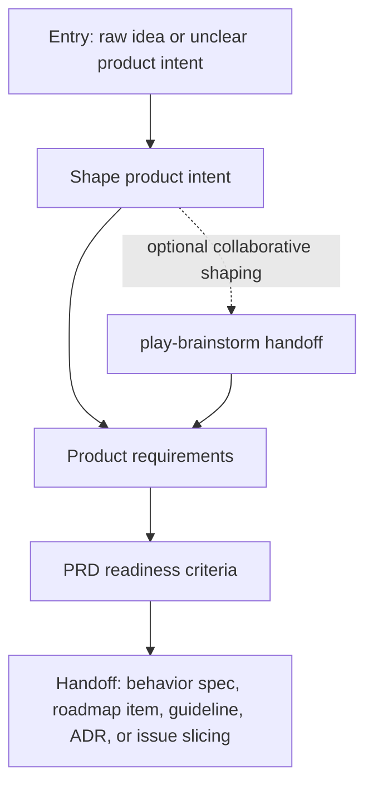

Use this path when the product outcome, user, goal, risk, assumption, or open
question is not stable enough to write exact behavior or executable issues.

### Behavior Spec Path

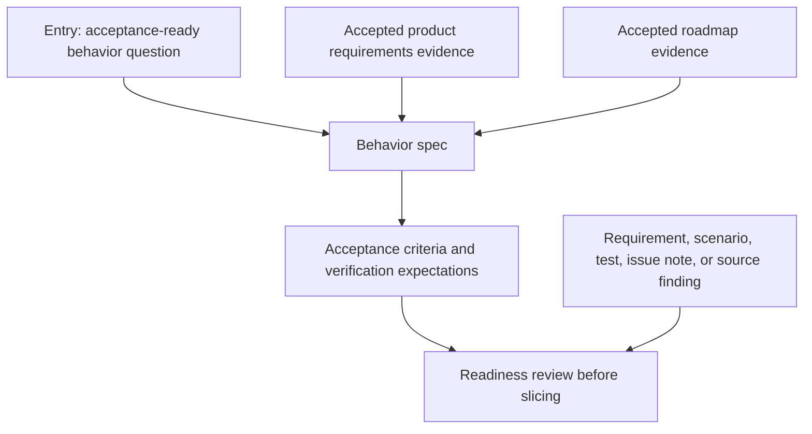

Use this path when exact behavior, boundaries, acceptance criteria, verification
expectations, or agent context need durable ownership. Use
[`behavior-spec-evidence-routing.md`](behavior-spec-evidence-routing.md) for
the evidence-pointer, readiness-review, and issue-slicing handoff rules that
apply to behavior-spec authoring.

### Roadmap Path

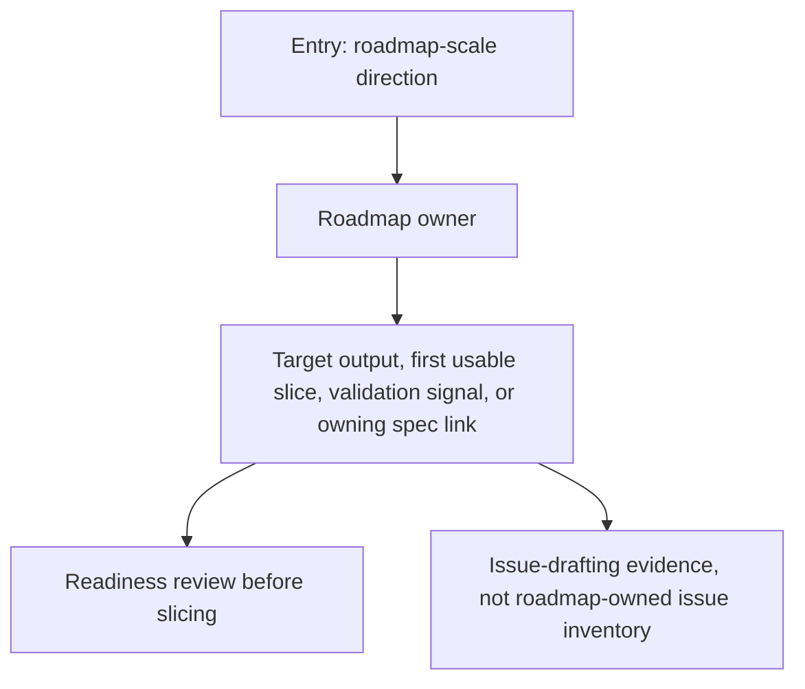

Use this path when work is larger than one issue or PR and needs durable target
output, appetite, sequencing, or validation direction.

### Issue Slicing Path

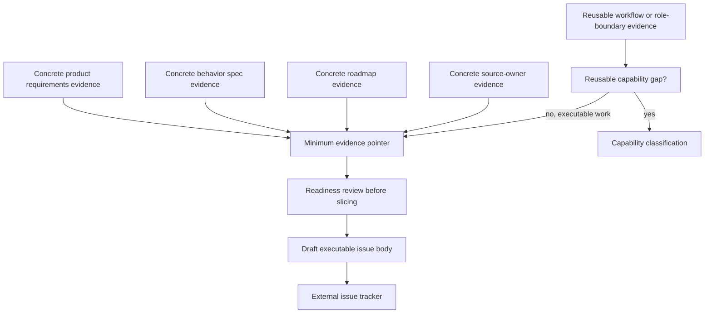

Use this path to create executable work from an owning durable artifact. Issue
slicing should produce draft tracker work from evidence; provider-specific live
mutation needs separate approval.

### Execute Ready Issue

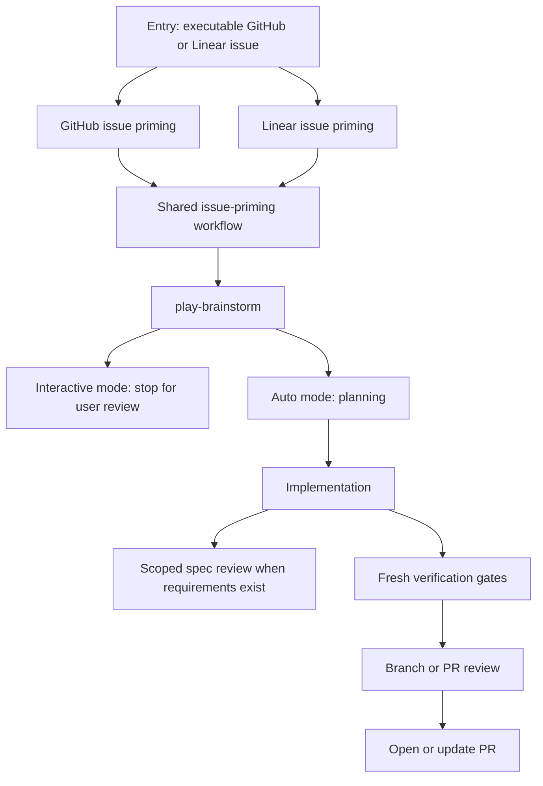

Use this path when an existing GitHub or Linear issue has enough contract to
start work without reshaping product intent or workflow policy.

### Investigate Concrete Finding

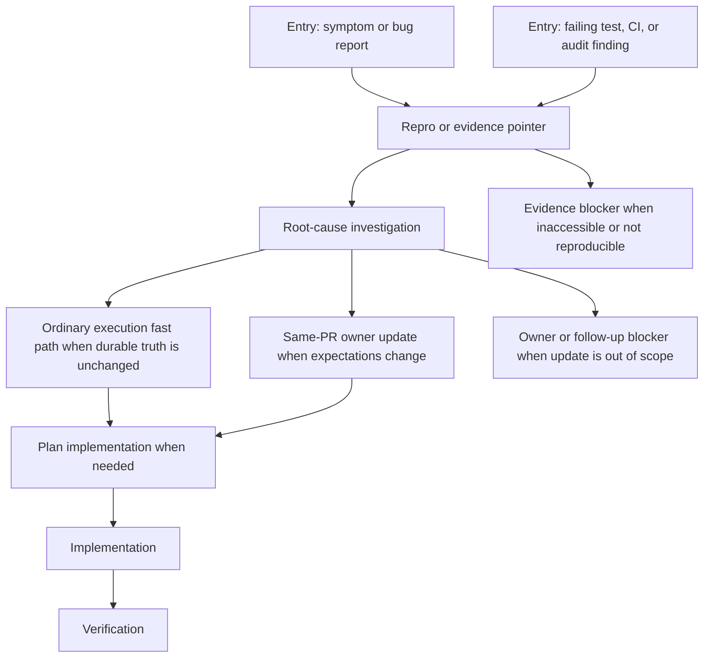

Use this path for concrete failures and findings. Fix the failure when
expectations are unchanged; update the owning artifact when the expected
behavior or verification expectation changes.

### Review Existing Work

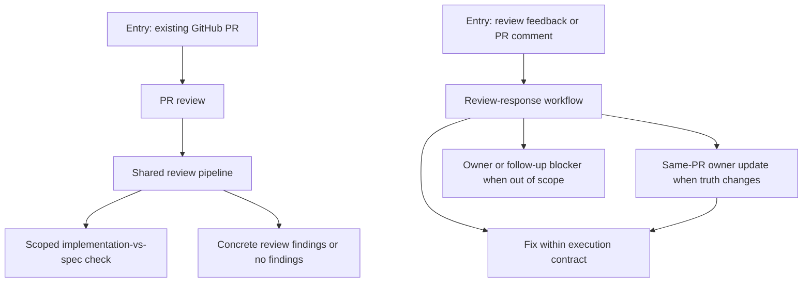

Use this path when reviewing a PR or responding to review feedback. PR systems
own review state; durable repository artifacts own changes to behavior, policy,
or ownership.

### Finish And Merge

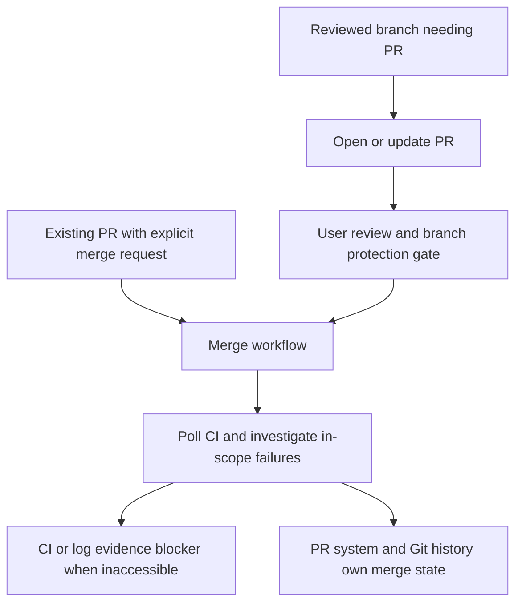

Use this path for closeout. Opening a PR creates the review gate; merge
automation needs an explicit merge request and must leave merge state in the PR
system and Git history.

### Same-PR Documentation Impact

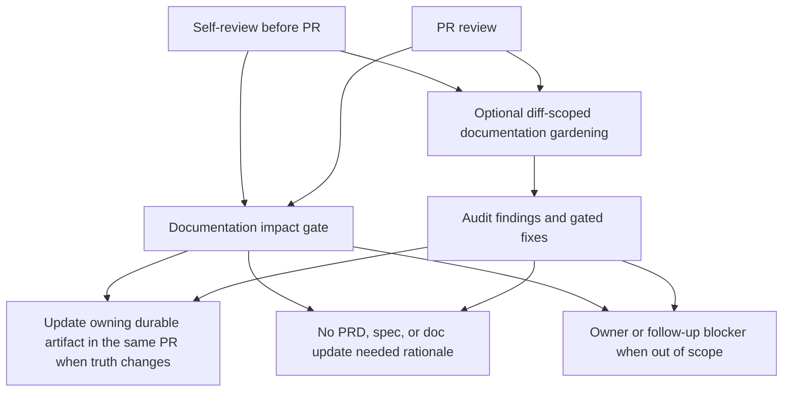

Use this path to decide whether a code, docs, or review change alters durable
truth. Do not copy issue comments, PR review history, validation logs, or
agent-local plans into repository docs.

When agent-local artifacts inform shared follow-up, apply the
`Agent-Local Evidence Reuse Boundary` in
[`../specs/afds-workflow-routing.md`](../specs/afds-workflow-routing.md).
Session-local `.ephemeral/` artifacts can support the current workflow, but PR,
issue, tracker, or review comments should carry only sanitized summary-only
outcomes and evidence pointers. Durable docs record promoted durable truth, not
raw artifact paths, transcripts, prompts, logs, validation dumps, stack traces,
internal decision trails, or session chronology.

### Knowledge Gardening

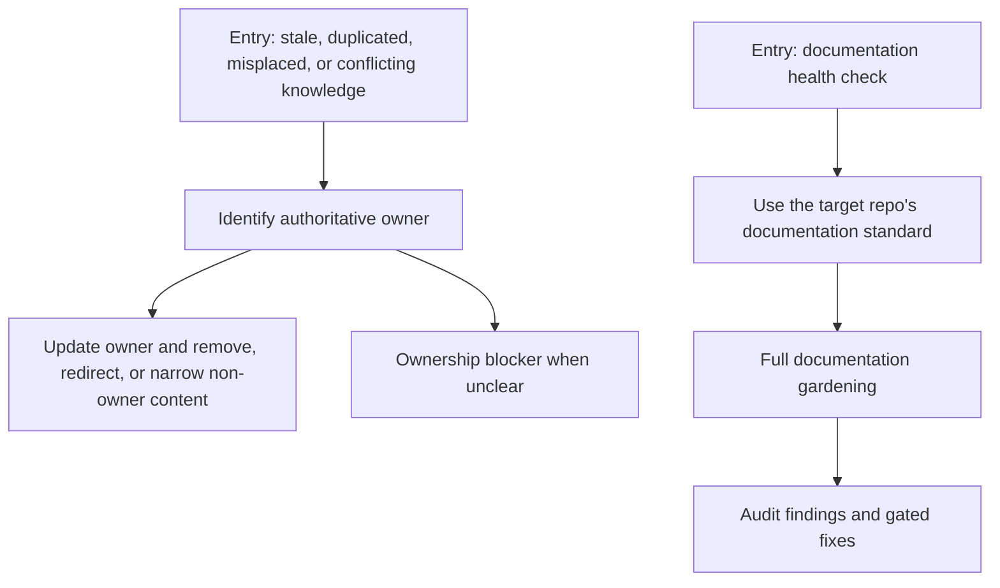

Use this path to correct durable knowledge. The owning artifact should be
updated, while non-owner copies should be removed, redirected, or narrowed.

### Generated And Installed Drift

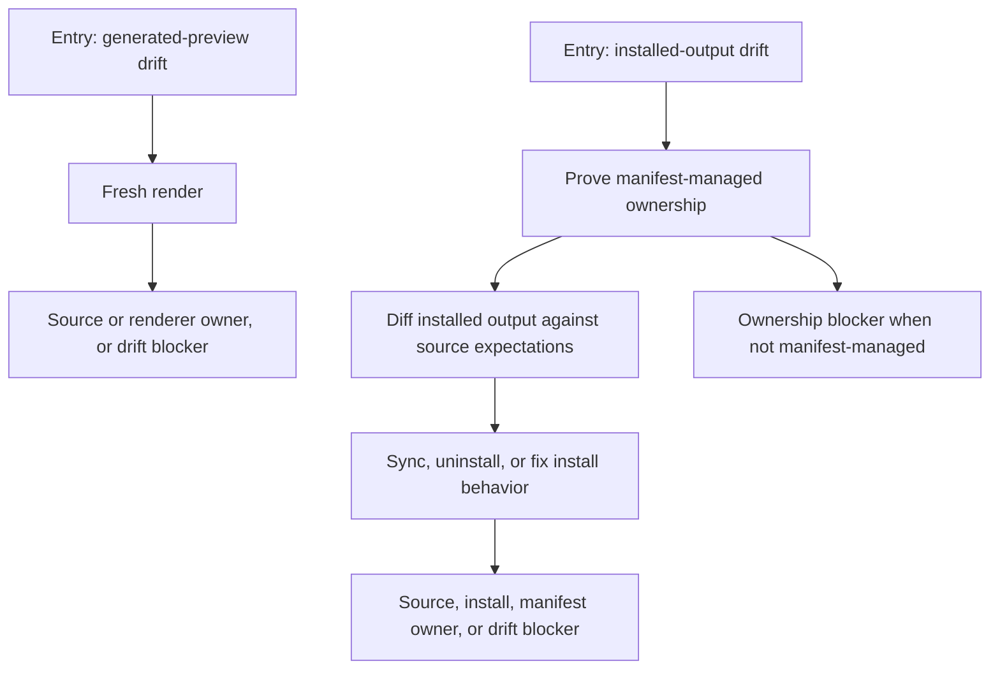

Use this path when generated previews or installed managed outputs differ from
expectations. These outputs are evidence, not durable authority.

### Govern Reusable Capability

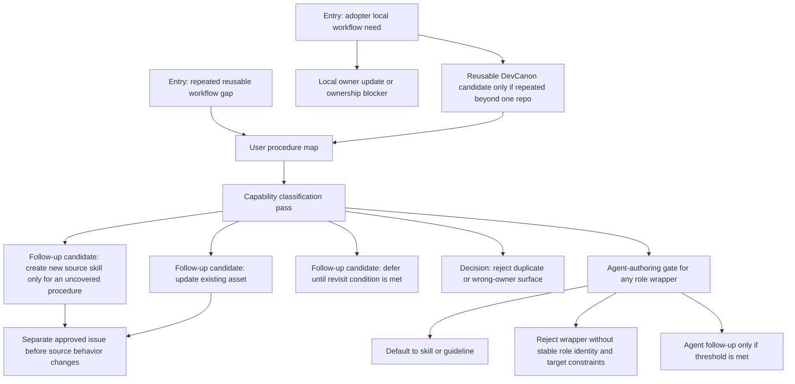

Use this path when repeated work suggests a reusable skill, agent, guideline,
source behavior, or governance update. This map helps identify the user
procedure; it does not approve new reusable assets by itself.

## Canonical Work-Origin Procedure Map

Use work origin as the canonical key. The same origin routes the same way
regardless of persona.

| Work origin                                            | Trigger                                               | User question                                              | Authoritative owner                                                                                                  | Evidence owner                                                                                | User procedure                                                                                                                                                                                                                            | Allowed output                                                                                 | Non-goals                                                                                         | Blocker wording                                                                | Next handoff                                                                                                       |
| ------------------------------------------------------ | ----------------------------------------------------- | ---------------------------------------------------------- | -------------------------------------------------------------------------------------------------------------------- | --------------------------------------------------------------------------------------------- | ----------------------------------------------------------------------------------------------------------------------------------------------------------------------------------------------------------------------------------------- | ---------------------------------------------------------------------------------------------- | ------------------------------------------------------------------------------------------------- | ------------------------------------------------------------------------------ | ------------------------------------------------------------------------------------------------------------------ |
| Raw idea or unclear product intent                     | Idea, problem signal, stakeholder request, or gap.    | What product outcome are we trying to make true?           | Product requirements under `docs/product-requirements/`.                                                             | Issue comment, product discussion, or linked source note.                                     | Shape product intent before writing behavior or slicing implementation work. Capture users, goals, outcomes, risks, assumptions, and open questions in the owning PRD.                                                                    | Product requirements update, or a named blocker if no PRD owner exists.                        | Acceptance-ready behavior, implementation plans, live backlog state, or issue inventories.        | `Blocked: product intent owner is unclear.`                                    | Behavior spec, roadmap item, guideline, ADR, or executable issue when intent is stable.                            |
| Acceptance-ready behavior question                     | Need to define exact behavior, boundaries, or tests.  | What behavior should the product or workflow guarantee?    | Behavior spec under `docs/specs/`.                                                                                   | Issue, PR note, design artifact, or linked source/test evidence.                              | Write or update the behavior spec with exact requirements, boundaries, acceptance criteria, verification expectations, agent context, and evidence routing from [`behavior-spec-evidence-routing.md`](behavior-spec-evidence-routing.md). | Behavior spec update and links to evidence.                                                    | Product discovery, roadmap sequencing, live issue state, or implementation detail.                | `Blocked: behavior owner is unclear.`                                          | `spec-readiness-review`, then `issue-slicing` when ready; implementation only after an executable contract exists. |
| Roadmap-scale direction                                | Direction is larger than one PR or one issue.         | What target output and validation path should guide work?  | Roadmap item under `docs/roadmap/`.                                                                                  | Issue or roadmap discussion link.                                                             | Update roadmap direction with target output, appetite, first usable slices, sequencing, and validation signals.                                                                                                                           | Roadmap update with links to owning PRD, spec, guideline, or issue.                            | Live schedules, assignees, sub-issue inventories, PR lists, or execution history.                 | `Blocked: roadmap owner is unclear.`                                           | Product requirements, behavior spec, or issue slicing.                                                             |
| Reusable workflow policy, procedure, or role boundary  | Repeated workflow question or reusable role need.     | Which reusable procedure or role rule should users follow? | Guideline or accepted source owner; source agent only when role boundary or target constraints are already governed. | Issue, PR note, or design artifact.                                                           | Identify whether the truth is policy, procedure, role identity, target constraint, or source behavior. If the needed owner is not already governed, extract a candidate gap instead of editing source assets.                             | Guideline update, accepted source-owner update, candidate capability gap, or evidence pointer. | New workflow asset approval, provider automation, or capability classification before governance. | `Blocked: workflow policy owner is unclear.`                                   | Capability-classification pass when a reusable toolkit gap is suspected.                                           |
| Executable GitHub or Linear issue                      | Issue has enough contract to start work.              | Can we execute from this issue without reshaping intent?   | External issue tracker plus source/durable artifacts it links.                                                       | GitHub Issue or Linear issue.                                                                 | Confirm the execution contract, check blockers, implement, verify, and update durable owners only if the solution changes durable truth.                                                                                                  | Source/docs changes, verification evidence, PR, and optional no-PRD/spec-needed rationale.     | New PRDs, specs, or capability classification when durable truth is unchanged.                    | `Blocked: issue lacks an execution contract or owning artifact.`               | Pull request or owning artifact update if discovery changes durable truth.                                         |
| Review feedback or PR comment                          | Review asks for a change or clarification.            | Is this review state only, or does durable truth change?   | PR system for review state; owning artifact for durable changes.                                                     | PR review or PR comment.                                                                      | Fix feedback inside the PR when it matches the execution contract. Route behavior, policy, or ownership changes to the durable owner.                                                                                                     | Code/doc fix, response to review, or same-PR durable owner update.                             | Copying PR review history into repo docs or changing durable behavior without owner update.       | `Blocked: review feedback does not identify the governed behavior.`            | PR verification, owner decision, or follow-up issue.                                                               |
| Failing test, CI check, or audit finding               | Validation or audit evidence fails.                   | What failed, and is the expected behavior still correct?   | Source tests, CI/check system, audit output, or linked issue.                                                        | Test output, CI/check URL, audit output, or issue comment.                                    | Reproduce or inspect evidence. Fix the failure when expectations are unchanged; update the owning artifact when expectations change.                                                                                                      | Fix, test update, evidence pointer, or blocker for inaccessible evidence.                      | Invented local summaries of private logs or durable docs used as validation ledgers.              | `Blocked: failure evidence is inaccessible or not reproducible enough to act.` | PR fix, issue update, or owning artifact update.                                                                   |
| Implementation discovery                               | Work uncovers new durable truth.                      | Does discovery change source behavior, docs, or policy?    | Source owner or affected durable AFDS artifact.                                                                      | PR note, issue comment, source diff, or test evidence.                                        | Decide whether the current PR can update the owner safely. If not, name the owner and open or link follow-up work.                                                                                                                        | Same-PR owner update, source change, or follow-up with evidence pointer.                       | Parking durable discoveries in `.ephemeral/`, PR comments, or local summaries only.               | `Blocked: discovery changes durable truth but no owner is named.`              | Same PR update or follow-up issue.                                                                                 |
| Stale, duplicated, misplaced, or conflicting knowledge | Doc audit, review, broken link, or conflicting claim. | Which artifact owns the truth being corrected?             | Artifact that owns the truth being corrected.                                                                        | Review finding, doc audit, issue, PR, source diff, or linked evidence.                        | Identify the owner, update it, and remove, redirect, or narrow non-owner content. Name a blocker if ownership cannot be determined.                                                                                                       | Owner correction, redirect, deletion of stale duplicate, or blocker.                           | Treating docs as live logs or preserving duplicates because each copy is locally convenient.      | `Blocked: authoritative owner cannot be determined.`                           | Validation, review, or follow-up issue if ownership remains blocked.                                               |
| Generated-output drift                                 | Generated preview differs from source render result.  | Is generated output stale, or is source/render wrong?      | Source library or renderer behavior.                                                                                 | Generated preview, `devcanon render`, `devcanon diff`, source tests, or PR diff.              | Regenerate from source when output is stale. Fix source or renderer behavior when drift reveals an authoritative source problem.                                                                                                          | Regenerated preview, source/render fix, tests, and evidence pointer.                           | Hand-editing generated output or treating generated previews as durable authority.                | `Blocked: generated output drift source is unclear.`                           | Render validation, source fix, or PR review.                                                                       |
| Installed-output drift                                 | Installed managed output differs from expectations.   | Is installed output stale, unmanaged, missing, or wrong?   | Install manifest, source library, or install/sync behavior.                                                          | Installed managed output, `devcanon diff`, install manifest, filesystem state, or issue note. | Use manifest/source expectations to classify ownership. Sync, uninstall, or fix install behavior only when ownership is proven.                                                                                                           | Sync/uninstall action, source/install fix, manifest-backed evidence pointer, or blocker.       | Overwriting unmanaged files, deleting manifest authority, or treating installed output as source. | `Blocked: installed output ownership cannot be proven.`                        | Sync, uninstall, source/install fix, or follow-up issue.                                                           |

## Persona Journey View

Persona journeys use the canonical work-origin procedures above. They do not
redefine owner rules.

### Product Leader

A Product Leader shapes intent and keeps work traceable from product outcomes
to implementation.

| Use case                                | Start from                                                          | Procedure rows to use                                                                            | Expected handoff                                                             |
| --------------------------------------- | ------------------------------------------------------------------- | ------------------------------------------------------------------------------------------------ | ---------------------------------------------------------------------------- |
| Shape a new product or workflow idea    | Raw idea, problem signal, or stakeholder request.                   | Raw idea or unclear product intent; acceptance-ready behavior question.                          | Product requirements, then behavior spec or issue slicing.                   |
| Assess readiness to slice work          | Draft PRD, roadmap item, open questions, or unresolved assumptions. | Raw idea or unclear product intent; acceptance-ready behavior question; roadmap-scale direction. | Behavior spec, executable issue, roadmap update, or named readiness blocker. |
| Turn stable intent into executable work | Accepted PRD section or roadmap direction.                          | Acceptance-ready behavior question; roadmap-scale direction.                                     | Behavior spec, roadmap update, or executable tracker issue.                  |
| Preserve traceability after discovery   | Implementation or review changes meaning.                           | Implementation discovery; review feedback or PR comment.                                         | Same-PR durable owner update or named follow-up blocker.                     |

### Human Developer With Agent

A Human Developer with Agent executes scoped work while keeping humans and
agents aligned on authoritative context.

| Use case                        | Start from                                                    | Procedure rows to use                                                                                  | Expected handoff                                                                                             |
| ------------------------------- | ------------------------------------------------------------- | ------------------------------------------------------------------------------------------------------ | ------------------------------------------------------------------------------------------------------------ |
| Investigate a problem           | Symptom, bug report, unclear failure, or suspicious behavior. | Executable GitHub or Linear issue; failing test, CI check, or audit finding; implementation discovery. | Repro steps, checked evidence, suspected owner, executable contract, durable owner update, or named blocker. |
| Implement a ready issue         | GitHub or Linear issue with contract.                         | Executable GitHub or Linear issue; implementation discovery.                                           | Pull request with verification evidence.                                                                     |
| Fix concrete validation failure | Failing test, CI check, or audit output.                      | Failing test, CI check, or audit finding; implementation discovery.                                    | Fix, evidence pointer, or inaccessible-evidence blocker.                                                     |
| Resolve review feedback         | PR review or inline comment.                                  | Review feedback or PR comment; acceptance-ready behavior question.                                     | PR response, fix, or durable behavior/policy owner update.                                                   |

### Reviewer or Maintainer

A Reviewer or Maintainer is a derived journey role. This user protects the
system of record during review, merge, and maintenance. They may not own the
original product intent, but they are responsible for checking whether the
change respects the owning artifact and evidence boundary.

| Use case                                  | Start from                                                              | Procedure rows to use                                                                                                                     | Expected handoff                                                                     |
| ----------------------------------------- | ----------------------------------------------------------------------- | ----------------------------------------------------------------------------------------------------------------------------------------- | ------------------------------------------------------------------------------------ |
| Decide whether a PR changed durable truth | PR diff, review thread, or test evidence.                               | Review feedback or PR comment; implementation discovery.                                                                                  | Approval, requested change, owner update, or follow-up issue.                        |
| Review docs for drift                     | Broken link, duplicate claim, or stale generated preview.               | Stale, duplicated, misplaced, or conflicting knowledge; generated-output drift.                                                           | Owner correction, regeneration, or blocker.                                          |
| Check merge readiness                     | PR, reviews, unresolved threads, validation evidence, and linked issue. | Failing test, CI check, or audit finding; executable GitHub or Linear issue; generated-output drift when generated previews are reviewed. | Merge, requested fix, owner update, generated drift correction, or evidence blocker. |

### AFDS Repo Adopter

An AFDS Repo Adopter is a derived journey role. This user applies Portable AFDS
guidance to a consumer repository and decides where local project knowledge
belongs. They are responsible for adopting the model deliberately, not for
letting DevCanon rewrite local docs automatically.

| Use case                                 | Start from                                                           | Procedure rows to use                                                                       | Expected handoff                                                             |
| ---------------------------------------- | -------------------------------------------------------------------- | ------------------------------------------------------------------------------------------- | ---------------------------------------------------------------------------- |
| Find the adoption entry point            | `MAP.md`, local docs, tracker conventions, or unclear repo workflow. | Raw idea or unclear product intent; stale, duplicated, misplaced, or conflicting knowledge. | Local owner update, adoption issue, or ownership blocker.                    |
| Decide where local knowledge belongs     | Existing repo docs, issue tracker, and workflow habits.              | Raw idea or unclear product intent; stale, duplicated, misplaced, or conflicting knowledge. | Local owner update, adoption issue, or ownership blocker.                    |
| Configure reusable workflow expectations | Repeated local agent or contributor workflow need.                   | Reusable workflow policy, procedure, or role boundary.                                      | Local owner update, ownership blocker, or DevCanon candidate capability gap. |
| Handle inaccessible evidence             | Private issue, PR, CI, or installed path.                            | Failing test, CI check, or audit finding; installed-output drift.                           | Evidence blocker or owner-specific follow-up.                                |

### DevCanon Contributor

A DevCanon Contributor evolves the reusable toolkit while keeping source files
authoritative and generated or installed outputs disposable.

| Use case                            | Start from                                                                              | Procedure rows to use                                                            | Expected handoff                                                                       |
| ----------------------------------- | --------------------------------------------------------------------------------------- | -------------------------------------------------------------------------------- | -------------------------------------------------------------------------------------- |
| Evaluate a reusable capability need | Repeated workflow gap or upstream shared-skill report.                                  | Reusable workflow policy, procedure, or role boundary; implementation discovery. | Accepted owner update, or candidate capability gap for capability classification.      |
| Extract candidate capability gap    | Repeated blocker, follow-up evidence, or procedure step existing assets cannot express. | Reusable workflow policy, procedure, or role boundary; implementation discovery. | Candidate capability gap only; no new or changed reusable asset before classification. |
| Fix generated preview drift         | Render diff, generated preview, or source change.                                       | Generated-output drift.                                                          | Regenerated output or renderer/source fix.                                             |
| Fix installed managed output drift  | `devcanon diff`, manifest evidence, or target-home issue.                               | Installed-output drift.                                                          | Sync/uninstall/source fix or ownership blocker.                                        |

## Cross-Cutting Evidence Cases

Private, inaccessible, unavailable, or incomplete evidence is an evidence state,
not a normal work origin.

When evidence is incomplete:

1. Name the evidence system.
2. Provide the stable reference available to the user or agent.
3. State the checked requirement, route, execution contract, or owner.
4. Mark the result state as blocked, unavailable, not run, failing, or not
   applicable.
5. Name the blocker or follow-up owner.

Do not copy private issue, PR, CI, validation, or agent-local history into repo
docs. Do not invent a local summary to replace evidence the user or agent cannot
access. If a durable decision depends on unavailable evidence, the route remains
blocked until that evidence is available or the decision is reframed.

Agent-local issue snapshots, research briefs, designs, and plans under
`.ephemeral/` are disposable execution context. They may inform the current
session, but they do not become durable authority unless their conclusions are
promoted into the owning repo artifact.

Generated previews and installed managed outputs are also not durable authority,
even when they are the first artifact a user sees. Use them as drift evidence,
then route back to source, renderer, manifest, or install/sync ownership.

## Follow-Up Surfaces and Revisit Conditions

Follow-up workflow surfaces are candidates for later capability classification.
Do not automatically convert them into implementation backlog.

Revisit a follow-up surface only when at least one of these conditions is true:

- the same procedure gap blocks multiple issues or repositories;
- users cannot identify the authoritative owner with existing docs;
- evidence pointers repeatedly fail because the current procedure is unclear;
- an existing skill, guideline, or source behavior cannot express the accepted
  workflow without becoming misleading;
- generated-output or installed-output drift exposes a missing source or
  manifest-owned procedure.

This guideline does not name or approve specific follow-up workflow surfaces.
It records revisit conditions only; classification remains outside this
guideline.

## Gap Extraction

Extract a candidate capability gap only after the user procedure is clear.

For each candidate gap, record:

- the work origin that exposed the gap;
- the user who was blocked;
- the authoritative owner and evidence owner;
- the procedure step that failed or was missing;
- the allowed output that existing assets could not produce;
- the named blocker or follow-up owner.

Do not classify the gap in this guideline. The capability-classification pass
consumes this procedure map to classify actual AFDS workflow capabilities
against existing skills, agents, docs, source behavior, and non-goals.

## Relationship to Capability Classification

Capability classification should use this user procedure map as input when
classifying AFDS workflow capabilities.

This map stabilizes the user journeys, work origins, owners, evidence pointers,
blockers, allowed outputs, non-goals, and handoffs that classification needs.
The classification pass remains responsible for deciding whether each candidate
capability should update an existing asset, create a new asset, be deferred, or
be rejected.
