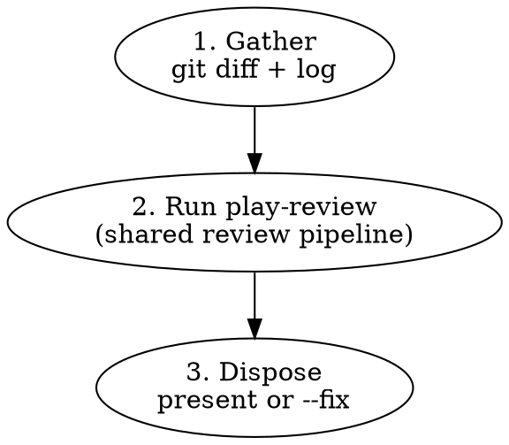

# Branch Review

Multi-agent code review on a local branch. Wrapper around `play-review`
for the local-diff case.

## Workflow



## Arguments

| Arg      | Effect                                                                                                                                   |
| -------- | ---------------------------------------------------------------------------------------------------------------------------------------- |
| `<base>` | Base branch to diff against (default: the repository's default branch, resolved via `origin/HEAD`, falling back to `main` then `master`) |
| `--fix`  | Auto-fix eligible blocking findings instead of presenting them. Used by `github-issue-priming --auto`.                                   |

## Phase 1: Gather

Detect the base branch and collect the diff:

```bash
# Determine base: explicit argument wins; otherwise resolve from origin/HEAD,
# falling back to main then master if origin/HEAD is unset.
if [[ -n "${1:-}" ]]; then
  BASE="$1"
elif symbolic_ref=$(git symbolic-ref --short refs/remotes/origin/HEAD 2>/dev/null); then
  BASE="${symbolic_ref#origin/}"
elif git show-ref --verify --quiet refs/remotes/origin/main; then
  BASE=main
elif git show-ref --verify --quiet refs/remotes/origin/master; then
  BASE=master
else
  BASE=main
fi

# Get the diff and commit log
git diff "$BASE"...HEAD
git log "$BASE"...HEAD --oneline
git diff "$BASE"...HEAD --stat
```

If the diff is empty, report "no changes to review" and stop.

Compute language hints from changed file extensions (e.g., `*.ts`, `*.rs`, `*.md`). The set drives `play-review`'s dynamic-agent triggers.

## Phase 2: Run play-review

Hand off to `play-review` with these inputs (compose them into the briefing prose that invokes the skill):

- `working_directory` = repo root (the current working directory)
- `base_ref` = `$BASE`
- `active_diff_range` = `"$BASE...HEAD"`
- `full_pr_diff_range` = `"$BASE...HEAD"` (same — no follow-up scope)
- `head_sha` = `$(git rev-parse HEAD)`
- `mode` = `"fix"` if `--fix` is set, else `"present"`
- `language_hints` = computed in Phase 1
- `prior_threads` = (none); `last_reviewed_sha` = (none); `is_followup_narrow` = `false`

Follow `skills/play-review/SKILL.md` end-to-end. The output is a markdown document with a `## Findings` section.

## Phase 3: Dispose

**Without `--fix` (interactive mode):**

Re-emit `play-review`'s findings to the user in conversation. Preserve the format (file:line, severity, category, evidence code, recommendation). Findings tagged `Anchor: out-of-diff` are listed under "Out-of-diff findings" with a note that they require human judgment.

**With `--fix` (autonomous mode, used by `github-issue-priming --auto`):**

For each finding in `play-review`'s output:

1. **Skip if `Anchor: out-of-diff`.** Add to the remaining-nits report.
2. **Skip if blocking and `Critic: INVALID` or `DOWNGRADE`.** The critic disagrees; do not auto-fix.
3. **Skip if blocking and the fix triggers the design-change stop rule** (changes a function's signature, alters control flow structure, touches more than one module, needs context beyond the flagged lines). Add to the remaining-nits report.
4. Otherwise: apply the fix, run local CI checks (`pnpm run check` for TypeScript repos; equivalent elsewhere), commit.

**Commit message format:** Before composing fix commit messages, glob for `**/commit-guideline*.md` and follow its format. If none is found, use Conventional Commits: `fix(<scope>): <what was fixed>`.

After all eligible findings are processed, report:

- Number of blocking findings auto-fixed
- Remaining nits (left for user) including `Anchor: out-of-diff` findings
- Any blocking findings that hit the stop rule (design changes or out-of-diff)

## Quick Reference

| Situation                                                 | Action                            |
| --------------------------------------------------------- | --------------------------------- |
| Empty diff                                                | Report "no changes", stop         |
| All clean                                                 | Report "no issues found"          |
| Blocking findings + `--fix`                               | Auto-fix eligible, commit, report |
| Blocking finding needs design change or out-of-diff edits | Stop, report to caller            |
| Nits + `--fix`                                            | Leave for user, list in report    |

## Common Mistakes

### Using `gh pr diff` instead of `git diff`

- **Problem:** No PR exists yet — `gh` commands will fail
- **Fix:** Always use `git diff <base>...HEAD`

### Posting findings to GitHub

- **Problem:** No PR to post to; this is a local review
- **Fix:** Present findings in the conversation or auto-fix with `--fix`

## Red Flags — You Are Violating This Skill

- You called any `gh` command — no PR exists
- You posted a review to GitHub
- You auto-fixed a finding tagged `Anchor: out-of-diff`
- You auto-fixed a `Blocking | Safety` Sub-check 1 finding (substitution audit) — these are design work
- You auto-fixed a `Blocking | Contracts` Sub-check 2 finding (documented-behavior verification) — these are design work
- You skipped delegating to `play-review` and tried to spawn agents yourself
- You presented `play-review`'s findings without preserving the evidence code (3-7 lines)

**All of these mean: STOP. Go back to the workflow.**

## Integration

**Called by:**

- `github-issue-priming --auto` (Phase 7, with `--fix`)
- `linear-issue-priming --auto` (Phase 7, with `--fix`)
- Any workflow needing pre-PR review

**Calls:**

- `play-review` — shared review pipeline (this skill is a wrapper)

**Complements:**

- `pr-review` — for reviewing existing GitHub PRs
- `play-review-response` — guidance for responding to review feedback
