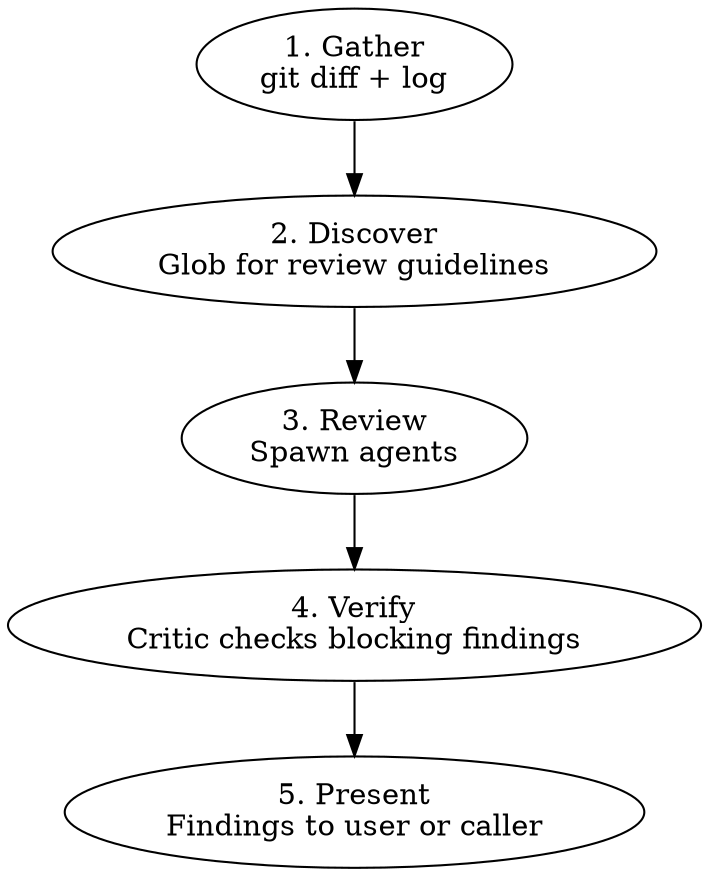

# Branch Review

Multi-agent code review on a local branch. Same review quality as `pr-review` but works on `git diff` — no GitHub PR required.

## Workflow



## Arguments

| Arg      | Effect                                                                                        |
| -------- | --------------------------------------------------------------------------------------------- |
| `<base>` | Base branch to diff against (default: `main`)                                                 |
| `--fix`  | Auto-fix blocking findings instead of presenting them. Used by `github-issue-priming --auto`. |

## Phase 1: Gather

Detect the base branch and collect the diff:

```bash
# Determine base (argument or default)
BASE=${1:-main}

# Get the diff and commit log
git diff $BASE...HEAD
git log $BASE...HEAD --oneline
git diff $BASE...HEAD --stat
```

If the diff is empty, report "no changes to review" and stop.

Extract from the diff:

- Changed files with +/- line counts
- Total scope (files changed, insertions, deletions)

## Phase 2: Discover Guidelines

Search the repository for review guidelines — read them, don't just list paths:

- `**/code-review*.md`, `**/review-*.md` — review checklists
- `**/error-handling*.md` — error discipline
- `AGENTS.md`, `CONTRIBUTING.md` — project conventions

No guidelines found? Proceed with agents' built-in knowledge, note it in the report.

## Phase 3: Review

**Core agents (always spawned):**

| Agent       | Focus                                                                                                   |
| ----------- | ------------------------------------------------------------------------------------------------------- |
| Correctness | Logic bugs, panic discipline, error propagation, API contracts                                          |
| Data-safety | Secrets/credentials, injection (path traversal, SQL, XSS, command), PII in logs/errors, untrusted input |

**Dynamic agents (by file types in diff):**

| Trigger                                                                                                     | Agent                                                                                                |
| ----------------------------------------------------------------------------------------------------------- | ---------------------------------------------------------------------------------------------------- |
| `*.rs`                                                                                                      | Rust — clippy, unsafe, ECS, serde, WASM                                                              |
| `*.ts` / `*.tsx`                                                                                            | TypeScript — types, React patterns, bridge sync                                                      |
| `tests/` or `*_test.*`                                                                                      | Test — coverage, correctness, fixtures                                                               |
| `docs/` or `*.md`                                                                                           | Docs — accuracy, staleness, contract alignment                                                       |
| `Cargo.toml`, `package.json`, `tsconfig.json`, `*.config.*`, `mod.rs`, `index.ts`, or 3+ modules            | Architecture — boundary violations, dependency justification, responsibility drift, contract changes |
| CLI command handlers, public API surfaces, user-facing config schemas, or files referenced by existing docs | Documentation — missing/stale docs for changed behavior, contract alignment, operator guidance gaps  |

**Agent briefing — each prompt MUST include:**

1. Role — one sentence
2. Context — branch name, base branch, changed files with +/- counts
3. Diff — full `git diff` output
4. Discovered guidelines — actual content, not file paths
5. Output format — file, line, priority P0-P3, blocking/nit, code reference, recommendation

Run all agents in parallel.

**Model selection:** Use `{{model:deep}}` for all review agents and the critic — same rationale as `pr-review`.

## Phase 4: Verify

Spawn critic agent with all findings merged. The critic reads actual code in the working directory and tags each **blocking** finding:

- **VALID** — holds up
- **INVALID** — code doesn't match the claim
- **DOWNGRADE** — valid but not blocking

Nits skip critic verification.

## Phase 5: Present

**Without `--fix` (interactive mode):**

Present findings with evidence code, same format as `pr-review`:

```
#### 1. <title>
**<file>:<line> | P0 | Blocking | Critic: VALID**

` ` `<lang>
// <file>:<start>-<end>
<3-7 lines of actual code>
` ` `

<Why this is a problem>

**Recommendation:** <concrete suggestion>
```

**With `--fix` (autonomous mode, used by `github-issue-priming --auto`):**

For each blocking finding verified by the critic:

1. Fix the issue
2. Run local CI checks to verify the fix doesn't break anything
3. Commit the fix

**Commit message format:** Before composing fix commit messages, glob for `**/commit-guideline*.md` and follow its format. If no guideline is found, use Conventional Commits: `fix(<scope>): <what was fixed>`. The scope should match the file/module being fixed.

After all blocking findings are fixed, report:

- Number of blocking findings fixed
- Remaining nits (left for user)
- Any blocking findings that couldn't be fixed (requires design changes)

If a blocking finding requires design changes, **stop and report** — don't attempt architectural fixes. A fix "requires design changes" if it changes a function's signature, alters control flow structure, touches more than one module, or needs context beyond the flagged lines to determine correctness.

## Quick Reference

| Situation                            | Action                         |
| ------------------------------------ | ------------------------------ |
| Empty diff                           | Report "no changes", stop      |
| No guidelines found                  | Note in report, proceed        |
| All clean                            | Report "no issues found"       |
| Blocking findings + `--fix`          | Auto-fix, commit, report       |
| Blocking finding needs design change | Stop, report to caller         |
| Nits + `--fix`                       | Leave for user, list in report |

## Common Mistakes

### Using `gh pr diff` instead of `git diff`

- **Problem:** No PR exists yet — `gh` commands will fail
- **Fix:** Always use `git diff <base>...HEAD`

### Posting findings to GitHub

- **Problem:** No PR to post to; this is a local review
- **Fix:** Present findings in the conversation or auto-fix with `--fix`

### Skipping the critic

- **Problem:** Review agents sometimes flag code that doesn't match their claim
- **Fix:** Always run critic verification on blocking findings

## Red Flags — You Are Violating This Skill

- You called any `gh` command (`gh pr view`, `gh pr diff`, `gh api`, `gh pr review`) — no PR exists
- You posted a review to GitHub
- You skipped the data-safety agent
- You showed findings without evidence code (3-7 lines)
- You skipped the critic pass
- You used a generic agent prompt without file references and line counts from the diff

**All of these mean: STOP. Go back to the workflow.**

## Integration

**Called by:**

- `github-issue-priming --auto` (Phase 8, with `--fix`)
- Any workflow needing pre-PR review

**Complements:**

- `pr-review` — for reviewing existing GitHub PRs
- `play-review-response` — guidance for responding to review feedback with technical rigor
