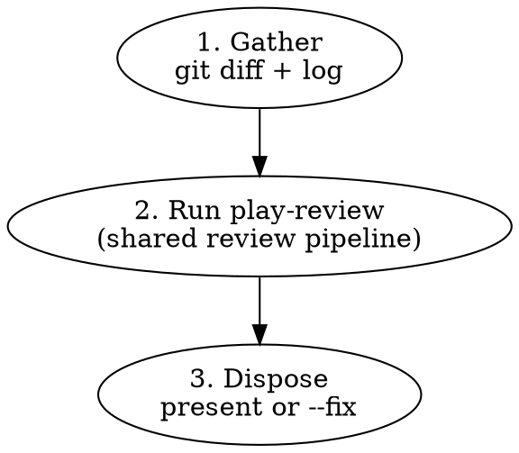

# Branch Review

Multi-agent code review on a local branch. Wrapper around `play-review`
for the local-diff case.

## Workflow



## Arguments

| Arg      | Effect                                                                                                                                   |
| -------- | ---------------------------------------------------------------------------------------------------------------------------------------- |
| `<base>` | Base branch to diff against (default: the repository's default branch, resolved via `origin/HEAD`, falling back to `main` then `master`) |
| `--fix`  | Auto-fix eligible blocking findings instead of presenting them. Used by `github-issue-priming --auto`.                                   |

## Phase 1: Gather

Detect the base branch and collect the diff:

```bash
# Determine base: explicit argument wins; otherwise resolve from origin/HEAD,
# falling back to main then master if origin/HEAD is unset.
if [[ -n "${1:-}" ]]; then
  BASE="$1"
elif symbolic_ref=$(git symbolic-ref --short refs/remotes/origin/HEAD 2>/dev/null); then
  BASE="${symbolic_ref#origin/}"
elif git show-ref --verify --quiet refs/remotes/origin/main; then
  BASE=main
elif git show-ref --verify --quiet refs/remotes/origin/master; then
  BASE=master
else
  BASE=main
fi

# Get the diff and commit log
git diff "$BASE"...HEAD
git log "$BASE"...HEAD --oneline
git diff "$BASE"...HEAD --stat
```

If the diff is empty, report "no changes to review" and stop.

Compute language hints from changed file extensions (e.g., `*.ts`, `*.rs`, `*.md`). The set drives `play-review`'s dynamic-agent triggers.

## Phase 2: Run play-review

Hand off to `play-review` with these inputs (compose them into the briefing prose that invokes the skill):

- `working_directory` = repo root (the current working directory)
- `base_ref` = `$BASE`
- `active_diff_range` = `"$BASE...HEAD"`
- `full_pr_diff_range` = `"$BASE...HEAD"` (same — no follow-up scope)
- `head_sha` = `$(git rev-parse HEAD)`
- `mode` = `"fix"` if `--fix` is set, else `"present"`
- `language_hints` = computed in Phase 1
- `prior_threads` = (none); `last_reviewed_sha` = (none); `is_followup_narrow` = `false`

Follow `skills/play-review/SKILL.md` end-to-end. The output is a markdown document with a `## Findings` section.

## Phase 3: Dispose

**Without `--fix` (interactive mode):**

Re-emit `play-review`'s findings to the user in conversation. Preserve the format (file:line, severity, category, evidence code, recommendation). Findings tagged `Anchor: out-of-diff` are listed under "Out-of-diff findings" with a note that they require human judgment.

After the human-readable findings, append `play-review`'s structured-finding JSON block verbatim as the last fenced `json` block in the output (no fixes have been applied on this path, so the block is unmodified from `play-review`'s output). This is the `play-review/findings/v1` block defined in `skills/play-review/SKILL.md` § Output. The block is intended for downstream tools that wrap `branch-review`'s output; the user can ignore it. The schema block must remain the trailing `json` fence in the report — additional `json` fences earlier in the report (e.g., when an evidence snippet is itself a JSON file) are permitted, since consumers identify the schema block by trailing position or by the `"schema": "play-review/findings/v1"` key.

**With `--fix` (autonomous mode, used by `github-issue-priming --auto`):**

Iterate over blocking findings verified by the critic (i.e., not `Critic: INVALID` or `DOWNGRADE`). For each:

1. **If the finding hits the stop rule, halt `--fix` immediately and report.** Do not process further findings, do not commit anything for this run beyond fixes already applied. The stop rule fires when:
   - `Anchor: out-of-diff` — the fix would require editing files outside the diff (e.g., Sub-check B cross-document drift, corpus-wide pattern propagation), or
   - the fix would change a function's signature, alter control flow structure, touch more than one module, or need context beyond the flagged lines.

   Halting here is a contract with the caller: `github-issue-priming --auto` Phase 7 relies on `branch-review --fix` stopping before more auto-edits accumulate, so the user can take over a coherent branch state rather than a half-auto-fixed one.

2. Otherwise: apply the fix, run local CI checks (`pnpm run check` for TypeScript repos; equivalent elsewhere), commit.

Skip blocking findings tagged `Critic: INVALID` or `DOWNGRADE` — the critic disagrees with the agent. Note them in the report but do not auto-fix and do not halt.

Nit findings are never auto-fixed. Collect them for the report (including any with `Anchor: out-of-diff`).

**Commit message format:** Before composing fix commit messages, glob for `**/commit-guideline*.md` and follow its format. If none is found, use Conventional Commits: `fix(<scope>): <what was fixed>`.

After processing — whether the loop completes or halts on the stop rule — report:

- Number of blocking findings auto-fixed
- Remaining nits (left for user), including `Anchor: out-of-diff` nits
- The blocking finding that triggered the halt, if any (cite file:line, severity, category, and which stop-rule branch fired)
- Blocking findings skipped because the critic flagged `INVALID` or `DOWNGRADE`

Then append a `play-review/findings/v1` JSON block as the last fenced `json` block in the report (see `skills/play-review/SKILL.md` § Output). The block's `findings` array contains exactly the **remaining set**: every nit (regardless of anchor), plus any blocker that was skipped (`INVALID`/`DOWNGRADE`) or that triggered the halt. Auto-fixed blockers do NOT appear in the JSON block — they're already committed. If the remaining set is empty, still emit the canonical empty block (see `skills/play-review/SKILL.md` § Output positional rules) — never an absent block. `issue-priming-workflow` Phase 7 reads this block to classify nits and feed `play-branch-finish`'s `nits` input. Drop `play-review`'s original schema block before emitting the new one — the schema rule requires exactly one schema block per report (identified by trailing position or by the `"schema": "play-review/findings/v1"` key); evidence snippets that happen to be JSON may use `json` fences earlier in the report and do not count.

## Quick Reference

| Situation                                                 | Action                            |
| --------------------------------------------------------- | --------------------------------- |
| Empty diff                                                | Report "no changes", stop         |
| All clean                                                 | Report "no issues found"          |
| Blocking findings + `--fix`                               | Auto-fix eligible, commit, report |
| Blocking finding needs design change or out-of-diff edits | Stop, report to caller            |
| Nits + `--fix`                                            | Leave for user, list in report    |

## Common Mistakes

### Using `gh pr diff` instead of `git diff`

- **Problem:** No PR exists yet — `gh` commands will fail
- **Fix:** Always use `git diff <base>...HEAD`

### Posting findings to GitHub

- **Problem:** No PR to post to; this is a local review
- **Fix:** Present findings in the conversation or auto-fix with `--fix`

## Red Flags — You Are Violating This Skill

- You called any `gh` command — no PR exists
- You posted a review to GitHub
- You auto-fixed a finding tagged `Anchor: out-of-diff`
- You auto-fixed a `Blocking | Safety` Sub-check 1 finding (substitution audit) — these are design work
- You auto-fixed a `Blocking | Contracts` Sub-check 2 finding (documented-behavior verification) — these are design work
- You skipped delegating to `play-review` and tried to spawn agents yourself
- You presented `play-review`'s findings without preserving the evidence code (3-7 lines)

**All of these mean: STOP. Go back to the workflow.**

## Integration

**Called by:**

- `github-issue-priming --auto` (Phase 7, with `--fix`)
- `linear-issue-priming --auto` (Phase 7, with `--fix`)
- Any workflow needing pre-PR review

**Calls:**

- `play-review` — shared review pipeline (this skill is a wrapper)

**Complements:**

- `pr-review` — for reviewing existing GitHub PRs
- `play-review-response` — guidance for responding to review feedback
