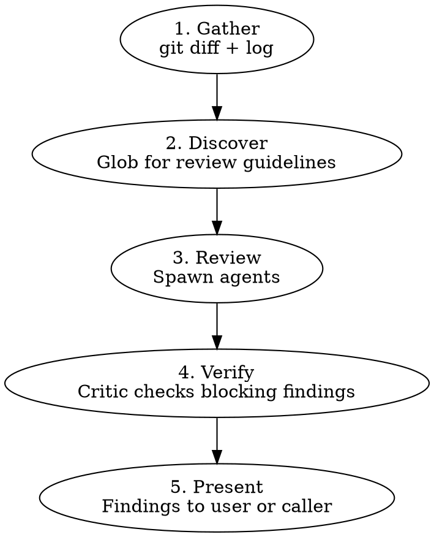

# Branch Review

Multi-agent code review on a local branch. Same review quality as `pr-review` but works on `git diff` — no GitHub PR required.

## Workflow



## Arguments

| Arg      | Effect                                                                                                                                   |
| -------- | ---------------------------------------------------------------------------------------------------------------------------------------- |
| `<base>` | Base branch to diff against (default: the repository's default branch, resolved via `origin/HEAD`, falling back to `main` then `master`) |
| `--fix`  | Auto-fix blocking findings instead of presenting them. Used by `github-issue-priming --auto`.                                            |

## Phase 1: Gather

Detect the base branch and collect the diff:

```bash
# Determine base: explicit argument wins; otherwise resolve from origin/HEAD,
# falling back to main then master if origin/HEAD is unset.
if [[ -n "${1:-}" ]]; then
  BASE="$1"
elif symbolic_ref=$(git symbolic-ref --short refs/remotes/origin/HEAD 2>/dev/null); then
  BASE="${symbolic_ref#origin/}"
elif git show-ref --verify --quiet refs/remotes/origin/main; then
  BASE=main
elif git show-ref --verify --quiet refs/remotes/origin/master; then
  BASE=master
else
  BASE=main
fi

# Get the diff and commit log
git diff "$BASE"...HEAD
git log "$BASE"...HEAD --oneline
git diff "$BASE"...HEAD --stat
```

If the diff is empty, report "no changes to review" and stop.

Extract from the diff:

- Changed files with +/- line counts
- Total scope (files changed, insertions, deletions)

## Phase 2: Discover Guidelines

Search the repository for review guidelines — read them, don't just list paths:

- `**/code-review*.md`, `**/review-*.md` — review checklists
- `**/error-handling*.md` — error discipline
- `AGENTS.md`, `CONTRIBUTING.md` — project conventions

No guidelines found? Proceed with agents' built-in knowledge, note it in the report.

## Phase 3: Review

**Core agents (always spawned):**

| Agent       | Focus                                                                                                                          |
| ----------- | ------------------------------------------------------------------------------------------------------------------------------ |
| Correctness | Logic bugs, panic discipline, error propagation, API contracts, external-invocation audit (substitution + documented behavior) |
| Data-safety | Secrets/credentials, injection (path traversal, SQL, XSS, command), PII in logs/errors, untrusted input                        |

**Dynamic agents (by file types in diff):**

| Trigger                                                                                                     | Agent                                                                                                 |
| ----------------------------------------------------------------------------------------------------------- | ----------------------------------------------------------------------------------------------------- |
| `*.rs`                                                                                                      | Rust — clippy, unsafe, ECS, serde, WASM                                                               |
| `*.ts` / `*.tsx`                                                                                            | TypeScript — types, React patterns, bridge sync                                                       |
| `tests/` or `*_test.*`                                                                                      | Test — coverage, correctness, fixtures                                                                |
| `docs/` or `*.md`                                                                                           | Docs — accuracy, staleness, contract alignment, identifier drift (within-document and cross-document) |
| `Cargo.toml`, `package.json`, `tsconfig.json`, `*.config.*`, `mod.rs`, `index.ts`, or 3+ modules            | Architecture — boundary violations, dependency justification, responsibility drift, contract changes  |
| CLI command handlers, public API surfaces, user-facing config schemas, or files referenced by existing docs | Documentation — missing/stale docs for changed behavior, contract alignment, operator guidance gaps   |

**Agent briefing — each prompt MUST include:**

1. Role — one sentence
2. Context — branch name, base branch, changed files with +/- counts
3. Diff — full `git diff` output
4. Discovered guidelines — actual content, not file paths
5. Output format — file, line, severity (`Blocking` or `Nit`), category (`Logic`, `Safety`, `Architecture`, `Tests`, `Maintainability`, `Documentation`, or `Contracts`), code reference, recommendation

Run all agents in parallel.

**Model selection:** Use `{{model:deep}}` for all review agents and the critic — same rationale as `pr-review`.

**Correctness agent external-invocation audit:**

The Correctness agent must perform two structured sub-checks in addition to its existing logic-bug / panic-discipline / error-propagation / API-contract review. Both fire only when the diff contains an external CLI / REST / system primitive invocation.

**Sub-check 1 — Substitution audit.** Fires when the diff replaces one external invocation token with a sibling at the same call site (e.g., `git branch -d` → `git branch -D`, `fs.writeFileSync` → `fs.writeFile`, `gh pr review --body ...` → `gh api .../reviews --input ...`). "External invocation" means a CLI flag/subcommand swap, a method swap on an external SDK, a system primitive swap (`unlink` ↔ `rm -rf`), or a flag-set rearrangement on the same call.

Procedure:

1. Identify the replaced primitive (old → new), citing the diff hunk.
2. Enumerate every safety property, precondition check, or rejection mode the OLD primitive enforced. Pull from the tool's documented behavior (`--help` / official docs) when the property isn't obvious from the name alone.
3. For each property, classify what the NEW code does: PRESERVES (same property holds), GUARDS (replaces with an equivalent runtime check), or SILENTLY DROPS (no equivalent guard, no waiver).
4. A SILENTLY DROPS finding is `Blocking`, category `Safety`, unless the diff or surrounding spec explicitly waives the property with a rationale.

**Bounding rule:** apply only to _external_ invocations (CLIs, REST/HTTP APIs, OS primitives, third-party SDK calls). Do not apply to internal-code refactors (calling site changes from one repo function to another), to literal renames, or to mechanical formatting changes. The agent should self-check: "is the named primitive defined inside this repo, or by a tool whose semantics live elsewhere?"

**Disposition:** judgment-required. The fix for a lost safety property is a guard, which is design work — multiple reconstructions are usually possible. Findings surface as `Blocking`, category `Safety` — in `branch-review --fix`, they hit the Phase 5 stop rule for blocking design changes (do not auto-fix); in `pr-review`, they surface in the Phase 5 user-gate report.

Worked example (real, PR #117): a diff replaces `git branch -d` with `git branch -D` to silence a spurious squash-merge warning. The OLD primitive's safety properties include rejecting deletion when the branch has unmerged commits relative to its upstream and HEAD. The NEW primitive (`-D`) accepts unconditionally, and the diff adds no surrounding guard. Verdict: SILENTLY DROPS the unmerged-commit rejection — `Blocking | Safety`, with the recommendation to add a tip-equality check (local tip == PR head OID) before `-D` runs. (PR #117 landed exactly that fix after Copilot's inline review caught the regression.)

**Sub-check 2 — Documented-behavior verification.** Fires when the diff adds a new external invocation, or modifies an existing one's flags / body shape / query parameters. Substitutions (Sub-check 1's trigger) are a subset; Sub-check 2 is the broader case. Examples in scope: any new `gh api` / `gh pr` invocation, any `git` invocation with a non-trivial flag combination, any new `fetch(` / `axios.` / HTTP-client call, any new child_process / subprocess invocation, any new file-system primitive (`fs.*`, `unlink`, etc.). Excluded: pure language-stdlib calls with stable, well-understood semantics (`Array.map`, `JSON.stringify`).

Procedure:

1. Identify the tool and the specific invocation pattern (subcommand, flags, body shape, query params).
2. Verify the invocation against documented behavior — the tool's `--help` output, official docs, or actual runtime behavior. Do **not** approve based on prior knowledge of flag interactions or default semantics.
3. Flag any divergence: invocation that won't do what the surrounding code claims, silently-ignored arguments, defaults that change between adjacent flag combinations, etc.
4. Tag any divergence as DOCUMENTED-BEHAVIOR MISMATCH; this is `Blocking`, category `Contracts`, unless the diff or surrounding spec explicitly waives the documented behavior with a rationale.

**Bounding rule:** don't re-verify the tool's whole API surface — only the specific invocation pattern in the diff. Don't flag stable, widely-known stdlib behavior. The bar is "could a reasonable reviewer assume the wrong semantics here?" — if yes, verify.

**Disposition:** judgment-required. Even a flag-swap fix is rarely a 1–3 line mechanical change in practice. Findings surface as `Blocking`, category `Contracts` — in `branch-review --fix`, they hit the Phase 5 stop rule for blocking design changes (do not auto-fix); in `pr-review`, they surface in the Phase 5 user-gate report.

Worked example (real, PR #127): a diff adds a `gh api repos/{owner}/{repo}/pulls/<N>/reviews` invocation that mixes `-f commit_id=...`, `-f event=...`, `-f body=...` with `--input <file>`. The Correctness agent reads `gh api --help` and identifies that when `--input` is supplied, sibling `-f` flags become URL query parameters, not body fields — so `commit_id`, `event`, and `body` are silently dropped from the POST body. Verdict: DOCUMENTED-BEHAVIOR MISMATCH — `Blocking | Contracts`, with the recommendation to build the entire payload inside `jq -n` so all fields land in the JSON body. (PR #127's first "fix" rearranged flags but kept the broken pattern; the second review pass caught it. The audit should verify against `--help` rather than assume.)

**Docs agent identifier-drift checks:**

The Docs agent must perform two consistency checks in addition to its existing accuracy / staleness / contract-alignment review:

**Sub-check A — within-document identifier drift.** For each changed `*.md` file:

- Compare backticked identifiers in prose against identifiers used in adjacent fenced code blocks within the same file.
- Flag any prose identifier whose code-block counterpart uses a different name, or any code-block identifier whose surrounding prose names something else.
- Report as `Blocking`, category `Documentation`. Auto-fixable via `--fix`.
- **Auto-fix rule:** the code block is canonical; rewrite prose to match. If the code block is itself wrong, reclassify as judgment-required and route to nits — do not auto-fix.

Illustrative scenario (pattern from PR #106): a single `.md` file describes a worktree-cleanup procedure where the prose narrates "`git worktree prune` removes the directory" while the adjacent code block invokes `git worktree remove <path>`. The two identifiers diverged across review rounds — code was updated; prose was not. Sub-check A flags this as `Blocking | Documentation`, with the recommendation "the code block is canonical; rewrite prose to match."

**Sub-check B — cross-document identifier drift.** Fires only when the diff adds prose explicitly labeling a pattern as broken, deprecated, superseded, or wrong. A silent example-replacement (replacing X with Y without adding anti-pattern prose) does NOT trigger Sub-check B.

When the trigger fires:

- Grep the repository for unchanged occurrences of pattern X.
- Flag any occurrence as a blocking finding requiring out-of-diff edits: "unchanged file still demonstrates pattern X which this diff documents as broken / superseded". This category routes through the Phase 5 stop rule (the "blocking finding requires editing files outside the diff" branch), not through the `--fix` auto-fix step list.
- **Bounding rule:** only grep for patterns the diff explicitly changes the direction of. Do not grep for every backticked identifier in the diff.
- **`--fix` behavior:** report-only. Do not auto-fix files outside the diff. Sub-check B findings surface to the caller for human judgment — the new direction may not always be canonical, or the unchanged file may represent intentional asymmetry.

Illustrative scenario (pattern adapted from PR #127, hypothetical): suppose a diff to one skill adds prose explicitly calling out that `gh api -f <field>=<value>` combined with `--input <file>` is broken because `-f` arguments become URL query parameters when `--input` is supplied. Sub-check B greps the corpus for the broken pattern. Any unchanged sibling files still demonstrating it would each be flagged as a blocking, out-of-diff finding — `--fix` would route them through the Phase 5 stop rule rather than auto-fixing, since the new direction may not always be canonical. (PR #127 itself updated all occurrences in the same diff, so the corpus today shows zero unchanged siblings; the scenario imagines the alternative.)

## Phase 4: Verify

Spawn critic agent with all findings merged. The critic reads actual code in the working directory and tags each **blocking** finding:

- **VALID** — holds up
- **INVALID** — code doesn't match the claim
- **DOWNGRADE** — valid but not blocking

**Treat every concrete reference as a literal claim, not as illustrative rhetoric.** When a finding cites a specific `file:line`, identifier, function name, command, or commit SHA, verify it by opening the cited file (or running `git log` / `git show`). Tag the finding INVALID if the cited artifact does not exist or does not contain the cited text. **Internal consistency is not evidence of literal intent.** Do not apply the inference "every occurrence of pattern X appears within this PR's diff, therefore X is illustrative." Fabricated citations are usually internally consistent precisely because they were generated together; co-occurrence within a diff is the failure signature, not a downgrade signal.

Nits skip critic verification.

## Phase 5: Present

**Without `--fix` (interactive mode):**

Present findings with evidence code, same format as `pr-review`:

```
#### 1. <title>
**<file>:<line> | Blocking | Safety | Critic: VALID**

` ` `<lang>
// <file>:<start>-<end>
<3-7 lines of actual code>
` ` `

<Why this is a problem>

**Recommendation:** <concrete suggestion>
```

**With `--fix` (autonomous mode, used by `github-issue-priming --auto`):**

For each blocking finding verified by the critic:

1. Fix the issue
2. Run local CI checks to verify the fix doesn't break anything
3. Commit the fix

**Commit message format:** Before composing fix commit messages, glob for `**/commit-guideline*.md` and follow its format. If no guideline is found, use Conventional Commits: `fix(<scope>): <what was fixed>`. The scope should match the file/module being fixed.

After all blocking findings are fixed, report:

- Number of blocking findings fixed
- Remaining nits (left for user)
- Any blocking findings that couldn't be fixed (requires design changes or files outside the diff)

If a blocking finding requires design changes **or requires editing files outside the diff (e.g., Sub-check B cross-document drift)**, **stop and report** — don't attempt architectural fixes or corpus-wide edits. A fix triggers this stop rule if it changes a function's signature, alters control flow structure, touches more than one module, needs context beyond the flagged lines to determine correctness, or requires editing unchanged files.

## Quick Reference

| Situation                                                 | Action                         |
| --------------------------------------------------------- | ------------------------------ |
| Empty diff                                                | Report "no changes", stop      |
| No guidelines found                                       | Note in report, proceed        |
| All clean                                                 | Report "no issues found"       |
| Blocking findings + `--fix`                               | Auto-fix, commit, report       |
| Blocking finding needs design change or out-of-diff edits | Stop, report to caller         |
| Nits + `--fix`                                            | Leave for user, list in report |

## Common Mistakes

### Using `gh pr diff` instead of `git diff`

- **Problem:** No PR exists yet — `gh` commands will fail
- **Fix:** Always use `git diff <base>...HEAD`

### Posting findings to GitHub

- **Problem:** No PR to post to; this is a local review
- **Fix:** Present findings in the conversation or auto-fix with `--fix`

### Skipping the critic

- **Problem:** Review agents sometimes flag code that doesn't match their claim
- **Fix:** Always run critic verification on blocking findings

## Red Flags — You Are Violating This Skill

- You called any `gh` command (`gh pr view`, `gh pr diff`, `gh api`, `gh pr review`) — no PR exists
- You posted a review to GitHub
- You skipped the data-safety agent
- You showed findings without evidence code (3-7 lines)
- You skipped the critic pass
- You used a generic agent prompt without file references and line counts from the diff

**All of these mean: STOP. Go back to the workflow.**

## Integration

**Called by:**

- `github-issue-priming --auto` (Phase 8, with `--fix`)
- Any workflow needing pre-PR review

**Complements:**

- `pr-review` — for reviewing existing GitHub PRs
- `play-review-response` — guidance for responding to review feedback with technical rigor
