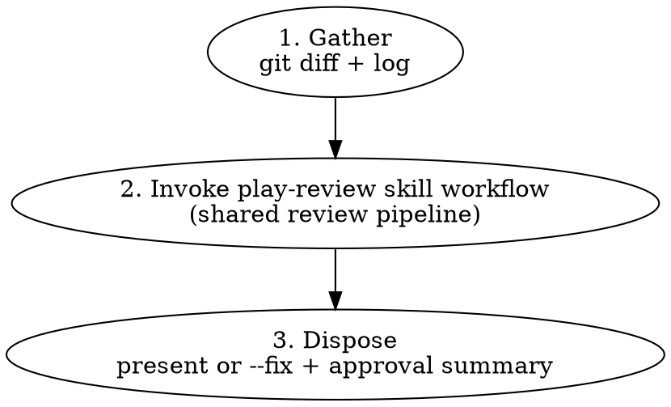

# Branch Review

Multi-agent code review on a local branch. Wrapper around `play-review`
for the local-diff case.

## Workflow



## Arguments

`branch-review [--fix] [--risk-signals <repo-relative-path>] [--last-reviewed <sha> --prior-findings <path>] [base]`

| Arg                                   | Effect                                                                                                                                                                                                                                              |
| ------------------------------------- | --------------------------------------------------------------------------------------------------------------------------------------------------------------------------------------------------------------------------------------------------- |
| `<base>`                              | Base branch to diff against (default: the repository's default branch, resolved via `origin/HEAD`, falling back to `main` then `master`)                                                                                                            |
| `--fix`                               | Auto-fix eligible blocking findings instead of presenting them. Used by `issue-priming-workflow --auto` for GitHub and Linear entrypoints.                                                                                                          |
| `--risk-signals <repo-relative-path>` | Optional, non-authoritative repo-relative `.ephemeral/*-risk-signals.json` handoff from `play-subagent-execution`. Valid signals can only preserve or escalate scrutiny; invalid supplied signals fail closed.                                      |
| `--last-reviewed <sha>`               | Enter follow-up mode using the immutable 40-character lowercase hex commit SHA from the previous branch-review run. Must be supplied together with `--prior-findings`; supplying only one follow-up argument is invalid and stops before reviewing. |
| `--prior-findings <path>`             | Repo-relative `.ephemeral/*-findings.json` file from the prior `play-review/findings/v1` run. Must be supplied together with `--last-reviewed`; validate it with the installed `play-review` helper before reading or passing it onward.            |

`--fix` without follow-up arguments keeps the existing full-diff default used
by `issue-priming-workflow --auto`. Do not silently convert that Phase 7 gate
into an incremental review.

## Phase 1: Gather

Detect the base branch, validate any follow-up inputs, compute the review
ranges, and collect the full branch diff.

```bash
BRANCH_REVIEW_DIR="<installed-branch-review-skill-bundle>"
PREPARE_INPUTS_HELPER="$BRANCH_REVIEW_DIR/scripts/prepare-review-inputs.sh"
PLAY_REVIEW_DIR="<installed-play-review-skill-bundle>"

BRANCH_REVIEW_INPUTS=$(
  PLAY_REVIEW_DIR="$PLAY_REVIEW_DIR" \
    bash "$PREPARE_INPUTS_HELPER" "$@"
) || exit 1

while IFS= read -r line; do
  key=${line%%=*}
  value=${line#*=}
  case "$key" in
    BASE) BASE="$value" ;;
    FIX_MODE) FIX_MODE="$value" ;;
    RISK_SIGNALS_FILE) RISK_SIGNALS_FILE="$value" ;;
    RISK_SIGNALS_STATUS) RISK_SIGNALS_STATUS="$value" ;;
    FULL_DIFF_RANGE) FULL_DIFF_RANGE="$value" ;;
    CANDIDATE_ACTIVE_DIFF_RANGE) CANDIDATE_ACTIVE_DIFF_RANGE="$value" ;;
    MECHANICAL_ACTIVE_DIFF_RANGE) MECHANICAL_ACTIVE_DIFF_RANGE="$value" ;;
    MECHANICAL_IS_FOLLOWUP_NARROW) MECHANICAL_IS_FOLLOWUP_NARROW="$value" ;;
    MECHANICAL_ESCALATE_FULL) MECHANICAL_ESCALATE_FULL="$value" ;;
    MECHANICAL_ESCALATION_REASON) MECHANICAL_ESCALATION_REASON="$value" ;;
    FOLLOWUP_SHA_USABLE) FOLLOWUP_SHA_USABLE="$value" ;;
    CHANGED_FILE_COUNT) CHANGED_FILE_COUNT="$value" ;;
    CHANGED_FILES_FILE) CHANGED_FILES_FILE="$value" ;;
    SCOPE_DECISION_FILE) SCOPE_DECISION_FILE="$value" ;;
    APPROVAL_SUMMARY_FILE) APPROVAL_SUMMARY_FILE="$value" ;;
    LANGUAGE_HINTS) LANGUAGE_HINTS="$value" ;;
    LAST_REVIEWED_SHA) LAST_REVIEWED_SHA="$value" ;;
    PRIOR_BRANCH_FINDINGS) PRIOR_BRANCH_FINDINGS="$value" ;;
  esac
done <<EOF
$BRANCH_REVIEW_INPUTS
EOF

# Get the diff and commit log
git diff "$FULL_DIFF_RANGE"
git log "$FULL_DIFF_RANGE" --oneline
git diff "$FULL_DIFF_RANGE" --stat
```

If the diff is empty, report "no changes to review" and stop.

`prepare-review-inputs.sh` owns branch-specific Phase 1 adapter mechanics:
argument parsing, base resolution, paired follow-up input validation,
installed `play-review` helper validation, prior findings review-head matching,
candidate range computation, changed-file fact emission, initial language-hint
extraction, and preparing `SCOPE_DECISION_FILE` for the later semantic scope
decision. `skills/branch-review/scripts/scope-decision-artifacts.sh
finalize-scope-decision` validates the final scope decision artifact after
semantic classification by translating branch-review inputs into explicit
support-validator flags for
`skills/play-validate-review-artifacts/scripts/review-artifacts.sh`. The helpers
must run from the repository root. Preparation is not authoritative for semantic
review scope and must not be treated as having written the final scope decision.

The helper writes `KEY=VALUE` lines to stdout:

- `BASE`
- `FIX_MODE`
- `RISK_SIGNALS_FILE`
- `RISK_SIGNALS_STATUS`
- `FULL_DIFF_RANGE`
- `CANDIDATE_ACTIVE_DIFF_RANGE`
- `MECHANICAL_ACTIVE_DIFF_RANGE`
- `MECHANICAL_IS_FOLLOWUP_NARROW`
- `MECHANICAL_ESCALATE_FULL`
- `MECHANICAL_ESCALATION_REASON`
- `FOLLOWUP_SHA_USABLE`
- `CHANGED_FILE_COUNT`
- `CHANGED_FILES_FILE`
- `SCOPE_DECISION_FILE`
- `APPROVAL_SUMMARY_FILE`
- `LANGUAGE_HINTS`
- `LAST_REVIEWED_SHA`
- `PRIOR_BRANCH_FINDINGS`

`APPROVAL_SUMMARY_FILE` is a prepared direct-child
`.ephemeral/*-approval-summary.json` target for Phase 3. Preparation checks
the deterministic path and write target; the summary is not written until the
final findings envelope for present mode or `--fix` mode is known.

For base resolution, an explicit base argument wins; otherwise resolve from
`origin/HEAD`, then `origin/main`, then `origin/master`, then `main`.
Flags may appear before or after the optional base argument. At most one positional base is accepted. Unknown flags or multiple base arguments stop before review.
Follow-up input is invalid and stops before invoking `play-review` when only
one follow-up argument is supplied, the prior findings path is unsafe, the
40-character lowercase hex review head embedded in `--prior-findings` does not
exactly match `--last-reviewed`, or the installed `play-review` helper rejects
the prior findings file. Malformed follow-up SHAs stop with
`--last-reviewed requires a 40-character lowercase hex SHA`. A mismatched review
head stops with `--prior-findings review head must match --last-reviewed`.
Missing values stop with `--last-reviewed requires a SHA` or
`--prior-findings requires a path`; `--risk-signals` without a value stops with
`--risk-signals requires a path`; unknown flags stop with
`unknown branch-review argument`; duplicate positional bases stop with
`multiple base arguments supplied`. The prior findings file is local review
context, not GitHub thread state, and this skill still performs no GitHub
posting.

`--risk-signals` is optional and non-authoritative. Missing risk signals are
normal branch-review usage. The prepare helper only classifies the supplied path
as `absent`, `supplied`, or `invalid-path`; it does not read the artifact.
Prior findings follow-up validation remains separate from risk-signal
validation.

The shared support validator owns deterministic review-artifact mechanics such
as follow-up SHA usability, changed-file facts, language-hint derivation,
portable governed-path escalation, configured path escalation from
`BRANCH_REVIEW_FULL_REVIEW_PATH_PATTERN`, and range invariants. The
branch-review adapter owns only branch-specific path derivation, environment
translation, and compatibility with the `KEY=VALUE` stdout contract above. Do
not copy the support validator's runtime-backed policy into this skill prose.

## Upstream Review-Scope Handoff

If this branch-review run is reached from planning or `play-subagent-execution`,
consume that planning/execution categorization as non-authoritative context.
Useful handoff facts include risk route, hard-risk trigger labels, affected
consumers or generated outputs, source-owned contract surfaces, base/head SHAs,
changed files observed by the executor, and whether the context came from a
verified auto handoff or a direct/manual claim.

The handoff can justify full review, but it cannot by itself justify narrow
review. Match the handoff to the current branch and follow-up diff before using
it. Missing, stale, malformed, conflicting, or untrusted handoff data fails
closed to full branch review. This mirrors `play-subagent-execution`: plan hints
are inputs, the executor/reviewer owns the effective route, and revalidation may only preserve or escalate.

Risk signals are one such handoff. Valid risk signals can only preserve or
escalate scrutiny; they never justify narrow review. Invalid, stale, malformed,
or untrusted supplied risk signals fail closed to full review or higher scrutiny
without adding reserved scope reason codes. Scope-decision artifact remains the
authoritative branch-review explanation.

In follow-up mode, apply
`skills/play-review/references/follow-up-scope-policy.md` before invoking
`play-review` and finalize the active range conservatively. The helper's
validator-checked mechanical facts remain inputs to that shared policy; they do
not replace wrapper-level semantic classification:

- `full_pr_diff_range = "$BASE...HEAD"` for whole-branch governance and
  documentation impact.
- `candidate_active_diff_range = "$LAST_REVIEWED_SHA..HEAD"` for possible
  incremental re-review after `--last-reviewed` passes paired input and
  lowercase hex validation.
- Start from `MECHANICAL_ACTIVE_DIFF_RANGE`, then inspect
  `CHANGED_FILES_FILE`, `RISK_SIGNALS_*`, any upstream handoff, and the current
  follow-up diff.
- `active_diff_range = candidate_active_diff_range` only when support-validator
  checks and wrapper semantic classification both permit narrow review.
- `is_followup_narrow = true` only when the final selected range is narrow.
- The Phase 1 control flow must assign both final `ACTIVE_DIFF_RANGE` and
  `IS_FOLLOWUP_NARROW` after semantic classification; do not pass the helper's
  mechanical range to `play-review` as if it were final.

Escalate back to full branch review when the shared policy requires it. Treat
`MECHANICAL_ESCALATE_FULL=true` as a support-validator decision to use the full
range. Wrapper-level semantic inspection may also escalate for hard-risk
handoff facts, architecture or contract impact, generated-output behavior,
safety boundaries, broad scope, or ambiguous classification. Do not restate the
support validator's deterministic path, count, SHA, range, or language policy
here; the adapter contract keeps those mechanics in the shared script.

Before finalizing a narrow review, read `CHANGED_FILES_FILE` and inspect the
candidate diff. The helper writes repo-relative paths from the candidate active
range to a direct child under `.ephemeral/`; treat the file as facts to classify,
not as proof that the range is safe. If the file cannot be read or the
classification is unclear, escalate.

When the shared policy escalates, set `ACTIVE_DIFF_RANGE="$FULL_DIFF_RANGE"`
and `IS_FOLLOWUP_NARROW=false`, but still pass the validated prior findings to
`play-review` so the critic can evaluate carry-forward items. When every
mechanical and semantic escalation check clearly passes, set
`ACTIVE_DIFF_RANGE="$CANDIDATE_ACTIVE_DIFF_RANGE"` and
`IS_FOLLOWUP_NARROW=true`.

After final active range selection, recompute `LANGUAGE_HINTS` from changed file
extensions in `ACTIVE_DIFF_RANGE` (e.g., `*.ts`, `*.rs`, `*.md`). The helper's
`LANGUAGE_HINTS` is only an initial mechanical hint. Recompute after semantic
escalation so `Code-quality` checks and risk-triggered routing context match
the selected review scope; deriving the final hints from the full branch during
a narrow follow-up would defeat the follow-up scope, while keeping narrow hints
after full escalation would hide review-relevant languages.

After semantic classification is complete and both `ACTIVE_DIFF_RANGE` and
`IS_FOLLOWUP_NARROW` are final, rewrite and validate the final
`branch-review/scope-decision/v1` artifact before invoking `play-review`:

```bash
SCOPE_DECISION_HELPER="$BRANCH_REVIEW_DIR/scripts/scope-decision-artifacts.sh"

append_csv() {
  if [ -z "$1" ]; then
    printf '%s\n' "$2"
  elif [ -z "$2" ]; then
    printf '%s\n' "$1"
  else
    printf '%s,%s\n' "$1" "$2"
  fi
}

combine_notes() {
  if [ -z "$1" ]; then
    printf '%s\n' "$2"
  elif [ -z "$2" ]; then
    printf '%s\n' "$1"
  else
    printf '%s; %s\n' "$1" "$2"
  fi
}

WRAPPER_SEMANTIC_ESCALATION_REASON="${SEMANTIC_ESCALATION_REASON:-}"
WRAPPER_SEMANTIC_DECISION_NOTES="${SEMANTIC_DECISION_NOTES:-}"

RISK_SIGNALS_CLASSIFICATION_OUTPUT=$(
  HEAD_SHA="$(git rev-parse HEAD)" \
  FULL_DIFF_RANGE="$FULL_DIFF_RANGE" \
  RISK_SIGNALS_FILE="${RISK_SIGNALS_FILE:-}" \
  RISK_SIGNALS_STATUS="${RISK_SIGNALS_STATUS:-absent}" \
    bash "$SCOPE_DECISION_HELPER" classify-risk-signals
) || exit 1

while IFS= read -r line; do
  key=${line%%=*}
  value=${line#*=}
  case "$key" in
    RISK_SIGNALS_CLASSIFICATION) RISK_SIGNALS_CLASSIFICATION="$value" ;;
    RISK_SIGNALS_SEMANTIC_ESCALATION_REASON) RISK_SIGNALS_SEMANTIC_ESCALATION_REASON="$value" ;;
    RISK_SIGNALS_SEMANTIC_DECISION_NOTES) RISK_SIGNALS_SEMANTIC_DECISION_NOTES="$value" ;;
  esac
done <<EOF
$RISK_SIGNALS_CLASSIFICATION_OUTPUT
EOF

# Risk-signal semantic values compose with existing wrapper semantic classification; they do not replace it.

FINAL_SEMANTIC_ESCALATION_REASON="$(append_csv "$WRAPPER_SEMANTIC_ESCALATION_REASON" "$RISK_SIGNALS_SEMANTIC_ESCALATION_REASON")"
FINAL_SEMANTIC_DECISION_NOTES="$(combine_notes "$WRAPPER_SEMANTIC_DECISION_NOTES" "$RISK_SIGNALS_SEMANTIC_DECISION_NOTES")"

if [ -n "${FINAL_SEMANTIC_ESCALATION_REASON:-}" ]; then
  ACTIVE_DIFF_RANGE="$FULL_DIFF_RANGE"
  IS_FOLLOWUP_NARROW=false
fi

FINAL_CHANGED_FILES_JSON=$(
  git diff -z --name-only "$ACTIVE_DIFF_RANGE" |
    jq -R -s -c 'split("\u0000")[:-1] | sort'
)
FINAL_LANGUAGE_HINTS_JSON=$(
  printf '%s\n' "$FINAL_CHANGED_FILES_JSON" |
    jq -c '
      [
        .[]
        | select(test("\\.[A-Za-z0-9_+-]+$"))
        | capture("\\.(?<ext>[A-Za-z0-9_+-]+)$").ext
        | ascii_downcase
      ]
      | sort
      | unique
    '
)
LANGUAGE_HINTS="$(printf '%s\n' "$FINAL_LANGUAGE_HINTS_JSON" | jq -r 'join(",")')"

HEAD_SHA="$(git rev-parse HEAD)" \
SCOPE_DECISION_FILE="$SCOPE_DECISION_FILE" \
FULL_DIFF_RANGE="$FULL_DIFF_RANGE" \
CANDIDATE_ACTIVE_DIFF_RANGE="$CANDIDATE_ACTIVE_DIFF_RANGE" \
ACTIVE_DIFF_RANGE="$ACTIVE_DIFF_RANGE" \
IS_FOLLOWUP_NARROW="$IS_FOLLOWUP_NARROW" \
LAST_REVIEWED_SHA="$LAST_REVIEWED_SHA" \
PRIOR_BRANCH_FINDINGS="$PRIOR_BRANCH_FINDINGS" \
CHANGED_FILE_COUNT="$CHANGED_FILE_COUNT" \
FOLLOWUP_SHA_USABLE="$FOLLOWUP_SHA_USABLE" \
MECHANICAL_ESCALATE_FULL="$MECHANICAL_ESCALATE_FULL" \
MECHANICAL_ESCALATION_REASON="$MECHANICAL_ESCALATION_REASON" \
SEMANTIC_ESCALATION_REASON="$FINAL_SEMANTIC_ESCALATION_REASON" \
SEMANTIC_DECISION_NOTES="$FINAL_SEMANTIC_DECISION_NOTES" \
FINAL_CHANGED_FILES_JSON="$FINAL_CHANGED_FILES_JSON" \
FINAL_LANGUAGE_HINTS_JSON="$FINAL_LANGUAGE_HINTS_JSON" \
  bash "$SCOPE_DECISION_HELPER" finalize-scope-decision || exit 1
```

The finalized `branch-review/scope-decision/v1` artifact is the operator and
downstream-tool surface for explaining the selected scope. It includes
`scope_reason_codes`, a validated finite machine-readable code list, and
`scope_explanation`, a concise human-readable explanation. The current accepted
reason-code contract is `governed_path`, `file_count`, `range_validation`,
`language_or_surface_change`, `semantic_contract_risk`, and `narrow_allowed`;
the support validator rejects unknown, reserved, duplicate, missing, or
scope-inconsistent reason fields. Use these validated artifact fields rather
than deriving rationale from helper internals.

For a final full escalation caused by wrapper semantic classification, set
`ACTIVE_DIFF_RANGE="$FULL_DIFF_RANGE"`, `IS_FOLLOWUP_NARROW=false`, and provide
a semantic escalation reason such as `source-owned-contract`,
`shared-workflow-policy`, `broad-scope`, or `ambiguous-classification`.
The final artifact must record `selected_range` equal to `FULL_DIFF_RANGE`,
`is_followup_narrow: false`, and `semantic_decision.checked: true`.
When the semantic escalation reason is `ambiguous-classification`, the
finalizer records `semantic_decision.ambiguous: true`.
`semantic_decision.checked` means wrapper classification has completed; do not
write the final artifact earlier.

## Approval Summary

Branch review produces a compact `branch-review/approval-summary/v1` artifact
after the final findings envelope for the run is known. The summary is
wrapper-level terminal evidence for the reviewed head and links to the detailed
findings and scope-decision artifacts by path and digest; it does not duplicate
finding bodies and must not contain `gate_passed`.
`skills/play-validate-review-artifacts/scripts/review-artifacts.sh` owns
deterministic validation and pass/block interpretation for the summary through
`validate-approval-summary`. Branch review owns only the lifecycle point and
exact notice line:

```text
Approval summary written to <path>.
```

Consumer gating from this summary into `play-branch-finish` remains deferred to
GitHub issue #465; this skill only emits and validates the artifact.

## Phase 2: Invoke the play-review skill workflow

Hand off to `play-review` with these inputs (compose them into the briefing prose that invokes the skill):

- `working_directory` = repo root (the current working directory)
- `base_ref` = `$BASE`
- `active_diff_range` = the selected active range from Phase 1
- `full_pr_diff_range` = `"$BASE...HEAD"` (always, including follow-up mode)
- `head_sha` = `$(git rev-parse HEAD)`
- `mode` = `"fix"` if `$FIX_MODE` is `true`, else `"present"`
- `language_hints` = computed from the selected active diff in Phase 1
- `prior_threads` = (none)
- `prior_branch_findings` = the validated `--prior-findings` envelope path
  (`$PRIOR_BRANCH_FINDINGS`, follow-up only)
- `last_reviewed_sha` = `$LAST_REVIEWED_SHA` (follow-up only)
- `is_followup_narrow` = `$IS_FOLLOWUP_NARROW`

Follow `skills/play-review/SKILL.md` end-to-end. The output is a markdown
document with optional pre-findings presentation such as
`## Root-Cause Synthesis`, followed by a `## Findings` section, plus a
side-channel `play-review/findings/v1` envelope file at
`.ephemeral/<branch_slug>-<head_sha>-findings.json` and a one-line
`Findings written to <path>.` notice (see `skills/play-review/SKILL.md` § Output
for the contract).

In `--fix` mode, capture the Phase 2 `head_sha` and `Findings written to <path>.` notice path before applying any auto-fix commits:

```bash
REVIEW_HEAD_SHA="$(git rev-parse HEAD)"
# PLAY_REVIEW_OUTPUT is the captured markdown output from the Phase 2 play-review run.
FINDINGS_FILE=$(printf '%s\n' "$PLAY_REVIEW_OUTPUT" | sed -n 's/^Findings written to \(.*\)\.$/\1/p' | tail -n 1)
[ -n "$FINDINGS_FILE" ] || { echo "play-review findings notice missing" >&2; exit 1; }
REVIEW_FINDINGS_FILE="$FINDINGS_FILE"
```

## Phase 3: Dispose

**Without `--fix` (interactive mode):**

Render the present-mode output with the artifact-backed `play-review` preview
helper. Do not manually reshape findings or rebuild evidence snippets from the
current checkout. `PLAY_REVIEW_DIR` must resolve to the installed
`play-review` skill bundle, not the repository under review; bind
`PLAY_REVIEW_HELPER="$PLAY_REVIEW_DIR/scripts/review-artifacts.sh"` and invoke
it from the repository root with `REVIEW_SURFACE=branch-review` and
`HEAD_SHA` bound to the immutable Phase 2 review head:

```bash
PLAY_REVIEW_DIR="<installed-play-review-skill-bundle>"
PLAY_REVIEW_HELPER="$PLAY_REVIEW_DIR/scripts/review-artifacts.sh"
HEAD_SHA="$(git rev-parse HEAD)"
REVIEW_HEAD_SHA="$HEAD_SHA"
FINDINGS_FILE=$(printf '%s\n' "$PLAY_REVIEW_OUTPUT" | sed -n 's/^Findings written to \(.*\)\.$/\1/p' | tail -n 1)
[ -n "$FINDINGS_FILE" ] || { echo "play-review findings notice missing" >&2; exit 1; }
REVIEW_FINDINGS_FILE="$FINDINGS_FILE"

HELPER_PREVIEW=$(
  HEAD_SHA="$REVIEW_HEAD_SHA" \
  FINDINGS_FILE="$REVIEW_FINDINGS_FILE" \
  REVIEW_SURFACE="branch-review" \
    bash "$PLAY_REVIEW_HELPER" render-review-preview || exit 1
) || exit 1
PRE_FINDINGS_MARKDOWN=$(
  printf '%s\n' "$PLAY_REVIEW_OUTPUT" |
    awk '/^## Findings[[:space:]]*$/ { exit } { print }'
) || exit 1
if [ -n "$PRE_FINDINGS_MARKDOWN" ]; then
  FIRST_PREFINDINGS_LINE=$(printf '%s\n' "$PRE_FINDINGS_MARKDOWN" | sed -n '/[^[:space:]]/{p;q;}') || exit 1
  case "$FIRST_PREFINDINGS_LINE" in "## "*) echo "pre-findings markdown must start with narrative lead before headings" >&2; exit 1 ;; esac
  printf '%s\n\n' "$PRE_FINDINGS_MARKDOWN"
fi
printf '%s\n' "$HELPER_PREVIEW"
```

The snippet above preserves any markdown before the first `## Findings` heading
in `PLAY_REVIEW_OUTPUT` (the required narrative lead and, when present,
`play-review`'s optional `## Root-Cause Synthesis`) and emits the preserved
pre-findings markdown before the helper-rendered preview. It fails closed if the
preserved block starts with a heading instead of the narrative lead. Continue to
use the helper-rendered preview for findings and evidence snippets; do not
manually reshape finding entries.
Findings tagged `Anchor: out-of-diff` remain report-only and require human judgment.

After the human-readable findings, surface `play-review`'s `Findings written to <path>.` notice line in the wrapper's output (echo it as-is; do not reword). The `play-review/findings/v1` envelope (defined in `skills/play-review/SKILL.md` § Output) is on disk at the cited path; downstream tools that wrap `branch-review`'s output read the file directly. No JSON fence is appended to conversation — the file is the consumer contract.

Then write and validate the approval summary using the finalized scope-decision
artifact and this original present-mode findings envelope:

```bash
SCOPE_DECISION_HELPER="$BRANCH_REVIEW_DIR/scripts/scope-decision-artifacts.sh"
: "${REVIEW_HEAD_SHA:?trusted review head missing}"
: "${REVIEW_FINDINGS_FILE:?final findings path missing}"
: "${SCOPE_DECISION_FILE:?scope decision path missing}"
: "${APPROVAL_SUMMARY_FILE:?approval summary path missing}"

HEAD_SHA="$REVIEW_HEAD_SHA" \
BASE="$BASE" \
FULL_DIFF_RANGE="$FULL_DIFF_RANGE" \
ACTIVE_DIFF_RANGE="$ACTIVE_DIFF_RANGE" \
SCOPE_DECISION_FILE="$SCOPE_DECISION_FILE" \
FINDINGS_FILE="$REVIEW_FINDINGS_FILE" \
APPROVAL_SUMMARY_FILE="$APPROVAL_SUMMARY_FILE" \
  bash "$SCOPE_DECISION_HELPER" write-approval-summary || exit 1
```

The helper reads and digest-binds the linked findings and scope-decision
evidence, prepares the direct-child `.ephemeral/*-approval-summary.json`
target, writes the compact summary, validates it through the shared support
validator, and prints only the exact approval-summary notice after validation succeeds.
Treat any nonzero exit as a contract failure; preserve the findings evidence
and do not imply approval.

Branch review is a local surface: no GitHub posting, no `gh` commands, no GitHub schema or Reviews API payload construction.
`REVIEW_SURFACE=branch-review` is intentionally accepted only by `render-review-preview`;
`build-github-review-payload` must refuse this surface.

**With `--fix` (autonomous mode, used by `issue-priming-workflow --auto`):**

Before the per-fix-unit auto-fix loop, filter blocking findings tagged
`Critic: INVALID` or `DOWNGRADE` out of auto-fix eligibility; note them in the
report but do not group, iterate, auto-fix, or halt on them. Then run a
same-invariant grouping pass over the remaining blocking findings verified by
the critic. Inspect the eligible blockers for a shared root invariant using only
the existing finding text, evidence, anchors, classifications, and active diff
context. This is controller planning only: it does not add or require fields in
the `play-review/findings/v1` envelope, and individual finding anchors and
classifications remain authoritative for classification, reporting, and
stop-rule evaluation.

When multiple blocking findings have the same shared root invariant, name that
shared root invariant in the report, scan adjacent same-invariant surfaces in
the active diff before editing, and form one cohesive bounded grouped blocker set.
Grouping never expands auto-fix authorization: a grouped fix may proceed only
when every included finding independently passes the existing stop-rule checks
below. Edits may include adjacent same-invariant active-diff surfaces identified
during the scan, but only when they are needed for the shared root invariant and
remain bounded by the included finding classifications, active diff, and
stop-rule constraints. The grouped edit set as a whole must also satisfy the
same stop-rule constraints; if any included finding or the combined grouped edit
would trigger a stop rule, halt `--fix` under the existing stop-rule contract
instead of applying the grouped fix.

Iterate over blocking findings as fix units. Each unit is either one ungrouped
blocking finding verified by the critic (i.e., not `Critic: INVALID` or
`DOWNGRADE`) or one same-invariant grouped blocker set formed above. Do not also
process grouped members as individual findings. For each unit:

1. **If the unit hits the stop rule, halt `--fix` immediately and report.** Do not process further findings, do not commit anything for this run beyond fixes already applied. The stop rule fires when:
   - `Anchor: out-of-diff` — the fix would require editing files outside the diff (e.g., Sub-check B cross-document drift, corpus-wide pattern propagation), or
   - any finding in the unit is a `play-review` hard-rule judgment-required blocker:
     `Blocking | Safety` from Code-quality Sub-check 1 (substitution audit) or
     `Blocking | Contracts` from Code-quality Sub-check 2
     (documented-behavior verification), or
   - the fix would change a function's signature, alter control flow structure, touch more than one module, or need context beyond the unit's flagged lines and any adjacent same-invariant active-diff surfaces selected by the scan for that grouped unit.

   Halting here is a contract with the caller: `issue-priming-workflow --auto` Phase 7 relies on `branch-review --fix` stopping before more auto-edits accumulate, so the user can take over a coherent branch state rather than a half-auto-fixed one.

2. Otherwise: apply the fix, run local CI checks (`pnpm run check` for TypeScript repos; equivalent elsewhere), commit. When a grouped fix is applied and committed, every included finding counts as auto-fixed, is removed from the post-`--fix` remaining-set envelope, and must not be reprocessed individually.

Nit findings are never auto-fixed. Collect them for the report (including any with `Anchor: out-of-diff`).

**Commit message format:** Before composing fix commit messages, glob for `**/commit-guideline*.md` and follow its format. If none is found, use Conventional Commits: `fix(<scope>): <what was fixed>`.

After processing — whether the loop completes or halts on the stop rule — emit
this exact standalone notice line, expanding `$REVIEW_HEAD_SHA` to its
40-character value:

```
Review head: $REVIEW_HEAD_SHA.
```

Then report:

- Number of blocking findings auto-fixed
- Remaining nits (left for user), including `Anchor: out-of-diff` nits
- The blocking finding that triggered the halt, if any (cite file:line, severity, category, and which stop-rule branch fired)
- Blocking findings skipped because the critic flagged `INVALID` or `DOWNGRADE`
- Hard-rule judgment-required blockers preserved in the remaining set (Sub-check
  1 Safety or Sub-check 2 Contracts)
- Follow-up `carry_forward[]` entries preserved from `play-review`, if any

Then **overwrite the side-channel findings file in place** with the remaining-set envelope. The file path is the same one `play-review` wrote in Phase 2 — `.ephemeral/<branch_slug>-<head_sha>-findings.json`, see `skills/play-review/SKILL.md` § Output. Before opening `$FINDINGS_FILE`, run the canonical `play-review` helper with `validate-findings`; that command fails closed on unsafe paths, symlinks, non-files, unreadable files, schema mismatch, and a notice path that does not match the immutable Phase 2 review head. Immediately before overwriting, run the same helper with `prepare-findings-write`; that command prepares the write target but is not a substitute for read/schema validation. `PLAY_REVIEW_DIR` must resolve to the installed `play-review` skill bundle, not the repository under review; bind `PLAY_REVIEW_HELPER="$PLAY_REVIEW_DIR/scripts/review-artifacts.sh"` and invoke it from the target repository root.

```bash
PLAY_REVIEW_DIR="<installed-play-review-skill-bundle>"
PLAY_REVIEW_HELPER="$PLAY_REVIEW_DIR/scripts/review-artifacts.sh"
HEAD_SHA="$REVIEW_HEAD_SHA"  # immutable Phase 2 review head; current HEAD may include auto-fix commits
FINDINGS_FILE="$REVIEW_FINDINGS_FILE"
HEAD_SHA="$HEAD_SHA" FINDINGS_FILE="$FINDINGS_FILE" \
  bash "$PLAY_REVIEW_HELPER" validate-findings || exit 1
```

After computing the remaining-set envelope from the validated file, and
immediately before replacing it with the `Write` tool, re-run the helper's
write-target preparation for the same immutable review head and same file:

```bash
HEAD_SHA="$HEAD_SHA" FINDINGS_FILE="$FINDINGS_FILE" \
  bash "$PLAY_REVIEW_HELPER" prepare-findings-write || exit 1
```

The remaining-set `findings[]` contains all pre-fix findings except blockers
that were successfully auto-fixed and committed. For a committed grouped fix,
that exception covers every included finding in the grouped blocker set, not
only the lead anchor or first finding processed. The remaining set includes
every nit (regardless of anchor), blockers skipped because the critic flagged
`INVALID` or `DOWNGRADE`, hard-rule judgment-required blockers preserved in the
remaining set (Sub-check 1 Safety or Sub-check 2 Contracts), the blocker that
triggered the halt (if any), any later blockers left unprocessed because an
earlier stop-rule finding halted the loop, and unresolved blocking
`carry_forward[]` entries from follow-up review. Auto-fixed blockers do NOT
appear — they're already committed in the worktree. In follow-up runs, also preserve
`carry_forward[]` from the validated `play-review` envelope unchanged for audit
continuity; unresolved blocking carry-forward entries must additionally be
copied into the post-`--fix` remaining `findings[]` so downstream consumers that
gate on `findings[]` do not mistake the run for clean. If the remaining set is
empty and `carry_forward[]` is also empty, still write the canonical empty envelope
(`{"schema":"play-review/findings/v1","findings":[],"carry_forward":[]}`) —
never leave the file from `play-review`'s pre-fix run unchanged, and never
delete it. If current-run findings are empty but `carry_forward[]` is
non-empty, the post-`--fix` envelope must keep those carry-forward entries and
mirror unresolved blocking carry-forward entries into `findings[]`. Re-emit the
(unchanged) `Findings written to <path>.` notice line in conversation so
callers see the path. `issue-priming-workflow` Phase 7 reads from this file to
detect remaining blockers, classify nits, and produce `play-branch-finish`'s
`nits_file`.

Only after that post-fix remaining-set overwrite and findings notice, write the
approval summary using the immutable Phase 2 review head and the same final
findings path:

```bash
SCOPE_DECISION_HELPER="$BRANCH_REVIEW_DIR/scripts/scope-decision-artifacts.sh"
: "${REVIEW_HEAD_SHA:?trusted review head missing}"
: "${REVIEW_FINDINGS_FILE:?final findings path missing}"
: "${SCOPE_DECISION_FILE:?scope decision path missing}"
: "${APPROVAL_SUMMARY_FILE:?approval summary path missing}"

HEAD_SHA="$REVIEW_HEAD_SHA" \
BASE="$BASE" \
FULL_DIFF_RANGE="$FULL_DIFF_RANGE" \
ACTIVE_DIFF_RANGE="$ACTIVE_DIFF_RANGE" \
SCOPE_DECISION_FILE="$SCOPE_DECISION_FILE" \
FINDINGS_FILE="$REVIEW_FINDINGS_FILE" \
APPROVAL_SUMMARY_FILE="$APPROVAL_SUMMARY_FILE" \
  bash "$SCOPE_DECISION_HELPER" write-approval-summary || exit 1
```

This ordering is required: in present mode the final findings envelope is the
original `play-review` envelope, while in `--fix` mode it is the post-fix
remaining-set envelope overwritten in place. Never write the summary from the
pre-fix findings after auto-fix commits have changed the remaining set.

**Overwrite contract (strict subset).** The post-`--fix` envelope is a strict
subset of the pre-fix findings plus carry-forward set: this skill only removes
auto-fixed blockers from `findings[]`; it preserves `carry_forward[]` unchanged,
mirrors unresolved blocking carry-forward entries into `findings[]` for
downstream blocker gates, never invents new entries, never re-anchors lines, and
never edits `body` / `why` / `recommendation` text.
Downstream consumers (`pr-review` Phase 6, `issue-priming-workflow` Phase 7)
cannot tell from the file alone whether they are reading the pre-fix or
post-`--fix` version — the order is workflow-determined (Phase 7 always runs
after `branch-review --fix`). The schema does not carry a `source`
discriminator; the contract above is what guarantees consumers do not need one.

## Quick Reference

| Situation                                                 | Action                            |
| --------------------------------------------------------- | --------------------------------- |
| Empty diff                                                | Report "no changes", stop         |
| All clean                                                 | Report "no issues found"          |
| Blocking findings + `--fix`                               | Auto-fix eligible, commit, report |
| Blocking finding needs design change or out-of-diff edits | Stop, report to caller            |
| Hard-rule judgment-required blocker                       | Stop, preserve in findings file   |
| Nits + `--fix`                                            | Leave for user, list in report    |

## Common Mistakes

### Using `gh pr diff` instead of `git diff`

- **Problem:** No PR exists yet — `gh` commands will fail
- **Fix:** Always use `git diff <base>...HEAD`

### Posting findings to GitHub

- **Problem:** No PR to post to; this is a local review
- **Fix:** Present findings in the conversation or auto-fix with `--fix`

## Red Flags — You Are Violating This Skill

- You called any `gh` command — no PR exists
- You posted a review to GitHub
- You auto-fixed a finding tagged `Anchor: out-of-diff`
- You auto-fixed a `Blocking | Safety` Sub-check 1 finding (substitution audit) — these are design work
- You auto-fixed a `Blocking | Contracts` Sub-check 2 finding (documented-behavior verification) — these are design work
- You skipped delegating to `play-review` and tried to spawn agents yourself
- You presented `play-review`'s findings without preserving the evidence code (3-7 lines)

**All of these mean: STOP. Go back to the workflow.**

## Integration

**Called by:**

- `issue-priming-workflow --auto` Phase 7 (reached from GitHub and Linear entrypoints, with `--fix`)
- Any workflow needing pre-PR review

**Calls:**

- `play-review` — shared review pipeline (this skill is a wrapper)

**Complements:**

- `pr-review` — for reviewing existing GitHub PRs
- `play-review-response` — guidance for responding to review feedback
