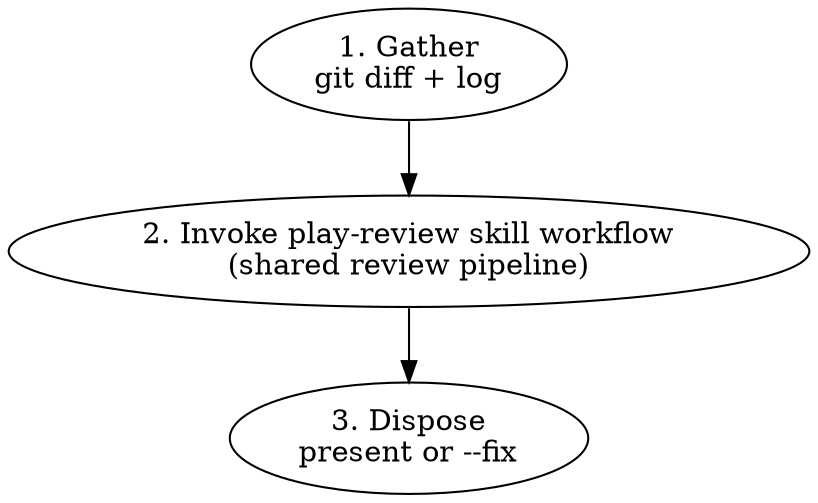

# Branch Review

Multi-agent code review on a local branch. Wrapper around `play-review`
for the local-diff case.

## Workflow



## Arguments

| Arg                       | Effect                                                                                                                                                                                                                                   |
| ------------------------- | ---------------------------------------------------------------------------------------------------------------------------------------------------------------------------------------------------------------------------------------- |
| `<base>`                  | Base branch to diff against (default: the repository's default branch, resolved via `origin/HEAD`, falling back to `main` then `master`)                                                                                                 |
| `--fix`                   | Auto-fix eligible blocking findings instead of presenting them. Used by `issue-priming-workflow --auto` for GitHub and Linear entrypoints.                                                                                               |
| `--last-reviewed <sha>`   | Enter follow-up mode using the immutable 40-character commit SHA from the previous branch-review run. Must be supplied together with `--prior-findings`; supplying only one follow-up argument is invalid and stops before reviewing.    |
| `--prior-findings <path>` | Repo-relative `.ephemeral/*-findings.json` file from the prior `play-review/findings/v1` run. Must be supplied together with `--last-reviewed`; validate it with the installed `play-review` helper before reading or passing it onward. |

`--fix` without follow-up arguments keeps the existing full-diff default used
by `issue-priming-workflow --auto`. Do not silently convert that Phase 7 gate
into an incremental review.

## Phase 1: Gather

Detect the base branch, validate any follow-up inputs, and collect the diff:

```bash
# Parse arguments. Flags may appear before or after the optional base.
# At most one positional base is accepted.
BASE_ARG=""
FIX_MODE=false
LAST_REVIEWED_SHA=""
PRIOR_FINDINGS_FILE=""
while [[ $# -gt 0 ]]; do
  case "$1" in
    --fix)
      FIX_MODE=true
      shift
      ;;
    --last-reviewed)
      [ -n "${2:-}" ] || { echo "--last-reviewed requires a SHA" >&2; exit 1; }
      LAST_REVIEWED_SHA="$2"
      shift 2
      ;;
    --prior-findings)
      [ -n "${2:-}" ] || { echo "--prior-findings requires a path" >&2; exit 1; }
      PRIOR_FINDINGS_FILE="$2"
      shift 2
      ;;
    --*)
      echo "unknown branch-review argument: $1" >&2
      exit 1
      ;;
    *)
      [ -z "$BASE_ARG" ] || { echo "multiple base arguments supplied" >&2; exit 1; }
      BASE_ARG="$1"
      shift
      ;;
  esac
done

# Determine base: explicit base argument wins; otherwise resolve from
# origin/HEAD, falling back to main then master if origin/HEAD is unset.
if [[ -n "$BASE_ARG" ]]; then
  BASE="$BASE_ARG"
elif symbolic_ref=$(git symbolic-ref --short refs/remotes/origin/HEAD 2>/dev/null); then
  BASE="${symbolic_ref#origin/}"
elif git show-ref --verify --quiet refs/remotes/origin/main; then
  BASE=main
elif git show-ref --verify --quiet refs/remotes/origin/master; then
  BASE=master
else
  BASE=main
fi

# Follow-up mode requires paired inputs and validated prior findings.
if [[ -n "${LAST_REVIEWED_SHA:-}" || -n "${PRIOR_FINDINGS_FILE:-}" ]]; then
  if [[ -z "${LAST_REVIEWED_SHA:-}" || -z "${PRIOR_FINDINGS_FILE:-}" ]]; then
    echo "--last-reviewed and --prior-findings must be supplied together" >&2
    exit 1
  fi

  PLAY_REVIEW_DIR="<installed-play-review-skill-bundle>"
  PLAY_REVIEW_HELPER="$PLAY_REVIEW_DIR/scripts/review-artifacts.sh"
  PRIOR_FINDINGS_HEAD_SHA="$(printf '%s\n' "$PRIOR_FINDINGS_FILE" | sed -n 's/^\.ephemeral\/.*-\([0-9a-f]\{40\}\)-findings\.json$/\1/p')"
  [ -n "$PRIOR_FINDINGS_HEAD_SHA" ] || { echo "prior findings path must include a 40-character review head" >&2; exit 1; }
  [ "$PRIOR_FINDINGS_HEAD_SHA" = "$LAST_REVIEWED_SHA" ] || { echo "--prior-findings review head must match --last-reviewed" >&2; exit 1; }
  HEAD_SHA="$PRIOR_FINDINGS_HEAD_SHA" FINDINGS_FILE="$PRIOR_FINDINGS_FILE" \
    bash "$PLAY_REVIEW_HELPER" validate-findings || exit 1
fi

FULL_DIFF_RANGE="$BASE...HEAD"
if [[ "${LAST_REVIEWED_SHA:-}" =~ ^[0-9a-f]{40}$ ]] &&
  git cat-file -e "${LAST_REVIEWED_SHA:-}^{commit}" &&
  git merge-base --is-ancestor "${LAST_REVIEWED_SHA:-}" HEAD; then
  CANDIDATE_ACTIVE_DIFF_RANGE="$LAST_REVIEWED_SHA..HEAD"
else
  CANDIDATE_ACTIVE_DIFF_RANGE="$FULL_DIFF_RANGE"
fi

# Get the diff and commit log
git diff "$FULL_DIFF_RANGE"
git log "$FULL_DIFF_RANGE" --oneline
git diff "$FULL_DIFF_RANGE" --stat
```

If the diff is empty, report "no changes to review" and stop.

Flags may appear before or after the optional base argument. Accept at most one
positional base; unknown flags or multiple base arguments stop before review.
Follow-up input is invalid and stops before invoking `play-review` when only
one follow-up argument is supplied, the prior findings path is unsafe, the
40-character review head embedded in `--prior-findings` does not exactly match
`--last-reviewed`, or the installed `play-review` helper rejects the prior
findings file. The prior findings file is local review context, not GitHub
thread state, and this skill still performs no GitHub posting.

In follow-up mode, choose the active range conservatively:

- `full_pr_diff_range = "$BASE...HEAD"` for whole-branch governance and
  documentation impact.
- `candidate_active_diff_range = "$LAST_REVIEWED_SHA..HEAD"` for possible
  incremental re-review.
- `active_diff_range = candidate_active_diff_range` only when the escalation
  checks below all pass.
- `is_followup_narrow = true` only when the narrow candidate range is selected.

Escalate back to full branch review when any of these are true:

- More than 5 files changed since `--last-reviewed`.
- `--last-reviewed` is not a 40-character SHA, does not resolve, or is not an
  ancestor of `HEAD`.
- New public API functions or types are introduced.
- Logic is restructured beyond previously flagged lines or adjacent changed
  lines.
- The increment touches architecture surfaces, shared workflow policy,
  source-owned contracts, generated-output behavior, safety boundaries, or
  broad file/module scope.
- The increment touches `docs/adr/**`, `docs/arch/**`, `MAP.md`, `AGENTS.md`,
  `CONTRIBUTING.md`, `agents/**`, reviewer-routing policy, output schemas,
  install/sync behavior, path-validation guards, external-invocation guards,
  generated-output renderers, or generated-output contracts.
- Scope classification is ambiguous.

When escalation fires, set `active_diff_range = "$BASE...HEAD"` and
`is_followup_narrow = false`, but still pass the validated prior findings to
`play-review` so the critic can evaluate carry-forward items. Compute
language hints from the changed file extensions in the selected active diff
(e.g., `*.ts`, `*.rs`, `*.md`). The set drives `play-review`'s dynamic-agent
triggers; deriving it from the full branch during a narrow follow-up would
defeat the follow-up scope.

## Phase 2: Invoke the play-review skill workflow

Hand off to `play-review` with these inputs (compose them into the briefing prose that invokes the skill):

- `working_directory` = repo root (the current working directory)
- `base_ref` = `$BASE`
- `active_diff_range` = the selected active range from Phase 1
- `full_pr_diff_range` = `"$BASE...HEAD"` (always, including follow-up mode)
- `head_sha` = `$(git rev-parse HEAD)`
- `mode` = `"fix"` if `--fix` is set, else `"present"`
- `language_hints` = computed from the selected active diff in Phase 1
- `prior_threads` = (none)
- `prior_branch_findings` = the validated `--prior-findings` envelope path
  (follow-up only)
- `last_reviewed_sha` = `--last-reviewed` (follow-up only)
- `is_followup_narrow` = computed in Phase 1

Follow `skills/play-review/SKILL.md` end-to-end. The output is a markdown document with a `## Findings` section, plus a side-channel `play-review/findings/v1` envelope file at `.ephemeral/<branch_slug>-<head_sha>-findings.json` and a one-line `Findings written to <path>.` notice (see `skills/play-review/SKILL.md` § Output for the contract).

In `--fix` mode, capture the Phase 2 `head_sha` and `Findings written to <path>.` notice path before applying any auto-fix commits:

```bash
REVIEW_HEAD_SHA="$(git rev-parse HEAD)"
# PLAY_REVIEW_OUTPUT is the captured markdown output from the Phase 2 play-review run.
FINDINGS_FILE=$(printf '%s\n' "$PLAY_REVIEW_OUTPUT" | sed -n 's/^Findings written to \(.*\)\.$/\1/p' | tail -n 1)
[ -n "$FINDINGS_FILE" ] || { echo "play-review findings notice missing" >&2; exit 1; }
REVIEW_FINDINGS_FILE="$FINDINGS_FILE"
```

## Phase 3: Dispose

**Without `--fix` (interactive mode):**

Re-emit `play-review`'s findings to the user in conversation. Preserve the format (file:line, severity, category, evidence code, recommendation). Findings tagged `Anchor: out-of-diff` are listed under "Out-of-diff findings" with a note that they require human judgment.

After the human-readable findings, surface `play-review`'s `Findings written to <path>.` notice line in the wrapper's output (echo it as-is; do not reword). The `play-review/findings/v1` envelope (defined in `skills/play-review/SKILL.md` § Output) is on disk at the cited path; downstream tools that wrap `branch-review`'s output read the file directly. No JSON fence is appended to conversation — the file is the consumer contract.

**With `--fix` (autonomous mode, used by `issue-priming-workflow --auto`):**

Iterate over blocking findings verified by the critic (i.e., not `Critic: INVALID` or `DOWNGRADE`). For each:

1. **If the finding hits the stop rule, halt `--fix` immediately and report.** Do not process further findings, do not commit anything for this run beyond fixes already applied. The stop rule fires when:
   - `Anchor: out-of-diff` — the fix would require editing files outside the diff (e.g., Sub-check B cross-document drift, corpus-wide pattern propagation), or
   - the finding is a `play-review` hard-rule judgment-required blocker:
     `Blocking | Safety` from Correctness Sub-check 1 (substitution audit) or
     `Blocking | Contracts` from Correctness Sub-check 2
     (documented-behavior verification), or
   - the fix would change a function's signature, alter control flow structure, touch more than one module, or need context beyond the flagged lines.

   Halting here is a contract with the caller: `issue-priming-workflow --auto` Phase 7 relies on `branch-review --fix` stopping before more auto-edits accumulate, so the user can take over a coherent branch state rather than a half-auto-fixed one.

2. Otherwise: apply the fix, run local CI checks (`pnpm run check` for TypeScript repos; equivalent elsewhere), commit.

Skip blocking findings tagged `Critic: INVALID` or `DOWNGRADE` — the critic disagrees with the agent. Note them in the report but do not auto-fix and do not halt.

Nit findings are never auto-fixed. Collect them for the report (including any with `Anchor: out-of-diff`).

**Commit message format:** Before composing fix commit messages, glob for `**/commit-guideline*.md` and follow its format. If none is found, use Conventional Commits: `fix(<scope>): <what was fixed>`.

After processing — whether the loop completes or halts on the stop rule — emit
this exact standalone notice line, expanding `$REVIEW_HEAD_SHA` to its
40-character value:

```
Review head: $REVIEW_HEAD_SHA.
```

Then report:

- Number of blocking findings auto-fixed
- Remaining nits (left for user), including `Anchor: out-of-diff` nits
- The blocking finding that triggered the halt, if any (cite file:line, severity, category, and which stop-rule branch fired)
- Blocking findings skipped because the critic flagged `INVALID` or `DOWNGRADE`
- Hard-rule judgment-required blockers preserved in the remaining set (Sub-check
  1 Safety or Sub-check 2 Contracts)
- Follow-up `carry_forward[]` entries preserved from `play-review`, if any

Then **overwrite the side-channel findings file in place** with the remaining-set envelope. The file path is the same one `play-review` wrote in Phase 2 — `.ephemeral/<branch_slug>-<head_sha>-findings.json`, see `skills/play-review/SKILL.md` § Output. Before opening `$FINDINGS_FILE`, run the canonical `play-review` helper with `validate-findings`; that command fails closed on unsafe paths, symlinks, non-files, unreadable files, schema mismatch, and a notice path that does not match the immutable Phase 2 review head. Immediately before overwriting, run the same helper with `prepare-findings-write`; that command prepares the write target but is not a substitute for read/schema validation. `PLAY_REVIEW_DIR` must resolve to the installed `play-review` skill bundle, not the repository under review; bind `PLAY_REVIEW_HELPER="$PLAY_REVIEW_DIR/scripts/review-artifacts.sh"` and invoke it from the target repository root.

```bash
PLAY_REVIEW_DIR="<installed-play-review-skill-bundle>"
PLAY_REVIEW_HELPER="$PLAY_REVIEW_DIR/scripts/review-artifacts.sh"
HEAD_SHA="$REVIEW_HEAD_SHA"  # immutable Phase 2 review head; current HEAD may include auto-fix commits
FINDINGS_FILE="$REVIEW_FINDINGS_FILE"
HEAD_SHA="$HEAD_SHA" FINDINGS_FILE="$FINDINGS_FILE" \
  bash "$PLAY_REVIEW_HELPER" validate-findings || exit 1
```

After computing the remaining-set envelope from the validated file, and
immediately before replacing it with the `Write` tool, re-run the helper's
write-target preparation for the same immutable review head and same file:

```bash
HEAD_SHA="$HEAD_SHA" FINDINGS_FILE="$FINDINGS_FILE" \
  bash "$PLAY_REVIEW_HELPER" prepare-findings-write || exit 1
```

The remaining-set `findings[]` contains all pre-fix findings except blockers
that were successfully auto-fixed and committed. That includes every nit
(regardless of anchor), blockers skipped because the critic flagged `INVALID`
or `DOWNGRADE`, hard-rule judgment-required blockers preserved in the remaining
set (Sub-check 1 Safety or Sub-check 2 Contracts), the blocker that triggered
the halt (if any), and any later blockers left unprocessed because an earlier
stop-rule finding halted the loop. Auto-fixed blockers do NOT appear — they're
already committed in the worktree. In follow-up runs, preserve
`carry_forward[]` from the validated `play-review` envelope unchanged; these
entries are unresolved prior blockers, not auto-fix targets from the current
`findings[]` loop. If the remaining set is empty and `carry_forward[]` is also
empty, still write the canonical empty envelope
(`{"schema":"play-review/findings/v1","findings":[],"carry_forward":[]}`) —
never leave the file from `play-review`'s pre-fix run unchanged, and never
delete it. If `findings[]` is empty but `carry_forward[]` is non-empty, the
post-`--fix` envelope must keep those carry-forward entries. Re-emit the
(unchanged) `Findings written to <path>.` notice line in conversation so
callers see the path. `issue-priming-workflow` Phase 7 reads from this file to
classify nits and produce `play-branch-finish`'s `nits_file`.

**Overwrite contract (strict subset).** The post-`--fix` envelope is a strict
subset of the pre-fix one: this skill only removes auto-fixed blockers from
`findings[]`; it preserves `carry_forward[]` unchanged, never adds new entries,
never re-anchors lines, and never edits `body` / `why` / `recommendation` text.
Downstream consumers (`pr-review` Phase 6, `issue-priming-workflow` Phase 7)
cannot tell from the file alone whether they are reading the pre-fix or
post-`--fix` version — the order is workflow-determined (Phase 7 always runs
after `branch-review --fix`). The schema does not carry a `source`
discriminator; the contract above is what guarantees consumers do not need one.

## Quick Reference

| Situation                                                 | Action                            |
| --------------------------------------------------------- | --------------------------------- |
| Empty diff                                                | Report "no changes", stop         |
| All clean                                                 | Report "no issues found"          |
| Blocking findings + `--fix`                               | Auto-fix eligible, commit, report |
| Blocking finding needs design change or out-of-diff edits | Stop, report to caller            |
| Hard-rule judgment-required blocker                       | Stop, preserve in findings file   |
| Nits + `--fix`                                            | Leave for user, list in report    |

## Common Mistakes

### Using `gh pr diff` instead of `git diff`

- **Problem:** No PR exists yet — `gh` commands will fail
- **Fix:** Always use `git diff <base>...HEAD`

### Posting findings to GitHub

- **Problem:** No PR to post to; this is a local review
- **Fix:** Present findings in the conversation or auto-fix with `--fix`

## Red Flags — You Are Violating This Skill

- You called any `gh` command — no PR exists
- You posted a review to GitHub
- You auto-fixed a finding tagged `Anchor: out-of-diff`
- You auto-fixed a `Blocking | Safety` Sub-check 1 finding (substitution audit) — these are design work
- You auto-fixed a `Blocking | Contracts` Sub-check 2 finding (documented-behavior verification) — these are design work
- You skipped delegating to `play-review` and tried to spawn agents yourself
- You presented `play-review`'s findings without preserving the evidence code (3-7 lines)

**All of these mean: STOP. Go back to the workflow.**

## Integration

**Called by:**

- `issue-priming-workflow --auto` Phase 7 (reached from GitHub and Linear entrypoints, with `--fix`)
- Any workflow needing pre-PR review

**Calls:**

- `play-review` — shared review pipeline (this skill is a wrapper)

**Complements:**

- `pr-review` — for reviewing existing GitHub PRs
- `play-review-response` — guidance for responding to review feedback
