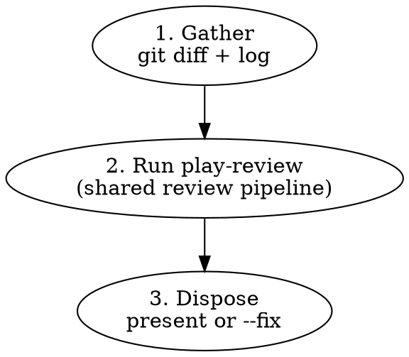

# Branch Review

Multi-agent code review on a local branch. Wrapper around `play-review`
for the local-diff case.

## Workflow



## Arguments

| Arg      | Effect                                                                                                                                     |
| -------- | ------------------------------------------------------------------------------------------------------------------------------------------ |
| `<base>` | Base branch to diff against (default: the repository's default branch, resolved via `origin/HEAD`, falling back to `main` then `master`)   |
| `--fix`  | Auto-fix eligible blocking findings instead of presenting them. Used by `issue-priming-workflow --auto` for GitHub and Linear entrypoints. |

## Phase 1: Gather

Detect the base branch and collect the diff:

```bash
# Determine base: explicit argument wins; otherwise resolve from origin/HEAD,
# falling back to main then master if origin/HEAD is unset.
if [[ -n "${1:-}" ]]; then
  BASE="$1"
elif symbolic_ref=$(git symbolic-ref --short refs/remotes/origin/HEAD 2>/dev/null); then
  BASE="${symbolic_ref#origin/}"
elif git show-ref --verify --quiet refs/remotes/origin/main; then
  BASE=main
elif git show-ref --verify --quiet refs/remotes/origin/master; then
  BASE=master
else
  BASE=main
fi

# Get the diff and commit log
git diff "$BASE"...HEAD
git log "$BASE"...HEAD --oneline
git diff "$BASE"...HEAD --stat
```

If the diff is empty, report "no changes to review" and stop.

Compute language hints from changed file extensions (e.g., `*.ts`, `*.rs`, `*.md`). The set drives `play-review`'s dynamic-agent triggers.

## Phase 2: Run play-review

Hand off to `play-review` with these inputs (compose them into the briefing prose that invokes the skill):

- `working_directory` = repo root (the current working directory)
- `base_ref` = `$BASE`
- `active_diff_range` = `"$BASE...HEAD"`
- `full_pr_diff_range` = `"$BASE...HEAD"` (same — no follow-up scope)
- `head_sha` = `$(git rev-parse HEAD)`
- `mode` = `"fix"` if `--fix` is set, else `"present"`
- `language_hints` = computed in Phase 1
- `prior_threads` = (none); `last_reviewed_sha` = (none); `is_followup_narrow` = `false`

Follow `skills/play-review/SKILL.md` end-to-end. The output is a markdown document with a `## Findings` section, plus a side-channel `play-review/findings/v1` envelope file at `.ephemeral/<branch_slug>-<head_sha>-findings.json` and a one-line `Findings written to <path>.` notice (see `skills/play-review/SKILL.md` § Output for the contract).

In `--fix` mode, capture the Phase 2 `head_sha` and `Findings written to <path>.` notice path before applying any auto-fix commits:

```bash
REVIEW_HEAD_SHA="$(git rev-parse HEAD)"
# PLAY_REVIEW_OUTPUT is the captured markdown output from the Phase 2 play-review run.
FINDINGS_FILE=$(printf '%s\n' "$PLAY_REVIEW_OUTPUT" | sed -n 's/^Findings written to \(.*\)\.$/\1/p' | tail -n 1)
[ -n "$FINDINGS_FILE" ] || { echo "play-review findings notice missing" >&2; exit 1; }
REVIEW_FINDINGS_FILE="$FINDINGS_FILE"
```

## Phase 3: Dispose

**Without `--fix` (interactive mode):**

Re-emit `play-review`'s findings to the user in conversation. Preserve the format (file:line, severity, category, evidence code, recommendation). Findings tagged `Anchor: out-of-diff` are listed under "Out-of-diff findings" with a note that they require human judgment.

After the human-readable findings, surface `play-review`'s `Findings written to <path>.` notice line in the wrapper's output (echo it as-is; do not reword). The `play-review/findings/v1` envelope (defined in `skills/play-review/SKILL.md` § Output) is on disk at the cited path; downstream tools that wrap `branch-review`'s output read the file directly. No JSON fence is appended to conversation — the file is the consumer contract.

**With `--fix` (autonomous mode, used by `issue-priming-workflow --auto`):**

Iterate over blocking findings verified by the critic (i.e., not `Critic: INVALID` or `DOWNGRADE`). For each:

1. **If the finding hits the stop rule, halt `--fix` immediately and report.** Do not process further findings, do not commit anything for this run beyond fixes already applied. The stop rule fires when:
   - `Anchor: out-of-diff` — the fix would require editing files outside the diff (e.g., Sub-check B cross-document drift, corpus-wide pattern propagation), or
   - the fix would change a function's signature, alter control flow structure, touch more than one module, or need context beyond the flagged lines.

   Halting here is a contract with the caller: `issue-priming-workflow --auto` Phase 7 relies on `branch-review --fix` stopping before more auto-edits accumulate, so the user can take over a coherent branch state rather than a half-auto-fixed one.

2. Otherwise: apply the fix, run local CI checks (`pnpm run check` for TypeScript repos; equivalent elsewhere), commit.

Skip blocking findings tagged `Critic: INVALID` or `DOWNGRADE` — the critic disagrees with the agent. Note them in the report but do not auto-fix and do not halt.

Nit findings are never auto-fixed. Collect them for the report (including any with `Anchor: out-of-diff`).

**Commit message format:** Before composing fix commit messages, glob for `**/commit-guideline*.md` and follow its format. If none is found, use Conventional Commits: `fix(<scope>): <what was fixed>`.

After processing — whether the loop completes or halts on the stop rule — emit
this exact standalone notice line, expanding `$REVIEW_HEAD_SHA` to its
40-character value:

```
Review head: $REVIEW_HEAD_SHA.
```

Then report:

- Number of blocking findings auto-fixed
- Remaining nits (left for user), including `Anchor: out-of-diff` nits
- The blocking finding that triggered the halt, if any (cite file:line, severity, category, and which stop-rule branch fired)
- Blocking findings skipped because the critic flagged `INVALID` or `DOWNGRADE`

Then **overwrite the side-channel findings file in place** with the remaining-set envelope. The file path is the same one `play-review` wrote in Phase 2 — `.ephemeral/<branch_slug>-<head_sha>-findings.json`, see `skills/play-review/SKILL.md` § Output. Before opening or overwriting `$FINDINGS_FILE`, run the canonical parsed-path guard from `play-review`, then use the `Write` tool for atomic replacement and reuse the canonical symlink guard from `play-review`'s Write rules before writing:

```bash
HEAD_SHA="$REVIEW_HEAD_SHA"  # immutable Phase 2 review head; current HEAD may include auto-fix commits
RAW_BRANCH=$(git rev-parse --abbrev-ref HEAD)
if [ "$RAW_BRANCH" = HEAD ]; then
  BRANCH_SLUG=detached
else
  BRANCH_SLUG=$(printf '%s' "$RAW_BRANCH" | tr '/' '-' | tr -cd '[:alnum:]._-')
  case "$BRANCH_SLUG" in
    ''|.|..|-*|.*) BRANCH_SLUG=unnamed ;;
  esac
fi
EXPECTED_FINDINGS_FILE=".ephemeral/${BRANCH_SLUG}-${HEAD_SHA}-findings.json"
FINDINGS_FILE="$REVIEW_FINDINGS_FILE"
case "$FINDINGS_FILE" in
  .ephemeral/*/*) echo "nested findings path rejected: $FINDINGS_FILE" >&2; exit 1 ;;
  .ephemeral/*-findings.json) ;;
  *) echo "play-review path validation failed: $FINDINGS_FILE" >&2; exit 1 ;;
esac
[ "${FINDINGS_FILE#*..}" = "$FINDINGS_FILE" ] || { echo "path traversal: $FINDINGS_FILE" >&2; exit 1; }
[ "$FINDINGS_FILE" = "$EXPECTED_FINDINGS_FILE" ] || { echo "findings path mismatch: $FINDINGS_FILE" >&2; exit 1; }
[ -L .ephemeral ] && { echo ".ephemeral must be a directory, not a symlink" >&2; exit 1; }
mkdir -p .ephemeral
[ -L "$FINDINGS_FILE" ] && rm "$FINDINGS_FILE"
```

The remaining-set `findings[]` contains: every nit (regardless of anchor), plus any blocker that was skipped (`INVALID`/`DOWNGRADE`), plus the blocker that triggered the halt (if any). Auto-fixed blockers do NOT appear — they're already committed in the worktree. If the remaining set is empty, still write the canonical empty envelope (`{"schema":"play-review/findings/v1","findings":[],"carry_forward":[]}`) — never leave the file from `play-review`'s pre-fix run unchanged, and never delete it. Re-emit the (unchanged) `Findings written to <path>.` notice line in conversation so callers see the path. `issue-priming-workflow` Phase 7 reads from this file to classify nits and produce `play-branch-finish`'s `nits_file`.

**Overwrite contract (strict subset).** The post-`--fix` envelope is a strict subset of the pre-fix one: this skill only removes auto-fixed blockers from `findings[]`; it never adds new entries, never re-anchors lines, and never edits `body` / `why` / `recommendation` text. Downstream consumers (`pr-review` Phase 6, `issue-priming-workflow` Phase 7) cannot tell from the file alone whether they are reading the pre-fix or post-`--fix` version — the order is workflow-determined (Phase 7 always runs after `branch-review --fix`). The schema does not carry a `source` discriminator; the contract above is what guarantees consumers do not need one.

## Quick Reference

| Situation                                                 | Action                            |
| --------------------------------------------------------- | --------------------------------- |
| Empty diff                                                | Report "no changes", stop         |
| All clean                                                 | Report "no issues found"          |
| Blocking findings + `--fix`                               | Auto-fix eligible, commit, report |
| Blocking finding needs design change or out-of-diff edits | Stop, report to caller            |
| Nits + `--fix`                                            | Leave for user, list in report    |

## Common Mistakes

### Using `gh pr diff` instead of `git diff`

- **Problem:** No PR exists yet — `gh` commands will fail
- **Fix:** Always use `git diff <base>...HEAD`

### Posting findings to GitHub

- **Problem:** No PR to post to; this is a local review
- **Fix:** Present findings in the conversation or auto-fix with `--fix`

## Red Flags — You Are Violating This Skill

- You called any `gh` command — no PR exists
- You posted a review to GitHub
- You auto-fixed a finding tagged `Anchor: out-of-diff`
- You auto-fixed a `Blocking | Safety` Sub-check 1 finding (substitution audit) — these are design work
- You auto-fixed a `Blocking | Contracts` Sub-check 2 finding (documented-behavior verification) — these are design work
- You skipped delegating to `play-review` and tried to spawn agents yourself
- You presented `play-review`'s findings without preserving the evidence code (3-7 lines)

**All of these mean: STOP. Go back to the workflow.**

## Integration

**Called by:**

- `issue-priming-workflow --auto` Phase 7 (reached from GitHub and Linear entrypoints, with `--fix`)
- Any workflow needing pre-PR review

**Calls:**

- `play-review` — shared review pipeline (this skill is a wrapper)

**Complements:**

- `pr-review` — for reviewing existing GitHub PRs
- `play-review-response` — guidance for responding to review feedback
