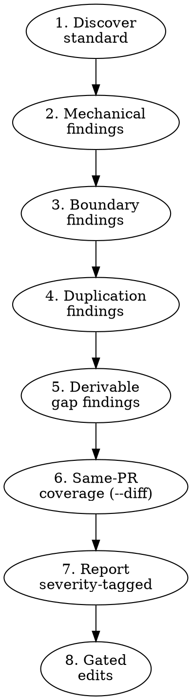

# Doc Gardening

## Overview

A repository's documentation rots quietly. Stale links, content in the wrong
file, shipped behavior with no spec, schemas that drift from their docs --
none of it shows up in CI, but all of it costs the next reader.

**Core principle:** the target repository's own standard is authoritative.
Read it, audit against it, cite its section numbers in findings. Do not
import conventions from other repos or your training.

**Scope is narrow on purpose.** This skill flags derivable gaps and
mechanical violations. It does not decide what _should_ exist, draft new
prose, or write ADRs.

## The Rule

```
NEVER GUESS THE STANDARD. NEVER CREATE NEW DOCS THE STANDARD DOES NOT MANDATE.
```

If you cannot cite a section of the target repo's documentation standard for
a finding, the finding is out of scope.

**Violating the letter of this rule is violating the spirit of gardening.**

## When to Use

Use only when explicitly invoked with phrases like:

- "garden docs", "doc gardening"
- "documentation audit", "audit the docs"
- "doc rot check", "documentation health check"
- "review documentation against the standard"

**Do not auto-trigger** on incidental phrases like "let me document this",
"update the README", "add a note to AGENTS.md", or "fix the typo in the
spec". Those are normal edits, not audits.

Same-PR documentation impact is also normal implementation/review work, not
implicit gardening. When an active issue or PR changes durable truth covered by
the target standard's same-PR update rule, the owning artifact update stays with
that active planning/execution/review flow. AFDS adopters should provide that
standard at `docs/guidelines/documentation-standard.md`; for audits, Phase 1
still discovers the target repository's authoritative standard before applying
any same-PR coverage rule. Use `doc-gardening` for explicit documentation health
checks and audits. For the broader routing model, see
`docs/guidelines/portable-afds-user-procedure-map.md`.

## Modes

| Mode            | Default | Scope                                                                   |
| --------------- | ------- | ----------------------------------------------------------------------- |
| `--full`        | yes     | Whole repo against the standard                                         |
| `--diff <base>` | no      | Only the doc-coverage delta for changes since `<base>` (default `main`) |

`--diff` is the optional audit mode to use before opening a PR when you want a
documentation-coverage check. It can report same-PR coverage gaps, but it does
not own the same-PR update; the active planning/execution/review workflow owns
durable updates caused by its own change. `--full` is for explicit periodic
gardening passes.

**`--diff` graceful degradation:** if the target standard does not name a
same-PR update rule, Phase 6 is skipped and `--diff` collapses to phases
1-5 + report. The report explicitly notes this so the user knows the
run was not gated by same-PR coverage.

## Workflow



Phases are run in order. Each phase emits findings. Edits happen only after
the user picks which findings to fix.

## Phase 1: Discover the standard

Find the target repo's documentation standard. Search in this order and
**stop at the first match**:

1. `docs/guidelines/documentation-standard.md`
2. `docs/guidelines/documentation.md`
3. `DOCUMENTATION.md` at repo root
4. Any file in `docs/guidelines/` whose name contains `documentation` and
   `standard`

If steps 1-3 all miss and step 4 returns more than one candidate, **ask
the user which file is authoritative** — do not pick arbitrarily.

If found: this file is authoritative. Read it fully. Note its section
numbering scheme — findings cite sections from _this_ file, not a generic
template.

Also locate the matching checklist if it exists:
`docs/guidelines/documentation-checklists.md` (or sibling).

If no standard exists: stop and report. Do not invent one. Tell the user:

> No documentation standard found at the expected paths. Doc gardening
> requires the target repo to define its own standard — please add one
> (or point me to where it lives).

Do not proceed to later phases without a standard. Without it, every
finding becomes a judgment call, which is the failure mode this skill
exists to prevent.

## Phase 2: Mechanical findings

Deterministic checks. Severity: `Blocking | Documentation`.

- **Markdown lint / format**: run the repo's configured commands if they
  exist (e.g., `pnpm run lint:markdown`, `pnpm run format:markdown:check`).
  If the repo has no markdown linter configured, skip — do not impose one.
- **Broken relative links**: scope is **inline-style links only** —
  `[text](path)` in tracked markdown. Resolve `path` relative to the file
  and flag missing targets. Anchors (`#section`) are checked when feasible
  but not required. **Exclude** links inside fenced code blocks
  (triple-backtick or triple-tilde), inline-code spans (single backticks),
  and HTML comments. **Out of scope** for this rule: reference-style
  links (`[text][ref]` + `[ref]: path`), image links (``),
  and angle-bracket destinations (`[t](<path>)`). If the target repo
  relies on these heavily, expand the rule explicitly rather than letting
  silent false negatives accumulate.
- **MAP.md entries resolve**: if the standard names a navigation index
  (commonly `MAP.md`), every link in it must resolve.
- **Soft-constraint violations**: if the standard names size constraints
  (e.g., `AGENTS.md` ≤ N words, ≤ M sections), check them. Cite the section
  of the standard that defines the constraint.
- **Filename anti-patterns**: flag filenames that match the target
  standard's "avoid" list verbatim. The kinds of names standards
  typically forbid include: dated names for enduring docs,
  version-marker suffixes (`v2`, `v3`, `final`), and vague labels
  (`misc`, `temp`, `notes`) — but only flag the ones the standard
  actually names.

Do **not** invent filename rules the standard does not list.

## Phase 3: Boundary findings

Walk the standard's "where information belongs" / "boundary rules" section.
For each boundary rule, sample the candidate docs and check whether
content sits in the right place. Severity: `Nit | Documentation`.

Examples (only if the target standard endorses these splits):

- Architecture detail in the agent entry point (should be in
  `docs/arch/`).
- Navigation in `README.md` (should be in `MAP.md`).
- Transient task notes in `docs/adr/` (ADRs are durable decisions).
- Contributor workflow embedded in the agent entry point (should be in
  `{{file:workflow-guide}}` or `CONTRIBUTING.md`).

Each boundary finding cites the section number/heading of the standard it
violates. If you cannot cite, the finding is speculation — drop it.

## Phase 4: Duplication findings

Walk the standard's "no duplicate sources of truth" / "single source of
truth" list. Detect overlapping authority across the named locations.
Severity: `Nit | Documentation`.

Use `grep` with semantically-significant phrases drawn from the standard's
own boundary list. Do not flag legitimate cross-references — flag only
content that asserts authority from two places.

## Phase 5: Derivable-gap findings

These are gaps that current artifacts in the repo make detectable.
Severity: `Nit | Documentation`.

| Gap type                     | Detection                                                                                                                                                                     |
| ---------------------------- | ----------------------------------------------------------------------------------------------------------------------------------------------------------------------------- |
| Shipped CLI not in spec      | CLI command file exists in source; not mentioned in the spec the standard names for CLI documentation.                                                                        |
| Config field undocumented    | New field in the schema (Zod, JSON Schema, TOML schema, etc.); no mention in the configuration spec the standard names.                                                       |
| Module without arch coverage | Top-level module under `src/`/`crates/`/`apps/` not mentioned in the architecture overview the standard names.                                                                |
| Module without local README  | The standard endorses per-module READMEs and the module fits the standard's own criteria for "major module"; no `README.md` (or sibling local doc) exists in the module root. |
| Stale example                | Doc references symbol/path that no longer exists (`grep` for the symbol, fail to find).                                                                                       |

**Use the target standard's own definition of "major module".** Do not
impose a numeric file-count threshold the standard does not state. If the
standard uses qualitative language ("major modules, not every tiny
helper"), apply that language: flag only modules already named as major
in the standard, the architecture overview, or the agent entry point's
repo map. When in doubt, do not flag.

**Do not draft the missing docs.** Flag the gap with file paths and a
one-line description. The user decides whether and how to fill it.

## Phase 6: Same-PR coverage (`--diff` only)

When invoked with `--diff <base>`, additionally enforce the standard's
"same-PR update rule" (or equivalent). Severity: `Blocking | Documentation`.

```bash
git diff --name-only "$BASE"...HEAD
```

For each changed path, map it to the trigger category named by the
standard:

- Schema/interface change → corresponding spec file must also be in the
  diff.
- File rename or move → `MAP.md` (or the named navigation index) must be
  in the diff.
- New CLI command → CLI command spec must be in the diff.
- Externally visible behavior change → the spec covering that behavior
  must be in the diff.
- Run/test/debug procedure change → agent entry point or workflow doc
  must be in the diff.

Use only the trigger categories the target standard actually names. If
the standard does not enforce same-PR updates, skip this phase.

## Phase 7: Report

Severity follows the canonical Finding Model from the repo's
code-review guideline: `Blocking` (mechanical violations and same-PR
coverage failures — objectively wrong) and `Nit` (boundary,
duplication, and derivable-gap findings — judgment calls the user
decides). All categories are `Documentation`. The skill emits no
custom severity tier — the canonical model is the one the rest of
the review pipeline already speaks.

Emit a single markdown report with this structure:

```markdown
# Doc Gardening Report

**Repository:** <abs path>
**Standard:** <relative path to standard file>
**Mode:** --full | --diff <base>

[Notice line, only when applicable:]
**Notice:** target standard does not name a same-PR update rule;
Phase 6 was skipped. This run was not gated by same-PR coverage.

## Summary

- N Blocking | Documentation (mechanical / same-PR coverage)
- N Nit | Documentation (boundary / duplication / derivable gaps)

## Findings

### Blocking | Documentation: <short title>

- **File:** `path:line` (when applicable)
- **Standard:** § <section number / heading from the target's standard>
- **Detail:** <one paragraph>
- **Suggested fix:** <one-line, mechanical only — no prose drafts>

[... one block per finding ...]
```

Order findings by severity (`Blocking` → `Nit`), then by file path.
Each finding cites the section of the target's standard it violates.

After the report, ask the user which findings to fix. Do not proceed to
edits without explicit selection.

## Phase 8: Gated edits

Apply only the user-selected fixes. After applying:

1. Re-run the mechanical phase commands (markdown lint/format) to confirm
   no regressions.
2. Re-run the link resolver on touched files.
3. Report what was fixed and what remains.

If any fix would require drafting new prose (e.g., writing a missing
spec section, rewording an awkward paragraph), **stop**. Tell the user:

> Finding <id> requires drafting prose. This skill does not draft new
> documentation content. Please draft it yourself, or route the prose work
> through the owning authoring workflow or `write-prose` as a separate step.

## Out of Scope

This skill does **not**:

- Draft ADRs, even when it detects what looks like a durable decision
  with no ADR. Decisions need a human author and rationale; gardening
  cannot reconstruct that.
- Rewrite prose for style, tone, or clarity. Mechanical fixes only.
- Decide what _should_ be documented based on judgment. Only flag gaps
  that current artifacts (CLI commands, schemas, modules) make
  detectable.
- Apply documentation conventions from other repositories or training
  data. Only the target's own standard counts.
- Operate without a documentation standard in the target repo. If none
  exists, stop in Phase 1.

## Common Mistakes

### Importing conventions from another repo

- **Problem:** You audited `devcanon` last week; now auditing
  `shotloom`. You apply `devcanon`'s "Not used" list (no
  `contracts/`, no `docs/ipc/`) to `shotloom`, which mandates both.
- **Fix:** Re-read the target repo's own standard before each audit.
  Cite section numbers from _that_ file. Each repo's standard is
  authoritative for itself.

### Drafting an ADR for "obvious" decisions

- **Problem:** You see a recent architectural choice with no ADR. You
  draft `adr-0042-some-decision.md` to "fill the gap".
- **Fix:** ADRs need a human-authored rationale and a decision moment.
  Gardening cannot reconstruct that. Flag the gap if the standard
  endorses ADRs; do not draft the file.

### Rewriting awkward prose

- **Problem:** You found a section that reads poorly. You "garden" by
  rewriting it.
- **Fix:** Mechanical fixes only. Awkward prose is not within scope.
  Flag it as `Nit | Documentation` if the standard names a
  writing-quality rule; otherwise leave it alone.

### Inventing filename rules

- **Problem:** The standard does not list `notes.md` as an avoided
  name, but you flag it anyway because it "feels" temporary.
- **Fix:** Only flag filenames the standard names verbatim in its
  "avoid" list. If the standard is silent, the filename is fine.

### Imposing a numeric threshold for "major module"

- **Problem:** The standard says "major modules, not every tiny
  helper"; you flag every subtree with more than N files anyway.
- **Fix:** Defer to the standard's own definition. If the architecture
  overview or the agent entry point's repo map names a module as
  major, use that. If the standard is qualitative and you are not
  sure, do not flag.

### Treating absence of a doc as a gap

- **Problem:** The target repo has no `docs/tech-debt/` directory.
  You flag it as a missing required doc.
- **Fix:** Required vs. optional varies per standard. Read the
  target's "required / should have / optional" list before flagging
  absences.

## Rationalization Table

| Excuse                                                 | Reality                                                                                     |
| ------------------------------------------------------ | ------------------------------------------------------------------------------------------- |
| "The standard doesn't say it, but it's clearly bad."   | Out of scope. The standard is authoritative.                                                |
| "I'll just draft a short ADR — it's a small one."      | All ADRs are out of scope. Even small ones need a human decision and rationale.             |
| "This prose is confusing; I'll improve it while here." | Out of scope. Mechanical fixes only.                                                        |
| "Other repos use this convention, so I'll apply it."   | Each repo's standard is authoritative for itself. Do not import.                            |
| "There's no standard, but I know what's good."         | Stop in Phase 1. Without a standard, every finding is speculation.                          |
| "This finding seems obvious; I'll skip the citation."  | Every finding cites a section of the target's standard. No citation = no finding.           |
| "User said 'fix the README' — they want a full audit." | They asked for an edit. Do the edit. Do not run the audit unless they invoke it explicitly. |

## Red Flags — STOP

- You drafted any markdown file the user did not ask for.
- A finding has no citation to a section of the target's standard.
- You imported a filename rule, layout rule, or naming rule from another
  repo or your training.
- You rewrote prose that was not mechanically broken.
- You started auditing without reading the target repo's
  `documentation-standard.md` (or equivalent).
- You proceeded through the phases when Phase 1 found no standard.

**All of these mean: stop and re-read this skill.**

## Quick Reference

| Situation                          | Action                                                          |
| ---------------------------------- | --------------------------------------------------------------- |
| User says "garden docs"            | Run all phases against the target's standard                    |
| User says "doc audit before PR"    | Run with `--diff <base>` (default `main`)                       |
| No standard found                  | Stop in Phase 1 and report                                      |
| Empty diff (in `--diff` mode)      | Report "no doc-relevant changes since base", stop               |
| Mechanical commands not configured | Skip those checks; do not impose new linters                    |
| User wants a finding fixed         | Apply only that fix; re-run mechanical checks; report remainder |
| Fix needs new prose                | Stop, tell the user, do not draft                               |

## Integration

**Called by:** users explicitly. Not auto-invoked by other skills.

**Complements:**

- `branch-review` / `pr-review` — code-quality and spec-conformance
  reviews. `doc-gardening` covers documentation health, which those
  skills do not.
- `play-branch-finish` — natural pairing: run `doc-gardening --diff`
  before finishing a branch.
- `write-prose` — optional follow-up for user-requested wording polish on
  existing text, or for a prose pass after the owning documentation workflow
  has supplied the draft and authority boundaries. Do not call `write-prose`
  during the audit phases, to invent missing documentation, or to bypass the
  user-selected gated-edit model.

**Does not call other skills during audit or finding generation.**
Findings → user → optional gated edits. Prose drafting or style rewrites are
separate work and must preserve the target repository's documentation
standard and the owning artifact's authority.
