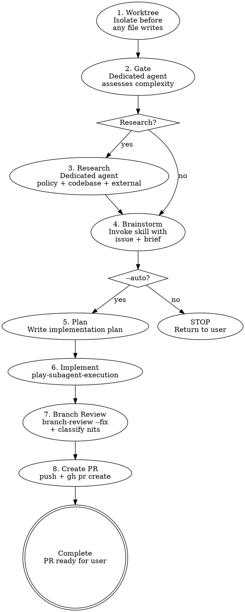

# Issue Priming Workflow

Continue an issue-priming workflow handed off by `linear-issue-priming` or `github-issue-priming`. Set up an isolated worktree, gate complexity, optionally research, brainstorm, and (in `--auto` mode) plan, implement, review, and create a PR. Source-specific concerns (issue fetching, identifier shape) are handled by the entrypoint before this skill is invoked.

## Inputs

This skill is invoked with a normalized issue payload from one of the source entrypoints. The payload looks like:

```
## Issue Payload

- **source**: linear | github
- **identifier**: ENG-123 (or #149)
- **title**: <verbatim issue title, single line>
- **body**: |
    <verbatim issue description/body, multi-line, indented>
- **mode**: interactive | auto
- **research**: gated | forced
- **branch-name**: <type>/<id>-<title-slug>
- **worktree-leaf**: <id>-<title-slug>
```

Field semantics:

| Field           | Used by                                        |
| --------------- | ---------------------------------------------- |
| `source`        | Phase 8 PR description "Closes" line wording   |
| `identifier`    | Agent prompts, brainstorm args, PR description |
| `title`         | Agent prompts, brainstorm args                 |
| `body`          | Gate agent, research agent, brainstorm args    |
| `mode`          | Phase 4 stop-vs-continue, Phases 5–8 gating    |
| `research`      | Phase 2 gate-skip                              |
| `branch-name`   | Phase 1 worktree setup                         |
| `worktree-leaf` | Phase 1 worktree setup                         |

`payload.body` carries either Linear `.description` text or GitHub `.body` text — this skill treats them identically.

`payload.branch-name` and `payload.worktree-leaf` are pre-sanitized by the entrypoint into git-safe form (no `#`, no special characters): GitHub passes the integer issue number (e.g., `149`); Linear passes the raw identifier (e.g., `ENG-123`). They are NOT the same as `payload.identifier`, which retains the source-native shape (`#149` for GitHub, `ENG-123` for Linear).

The phases below use `--auto` and `--research` as shorthand for the operator's CLI flags at the entrypoint. The entrypoint reflects them into the payload as `payload.mode = auto` (vs. `interactive`) and `payload.research = forced` (vs. `gated`); the workflow itself only ever sees the payload.

## Workflow



## Phase 1: Create Worktree

Set up an isolated workspace **immediately after fetching the issue**, before any file writes (specs, designs, plans). This ensures all artifacts live in the worktree from the start — no copying, no path confusion.

Use the `branch-name` and `worktree-leaf` values from the payload — the entrypoint has already derived them from the source-specific identifier.

Invoke the `issue-worktree-setup` skill. It owns environment detection and
setup policy. Do NOT re-implement the worktree decision logic here.

```bash
ISSUE_WORKTREE_SETUP_DIR="<issue-worktree-setup-skill-dir>"
HELPER_SCRIPT="$ISSUE_WORKTREE_SETUP_DIR/scripts/setup-worktree.sh"

WORKTREE_SETUP_OUTPUT=$(
  BRANCH_NAME="<payload.branch-name>" \
  WORKTREE_LEAF="<payload.worktree-leaf>" \
  bash "$HELPER_SCRIPT"
)
```

Resolve `ISSUE_WORKTREE_SETUP_DIR` to the installed
`issue-worktree-setup` skill bundle. The repository working directory may be
any subdirectory inside the target checkout. Parse `WORKTREE_SETUP_OUTPUT`
exactly as specified in the helper skill's output contract; do not
whitespace-split it or assume the script lives under the target repo's own
`scripts/` directory.

Handle the result:

- If `MODE=stop`, surface `MESSAGE` and stop the workflow. The forbidden
  outcome is **producing a worktree (or any equivalent checkout) for this
  issue from inside the current session** — by any mechanism. That includes,
  but is not limited to: `cd`-ing to the primary checkout; passing
  `--git-dir`/`--work-tree`/`-C` to git or to the helper; setting `GIT_DIR`
  or `GIT_WORK_TREE` env vars; calling `git worktree add` directly without
  the helper; cloning the repo elsewhere on disk to escape the gate; or any
  other path that reaches the same end state. If you find yourself
  reasoning about _which_ mechanism is "really" forbidden, you are
  rationalizing — the outcome is the rule. The operator returns to primary
  explicitly and re-runs the skill from there.
- If `MODE=reuse` or `MODE=new`, continue from `WORKTREE_PATH`.

**After worktree is ready:** All subsequent phases (gate, research,
brainstorming, planning, implementation) operate from `WORKTREE_PATH`. Pass
that path to all dispatched subagents.

**If brainstorming concludes "don't implement":** Clean up the worktree with `play-branch-finish` (option: discard).

## Phase 2: Complexity Gate

The gate is **always evaluated** — it is not optional. Only the research phase (Phase 3) is conditional based on the gate's output.

Dispatch a **dedicated exploration agent** using the prompt template in `references/gate-agent-prompt.md`. The agent reads the issue description, scans `docs/adr/` titles, and checks `AGENTS.md` for relevant rules. Use `{{model:standard}}` as the floor — escalate to `{{model:deep}}` for issues with ambiguous scope or multiple conflicting signals.

**Pass to the gate agent:**

- Issue title + description (verbatim)
- Repository root path

**Gate returns:** `RESEARCH_NEEDED` or `SKIP_RESEARCH` with a one-line reason.

**Override:** If the user passed `--research` in the skill args, skip the gate and go directly to research.

### Gate Signals

**Trigger research if ANY of:**

| Signal                   | Detection                                                                                        |
| ------------------------ | ------------------------------------------------------------------------------------------------ |
| Cross-module impact      | Issue references files/types in 2+ crates or requires coordinated edits across module boundaries |
| New module or public API | Issue describes adding a component, crate, or public interface that doesn't exist yet            |
| No covering ADR          | Scan of `docs/adr/` finds no existing decision covering this domain                              |
| Conflicting guidelines   | Existing policies or ADRs pull in different directions for this issue                            |
| Explicit request         | Issue description contains "brainstorm", "design decision", or "choose between"                  |

**Skip research if ALL of:**

- Single-module, single-file change
- Clear precedent exists in the codebase
- Covering ADR or guideline prescribes the approach

## Phase 3: Research (Conditional)

Dispatch the **`research-agent`** agent using the prompt template in `references/research-agent-prompt.md`. Use `{{model:standard}}` as the floor — escalate to `{{model:deep}}` for cross-module or architecturally complex issues.

**Pass to the research agent:**

- Issue title + description
- Repository root path
- Gate agent's reasoning (so it knows why research was triggered)

**Research agent internally dispatches sub-agents in parallel:**

1. Policy/guideline scanner
2. Codebase pattern explorer
3. External OSS precedent searcher (web search + code search)

**Research agent returns:** A synthesized brief (500-1000 words) in the format:

```markdown
## Issue Brief: <ID> — <TITLE>

### Policy Constraints

- [rules that apply]

### Existing Patterns

- [how the codebase handles similar things]

### External Precedent

- [how other projects solve this]

### Recommended Approaches

- [2-3 options, leading with the architecturally cleanest]
```

**Architecture preference:** The research agent surfaces the architecturally cleaner option, not just the easiest one.

**Persist the brief and emit the notice line.** After the agent returns:

1. Compute the brief path: `.ephemeral/<YYYY-MM-DD>-<id>-research.md` where
   `<YYYY-MM-DD>` is today's date and `<id>` is `payload.identifier` slugged
   (`#167` → `167`, `ENG-123` → `eng-123`).
2. Validate the path before writing (the same guard a downstream consumer
   would apply, narrowed to the research-brief suffix):

   ```bash
   case "$RESEARCH_BRIEF_PATH" in
     .ephemeral/*-research.md) ;;
     *) echo "research brief path validation failed: $RESEARCH_BRIEF_PATH" >&2; exit 1 ;;
   esac
   [ "${RESEARCH_BRIEF_PATH#*..}" = "$RESEARCH_BRIEF_PATH" ] || { echo "path traversal: $RESEARCH_BRIEF_PATH" >&2; exit 1; }
   ```

   This bash mirrors the authoritative path-validation guard in
   `skills/play-review/SKILL.md` § Output → Side-channel file → Path
   (required by ADR-0012), narrowed to the research-brief suffix. The
   canonical copy lives in `play-review/SKILL.md`; if that copy gains a
   step (e.g., a new pre-read check), update this skill to match.

3. Apply the symlink guard before the `Write` tool call (per
   `skills/play-review/SKILL.md` § Output → Write rules — fork-PR working
   trees may contain pre-staged symlinks):

   ```bash
   [ -L "$RESEARCH_BRIEF_PATH" ] && rm "$RESEARCH_BRIEF_PATH"
   ```

4. Write the brief verbatim to the path using the `Write` tool.
5. Emit the literal line `Research brief written to <repo-relative-path>.`
   to the conversation output. This is the consumer contract surface; do
   not reword.
6. Carry the path forward to Phase 4's args (no parsing required — the
   path was computed in step 1 above and is already in hand). The full
   synthesized brief is no longer threaded through; only the path
   reference is. ("Capture" is reserved for the consumer pattern in
   Phases 5 and 6, where the controller parses the path off a producer's
   notice line; Phase 3 is the producer here.)

See [ADR-0013](../../docs/adr/adr-0013-path-based-phase-artifact-handoff.md)
for the convention rationale and the producer notice-line contract.

## Phase 4: Invoke Brainstorming

Invoke the `play-brainstorm` skill with the combined context below.

`<source-noun>` below is `Linear` when `payload.source` is `linear` and `GitHub` when `payload.source` is `github`.

**Args format when research was done:**

```
Resolve <source-noun> issue <ID>: <TITLE>

## Issue Body
<verbatim payload.body>

Research brief: <repo-relative-path captured from Phase 3's notice line>
```

The `Research brief: <path>` line replaces the previous inline `## Research
Brief\n<brief>` block. `play-brainstorm` validates the path and reads the
brief from disk (see `skills/play-brainstorm/SKILL.md` § Inputs and
[ADR-0013](../../docs/adr/adr-0013-path-based-phase-artifact-handoff.md)).
The `## Issue Body` block remains inline because the issue body is a single
small artifact arriving from the entrypoint payload — it is not a multi-hop
carry-forward, and re-writing it to a file would add a hop without saving
content.

**Args format when research was skipped:**

```
Resolve <source-noun> issue <ID>: <TITLE>

## Issue Body
<verbatim payload.body>

## Research Brief
Skipped — <reason from gate agent>. Proceed with codebase exploration in brainstorming.
```

**`--auto` mode behavior in brainstorming:**

When `--auto` is set, the brainstorming skill still runs fully (exploration, option generation, spec writing), but:

- Do NOT ask the user to choose between options — pick the architecturally cleanest approach
- Do NOT wait for user approval of the spec/design — proceed immediately
- Do NOT ask clarifying questions — make reasonable assumptions and document them in the spec

These bullets cover routine clarifications and tie-breakable choices. The exception below — genuine architectural ambiguity with no clean winner — is the one case where stopping `--auto` is required.

If brainstorming surfaces a decision that is genuinely ambiguous (two equally valid approaches with different trade-offs), **stop `--auto` mode and ask the user**. Resume autonomous execution after their answer.

**Don't launder a coin-flip into a fait accompli.** "Document the assumption in the spec and let the user override at PR review" sounds reasonable but is the same violation. Once a plan and implementation exist, the user reviewing the PR is anchoring against working code, not deciding fresh between options — that's a worse decision context, not a better one. A 30-second question now beats a re-implementation later.

**Third-party "either is fine" is not authorization.** PM comments on the issue, teammate Slack messages, threaded discussion on the ticket — none of these count as in-session authorization for `--auto` to silently pick. They are schedule pressure dressed as consent. Surface the choice to the operator who ran `--auto`; that's the only authorization channel that counts.

**Without `--auto`:** Stop after brainstorming completes. Return control to the user.

## Phases 5-8: Autonomous Execution (`--auto` only)

These phases run only when `--auto` is set. They chain automatically after brainstorming.

**`--auto` removes user checkpoints. It does not remove phases.** The full pipeline runs end-to-end; only the gates between phases are bypassed. Phases are never skipped, streamlined, or short-circuited because an issue "looks simple," because a teammate is impatient, or because CI is green.

### Phase 5: Write Plan

After `play-brainstorm` returns, capture the literal `Design written to <path>.` notice line it emitted. Validate the captured path:

```bash
case "$DESIGN_PATH" in
  .ephemeral/*-design.md) ;;
  *) echo "design path validation failed: $DESIGN_PATH" >&2; exit 1 ;;
esac
[ "${DESIGN_PATH#*..}" = "$DESIGN_PATH" ] || { echo "path traversal: $DESIGN_PATH" >&2; exit 1; }
[ -r "$DESIGN_PATH" ] || { echo "design missing or unreadable: $DESIGN_PATH" >&2; exit 1; }
```

This bash mirrors the authoritative path-validation guard in
`skills/play-review/SKILL.md` § Output → Side-channel file → Path
(required by ADR-0012), narrowed to the design-document suffix. The
canonical copy lives in `play-review/SKILL.md`; if that copy gains a
step (e.g., a new pre-read check), update this skill to match.

Invoke `play-planning` and pass the design as a `Design: <path>` reference in the invocation prose, NOT as inline content. The invocation skeleton:

```
Write an implementation plan for <source-noun> issue <ID>: <TITLE>.

`--auto` flow active (invoked by `issue-priming-workflow`). Do NOT prompt for execution mode at the end — return after saving the plan so the parent skill can invoke `play-subagent-execution`.

Design: <repo-relative-path captured above>
```

Do not wait for user review of the plan — proceed directly to implementation. See [ADR-0013](../../docs/adr/adr-0013-path-based-phase-artifact-handoff.md) for the convention.

### Phase 6: Implement

After `play-planning` returns, capture the literal `Plan written to <path>.` notice line it emitted. Validate the captured path:

```bash
case "$PLAN_PATH" in
  .ephemeral/*-plan.md) ;;
  *) echo "plan path validation failed: $PLAN_PATH" >&2; exit 1 ;;
esac
[ "${PLAN_PATH#*..}" = "$PLAN_PATH" ] || { echo "path traversal: $PLAN_PATH" >&2; exit 1; }
[ -r "$PLAN_PATH" ] || { echo "plan missing or unreadable: $PLAN_PATH" >&2; exit 1; }
```

This bash mirrors the authoritative path-validation guard in
`skills/play-review/SKILL.md` § Output → Side-channel file → Path
(required by ADR-0012), narrowed to the plan-document suffix. The
canonical copy lives in `play-review/SKILL.md`; if that copy gains a
step (e.g., a new pre-read check), update this skill to match.

Invoke `play-subagent-execution` and pass the plan as a `Plan: <path>` reference in the invocation prose, NOT as inline content. The invocation skeleton:

```
Execute the implementation plan for <source-noun> issue <ID>: <TITLE>.

`--auto` flow active (invoked by `issue-priming-workflow`). Run all per-task reviews per ADR-0007.

Plan: <repo-relative-path captured above>
```

All play-subagent-execution rules apply (fresh subagent per task, plus per-task two-stage review — spec compliance then code quality — for multi-task plans; single-task plans skip per-task review and rely on Phase 7 branch-review, see ADR-0007). The per-task implementer subagent dispatch boundary still receives curated, inlined task text — `play-subagent-execution`'s controller extracts each task from the plan file before per-task dispatch (see `skills/play-subagent-execution/SKILL.md` § Inputs and § Red Flags). See [ADR-0013](../../docs/adr/adr-0013-path-based-phase-artifact-handoff.md) for the convention.

### Phase 7: Branch Review

Invoke `branch-review --fix` to review the implementation before creating a PR.

This runs the full multi-agent review (correctness, data-safety, language-specific agents, critic verification) on `git diff <base>...HEAD` where `<base>` is the repository's default branch. With `--fix`, `branch-review` attempts to auto-fix eligible `Blocking` findings and commit them. If a `Blocking` finding requires design changes or out-of-diff edits, the workflow stops and reports it instead of auto-fixing. `Nit` findings are collected and passed to `play-branch-finish` in Phase 8 for posting as PR review comments after PR creation, not in the description body.

If a blocking finding requires design changes **or out-of-diff edits**, **stop `--auto` and report to the user**.

**Classify remaining nits before Phase 8.** `branch-review --fix` returns auto-fixable blockers as already-committed fixups and rewrites the side-channel findings file with the remaining-set `play-review/findings/v1` envelope (see `skills/play-review/SKILL.md` § Output for the schema; transport per [ADR-0012](../../docs/adr/adr-0012-side-channel-file-delivery-for-play-review-findings.md)). Read the path from `branch-review --fix`'s `Findings written to <path>.` notice line — by convention this is `.ephemeral/<branch_slug>-<head_sha>-findings.json` — and load `findings[]` from the file (e.g., `jq '.findings' "$FINDINGS_FILE"`). Do not re-parse the human-readable markdown.

**First, check severity.** The `findings[]` array can include `severity: "Blocking"` items that the auto-fixer skipped (Safety / Contracts categories per the play-review hard rule, plus any blocker whose critic verdict was `INVALID` or `DOWNGRADE`, plus blockers requiring design changes or out-of-diff edits). If any finding has `severity: "Blocking"`, **stop `--auto` and surface those findings to the user** — they need human attention, not classification as nits. Only proceed with the per-nit classification flow when every remaining finding has `severity: "Nit"`.

For each `severity: "Nit"` finding object, classify it as **mechanical** or **judgment-required** using its `severity`, `category`, and `why` JSON fields:

- **Mechanical** — 1–3 line source change (excluding generated test snapshot churn), no design judgment, single obvious correct fix. Examples:
  - Typos and misspellings.
  - Truncated, incomplete, or broken sentences with one clear reconstruction (e.g., a sentence ending mid-clause).
  - Broken cross-references where the intended target is unambiguous (wrong file paths, stale section numbers after a renumber, dead links to renamed identifiers).
  - Missing words or punctuation where context fully constrains the fix.
  - Variable-naming or placeholder gaps (e.g., a literal `<TODO>` left in a code example) with one obvious replacement.
- **Judgment-required** — anything else. Examples: "this could be clearer," "consider extracting a helper," subjective wording, structural suggestions, or any nit where a competent reviewer could defend more than one fix.

**Conservative tie-breaker.** When in doubt, classify as judgment-required. False mechanical classifications produce subtly wrong fixes; false judgment classifications produce one extra PR comment. Prefer the latter.

**Reclassification escape.** If, while drafting a mechanical fix, the broken text turns out to have multiple plausible reconstructions, reclassify as judgment-required and route to PR comments. Do not commit a guess.

**Handle each class:**

- **Mechanical nits** — apply the fix in the worktree and commit. Use the project's commit guideline (glob `**/commit-guideline*.md`, `**/commit-*.md`, `CONTRIBUTING.md`); default to Conventional Commits (`fix(<scope>): <what was fixed>`) if no guideline is found.
  - **Back-reference (required).** Each commit body must include the literal footer line `Reported by branch-review at <path>:<line>` for every nit the commit addresses, so the audit trail is unambiguous.
  - **Grouping.** Multiple mechanical fixes in the same file at the same scope may be grouped into one commit. When grouping, include one back-reference line per nit, each on its own line in the commit body.
  - **Edit-staleness.** Re-read the target file from disk before applying each Edit. Any implementer snapshot the controller may still be holding from Phase 6 is stale by this point — earlier per-task review fixups and `branch-review --fix` auto-fix commits have already modified the tree, so snapshot content is no longer a reliable Edit anchor. `skills/play-subagent-execution/SKILL.md` § Edit-staleness rule restates the same constraint for the per-task path.
- **Judgment-required nits** — leave unfixed. After classification, write the judgment-required subset as a fresh `play-review/findings/v1` envelope (`{"schema": "play-review/findings/v1", "findings": [<judgment-required items>], "carry_forward": []}`) to a sibling file derived from `$FINDINGS_FILE` by replacing the `-findings.json` suffix with `-nits-pending.json` (i.e., `.ephemeral/<branch_slug>-<head_sha>-nits-pending.json`). Assert the suffix shape before substituting, so a malformed `$FINDINGS_FILE` does not silently produce a path with `-nits-pending.json` appended; remove any pre-existing symlink at the derived path before writing (per the symlink-guard rule in `skills/play-review/SKILL.md` § Output → Write rules):

  ```bash
  case "$FINDINGS_FILE" in
    *-findings.json) NITS_PENDING_FILE="${FINDINGS_FILE%-findings.json}-nits-pending.json" ;;
    *) echo "FINDINGS_FILE shape unexpected: $FINDINGS_FILE" >&2; exit 1 ;;
  esac
  [ -L "$NITS_PENDING_FILE" ] && rm "$NITS_PENDING_FILE"
  ```

  The Phase 8 step "Pass nits to `play-branch-finish`" passes `$NITS_PENDING_FILE` as `nits_file`. If the judgment-required set is empty, skip the file write — Phase 8 will omit `nits_file` entirely.

After this classification step, the set of nits that reaches Phase 8 contains only judgment-required items.

**This step is `--auto` only.** Manual operators reading the branch-review report decide nit-handling case by case.

### Phase 8: Create PR

Invoke `play-branch-finish`. In `--auto` mode, choose **option 2: push and create PR**. Do NOT merge — the PR is the user's review gate.

**Always assign the PR to yourself:** Pass `--assignee @me` to `gh pr create`.

**Before composing the PR title and description**, glob for project PR guidelines (`**/pr-guideline*.md`, `**/pr-*.md`, `CONTRIBUTING.md`) and read them. Follow the project's title format and description template exactly. If no guideline is found, use the defaults below.

**Default PR title:** Follow Conventional Commits — `<type>(<scope>): <short summary>`. Do not append issue identifiers to the title; link issues in the description body instead.

**Default PR description should include:**

- Issue reference: `Closes <ID>` (for `payload.source = github`) or `Closes <ID>` plus a link to the Linear issue (for `payload.source = linear`)
- The design decisions made (especially any assumptions from Phase 4)
- Summary of what was implemented

**Description body invariant:** The description must contain only the items listed above. Do not embed unaddressed review nits, commit-by-commit changelogs, "originally / now" chronology, "Notes from review" sections, or any logbook content. Unaddressed nits from Phase 7 are routed to `play-branch-finish` and posted as PR review comments after PR creation — see `skills/play-branch-finish/SKILL.md` Option 2 for the `nits_file` input contract.

**Pass nits to `play-branch-finish`:** When invoking `play-branch-finish` for PR creation, pass `nits_file` — the path to the judgment-required-nits envelope Phase 7 wrote (`.ephemeral/<branch_slug>-<head_sha>-nits-pending.json`; schema in `skills/play-review/SKILL.md` § Output; transport per [ADR-0012](../../docs/adr/adr-0012-side-channel-file-delivery-for-play-review-findings.md)). `play-branch-finish` posts every entry of `findings[]` in that file — anchorable items as inline review comments, unanchorable as a top-level review comment — applying `"side": "RIGHT"` defaults and dropping `start_line: null`. Only items with `severity: "Nit"` are eligible; any `severity: "Blocking"` items must already have triggered a stop-`--auto` in Phase 7, so they never reach this file. Extra fields (`severity`, `category`, `critic`, `anchor`, `why`, `recommendation`) are ignored by `play-branch-finish` but harmless to leave in the envelope. If Phase 7 produced no judgment-required nits and skipped the file write, omit the `nits_file` arg entirely; `play-branch-finish` handles the absence by skipping the post step.

## Quick Reference

| Phase            | What                                  | Key constraint                                                               |
| ---------------- | ------------------------------------- | ---------------------------------------------------------------------------- |
| 1. Worktree      | Isolate before file writes            | Detect managed worktree vs local                                             |
| 2. Gate          | Dedicated agent assesses complexity   | Always evaluated; default to `RESEARCH_NEEDED` on failure                    |
| 3. Research      | Dedicated agent synthesizes brief     | Optional — only if gate says so                                              |
| 4. Brainstorm    | Invoke `play-brainstorm`              | Never skip, even for "simple" issues                                         |
| 5. Plan          | `play-planning`                       | `--auto` only                                                                |
| 6. Implement     | `play-subagent-execution`             | `--auto` only                                                                |
| 7. Branch Review | `branch-review --fix` + classify nits | `--auto` only; mechanical nits auto-fixed, judgment-required nits to Phase 8 |
| 8. Create PR     | Push + `gh pr create`                 | `--auto` only; never auto-merge; follow project PR guideline                 |

## Common Mistakes

### Writing specs to main workspace instead of worktree

- **Problem:** Spec/plan files end up outside the worktree, subagents read wrong paths
- **Fix:** Worktree is created in Phase 1, before brainstorming writes any files

### Creating nested worktree in an already-managed session

- **Problem:** Creating a fresh worktree from inside an existing managed worktree causes double nesting and path confusion
- **Fix:** Invoke `issue-worktree-setup` and obey `MODE=stop`. If already inside a non-primary worktree, either branch in place when safe or stop and return to the primary checkout before creating another worktree

### Running research in the main session

- **Problem:** CI logs, file reads, and web searches pollute the main context window
- **Fix:** Always dispatch dedicated agents for gate and research phases

### Ignoring project PR guideline

- **Problem:** PR title/description uses a generic format instead of the project's required template, requiring manual rework
- **Fix:** Always glob for PR guidelines before composing the PR title and description in Phase 8

### Skipping the gate for "obvious" issues

- **Problem:** Single-module issues sometimes have hidden cross-module dependencies
- **Fix:** Always run the gate — it's cheap (exploration agent, `{{model:standard}}`) and catches surprises

### Skipping brainstorming for "trivial" issues

- **Problem:** A typo fix or one-line change feels too small to brainstorm, so the phase gets dropped — but the worktree-and-PR scaffold is the value, not the deliberation depth
- **Fix:** Always run brainstorming. For genuinely trivial issues it returns in seconds with a one-line spec; that's fine and still goes through the pipeline

### Skipping nit classification in `--auto` mode

- **Problem:** Mechanical nits — typos, truncated sentences, broken cross-references — get posted as PR comments instead of fixed in the worktree, leaking workflow gaps that `--auto` exists to eliminate
- **Fix:** After `branch-review --fix` returns, classify remaining nits and auto-fix mechanical ones before invoking Phase 8. See Phase 7 prose for the taxonomy

### Treating out-of-band authorization as merge consent

- **Problem:** Teammate claims, prior-session statements ("I'm in war room, do whatever"), incident urgency, or inferred intent get treated as merge authorization — bypassing the PR review gate
- **Fix:** Only an in-session, in-context user instruction counts, and even then prefer surfacing to the user over acting. The PR is the user's review gate; `--auto` does not widen that authority. If urgency is real, push the PR and surface it — let the human take the merge action.

## Red Flags — You Are Violating This Skill

- You skipped the gate and went straight to brainstorming without assessing complexity
- You ran the research agent in the main session instead of a dedicated agent
- You started implementing before invoking brainstorming
- You dumped raw research output instead of passing the synthesized brief
- You skipped brainstorming because "the issue is simple enough"
- You wrote spec/design/plan files outside the worktree
- You created a nested worktree inside an already-managed worktree
- You auto-merged a PR in `--auto` mode for any reason — including incident urgency, claimed pre-authorization, or green CI (the PR is the user's review gate)
- You passed mechanical nits straight through to Phase 8 instead of fixing them in the worktree first
- You silently picked an option when two approaches had genuinely different trade-offs in `--auto` mode
- You composed a PR title/description without reading the project's PR guideline first

**All of these mean: STOP. Go back to the workflow.**

## Error Handling

| Scenario                       | Action                                                                    |
| ------------------------------ | ------------------------------------------------------------------------- |
| Gate agent fails               | Default to `RESEARCH_NEEDED` (safer to over-research than under-research) |
| Research agent fails/times out | Report partial results, invoke brainstorming with what's available        |
| No `docs/adr/` directory       | Gate treats as "no covering ADR" (research signal)                        |

## Project-Specific Overrides

These rules apply to any project using this skill. They override defaults from downstream skills.

### Model selection

Use `{{model:standard}}` as the floor for agents that make judgment calls during exploration and planning. Reviewer roles run at `{{model:deep}}` to match the downstream `branch-review` / `pr-review` floor — the authoritative defaults are pinned in `agents/spec-compliance-reviewer.yaml` and `agents/code-quality-reviewer.yaml`; the rows below mirror those for reader convenience and are not enforced by this skill. Only `{{model:fast}}` is acceptable for mechanical implementer tasks with fully-specified plans.

| Agent                    | Minimum model        | Notes                                                                                                                                |
| ------------------------ | -------------------- | ------------------------------------------------------------------------------------------------------------------------------------ |
| Gate (Phase 2)           | `{{model:standard}}` | Escalate to `{{model:deep}}` for ambiguous scope or multiple conflicting signals                                                     |
| Research (Phase 3)       | `{{model:standard}}` | Escalate to `{{model:deep}}` for cross-module or architecturally complex issues                                                      |
| Spec compliance reviewer | `{{model:deep}}`     | Raised from `{{model:standard}}`; per-task dispatch on multi-task plans only (single-task skip per ADR-0007); no whole-impl. variant |
| Code quality reviewer    | `{{model:deep}}`     | Raised from `{{model:standard}}`. Per-task review: multi-task plans only (ADR-0007). Whole-implementation review: every plan         |
| PR review agents         | `{{model:deep}}`     | Always — final gate, highest cost of failure                                                                                         |

## What This Skill Does NOT Do

**Without `--auto`:**

- Does not write code or create PRs
- Does not manage implementation — returns control to user after brainstorming

**With `--auto`:**

- Does not merge PRs — the PR is the user's review gate
- Does not skip brainstorming or planning — runs the full pipeline, just without user checkpoints
- Does not make genuinely ambiguous design decisions — stops and asks if options are equally valid
