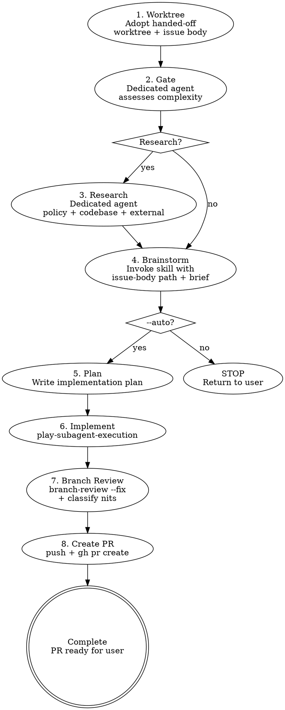

# Workflow Diagram — `issue-priming-workflow`

Visual illustration of the phase flow. The authoritative phase procedures
are in `SKILL.md` § Phase 1–8.

```dot
digraph priming {
  rankdir=TB;
  worktree [label="1. Worktree\nAdopt handed-off\nworktree + issue body"];
  gate [label="2. Gate\nDedicated agent\nassesses complexity"];
  decide [label="Research?", shape=diamond];
  research [label="3. Research\nDedicated agent\npolicy + codebase + external"];
  brainstorm [label="4. Brainstorm\nInvoke skill with\nissue-body path + brief"];
  auto_check [label="--auto?", shape=diamond];
  plan [label="5. Plan\nWrite implementation plan"];
  implement [label="6. Implement\nplay-subagent-execution"];
  stop_interactive [label="STOP\nReturn to user"];

  worktree -> gate -> decide;
  decide -> research [label="yes"];
  decide -> brainstorm [label="no"];
  research -> brainstorm;
  brainstorm -> auto_check;
  auto_check -> plan [label="yes"];
  auto_check -> stop_interactive [label="no"];
  plan -> implement -> review -> create_pr -> done;
  review [label="7. Branch Review\nbranch-review --fix\n+ classify nits"];
  create_pr [label="8. Create PR\npush + gh pr create"];
  done [label="Complete\nPR ready for user", shape=doublecircle];
}
```
