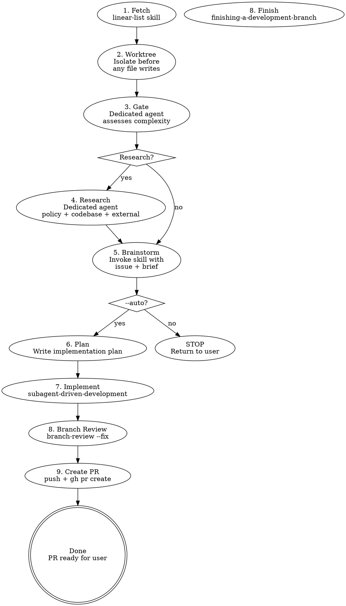

# Linear Issue Priming

Fetch a Linear issue, set up an isolated worktree, assess whether it needs multi-agent research, and invoke brainstorming with pre-loaded context. The research phase runs in a dedicated agent to keep the main session clean.

## Arguments

| Arg                       | Effect                                                                                                                                                  |
| ------------------------- | ------------------------------------------------------------------------------------------------------------------------------------------------------- |
| `<identifier>` or `<url>` | Issue to work on (required)                                                                                                                             |
| `--research`              | Skip gate, go directly to research                                                                                                                      |
| `--auto`                  | Autonomous mode: skip user review gates, pick the architecturally cleanest option, write plan, and execute via `subagent-driven-development` end-to-end |

Examples: `/linear-issue-priming ENG-123`, `/linear-issue-priming ENG-123 --auto`, `/linear-issue-priming --auto --research ENG-123`

## Workflow



## Phase 1: Fetch the Issue

Parse the argument — accept a `TEAM-NUMBER` identifier (e.g. `ENG-123`) or a full Linear URL.

```
Skill(skill: "linear-list", args: "<IDENTIFIER>")
Skill(skill: "linear-comments", args: "<IDENTIFIER>")
```

Present a one-line summary to the user:

> Issue ENG-123: refactor auth middleware to use new token format [In Progress]

If the issue cannot be fetched (not found, Linear skill not available), stop and report the error.

## Phase 2: Create Worktree

Set up an isolated workspace **immediately after fetching the issue**, before any file writes (specs, designs, plans). This ensures all artifacts live in the worktree from the start — no copying, no path confusion.

Derive the branch name from the Linear identifier: `<type>/<IDENTIFIER>-<slug>` (e.g., `refactor/ENG-123-auth-middleware-token-format`).

**Detect environment:**

```bash
# Check if running inside a remote-control worktree
pwd | grep -q '\.claude/worktrees/' && echo "REMOTE_WORKTREE" || echo "LOCAL"
```

**If `REMOTE_WORKTREE` (session spawned by `claude remote-control --spawn worktree`):**

The session is already in an isolated worktree at `.claude/worktrees/<session>/`. Do NOT invoke `using-git-worktrees` — creating a nested worktree causes path confusion and edits landing in the wrong directory. Instead:

1. Ensure the branch base is current: `git fetch origin && git merge origin/main --ff-only`
2. Create a feature branch: `git checkout -b <branch-name>`
3. Use the current working directory as the implementation workspace

**If `LOCAL` (normal CLI session):**

Invoke `using-git-worktrees` to create a feature branch + worktree. The skill will use the project's existing `.worktrees/` directory.

**After worktree is ready:** All subsequent phases (gate, research, brainstorming, planning, implementation) operate from the worktree. Pass the worktree path to all dispatched subagents.

**If brainstorming concludes "don't implement":** Clean up the worktree with `finishing-a-development-branch` (option: discard).

## Phase 3: Complexity Gate

The gate is **always evaluated** — it is not optional. Only the research phase (Phase 4) is conditional based on the gate's output.

Dispatch a **dedicated agent** (subagent_type: `Explore`, model: `sonnet`) using the prompt template in `gate-agent-prompt.md`. The agent reads the issue description, scans `docs/adr/` titles, and checks `AGENTS.md` for relevant rules. Use `sonnet` as the floor — escalate to `opus` for issues with ambiguous scope or multiple conflicting signals.

**Pass to the gate agent:**

- Issue title + description (verbatim)
- Repository root path

**Gate returns:** `RESEARCH_NEEDED` or `SKIP_RESEARCH` with a one-line reason.

**Override:** If the user passed `--research` in the skill args, skip the gate and go directly to research.

### Gate Signals

**Trigger research if ANY of:**

| Signal                   | Detection                                                                                        |
| ------------------------ | ------------------------------------------------------------------------------------------------ |
| Cross-module impact      | Issue references files/types in 2+ crates or requires coordinated edits across module boundaries |
| New module or public API | Issue describes adding a component, crate, or public interface that doesn't exist yet            |
| No covering ADR          | Scan of `docs/adr/` finds no existing decision covering this domain                              |
| Conflicting guidelines   | Existing policies or ADRs pull in different directions for this issue                            |
| Explicit request         | Issue description contains "brainstorm", "design decision", or "choose between"                  |

**Skip research if ALL of:**

- Single-module, single-file change
- Clear precedent exists in the codebase
- Covering ADR or guideline prescribes the approach

## Phase 4: Research (Conditional)

Dispatch a **dedicated agent** (subagent_type: `general-purpose`, model: `sonnet`) using the prompt template in `research-agent-prompt.md`. Use `sonnet` as the floor — escalate to `opus` for cross-module or architecturally complex issues.

**Pass to the research agent:**

- Issue title + description
- Repository root path
- Gate agent's reasoning (so it knows why research was triggered)

**Research agent internally dispatches sub-agents in parallel:**

1. Policy/guideline scanner
2. Codebase pattern explorer
3. External OSS precedent searcher (web search + Codex)

**Research agent returns:** A synthesized brief (500-1000 words) in the format:

```markdown
## Issue Brief: <IDENTIFIER> — <title>

### Policy Constraints

- [rules that apply]

### Existing Patterns

- [how the codebase handles similar things]

### External Precedent

- [how other projects solve this]

### Recommended Approaches

- [2-3 options, leading with the architecturally cleanest]
```

**Architecture preference:** The research agent surfaces the architecturally cleaner option, not just the easiest one.

## Phase 5: Invoke Brainstorming

Call the `Skill` tool to invoke the `play-brainstorm` skill with combined context:

```
Skill(skill: "play-brainstorm", args: "<composed args>")
```

**Args format when research was done:**

```
Resolve Linear issue <IDENTIFIER>: <title>

## Issue Description
<verbatim issue description>

## Research Brief
<brief from research agent>
```

**Args format when research was skipped:**

```
Resolve Linear issue <IDENTIFIER>: <title>

## Issue Description
<verbatim issue description>

## Research Brief
Skipped — <reason from gate agent>. Proceed with codebase exploration in brainstorming.
```

**`--auto` mode behavior in brainstorming:**

When `--auto` is set, the brainstorming skill still runs fully (exploration, option generation, spec writing), but:

- Do NOT ask the user to choose between options — pick the architecturally cleanest approach
- Do NOT wait for user approval of the spec/design — proceed immediately
- Do NOT ask clarifying questions — make reasonable assumptions and document them in the spec

If brainstorming surfaces a decision that is genuinely ambiguous (two equally valid approaches with different trade-offs), **stop `--auto` mode and ask the user**. Resume autonomous execution after their answer.

**Without `--auto`:** Stop after brainstorming completes. Return control to the user.

## Phases 6-9: Autonomous Execution (`--auto` only)

These phases run only when `--auto` is set. They chain automatically after brainstorming.

### Phase 6: Write Plan

Invoke `play-planning` using the spec produced in Phase 5. Do not wait for user review of the plan — proceed directly to implementation.

### Phase 7: Implement

Invoke `play-subagent-execution` to execute the plan. All subagent-driven-development rules apply (fresh subagent per task, two-stage review, spec compliance then code quality).

### Phase 8: Branch Review

Invoke the `branch-review` skill with `--fix` to review the implementation before creating a PR:

```
Skill(skill: "branch-review", args: "--fix")
```

This runs the full multi-agent review (correctness, data-safety, language-specific agents, critic verification) on `git diff main...HEAD`. With `--fix`, blocking findings are auto-fixed and committed. Nits are collected for the PR description.

If a blocking finding requires design changes, **stop `--auto` and report to the user**.

### Phase 9: Create PR

Invoke `play-branch-finish`. In `--auto` mode, choose **option 2: push and create PR**. Do NOT merge — the PR is the user's review gate.

**Always assign the PR to yourself:** Pass `--assignee @me` to `gh pr create`.

**Before composing the PR title and description**, glob for project PR guidelines (`**/pr-guideline*.md`, `**/pr-*.md`, `CONTRIBUTING.md`) and read them. Follow the project's title format and description template exactly. If no guideline is found, use the defaults below.

**Default PR title:** Follow Conventional Commits — `<type>(<scope>): <short summary>`. Do not append issue identifiers to the title; link issues in the description body instead.

**Default PR description should include:**

- Linear issue reference (`Closes <IDENTIFIER>` with link to the Linear issue)
- The design decisions made (especially any assumptions from Phase 5)
- Summary of what was implemented
- Remaining nits from Phase 8 (if any), so the user knows what to look at

## Quick Reference

| Phase            | What                                | Key constraint                                               |
| ---------------- | ----------------------------------- | ------------------------------------------------------------ |
| 1. Fetch         | `linear-list skill`                 | Stop if not found                                            |
| 2. Worktree      | Isolate before file writes          | Detect remote-control vs local                               |
| 3. Gate          | Dedicated agent assesses complexity | Always evaluated; default to `RESEARCH_NEEDED` on failure    |
| 4. Research      | Dedicated agent synthesizes brief   | Optional — only if gate says so                              |
| 5. Brainstorm    | Invoke `play-brainstorm`            | Never skip, even for "simple" issues                         |
| 6. Plan          | `play-planning`                     | `--auto` only                                                |
| 7. Implement     | `play-subagent-execution`           | `--auto` only                                                |
| 8. Branch Review | `branch-review --fix`               | `--auto` only; review before PR, not after                   |
| 9. Create PR     | Push + `gh pr create`               | `--auto` only; never auto-merge; follow project PR guideline |

## Common Mistakes

### Writing specs to main workspace instead of worktree

- **Problem:** Spec/plan files end up outside the worktree, subagents read wrong paths
- **Fix:** Worktree is created in Phase 2, before brainstorming writes any files

### Creating nested worktree in remote-control session

- **Problem:** `using-git-worktrees` creates a worktree inside `.claude/worktrees/<session>/`, causing double nesting and path confusion
- **Fix:** Detect remote-control context with `pwd | grep '\.claude/worktrees/'` and branch in place

### Running research in the main session

- **Problem:** CI logs, file reads, and web searches pollute the main context window
- **Fix:** Always dispatch dedicated agents for gate and research phases

### Ignoring project PR guideline

- **Problem:** PR title/description uses a generic format instead of the project's required template, requiring manual rework
- **Fix:** Always glob for PR guidelines before composing the PR title and description in Phase 9

### Skipping the gate for "obvious" issues

- **Problem:** Single-module issues sometimes have hidden cross-module dependencies
- **Fix:** Always run the gate — it's cheap (Explore agent, sonnet) and catches surprises

## Red Flags — You Are Violating This Skill

- You skipped the gate and went straight to brainstorming without assessing complexity
- You ran the research agent in the main session instead of a dedicated agent
- You started implementing before invoking brainstorming
- You dumped raw research output instead of passing the synthesized brief
- You skipped brainstorming because "the issue is simple enough"
- You wrote spec/design/plan files outside the worktree
- You created a nested worktree inside a remote-control worktree
- You auto-merged a PR in `--auto` mode (the PR is the user's review gate)
- You silently picked an option when two approaches had genuinely different trade-offs in `--auto` mode
- You composed a PR title/description without reading the project's PR guideline first

**All of these mean: STOP. Go back to the workflow.**

## Error Handling

| Scenario                       | Action                                                                    |
| ------------------------------ | ------------------------------------------------------------------------- |
| Linear skill not available     | Stop, suggest checking Linear plugin/MCP configuration                    |
| Issue not found                | Stop, verify identifier/URL                                               |
| Issue already completed/closed | Warn user, ask whether to proceed                                         |
| Gate agent fails               | Default to `RESEARCH_NEEDED` (safer to over-research than under-research) |
| Research agent fails/times out | Report partial results, invoke brainstorming with what's available        |
| No `docs/adr/` directory       | Gate treats as "no covering ADR" (research signal)                        |

## Project-Specific Overrides

These rules apply to any project using this skill. They override defaults from downstream skills.

### Spec and plan file location

Brainstorming specs, design docs, and plans are workflow ephemera, not durable repo documentation. Do not commit them. The durable record lives in the implementation PR description and the committed code. If an ADR-worthy decision emerges, it lands separately in `docs/adr/`.

Write all spec, design, and plan files to the **main workspace's** `.claude/superpowers/<YYYY-MM-DD>-<topic>-{design,plan}.md`, not the worktree's. This overrides the brainstorming skill's default output path (`docs/superpowers/specs/`). Worktrees don't have their own `.claude/` directory, so Write/mkdir permissions from `settings.local.json` may not be in effect there.

Resolve the main workspace root and create the directory before writing:

```bash
MAIN_ROOT=$(git worktree list --porcelain | head -1 | sed 's/^worktree //')
mkdir -p "$MAIN_ROOT/.claude/superpowers"
```

Pass the absolute path to all downstream skills (brainstorming, writing-plans) so they write to the correct location regardless of CWD.

### Model selection

Use `sonnet` as the floor for all agents that make judgment calls. Only haiku is acceptable for mechanical implementer tasks with fully-specified plans.

| Agent                    | Minimum model | Escalate to opus when                          |
| ------------------------ | ------------- | ---------------------------------------------- |
| Gate (Phase 3)           | sonnet        | Ambiguous scope, multiple conflicting signals  |
| Research (Phase 4)       | sonnet        | Cross-module or architecturally complex issues |
| Spec compliance reviewer | sonnet        | Multi-file changes, complex requirements       |
| Code quality reviewer    | sonnet        | Architectural or pattern-level concerns        |
| PR review agents         | opus          | Always — final gate, highest cost of failure   |

## What This Skill Does NOT Do

**Without `--auto`:**

- Does not write code or create PRs
- Does not manage implementation — returns control to user after brainstorming

**With `--auto`:**

- Does not merge PRs — the PR is the user's review gate
- Does not skip brainstorming or planning — runs the full pipeline, just without user checkpoints
- Does not make genuinely ambiguous design decisions — stops and asks if options are equally valid
