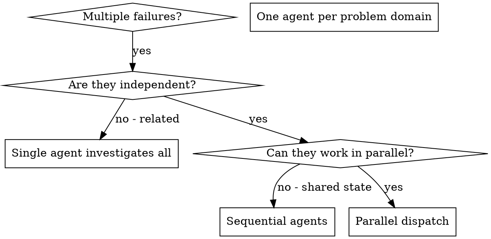

# Dispatching Parallel Agents

## Invocation Policy

This workflow is explicit-invocation-only. Do not select it from ordinary discussion, review-shaped text, possible behavior-change wording, or implementation-adjacent language. Run it only when the user explicitly invokes `play-agent-dispatch` or when an owning workflow explicitly hands off to `play-agent-dispatch`.

## Overview

You delegate tasks to specialized agents with isolated context. By precisely crafting their instructions and context, you ensure they stay focused and succeed at their task. They should never inherit your session's context or history — you construct exactly what they need. This also preserves your own context for coordination work.

When you have multiple unrelated failures (different test files, different subsystems, different bugs), investigating them sequentially wastes time. Each investigation is independent and can happen in parallel.

**Core principle:** Dispatch one agent per independent problem domain. Let them work concurrently.

## When to Use



**Use when:**

- 3+ test files failing with different root causes
- Multiple subsystems broken independently
- Each problem can be understood without context from others
- No shared state between investigations

**Don't use when:**

- Failures are related (fix one might fix others)
- Need to understand full system state
- Agents would interfere with each other

## The Pattern

### 1. Identify Independent Domains

Group failures by what's broken:

- File A tests: Tool approval flow
- File B tests: Batch completion behavior
- File C tests: Abort functionality

Each domain is independent - fixing tool approval doesn't affect abort tests.

### Semantic Route Contract

Before each focused specialist spawn, independently classify and declare the
full semantic route tuple:

1. cognitive demand: `mechanical`, `bounded`, `synthesis`, or `inherited`;
2. stance: `normal` or `adversarial`;
3. source mutation default: `source-immutable` or `source-mutable`;
4. exactly one of the six semantic roles;
5. the role's exact configured capability and effort, without per-call
   substitution;
6. dispatch scope;
7. termination and output behavior; and
8. external authority `none`.

Use the selected role's complete configured tuple:

| Semantic role   | Capability | Effort | Source mutation default |
| --------------- | ---------- | ------ | ----------------------- |
| `assessor`      | balanced   | medium | source-immutable        |
| `investigator`  | balanced   | high   | source-immutable        |
| `executor`      | efficient  | medium | source-mutable          |
| `implementer`   | balanced   | high   | source-mutable          |
| `reviewer`      | frontier   | high   | source-immutable        |
| `deep-reviewer` | frontier   | xhigh  | source-immutable        |

Classify each independent problem domain separately. The owning controller's
classification is the dispatch authority; a generic or inherited workflow does
not supply a child route by itself. Do not use an ambient model or ambient
effort, and do not substitute another capability or effort at spawn time.

If any tuple field is unresolved, do not spawn that specialist. Do not infer
authority from tools, sandbox, network, model, effort, the owning workflow, or
the controller's own authority. The route inventory is not a marker,
annotation, or discovery grammar. It is a controller-owned pre-spawn decision,
and child prompts do not discover or select their own route.

### Source-Immutable Specialists

A source-immutable focused specialist is a response-only leaf with zero
handoffs. Do not declare a named handoff, permit child persistence, or accept a
filesystem path as its result. Resolve `SOURCE_IMMUTABILITY_HELPER` to the
installed `play-agent-dispatch` bundle's
`scripts/source-immutability.sh` shim and run it from the current worktree root.

For each such specialist, keep this order exact:

1. capture before spawn and retain the returned baseline path in the
   controller;
2. spawn the already-classified specialist and capture only its raw terminal
   response and status;
3. verify before semantic validation or consumption;
4. after successful verification, validate and retain the response in
   controller memory;
5. cleanup the exact retained baseline; and
6. only after successful cleanup, integrate the retained response under the
   existing successful-result integration policy.

The no-handoff command shape is:

```bash
SOURCE_IMMUTABILITY_BASELINE="$(bash "$SOURCE_IMMUTABILITY_HELPER" capture)"
# Spawn the specialist and capture its raw response/status.
bash "$SOURCE_IMMUTABILITY_HELPER" verify --baseline "$SOURCE_IMMUTABILITY_BASELINE"
# Validate and retain the response in controller memory.
bash "$SOURCE_IMMUTABILITY_HELPER" cleanup --baseline "$SOURCE_IMMUTABILITY_BASELINE"
# Only now integrate the retained response.
```

Capture failure prevents that spawn. Every spawned terminal branch attempts
exact cleanup, including child failure and response, verification, or payload
rejection. Never reset, repair, stage, check out, or otherwise hide a detected
source change.

### Source-Mutable Specialists

A source-mutable specialist may alter only the dispatch-authorized durable
workspace paths named in its focused task. Its prompt must keep those paths and
the task's scope explicit, and external authority remains `none`. Review its
returned summary and changes, check for conflicts, run the required
verification, and preserve the existing successful-result review and
integration policy in this skill. The source-immutable guard does not replace
or broaden that authorization.

### 2. Create Focused Agent Tasks

Each agent gets:

- **Specific scope:** One test file or subsystem
- **Semantic route:** The complete pre-spawn route tuple
- **Clear goal:** Make these tests pass
- **Constraints:** Don't change other code
- **Expected output:** Summary of what you found and fixed

### 3. Dispatch in Parallel

Before parallel dispatch, use `subagent-lifecycle` for the controller-local
lifecycle ledger, target lifecycle capability classification, cleanup gate
before spawns, target-honest cleanup outcomes, and slot-limit recovery. Record
one pending ledger row per planned agent with its problem domain, expected
output, constraints, complete semantic route tuple, and any source-state anchor
relevant to that domain. A pending row is not spawn authority: resolve every
tuple and, for each source-immutable specialist, capture its baseline before
that specialist's spawn.

Dispatch one specialist agent per failing test file in the existing parallel
join. Each agent gets a focused scope (one test file or subsystem) and returns
the declared output. This route classification adds no new parallelism: retain
the existing independent-task and no-shared-state checks.

### 4. Review and Integrate

When agents return:

- Read each summary
- Update the `subagent-lifecycle` ledger with each returned session's
  role-specific state before closing or superseding it
- Verify each result under its declared source-mutation contract
- Verify fixes don't conflict
- Run full test suite
- Integrate successful changes under the existing policy only after the full
  batch is eligible
- After each returned session is integrated, run the `subagent-lifecycle`
  cleanup gate before keeping or spawning any additional agent sessions

## Joined Failure Disposition

After an ordinary child failure, verification rejection, or payload rejection,
first complete safe exact cleanup for the affected source-immutable specialist.
Then let every already-started sibling settle and complete its exact cleanup
when applicable. After that, integrate no specialist results from that parallel
batch, and return the failed domains plus the successful summaries to the
controller. A successful sibling summary remains diagnostic context; it does
not authorize partial integration after any domain rejects.

This joined failure path does not start replacement siblings or add another
parallel dispatch wave. Detected source mutation or cleanup failure is
guard-integrity terminal: preserve the visible source state, integrate no
results, let already-started siblings reach their terminal cleanup attempts,
and report the integrity failure instead of treating it as an ordinary child
failure.

## Agent Prompt Structure

Good agent prompts are:

1. **Focused** - One clear problem domain
2. **Self-contained** - All context needed to understand the problem
3. **Specific about output** - What should the agent return?

```markdown
Fix the 3 failing tests in src/agents/agent-tool-abort.test.ts:

1. "should abort tool with partial output capture" - expects 'interrupted at' in message
2. "should handle mixed completed and aborted tools" - fast tool aborted instead of completed
3. "should properly track pendingToolCount" - expects 3 results but gets 0

These are timing/race condition issues. Your task:

1. Read the test file and understand what each test verifies
2. Identify root cause - timing issues or actual bugs?
3. Fix by:
   - Replacing arbitrary timeouts with event-based waiting
   - Fixing bugs in abort implementation if found
   - Adjusting test expectations if testing changed behavior

Do NOT just increase timeouts - find the real issue.

Return: Summary of what you found and what you fixed.
```

## Common Mistakes

**❌ Too broad:** "Fix all the tests" - agent gets lost
**✅ Specific:** "Fix agent-tool-abort.test.ts" - focused scope

**❌ No context:** "Fix the race condition" - agent doesn't know where
**✅ Context:** Paste the error messages and test names

**❌ No constraints:** Agent might refactor everything
**✅ Constraints:** "Do NOT change production code" or "Fix tests only"

**❌ Vague output:** "Fix it" - you don't know what changed
**✅ Specific:** "Return summary of root cause and changes"

## When NOT to Use

**Related failures:** Fixing one might fix others - investigate together first
**Need full context:** Understanding requires seeing entire system
**Exploratory debugging:** You don't know what's broken yet
**Shared state:** Agents would interfere (editing same files, using same resources)

## Real Example from Session

**Scenario:** 6 test failures across 3 files after major refactoring

**Failures:**

- agent-tool-abort.test.ts: 3 failures (timing issues)
- batch-completion-behavior.test.ts: 2 failures (tools not executing)
- tool-approval-race-conditions.test.ts: 1 failure (execution count = 0)

**Decision:** Independent domains - abort logic separate from batch completion separate from race conditions

**Dispatch:**

```
Agent 1 → Fix agent-tool-abort.test.ts
Agent 2 → Fix batch-completion-behavior.test.ts
Agent 3 → Fix tool-approval-race-conditions.test.ts
```

**Results:**

- Agent 1: Replaced timeouts with event-based waiting
- Agent 2: Fixed event structure bug (threadId in wrong place)
- Agent 3: Added wait for async tool execution to complete

**Integration:** All fixes independent, no conflicts, full suite green

**Time saved:** 3 problems solved in parallel vs sequentially

## Key Benefits

1. **Parallelization** - Multiple investigations happen simultaneously
2. **Focus** - Each agent has narrow scope, less context to track
3. **Independence** - Agents don't interfere with each other
4. **Speed** - 3 problems solved in time of 1

## Verification

After agents return:

1. **Review each summary** - Understand what changed
2. **Check for conflicts** - Did agents edit same code?
3. **Run full suite** - Verify all fixes work together
4. **Spot check** - Agents can make systematic errors

## Real-World Impact

From debugging session (2025-10-03):

- 6 failures across 3 files
- 3 agents dispatched in parallel
- All investigations completed concurrently
- All fixes integrated successfully
- Zero conflicts between agent changes
