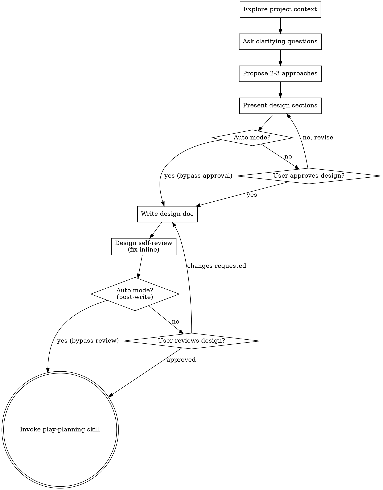

# Brainstorming Ideas Into Designs

Help turn ideas into fully formed designs through natural collaborative dialogue.

Start by understanding the current project context, then ask questions one at a time to refine the idea. Once you understand what you're building, present the design and get user approval.

<HARD-GATE>
Do NOT invoke any implementation skill, write any code, scaffold any project, or take any implementation action until you have presented a design. In interactive mode, this also requires explicit user approval. In `--auto` mode (when invoked by an upstream skill that has bypassed user gates), the design is presented and recorded, and execution proceeds without waiting for user approval — but the design step itself is never skipped.
</HARD-GATE>

## Anti-Pattern: "This Is Too Simple To Need A Design"

Every project goes through this process. A todo list, a single-function utility, a config change — all of them. "Simple" projects are where unexamined assumptions cause the most wasted work. The design can be short (a few sentences for truly simple projects), but you MUST present it (and, in interactive mode, get user approval — see HARD-GATE above for `--auto` behavior).

## Checklist

You MUST create a task for each of these items and complete them in order:

1. **Explore project context** — check files, docs, recent commits
2. **Ask clarifying questions** — one at a time, understand purpose/constraints/success criteria
3. **Propose 2-3 approaches** — with trade-offs and your recommendation
4. **Present design** — in sections scaled to their complexity, get user approval after each section
5. **Write design doc** — save to `.ephemeral/YYYY-MM-DD-<topic>-design.md`
6. **Design self-review** — quick inline check for placeholders, contradictions, ambiguity, scope (see below)
7. **User reviews written design** — ask user to review the design file before proceeding
8. **Transition to implementation** — invoke play-planning skill to create implementation plan

**In `--auto` mode** (invoked by an upstream skill like `github-issue-priming --auto`), the user-interaction parts of steps 2, 4, and 7 are bypassed: skip clarifying-question prompts (make documented assumptions instead), skip the per-section approval pause, and skip the User Review Gate prompt. The design step itself — including writing the design doc to `.ephemeral/` — is never skipped.

## Process Flow

**The terminal state is invoking play-planning.** Do NOT invoke any other implementation skill. The ONLY skill you invoke after brainstorming is play-planning.

## The Process

**Understanding the idea:**

- Check out the current project state first (files, docs, recent commits)
- **Verify causal claims.** When the brief asserts that X causes Y (or that doing X prevents Y), reproduce or trace the claim once before designing around it. A 30-second `git`/`grep`/script check is far cheaper than a verified-but-misaimed fix. See `references/verifying-causal-claims.md` for a worked example.
- Before asking detailed questions, assess scope: if the request describes multiple independent subsystems (e.g., "build a platform with chat, file storage, billing, and analytics"), flag this immediately. Don't spend questions refining details of a project that needs to be decomposed first.
- If the project is too large for a single design, help the user decompose into sub-projects: what are the independent pieces, how do they relate, what order should they be built? Then brainstorm the first sub-project through the normal design flow. Each sub-project gets its own design → plan → implementation cycle.
- For appropriately-scoped projects, ask questions one at a time to refine the idea
- Prefer multiple choice questions when possible, but open-ended is fine too
- Only one question per message - if a topic needs more exploration, break it into multiple questions
- Focus on understanding: purpose, constraints, success criteria

**Exploring approaches:**

- Propose 2-3 different approaches with trade-offs
- Present options conversationally with your recommendation and reasoning
- Lead with your recommended option and explain why

**Presenting the design:**

- Once you believe you understand what you're building, present the design
- Scale each section to its complexity: a few sentences if straightforward, up to 200-300 words if nuanced
- Ask after each section whether it looks right so far
- Cover: architecture, components, data flow, error handling, testing
- Be ready to go back and clarify if something doesn't make sense

**Design for isolation and clarity:**

- Break the system into smaller units that each have one clear purpose, communicate through well-defined interfaces, and can be understood and tested independently
- For each unit, you should be able to answer: what does it do, how do you use it, and what does it depend on?
- Can someone understand what a unit does without reading its internals? Can you change the internals without breaking consumers? If not, the boundaries need work.
- Smaller, well-bounded units are also easier for you to work with - you reason better about code you can hold in context at once, and your edits are more reliable when files are focused. When a file grows large, that's often a signal that it's doing too much.

**Working in existing codebases:**

- Explore the current structure before proposing changes. Follow existing patterns.
- Where existing code has problems that affect the work (e.g., a file that's grown too large, unclear boundaries, tangled responsibilities), include targeted improvements as part of the design - the way a good developer improves code they're working in.
- Don't propose unrelated refactoring. Stay focused on what serves the current goal.

## After the Design

**Save:**

- Write the validated design to `.ephemeral/YYYY-MM-DD-<topic>-design.md`

**Design Self-Review:**
After writing the design document, look at it with fresh eyes:

1. **Placeholder scan:** Any "TBD", "TODO", incomplete sections, or vague requirements? Fix them.
2. **Internal consistency:** Do any sections contradict each other? Does the architecture match the feature descriptions?
3. **Scope check:** Is this focused enough for a single implementation plan, or does it need decomposition?
4. **Ambiguity check:** Could any requirement be interpreted two different ways? If so, pick one and make it explicit.
5. **Example verification:** For any worked example, illustrative scenario, or reference in the design that names a specific file path, line number, function name, identifier, command, commit SHA, or PR number — open the file (or run `git log` / `gh pr view`) and confirm the cited artifact exists and contains the cited text. A scenario explicitly labeled `(hypothetical)` is exempt. A scenario labeled "from PR #N" or citing a real file path is **not** exempt — verify it. Concrete-looking specifics that turn out to be fabricated are the most common silent defect class in worked examples.

Fix any issues inline. No need to re-review — just fix and move on.

**User Review Gate:**
After the design review loop passes, ask the user to review the written design before proceeding:

> "Design written to `<path>`. Please review it and let me know if you want to make any changes before we start writing out the implementation plan."

Wait for the user's response. If they request changes, make them and re-run the design review loop. Only proceed once the user approves.

**In `--auto` mode** (see HARD-GATE above): skip both the prompt and the wait. Record the design path in your handoff to `play-planning` and proceed immediately. The design step itself — including the self-review loop above and writing to `.ephemeral/` — is never skipped; only the user-approval pause is bypassed.

**Implementation:**

- Invoke the play-planning skill to create a detailed implementation plan
- Do NOT invoke any other skill. play-planning is the next step.

## Common Mistakes

### Designing around an unverified premise

- **Problem:** A brief asserts X causes Y; the brainstorm accepts the claim and the design lands a fix that targets the wrong cause. Downstream review agents anchor on the same premise and miss it too — by the time the misaim surfaces (often post-merge), the work is sunk.
- **Fix:** Spend 30 seconds reproducing or tracing the claim before designing around it (see `references/verifying-causal-claims.md`). If you can't trace it, name it as an open question and ask the user — don't silently accept it.

## Key Principles

- **One question at a time** - Don't overwhelm with multiple questions
- **Multiple choice preferred** - Easier to answer than open-ended when possible
- **YAGNI ruthlessly** - Remove unnecessary features from all designs
- **Explore alternatives** - Always propose 2-3 approaches before settling
- **Incremental validation** - Present design, get approval before moving on
- **Be flexible** - Go back and clarify when something doesn't make sense
