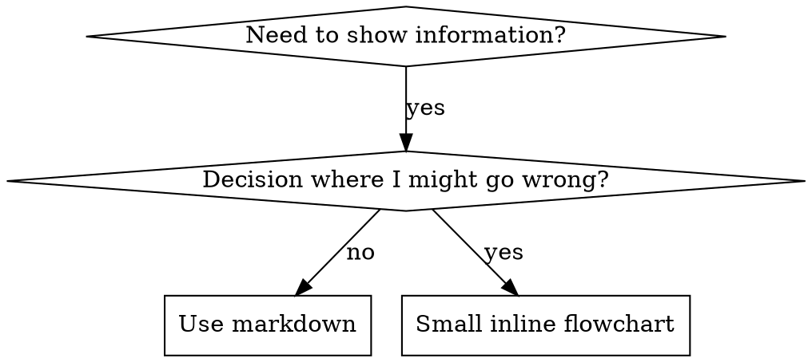

# Writing Skills

## Overview

**Writing skills IS Test-Driven Development applied to process documentation.**

**Personal skills live in each target's configured skills directory; shared source skills belong in the repository `skills/` tree**

You write test cases (pressure scenarios with subagents), watch them fail (baseline behavior), write the skill (documentation), watch tests pass (agents comply), and refactor (close loopholes).

**Core principle:** If you didn't watch an agent fail without the skill, you don't know if the skill teaches the right thing.

**REQUIRED BACKGROUND:** You MUST understand play-tdd before using this skill. That skill defines the fundamental RED-GREEN-REFACTOR cycle. This skill adapts TDD to documentation.

**Official guidance:** For Anthropic's official skill authoring best practices, see anthropic-best-practices.md. This document provides additional patterns and guidelines that complement the TDD-focused approach in this skill.

## What is a Skill?

A **skill** is a reference guide for proven techniques, patterns, or tools. Skills help future agents find and apply effective approaches.

**Skills are:** Reusable techniques, patterns, tools, reference guides

**Skills are NOT:** Narratives about how you solved a problem once

## TDD Mapping for Skills

| TDD Concept             | Skill Creation                                   |
| ----------------------- | ------------------------------------------------ |
| **Test case**           | Pressure scenario with subagent                  |
| **Production code**     | Skill document (SKILL.md)                        |
| **Test fails (RED)**    | Agent violates rule without skill (baseline)     |
| **Test passes (GREEN)** | Agent complies with skill present                |
| **Refactor**            | Close loopholes while maintaining compliance     |
| **Write test first**    | Run baseline scenario BEFORE writing skill       |
| **Watch it fail**       | Document exact rationalizations agent uses       |
| **Minimal code**        | Write skill addressing those specific violations |
| **Watch it pass**       | Verify agent now complies                        |
| **Refactor cycle**      | Find new rationalizations → plug → re-verify     |

The entire skill creation process follows RED-GREEN-REFACTOR.

## When to Create a Skill

**Create when:**

- Technique wasn't intuitively obvious to you
- You'd reference this again across projects
- Pattern applies broadly (not project-specific)
- Others would benefit

**Don't create for:**

- One-off solutions
- Standard practices well-documented elsewhere
- Project-specific conventions (put in the repository's agent guidance file)
- Mechanical constraints (if it's enforceable with regex/validation, automate it—save documentation for judgment calls)

## Skill Types

### Technique

Concrete method with steps to follow (condition-based-waiting, root-cause-tracing)

### Pattern

Way of thinking about problems (flatten-with-flags, test-invariants)

### Reference

API docs, syntax guides, tool documentation (office docs)

## Directory Structure

```
skills/
  skill-name/
    SKILL.md              # Main reference (required)
    supporting-file.*     # Only if needed
```

**Flat namespace** - all skills in one searchable namespace

**Separate files for:**

1. **Heavy reference** (100+ lines) - API docs, comprehensive syntax
2. **Reusable tools** - Scripts, utilities, templates

**Keep inline:**

- Principles and concepts
- Code patterns (< 50 lines)
- Everything else

## SKILL.md Structure

**Frontmatter (YAML):**

- Authoritative schema for this repo: `docs/specs/skills.md` and `SkillSourceSchema` in `src/config/schema.ts`. Frontmatter is `.strict()` — unknown top-level keys are rejected.
- Upstream [agentskills.io/specification](https://agentskills.io/specification) is supplementary; fields it lists that are not in `SkillSourceSchema` will fail validation here.
- Two required fields: `name` and `description`.
- `name`: lowercase letters, digits, and hyphens only; 2–64 chars (the regex's two boundary chars plus `{0,62}` middle); matches `^[a-z0-9][a-z0-9-]{0,62}[a-z0-9]$`.
- `description`: ≤ 1024 chars; no `<` or `>`; third-person; names **what** the skill does and **when** to use it.
  - Lead with the capability — a third-person declarative clause naming what the skill does.
  - Follow with "Use when…" — concrete triggers, symptoms, artifacts, or user phrases.
  - Do **not** encode procedural detail (step counts, ordered sequences, decision branches). That belongs in the body; see SSO section below for rationale.
  - For sibling-prone skills, add "Do not use when…" or a contrastive cue.
  - Keep under 500 chars if possible. Authoritative spec: `docs/specs/skills.md` § Description style.

```markdown
---
name: skill-name-with-hyphens
description: <Capability — what the skill does>. Use when <triggering conditions, symptoms, artifacts, or user phrases>.
---

# Skill Name

## Overview

What is this? Core principle in 1-2 sentences.

## When to Use

[Small inline flowchart IF decision non-obvious]

Bullet list with SYMPTOMS and use cases
When NOT to use

## Core Pattern (for techniques/patterns)

Before/after code comparison

## Quick Reference

Table or bullets for scanning common operations

## Implementation

Inline code for simple patterns
Link to file for heavy reference or reusable tools

## Common Mistakes

What goes wrong + fixes

## Real-World Impact (optional)

Concrete results
```

## Skill Search Optimization (SSO)

**Critical for discovery:** Future agents need to FIND your skill

### 1. Rich Description Field

**Purpose:** Both Claude and Codex pre-load the description into context and use it to decide whether to read the skill body for a given task. The description has to do two jobs at once: name the capability so it can be picked over siblings, and name the trigger so it fires at the right moment.

**Format:** name **what** the skill does, then **when** to use it. Third person.

```yaml
description: <Capability — what the skill does>. Use when <triggering conditions, symptoms, artifacts, user phrases>.
```

**Why both halves:**

- **What** disambiguates this skill from siblings with overlapping triggers. In a 100-skill catalog, "Use when reviewing code" matches three skills; "Multi-agent review of uncommitted local changes. Use when reviewing a branch before a PR…" matches one.
- **When** ensures the skill fires at the right moment, with concrete user-visible symptoms (error messages, file extensions, phrases) rather than abstract notions.

This matches what Anthropic's official skill-authoring guide and the `anthropics/skills` repo prescribe, and what Codex's `skill-creator` skill prescribes. The shared `description` is rendered into both targets — what+when is the only style safe across the pipeline.

**Examples:**

```yaml
# ❌ Trigger-only — omits the "what", can't disambiguate from sibling skills
description: Use when implementing any feature or bugfix.

# ❌ First/second person
description: I can help you with async tests when they're flaky.

# ❌ Vague — no concrete triggers
description: Helps with documents.

# ❌ Technology-specific symptom for a non-technology-specific skill
description: Race-condition fixes. Use when tests use setTimeout/sleep and are flaky.

# ✅ What + when, third person
description: Test-driven development discipline — write the test first, watch it fail, then write minimal code. Use when implementing any feature or bugfix, before writing implementation code.

# ✅ What + when, problem-domain triggers
description: Async test stabilization technique using condition-based waiting. Use when tests have race conditions, timing dependencies, or pass/fail inconsistently.

# ✅ Technology-specific skill with explicit trigger
description: Authentication redirect handling for React Router. Use when working with React Router authentication flows or when redirects misbehave after login.
```

#### Caveat: don't bake the procedure into the description

The description must name capability and trigger. It must **not** summarize the _procedure_ — step counts, stage names, decision branches — because the model can read a procedural one-liner and skip the body that owns the actual logic.

This is a typed risk, not a blanket ban: name what the skill is _for_, not how it works.

```yaml
# ❌ Procedural — encodes "two-stage review" into the description
description: Dispatches a subagent per task with spec-then-quality review between tasks. Use when executing plans.

# ✅ Capability + trigger; the procedure stays in the body
description: Executes an implementation plan by dispatching a fresh subagent per independent task. Use when running a written plan whose tasks have no shared state.
```

**Red flag — rewrite if the description contains:**

- A count: "two reviews", "three stages", "five steps".
- An ordered sequence: "first… then…", "before X, after Y".
- A branching word: "when X do Y, otherwise Z".
- First or second person: "I", "you", "we".

**Content rules:**

- Third person — no "I", "you", "we".
- Start the _what_ clause with a declarative verb ("Executes…", "Reviews…", "Generates…") — not "This skill…".
- Lead the _when_ clause with "Use when…".
- Use concrete, searchable triggers — error messages, file extensions, user phrases — not abstract categories.
- Describe the _problem domain_ (race conditions, inconsistent behavior), not _language-specific symptoms_ (setTimeout, sleep), unless the skill itself is technology-specific.
- For sibling-prone skills, add "Do not use when…" or a contrastive cue.
- ≤ 500 chars when possible (1024 hard cap, no `<` / `>`).

### 2. Keyword Coverage

Use words an agent would search for:

- Error messages: "Hook timed out", "ENOTEMPTY", "race condition"
- Symptoms: "flaky", "hanging", "zombie", "pollution"
- Synonyms: "timeout/hang/freeze", "cleanup/teardown/afterEach"
- Tools: Actual commands, library names, file types

### 3. Descriptive Naming

**Use active voice, verb-first:**

- ✅ `creating-skills` not `skill-creation`
- ✅ `condition-based-waiting` not `async-test-helpers`

### 4. Token Efficiency (Critical)

**Problem:** getting-started and frequently-referenced skills load into EVERY conversation. Every token counts.

**Target word counts:**

- getting-started workflows: <150 words each
- Frequently-loaded skills: <200 words total
- Other skills: <500 words (still be concise)

**Techniques:**

**Move details to tool help:**

```bash
# ❌ BAD: Document all flags in SKILL.md
search-conversations supports --text, --both, --after DATE, --before DATE, --limit N

# ✅ GOOD: Reference --help
search-conversations supports multiple modes and filters. Run --help for details.
```

**Use cross-references:**

```markdown
# ❌ BAD: Repeat workflow details

When searching, dispatch subagent with template...
[20 lines of repeated instructions]

# ✅ GOOD: Reference other skill

Always use subagents (50-100x context savings). REQUIRED: Use [other-skill-name] for workflow.
```

**Compress examples:**

```markdown
# ❌ BAD: Verbose example (42 words)

the user: "How did we handle authentication errors in React Router before?"
You: I'll search past conversations for React Router authentication patterns.
[Dispatch subagent with search query: "React Router authentication error handling 401"]

# ✅ GOOD: Minimal example (20 words)

Partner: "How did we handle auth errors in React Router?"
You: Searching...
[Dispatch subagent → synthesis]
```

**Eliminate redundancy:**

- Don't repeat what's in cross-referenced skills
- Don't explain what's obvious from command
- Don't include multiple examples of same pattern

**Verification:**

```bash
wc -w skills/path/SKILL.md
# getting-started workflows: aim for <150 each
# Other frequently-loaded: aim for <200 total
```

**Name by what you DO or core insight:**

- ✅ `condition-based-waiting` > `async-test-helpers`
- ✅ `using-skills` not `skill-usage`
- ✅ `flatten-with-flags` > `data-structure-refactoring`
- ✅ `root-cause-tracing` > `debugging-techniques`

**Gerunds (-ing) work well for processes:**

- `creating-skills`, `testing-skills`, `debugging-with-logs`
- Active, describes the action you're taking

### 4. Cross-Referencing Other Skills

**When writing documentation that references other skills:**

Use skill name only, with explicit requirement markers:

- ✅ Good: `**REQUIRED SUB-SKILL:** Use play-tdd`
- ✅ Good: `**REQUIRED BACKGROUND:** You MUST understand play-debug`
- ❌ Bad: `See skills/testing/test-driven-development` (unclear if required)
- ❌ Bad: `@skills/testing/test-driven-development/SKILL.md` (force-loads, burns context)

**Why no @ links:** `@` syntax force-loads files immediately, consuming 200k+ context before you need them.

## Flowchart Usage



**Use flowcharts ONLY for:**

- Non-obvious decision points
- Process loops where you might stop too early
- "When to use A vs B" decisions

**Never use flowcharts for:**

- Reference material → Tables, lists
- Code examples → Markdown blocks
- Linear instructions → Numbered lists
- Labels without semantic meaning (step1, helper2)

See @graphviz-conventions.dot for graphviz style rules.

**Visualizing for the user:** Use `render-graphs.js` in this directory to render a skill's flowcharts to SVG:

```bash
./render-graphs.js ../some-skill           # Each diagram separately
./render-graphs.js ../some-skill --combine # All diagrams in one SVG
```

## Code Examples

**One excellent example beats many mediocre ones**

Choose most relevant language:

- Testing techniques → TypeScript/JavaScript
- System debugging → Shell/Python
- Data processing → Python

**Good example:**

- Complete and runnable
- Well-commented explaining WHY
- From real scenario
- Shows pattern clearly
- Ready to adapt (not generic template)

**Don't:**

- Implement in 5+ languages
- Create fill-in-the-blank templates
- Write contrived examples

You're good at porting - one great example is enough.

## File Organization

### Self-Contained Skill

```
defense-in-depth/
  SKILL.md    # Everything inline
```

When: All content fits, no heavy reference needed

### Skill with Reusable Tool

```
condition-based-waiting/
  SKILL.md    # Overview + patterns
  example.ts  # Working helpers to adapt
```

When: Tool is reusable code, not just narrative

### Skill with Heavy Reference

```
pptx/
  SKILL.md       # Overview + workflows
  pptxgenjs.md   # 600 lines API reference
  ooxml.md       # 500 lines XML structure
  scripts/       # Executable tools
```

When: Reference material too large for inline

## The Rule (Same as TDD)

```
NO SKILL WITHOUT A FAILING TEST FIRST
```

This applies to NEW skills AND EDITS to existing skills.

Write skill before testing? Delete it. Start over.
Edit skill without testing? Same violation.

**No exceptions:**

- Not for "simple additions"
- Not for "just adding a section"
- Not for "documentation updates"
- Don't keep untested changes as "reference"
- Don't "adapt" while running tests
- Delete means delete

**REQUIRED BACKGROUND:** The play-tdd skill explains why this matters. Same principles apply to documentation.

## Testing All Skill Types

Different skill types need different test approaches:

### Discipline-Enforcing Skills (rules/requirements)

**Examples:** TDD, verification-before-completion, designing-before-coding

**Test with:**

- Academic questions: Do they understand the rules?
- Pressure scenarios: Do they comply under stress?
- Multiple pressures combined: time + sunk cost + exhaustion
- Identify rationalizations and add explicit counters

**Success criteria:** Agent follows rule under maximum pressure

### Technique Skills (how-to guides)

**Examples:** condition-based-waiting, root-cause-tracing, defensive-programming

**Test with:**

- Application scenarios: Can they apply the technique correctly?
- Variation scenarios: Do they handle edge cases?
- Missing information tests: Do instructions have gaps?

**Success criteria:** Agent successfully applies technique to new scenario

### Pattern Skills (mental models)

**Examples:** reducing-complexity, information-hiding concepts

**Test with:**

- Recognition scenarios: Do they recognize when pattern applies?
- Application scenarios: Can they use the mental model?
- Counter-examples: Do they know when NOT to apply?

**Success criteria:** Agent correctly identifies when/how to apply pattern

### Reference Skills (documentation/APIs)

**Examples:** API documentation, command references, library guides

**Test with:**

- Retrieval scenarios: Can they find the right information?
- Application scenarios: Can they use what they found correctly?
- Gap testing: Are common use cases covered?

**Success criteria:** Agent finds and correctly applies reference information

## Common Rationalizations for Skipping Testing

| Excuse                         | Reality                                                          |
| ------------------------------ | ---------------------------------------------------------------- |
| "Skill is obviously clear"     | Clear to you ≠ clear to other agents. Test it.                   |
| "It's just a reference"        | References can have gaps, unclear sections. Test retrieval.      |
| "Testing is overkill"          | Untested skills have issues. Always. 15 min testing saves hours. |
| "I'll test if problems emerge" | Problems = agents can't use skill. Test BEFORE deploying.        |
| "Too tedious to test"          | Testing is less tedious than debugging bad skill in production.  |
| "I'm confident it's good"      | Overconfidence guarantees issues. Test anyway.                   |
| "Academic review is enough"    | Reading ≠ using. Test application scenarios.                     |
| "No time to test"              | Deploying untested skill wastes more time fixing it later.       |

**All of these mean: Test before deploying. No exceptions.**

## Bulletproofing Skills Against Rationalization

Skills that enforce discipline (like TDD) need to resist rationalization. Agents are smart and will find loopholes when under pressure.

**Psychology note:** Understanding WHY persuasion techniques work helps you apply them systematically. See persuasion-principles.md for research foundation (Cialdini, 2021; Meincke et al., 2025) on authority, commitment, scarcity, social proof, and unity principles.

### Close Every Loophole Explicitly

Don't just state the rule - forbid specific workarounds:

<Bad>
```markdown
Write code before test? Delete it.
```
</Bad>

<Good>
```markdown
Write code before test? Delete it. Start over.

**No exceptions:**

- Don't keep it as "reference"
- Don't "adapt" it while writing tests
- Don't look at it
- Delete means delete

````
</Good>

### Address "Spirit vs Letter" Arguments

Add foundational principle early:

```markdown
**Violating the letter of the rules is violating the spirit of the rules.**
````

This cuts off entire class of "I'm following the spirit" rationalizations.

### Build Rationalization Table

Capture rationalizations from baseline testing (see Testing section below). Every excuse agents make goes in the table:

```markdown
| Excuse                           | Reality                                                                 |
| -------------------------------- | ----------------------------------------------------------------------- |
| "Too simple to test"             | Simple code breaks. Test takes 30 seconds.                              |
| "I'll test after"                | Tests passing immediately prove nothing.                                |
| "Tests after achieve same goals" | Tests-after = "what does this do?" Tests-first = "what should this do?" |
```

### Create Red Flags List

Make it easy for agents to self-check when rationalizing:

```markdown
## Red Flags - STOP and Start Over

- Code before test
- "I already manually tested it"
- "Tests after achieve the same purpose"
- "It's about spirit not ritual"
- "This is different because..."

**All of these mean: Delete code. Start over with TDD.**
```

### Update SSO for Violation Symptoms

Add to the `Use when…` clause: symptoms of when the rule is ABOUT to be violated. The capability half stays the same; the trigger half names the moments where discipline tends to slip.

```yaml
description: Test-driven development discipline — write the test first, watch it fail, then write minimal code. Use when implementing any feature or bugfix, before writing implementation code.
```

## RED-GREEN-REFACTOR for Skills

Follow the TDD cycle:

### RED: Write Failing Test (Baseline)

Run pressure scenario with subagent WITHOUT the skill. Document exact behavior:

- What choices did they make?
- What rationalizations did they use (verbatim)?
- Which pressures triggered violations?

This is "watch the test fail" - you must see what agents naturally do before writing the skill.

### GREEN: Write Minimal Skill

Write skill that addresses those specific rationalizations. Don't add extra content for hypothetical cases.

Run same scenarios WITH skill. Agent should now comply.

### REFACTOR: Close Loopholes

Agent found new rationalization? Add explicit counter. Re-test until bulletproof.

**Testing methodology:** See @testing-skills-with-subagents.md for the complete testing methodology:

- How to write pressure scenarios
- Pressure types (time, sunk cost, authority, exhaustion)
- Plugging holes systematically
- Meta-testing techniques

## Anti-Patterns

### ❌ Narrative Example

"In session 2025-10-03, we found empty projectDir caused..."
**Why bad:** Too specific, not reusable

### ❌ Multi-Language Dilution

example-js.js, example-py.py, example-go.go
**Why bad:** Mediocre quality, maintenance burden

### ❌ Code in Flowcharts

```dot
step1 [label="import fs"];
step2 [label="read file"];
```

**Why bad:** Can't copy-paste, hard to read

### ❌ Generic Labels

helper1, helper2, step3, pattern4
**Why bad:** Labels should have semantic meaning

## STOP: Before Moving to Next Skill

**After writing ANY skill, you MUST STOP and complete the deployment process.**

**Do NOT:**

- Create multiple skills in batch without testing each
- Move to next skill before current one is verified
- Skip testing because "batching is more efficient"

**The deployment checklist below is MANDATORY for EACH skill.**

Deploying untested skills = deploying untested code. It's a violation of quality standards.

## Skill Creation Checklist (TDD Adapted)

**IMPORTANT: Use TodoWrite to create todos for EACH checklist item below.**

**RED Phase - Write Failing Test:**

- [ ] Create pressure scenarios (3+ combined pressures for discipline skills)
- [ ] Run scenarios WITHOUT skill - document baseline behavior verbatim
- [ ] Identify patterns in rationalizations/failures

**GREEN Phase - Write Minimal Skill:**

- [ ] Name is lowercase letters, digits, and hyphens; 2–64 chars (regex in the Frontmatter section above)
- [ ] YAML frontmatter with required `name` and `description` (authoritative schema in `docs/specs/skills.md`)
- [ ] Description names **what** the skill does (third-person declarative clause: "Executes…", "Reviews…", "Generates…")
- [ ] Description names **when** to use it ("Use when…" with concrete triggers — symptoms, artifacts, user phrases, error messages)
- [ ] Description is third person — no "I", "you", "we"
- [ ] Description does NOT encode procedural detail (no step counts, ordered sequences "first…then…", or decision branches)
- [ ] Sibling-prone skill? Description includes "Do not use when…" or a contrastive cue against the nearest sibling
- [ ] Description ≤ 500 chars (1024 hard cap), contains no `<` or `>`
- [ ] Keywords throughout the body for search (errors, symptoms, tools)
- [ ] Clear overview with core principle
- [ ] Address specific baseline failures identified in RED
- [ ] Code inline OR link to separate file
- [ ] One excellent example (not multi-language)
- [ ] Run scenarios WITH skill - verify agents now comply

**REFACTOR Phase - Close Loopholes:**

- [ ] Identify NEW rationalizations from testing
- [ ] Add explicit counters (if discipline skill)
- [ ] Build rationalization table from all test iterations
- [ ] Create red flags list
- [ ] Re-test until bulletproof

**Quality Checks:**

- [ ] Small flowchart only if decision non-obvious
- [ ] Quick reference table
- [ ] Common mistakes section
- [ ] No narrative storytelling
- [ ] Supporting files only for tools or heavy reference

**Deployment:**

- [ ] Run `agents-manager validate` to verify skill structure
- [ ] Commit skill to git and push to your fork (if configured)
- [ ] Consider contributing back via PR (if broadly useful)

## Discovery Workflow

How future agents find your skill:

1. **Encounters problem** ("tests are flaky")
2. **Finds SKILL** (description matches)
3. **Scans overview** (is this relevant?)
4. **Reads patterns** (quick reference table)
5. **Loads example** (only when implementing)

**Optimize for this flow** - put searchable terms early and often.

## The Bottom Line

**Creating skills IS TDD for process documentation.**

Same rule: No skill without failing test first.
Same cycle: RED (baseline) → GREEN (write skill) → REFACTOR (close loopholes).
Same benefits: Better quality, fewer surprises, bulletproof results.

If you follow TDD for code, follow it for skills. It's the same discipline applied to documentation.
