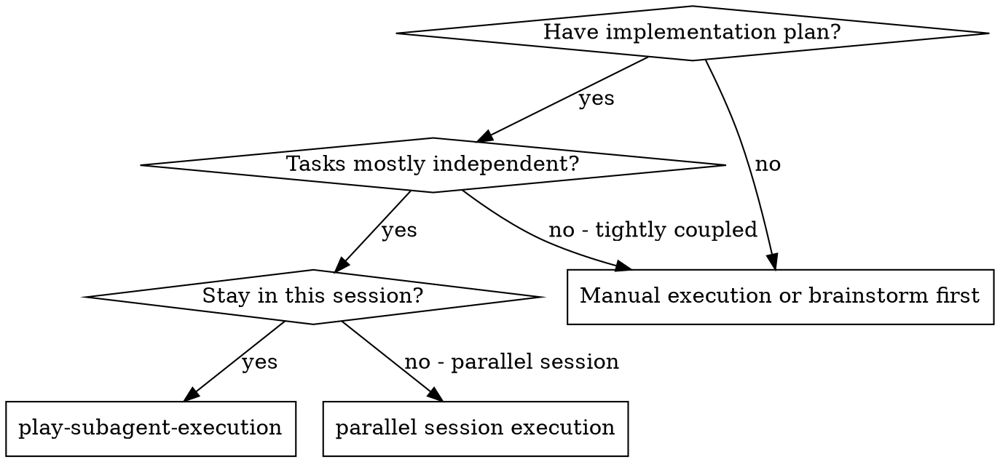
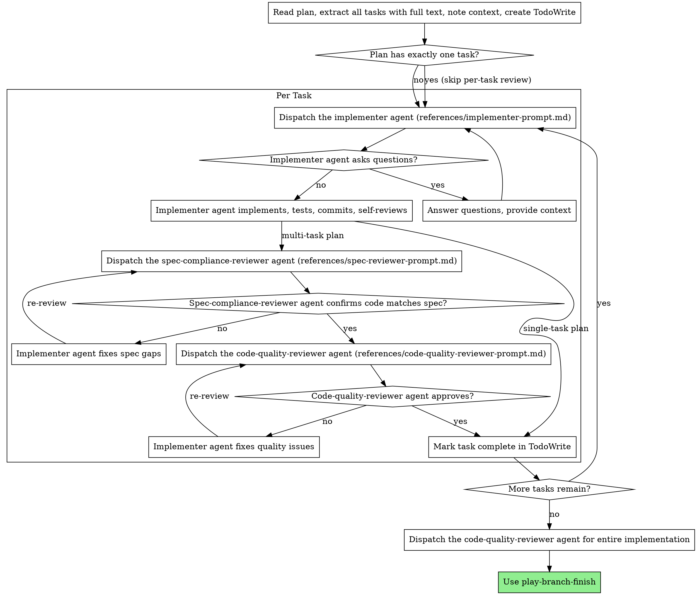

# Subagent-Driven Development

Execute plan by dispatching fresh subagent per task, with two-stage review after each (spec compliance review first, then code quality review) -- except when the plan has exactly one task, in which case the per-task two-stage review is skipped (see ADR-0007).

**Why subagents:** You delegate tasks to specialized agents with isolated context. By precisely crafting their instructions and context, you ensure they stay focused and succeed at their task. They should never inherit your session's context or history — you construct exactly what they need. This also preserves your own context for coordination work.

**Core principle:** Fresh subagent per task + two-stage review (spec then quality) for multi-task plans = high quality, fast iteration. Single-task plans skip per-task review and rely on `branch-review` (see ADR-0007).

## When to Use



**vs. Executing Plans (parallel session):**

- Same session (no context switch)
- Fresh subagent per task (no context pollution)
- Two-stage review after each task for multi-task plans (spec compliance first, then code quality); single-task plans skip per-task review (see ADR-0007)
- Faster iteration (no human-in-loop between tasks)

## The Process



## Model Selection

Use the least powerful model that can handle each role to conserve cost and increase speed.

**Mechanical implementation tasks** (isolated functions, clear specs, 1-2 files): use a fast, cheap model. Most implementation tasks are mechanical when the plan is well-specified.

**Integration and judgment tasks** (multi-file coordination, pattern matching, debugging): use a standard model.

**Architecture, design, and review tasks**: use the most capable available model.

**Task complexity signals:**

- Touches 1-2 files with a complete spec → cheap model
- Touches multiple files with integration concerns → standard model
- Requires design judgment or broad codebase understanding → most capable model

## Mechanical Task Hint

A task whose entire deliverable is "reproduce this verbatim text into a file and commit" doesn't need the full implementer scaffolding (escalation prose, ask-if-unclear reminders, code-organization advice). Plans can mark such tasks with `**Mode:** mechanical` in the task header. When this hint is present, dispatch with [`references/mechanical-implementer-prompt.md`](references/mechanical-implementer-prompt.md) instead of the default [`references/implementer-prompt.md`](references/implementer-prompt.md).

The default template is used when the hint is absent. There is no runtime auto-detection of plan structure — the plan author marks mechanical tasks explicitly. Hint-only is the conservative choice: under-marking falls back to the full template (no harm), while a heuristic biases toward over-trimming (false positives strip needed scaffolding).

When you set `**Mode:** mechanical`, you typically also want the cheap model from Model Selection above — the two knobs are correlated.

**Verification baseline:** the lean template body is ~32 lines vs. the default's ~96-line body. To confirm the optimization on a candidate task, render both prompts statically (substitute the task text into both templates) and compare line counts. A live `--auto` re-run is not required — it adds variance from unrelated dispatched context and doesn't strengthen the static comparison.

## Mechanical Task Taxonomy

Use the hint when the task fits one of these positive shapes:

- **Verbatim file create.** Single-file create from content fully specified in the plan (e.g., adding an ADR file like [PR #163](https://github.com/ryumiel/agent-manager/pull/163), or a template/snippet file with content provided verbatim).
- **Unambiguous identifier replacement.** Single-file rename where the plan provides exact before/after strings and there is only one correct substitution.

Do **not** use the hint for these negative shapes — the default template applies:

- **TDD step pair.** Any task with `Step 1: Write the failing test` and `Step 3: Write minimal implementation` — the implementer must write code that satisfies a test, which is judgment.
- **Multi-file coordinated change.** Several files where the relationship between edits is non-trivial.
- **New module or public interface.** Naming, boundary, or API decisions the implementer would need to make.
- **Plans containing the words "design", "decide", or "choose."**

## Single-Task Plans

When the plan extracted in the first step contains exactly **one** task, skip both per-task reviewers (spec-compliance and code-quality) for that task. The implementer's own self-review remains the immediate quality gate. The final whole-implementation code-quality reviewer at the end of this skill still runs (its scope is out of ADR-0007). When called by `github-issue-priming --auto`, the downstream `branch-review` invocation then performs whole-diff review on top of that.

For plans with two or more tasks, the per-task two-stage review runs unchanged.

If you invoke this skill **directly** (not via `--auto`) on a single-task plan, no whole-diff review runs after the final code-quality reviewer — run `branch-review` yourself before opening a PR if you want that coverage.

See [ADR-0007](../../docs/adr/adr-0007-review-pipeline-delineation.md) for the rationale, the rejected alternatives (Options B and C from issue #108), and the trade-off accepted for manual (non-`--auto`) single-task invocations.

## Handling Implementer Status

The `implementer` agent reports one of four statuses. Handle each appropriately:

**DONE:** For multi-task plans, proceed to spec compliance review. For single-task plans, mark the task complete (see ADR-0007 / Single-Task Plans).

**DONE_WITH_CONCERNS:** The implementer completed the work but flagged doubts. Read the concerns before proceeding. If the concerns are about correctness or scope, address them before continuing. For multi-task plans, then proceed to spec compliance review; for single-task plans (see ADR-0007), mark the task complete after addressing concerns. If the concerns are observations (e.g., "this file is getting large"), note them and proceed to the next step (spec review for multi-task, mark complete for single-task).

**NEEDS_CONTEXT:** The implementer needs information that wasn't provided. Provide the missing context and re-dispatch.

**BLOCKED:** The implementer cannot complete the task. Assess the blocker:

1. If it's a context problem, provide more context and re-dispatch with the same model
2. If the task requires more reasoning, re-dispatch with a more capable model
3. If the task is too large, break it into smaller pieces
4. If the plan itself is wrong, escalate to the user

**Never** ignore an escalation or force the same model to retry without changes. If the implementer said it's stuck, something needs to change.

## Prompt Templates

- `references/implementer-prompt.md` — default dispatch-time prompt for the `implementer` agent
- `references/mechanical-implementer-prompt.md` — leaner variant for tasks marked `**Mode:** mechanical` (see "Mechanical Task Hint" above)
- `references/spec-reviewer-prompt.md` — dispatch-time prompt for the `spec-compliance-reviewer` agent
- `references/code-quality-reviewer-prompt.md` — dispatch-time prompt for the `code-quality-reviewer` agent

## Example Workflow

The example below shows a multi-task (5-task) plan, so per-task reviewers run after every task. For a **single-task plan** the per-task reviewer dispatches are skipped (see "Single-Task Plans" above), so the per-task flow shrinks to: dispatch implementer → implementer self-reviews and commits → mark task complete → final whole-implementation code-quality reviewer → `play-branch-finish`.

```
You: I'm using Subagent-Driven Development to execute this plan.

[Read plan file once: .ephemeral/feature-plan.md]
[Extract all 5 tasks with full text and context]
[Create TodoWrite with all tasks]

Task 1: Hook installation script

[Get Task 1 text and context (already extracted)]
[Dispatch implementation subagent with full task text + context]

Implementer: "Before I begin - should the hook be installed at user or system level?"

You: "User level (~/.config/agent-hooks/)"

Implementer: "Got it. Implementing now..."
[Later] Implementer:
  - Implemented install-hook command
  - Added tests, 5/5 passing
  - Self-review: Found I missed --force flag, added it
  - Committed

[Dispatch spec compliance reviewer]
Spec reviewer: ✅ Spec compliant - all requirements met, nothing extra

[Get git SHAs, dispatch code quality reviewer]
Code reviewer: Strengths: Good test coverage, clean. Issues: None. Approved.

[Mark Task 1 complete]

Task 2: Recovery modes

[Get Task 2 text and context (already extracted)]
[Dispatch implementation subagent with full task text + context]

Implementer: [No questions, proceeds]
Implementer:
  - Added verify/repair modes
  - 8/8 tests passing
  - Self-review: All good
  - Committed

[Dispatch spec compliance reviewer]
Spec reviewer: ❌ Issues:
  - Missing: Progress reporting (spec says "report every 100 items")
  - Extra: Added --json flag (not requested)

[Implementer fixes issues]
Implementer: Removed --json flag, added progress reporting

[Spec reviewer reviews again]
Spec reviewer: ✅ Spec compliant now

[Dispatch code quality reviewer]
Code reviewer: Strengths: Solid. Issues (Important): Magic number (100)

[Implementer fixes]
Implementer: Extracted PROGRESS_INTERVAL constant

[Code reviewer reviews again]
Code reviewer: ✅ Approved

[Mark Task 2 complete]

...

[After all tasks]
[Dispatch final code-reviewer]
Final reviewer: All requirements met, ready to merge

Done!
```

## Advantages

**vs. Manual execution:**

- Subagents follow TDD naturally
- Fresh context per task (no confusion)
- Parallel-safe (subagents don't interfere)
- Subagent can ask questions (before AND during work)

**vs. Executing Plans:**

- Same session (no handoff)
- Continuous progress (no waiting)
- Review checkpoints automatic

**Efficiency gains:**

- No file reading overhead (controller provides full text)
- Controller curates exactly what context is needed
- Subagent gets complete information upfront
- Questions surfaced before work begins (not after)

**Quality gates:**

- Self-review catches issues before handoff
- Two-stage review (spec compliance, then code quality) per task on multi-task plans; single-task plans rely on the final code-quality reviewer plus downstream `branch-review` (see ADR-0007)
- Review loops ensure fixes actually work
- Spec compliance prevents over/under-building
- Code quality ensures implementation is well-built

**Cost:**

- More subagent invocations (implementer + 2 reviewers per task)
- Controller does more prep work (extracting all tasks upfront)
- Review loops add iterations
- But catches issues early (cheaper than debugging later)

## Red Flags

**Never:**

- Start implementation on main/master branch without explicit user consent
- Skip reviews when the plan has 2+ tasks (single-task plans skip per-task review by design — see ADR-0007)
- Proceed with unfixed issues
- Dispatch multiple implementation subagents in parallel (conflicts)
- Make subagent read plan file (provide full text instead)
- Skip scene-setting context (subagent needs to understand where task fits)
- Ignore subagent questions (answer before letting them proceed)
- Move to next task while either review has open issues

**Never (when per-task reviewers run — multi-task plans only):**

- Accept "close enough" on spec compliance (spec reviewer found issues = not done)
- Skip review loops (reviewer found issues = implementer fixes = review again)
- Let implementer self-review replace actual review (both are needed)
- **Start code quality review before spec compliance is ✅** (wrong order)

**If subagent asks questions:**

- Answer clearly and completely
- Provide additional context if needed
- Don't rush them into implementation

**If reviewer finds issues:**

- Implementer (same subagent) fixes them
- Reviewer reviews again
- Repeat until approved
- Don't skip the re-review

**If subagent fails task:**

- Dispatch fix subagent with specific instructions
- Don't try to fix manually (context pollution)

## Integration

**Required workflow skills:**

- **play-planning** - Creates the plan this skill executes
- **branch-review** - Code review for reviewer subagents
- **play-branch-finish** - Complete development after all tasks

**Subagents should use:**

- **play-tdd** - Subagents follow TDD for each task
