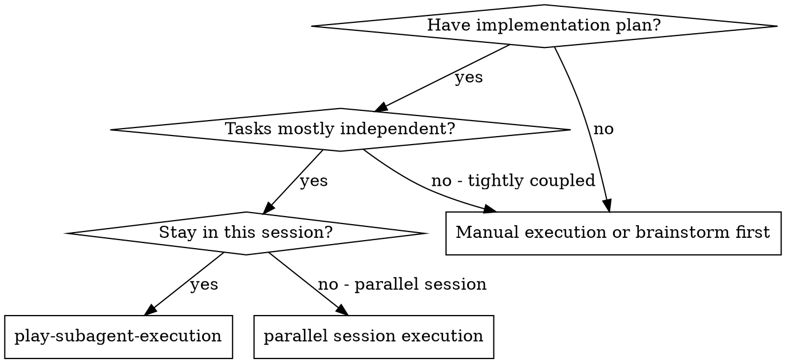

# Process Diagrams - `play-subagent-execution`

These diagrams are reference material for the controller flow in `SKILL.md`.
Load this file when you need the full branch diagram, transition labels, or
diagram interpretation notes.

## When to Use

## Process

```dot
digraph process {
    rankdir=TB;

    "Read plan and extract authored tasks" [shape=box];
    "Task contract structurally valid?" [shape=diamond];
    "Plan has exactly one task?" [shape=diamond];
    "Skip-dispatch guardrails all pass?" [shape=diamond];
    "Controller executes Write/Edit + verify + commit inline" [shape=box];
    "Dispatch implementer prompt" [shape=box];
    "Implementer asks questions?" [shape=diamond];
    "Answer questions and provide context" [shape=box];
    "Implementer implements, verifies, commits, self-reviews" [shape=box];
    "Compute effective review route" [shape=diamond];
    "Dispatch spec and quality reviewers for same task head" [shape=box];
    "Dispatch spec reviewer" [shape=box];
    "Join same-head review results" [shape=box];
    "Spec-only review passes?" [shape=diamond];
    "Spec passes for reviewed head?" [shape=diamond];
    "Quality result final for same reviewed head?" [shape=diamond];
    "Quality findings present?" [shape=diamond];
    "Resolve quality disposition or rerun quality" [shape=box];
    "Implementer fixes findings" [shape=box];
    "Revalidate effective review route" [shape=box];
    "Mark task complete" [shape=box];
    "More tasks remain?" [shape=diamond];
    "Single-task caller-scoped final-review skip applies?" [shape=diamond];
    "Dispatch final whole-implementation code-quality reviewer" [shape=box];
    "Final whole-implementation review passes?" [shape=diamond];
    "Implementer fixes final-review findings" [shape=box];
    "Owning caller final whole-diff gate present?" [shape=diamond];
    "Return to caller" [shape=box];
    "Report implementation and final review status; resolve branch-level review status" [shape=box];
    "Active workflow requires branch-level review before PR creation?" [shape=diamond];
    "Hand off to branch-review before play-branch-finish" [shape=box style=filled fillcolor=lightyellow];
    "Branch-review approval evidence or explicit waiver present?" [shape=diamond];
    "Invoke play-branch-finish" [shape=box style=filled fillcolor=lightgreen];
    "Stop: BLOCKED/NEEDS_CONTEXT for task contract" [shape=box];

    "Read plan and extract authored tasks" -> "Task contract structurally valid?";
    "Task contract structurally valid?" -> "Stop: BLOCKED/NEEDS_CONTEXT for task contract" [label="no"];
    "Task contract structurally valid?" -> "Plan has exactly one task?" [label="yes"];
    "Plan has exactly one task?" -> "Skip-dispatch guardrails all pass?" [label="yes"];
    "Skip-dispatch guardrails all pass?" -> "Controller executes Write/Edit + verify + commit inline" [label="yes"];
    "Skip-dispatch guardrails all pass?" -> "Dispatch implementer prompt" [label="no"];
    "Plan has exactly one task?" -> "Dispatch implementer prompt" [label="no"];
    "Dispatch implementer prompt" -> "Implementer asks questions?";
    "Implementer asks questions?" -> "Answer questions and provide context" [label="yes"];
    "Answer questions and provide context" -> "Dispatch implementer prompt";
    "Implementer asks questions?" -> "Implementer implements, verifies, commits, self-reviews" [label="no"];
    "Implementer implements, verifies, commits, self-reviews" -> "Mark task complete" [label="single-task plan"];
    "Implementer implements, verifies, commits, self-reviews" -> "Compute effective review route" [label="multi-task plan"];
    "Compute effective review route" -> "Dispatch spec and quality reviewers for same task head" [label="spec-and-quality"];
    "Compute effective review route" -> "Dispatch spec reviewer" [label="spec-only"];
    "Compute effective review route" -> "Mark task complete" [label="none-final-only"];
    "Dispatch spec and quality reviewers for same task head" -> "Join same-head review results";
    "Dispatch spec reviewer" -> "Spec-only review passes?";
    "Join same-head review results" -> "Spec passes for reviewed head?";
    "Spec-only review passes?" -> "Implementer fixes findings" [label="no"];
    "Spec-only review passes?" -> "Mark task complete" [label="yes"];
    "Spec passes for reviewed head?" -> "Implementer fixes findings" [label="no"];
    "Spec passes for reviewed head?" -> "Quality result final for same reviewed head?" [label="yes"];
    "Quality result final for same reviewed head?" -> "Resolve quality disposition or rerun quality" [label="no"];
    "Resolve quality disposition or rerun quality" -> "Join same-head review results";
    "Quality result final for same reviewed head?" -> "Quality findings present?" [label="yes"];
    "Quality findings present?" -> "Implementer fixes findings" [label="yes"];
    "Quality findings present?" -> "Mark task complete" [label="no"];
    "Implementer fixes findings" -> "Revalidate effective review route";
    "Revalidate effective review route" -> "Compute effective review route";
    "Controller executes Write/Edit + verify + commit inline" -> "Mark task complete";
    "Mark task complete" -> "More tasks remain?";
    "More tasks remain?" -> "Dispatch implementer prompt" [label="yes"];
    "More tasks remain?" -> "Single-task caller-scoped final-review skip applies?" [label="no"];
    "Single-task caller-scoped final-review skip applies?" -> "Return to caller" [label="yes"];
    "Single-task caller-scoped final-review skip applies?" -> "Dispatch final whole-implementation code-quality reviewer" [label="no"];
    "Dispatch final whole-implementation code-quality reviewer" -> "Final whole-implementation review passes?";
    "Final whole-implementation review passes?" -> "Implementer fixes final-review findings" [label="no"];
    "Implementer fixes final-review findings" -> "Dispatch final whole-implementation code-quality reviewer";
    "Final whole-implementation review passes?" -> "Owning caller final whole-diff gate present?" [label="yes"];
    "Owning caller final whole-diff gate present?" -> "Return to caller" [label="yes"];
    "Owning caller final whole-diff gate present?" -> "Report implementation and final review status; resolve branch-level review status" [label="no"];
    "Report implementation and final review status; resolve branch-level review status" -> "Active workflow requires branch-level review before PR creation?";
    "Active workflow requires branch-level review before PR creation?" -> "Hand off to branch-review before play-branch-finish" [label="yes"];
    "Hand off to branch-review before play-branch-finish" -> "Branch-review approval evidence or explicit waiver present?";
    "Branch-review approval evidence or explicit waiver present?" -> "Invoke play-branch-finish" [label="yes"];
    "Branch-review approval evidence or explicit waiver present?" -> "Hand off to branch-review before play-branch-finish" [label="no"];
    "Active workflow requires branch-level review before PR creation?" -> "Invoke play-branch-finish" [label="no"];
}
```

The diagram routes each multi-task task through effective route computation
before reviewer dispatch. `spec-and-quality` may dispatch both read-only
reviewers concurrently against the same captured task head, then joins their
results; `spec-only` stops after spec-compliance approval, and
`none-final-only` marks the task complete after implementer self-review and
commit because the final whole-diff gate is mandatory.

When a prior quality result needs freshness disposition after spec fixups, use
the lifecycle/status reference for the advisory, stale, superseded, and final
states before marking the task complete.

Final whole-implementation review failures use the final-review-specific fixup
state, then rerun the final whole-implementation code-quality reviewer. They do
not re-enter per-task effective route computation because there is no current
task route after all tasks are complete.

The terminal path splits on ownership. If a verified owning caller final
whole-diff gate exists, return to that caller. For direct/manual invocations
without that owning caller gate, a passing final whole-implementation review
reports implementation and final review status, then resolves branch-level
review status before any finish handoff. If the active workflow requires
branch-level review before PR creation, hand off to `branch-review` before any
`play-branch-finish` handoff. Use `branch-review --fix` as the branch-level
gate only when the owning workflow already grants auto-fix authority or the
operator explicitly confirms that branch-review may auto-commit fixes;
otherwise hand off to branch-review without auto-fix authority. Do not invoke
`play-branch-finish` until `branch-review` returns review approval evidence or
the active workflow explicitly waives branch-level review. If that workflow
does not require branch-level review, invoke `play-branch-finish`; that skill
presents the authoritative finish options. Implementation summaries,
verification summaries, and review pass reports are status reports only on both
paths, not terminal workflow states. The return-to-caller path leaves final
continuation ownership with the caller; the direct/manual path either resolves
required branch review before finish or hands finish ownership to
`play-branch-finish` when branch review is not required.

The implementer dispatch boxes use `references/implementer-prompt.md` by
default. When the task header carries `**Mode:** mechanical`, swap in
`references/mechanical-implementer-prompt.md` only after skip-dispatch fallback
rules confirm no TDD expectation or legacy TDD step-pair overrides the hint.

Before assembling either implementer dispatch prompt, classify whether this
task requires a DONE-report snapshot. If requested, include readable paths for
`references/snapshot-manifest-recipe.md` and
`scripts/write-snapshot-manifest.sh`. If skipped, require the default DONE
fields: status, summary, tests, files changed, base SHA, and head SHA.

When the plan has exactly one task and all skip-dispatch guardrails pass, the
controller executes the file change inline instead of dispatching an implementer
subagent.
