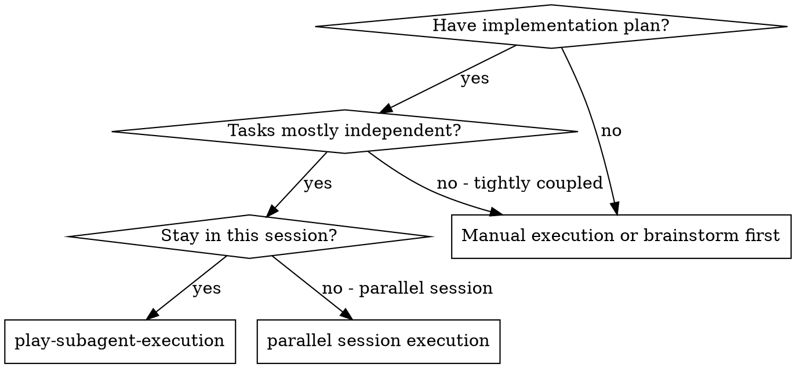

# Process Diagrams - `play-subagent-execution`

These diagrams are non-normative summaries of the controller flow in
`SKILL.md`. Load this file for orientation only. Initial review selection is
owned by [`review-routing-policy.md`](review-routing-policy.md); returned
status, freshness, guard-failure, cleanup, and terminal transitions are owned
by [`lifecycle-status-policy.md`](lifecycle-status-policy.md).

## When to Use

## Process

```dot
digraph process {
    rankdir=TB;

    "Read plan and extract authored tasks" [shape=box];
    "Task contract structurally valid?" [shape=diamond];
    "Plan has exactly one task?" [shape=diamond];
    "Skip-dispatch guardrails all pass?" [shape=diamond];
    "Controller chooses guarded inline?" [shape=diamond];
    "Controller executes Write/Edit + verify + commit inline" [shape=box];
    "Inline branch: no child DONE report or snapshot request" [shape=box];
    "Dispatch D13 executor for exact validated operation" [shape=box];
    "Dispatched D13: capture DONE report and snapshot state" [shape=box];
    "Dispatch implementer prompt" [shape=box];
    "Implementer asks questions?" [shape=diamond];
    "Answer questions and provide context" [shape=box];
    "Implementer implements, verifies, commits, self-reviews" [shape=box];
    "Compute effective review route" [shape=diamond];
    "Dispatch spec and quality reviewers for same task head" [shape=box];
    "Capture separate D14 and D15 baselines" [shape=box];
    "Independent D14 and D15 verify-validate-cleanup-apply" [shape=box];
    "Capture D14 baseline" [shape=box];
    "Dispatch spec reviewer" [shape=box];
    "D14 verify-validate-cleanup-apply" [shape=box];
    "Join same-head review results" [shape=box];
    "Spec-only review passes?" [shape=diamond];
    "Spec passes for reviewed head?" [shape=diamond];
    "Quality result final for same reviewed head?" [shape=diamond];
    "Quality findings present?" [shape=diamond];
    "Resolve quality disposition or rerun quality" [shape=box];
    "Implementer fixes findings" [shape=box];
    "Revalidate effective review route" [shape=box];
    "Mark task complete" [shape=box];
    "More tasks remain?" [shape=diamond];
    "Single-task caller-scoped final-review skip applies?" [shape=diamond];
    "Dispatch final whole-implementation code-quality reviewer" [shape=box];
    "Fresh D16 capture" [shape=box];
    "D16 verify-validate-cleanup-apply" [shape=box];
    "Final whole-implementation review passes?" [shape=diamond];
    "Implementer fixes final-review findings" [shape=box];
    "Owning caller final whole-diff gate present?" [shape=diamond];
    "Return to caller" [shape=box];
    "Report implementation and final review status; resolve branch-level review status" [shape=box];
    "Active workflow requires branch-level review before PR creation?" [shape=diamond];
    "Hand off to branch-review before play-branch-finish" [shape=box style=filled fillcolor=lightyellow];
    "Branch-review approval evidence or explicit waiver present?" [shape=diamond];
    "Invoke play-branch-finish" [shape=box style=filled fillcolor=lightgreen];
    "Stop: BLOCKED/NEEDS_CONTEXT for task contract" [shape=box];

    "Read plan and extract authored tasks" -> "Task contract structurally valid?";
    "Task contract structurally valid?" -> "Stop: BLOCKED/NEEDS_CONTEXT for task contract" [label="no"];
    "Task contract structurally valid?" -> "Plan has exactly one task?" [label="yes"];
    "Plan has exactly one task?" -> "Skip-dispatch guardrails all pass?" [label="yes"];
    "Skip-dispatch guardrails all pass?" -> "Controller chooses guarded inline?" [label="yes"];
    "Controller chooses guarded inline?" -> "Controller executes Write/Edit + verify + commit inline" [label="yes"];
    "Controller chooses guarded inline?" -> "Dispatch D13 executor for exact validated operation" [label="no"];
    "Skip-dispatch guardrails all pass?" -> "Dispatch implementer prompt" [label="non-contract miss: reclassify D12"];
    "Plan has exactly one task?" -> "Dispatch implementer prompt" [label="no"];
    "Dispatch implementer prompt" -> "Implementer asks questions?";
    "Implementer asks questions?" -> "Answer questions and provide context" [label="yes"];
    "Answer questions and provide context" -> "Dispatch implementer prompt";
    "Implementer asks questions?" -> "Implementer implements, verifies, commits, self-reviews" [label="no"];
    "Implementer implements, verifies, commits, self-reviews" -> "Mark task complete" [label="single-task plan"];
    "Implementer implements, verifies, commits, self-reviews" -> "Compute effective review route" [label="multi-task plan"];
    "Dispatch D13 executor for exact validated operation" -> "Dispatched D13: capture DONE report and snapshot state" [label="DONE or purely observational DONE_WITH_CONCERNS"];
    "Dispatched D13: capture DONE report and snapshot state" -> "Mark task complete" [label="single-task plan; DONE or purely observational concerns"];
    "Dispatched D13: capture DONE report and snapshot state" -> "Dispatch implementer prompt" [label="judgment-bearing concerns: route D12 via lifecycle/status policy"];
    "Compute effective review route" -> "Capture separate D14 and D15 baselines" [label="spec-and-quality"];
    "Capture separate D14 and D15 baselines" -> "Dispatch spec and quality reviewers for same task head" [label="capture succeeds"];
    "Dispatch spec and quality reviewers for same task head" -> "Independent D14 and D15 verify-validate-cleanup-apply";
    "Independent D14 and D15 verify-validate-cleanup-apply" -> "Join same-head review results";
    "Compute effective review route" -> "Capture D14 baseline" [label="spec-only"];
    "Capture D14 baseline" -> "Dispatch spec reviewer" [label="capture succeeds"];
    "Compute effective review route" -> "Mark task complete" [label="none-final-only"];
    "Dispatch spec reviewer" -> "D14 verify-validate-cleanup-apply";
    "D14 verify-validate-cleanup-apply" -> "Spec-only review passes?";
    "Join same-head review results" -> "Spec passes for reviewed head?";
    "Spec-only review passes?" -> "Implementer fixes findings" [label="no"];
    "Spec-only review passes?" -> "Mark task complete" [label="yes"];
    "Spec passes for reviewed head?" -> "Implementer fixes findings" [label="no"];
    "Spec passes for reviewed head?" -> "Quality result final for same reviewed head?" [label="yes"];
    "Quality result final for same reviewed head?" -> "Resolve quality disposition or rerun quality" [label="no"];
    "Resolve quality disposition or rerun quality" -> "Join same-head review results";
    "Quality result final for same reviewed head?" -> "Quality findings present?" [label="yes"];
    "Quality findings present?" -> "Implementer fixes findings" [label="yes"];
    "Quality findings present?" -> "Mark task complete" [label="no"];
    "Implementer fixes findings" -> "Revalidate effective review route";
    "Revalidate effective review route" -> "Compute effective review route";
    "Controller executes Write/Edit + verify + commit inline" -> "Inline branch: no child DONE report or snapshot request";
    "Inline branch: no child DONE report or snapshot request" -> "Mark task complete";
    "Mark task complete" -> "More tasks remain?";
    "More tasks remain?" -> "Dispatch implementer prompt" [label="yes"];
    "More tasks remain?" -> "Single-task caller-scoped final-review skip applies?" [label="no"];
    "Single-task caller-scoped final-review skip applies?" -> "Return to caller" [label="yes"];
    "Single-task caller-scoped final-review skip applies?" -> "Fresh D16 capture" [label="no"];
    "Fresh D16 capture" -> "Dispatch final whole-implementation code-quality reviewer" [label="capture succeeds"];
    "Dispatch final whole-implementation code-quality reviewer" -> "D16 verify-validate-cleanup-apply";
    "D16 verify-validate-cleanup-apply" -> "Final whole-implementation review passes?";
    "Final whole-implementation review passes?" -> "Implementer fixes final-review findings" [label="no"];
    "Implementer fixes final-review findings" -> "Fresh D16 capture";
    "Final whole-implementation review passes?" -> "Owning caller final whole-diff gate present?" [label="yes"];
    "Owning caller final whole-diff gate present?" -> "Return to caller" [label="yes"];
    "Owning caller final whole-diff gate present?" -> "Report implementation and final review status; resolve branch-level review status" [label="no"];
    "Report implementation and final review status; resolve branch-level review status" -> "Active workflow requires branch-level review before PR creation?";
    "Active workflow requires branch-level review before PR creation?" -> "Hand off to branch-review before play-branch-finish" [label="yes"];
    "Hand off to branch-review before play-branch-finish" -> "Branch-review approval evidence or explicit waiver present?";
    "Branch-review approval evidence or explicit waiver present?" -> "Invoke play-branch-finish" [label="yes"];
    "Branch-review approval evidence or explicit waiver present?" -> "Hand off to branch-review before play-branch-finish" [label="no"];
    "Active workflow requires branch-level review before PR creation?" -> "Invoke play-branch-finish" [label="no"];
}
```

The process graph is a success-path summary, not a second policy owner.
Capture-to-spawn arrows are labeled `capture succeeds`; omitted capture,
cleanup, verification, returned-status, and terminal failure edges are
deliberate and are governed by
[`lifecycle-status-policy.md`](lifecycle-status-policy.md). Initial route labels
are governed by [`review-routing-policy.md`](review-routing-policy.md), and
pre-dispatch D13 selection is governed by
[`skip-dispatch-policy.md`](skip-dispatch-policy.md).

Prompt boxes point to the child-action/report owners in `implementer-prompt.md`,
`executor-prompt.md`, `spec-reviewer-prompt.md`, and
`code-quality-reviewer-prompt.md`. Snapshot construction and consumption remain
owned by their dedicated references. Do not infer a missing failure transition
from this summary diagram.
