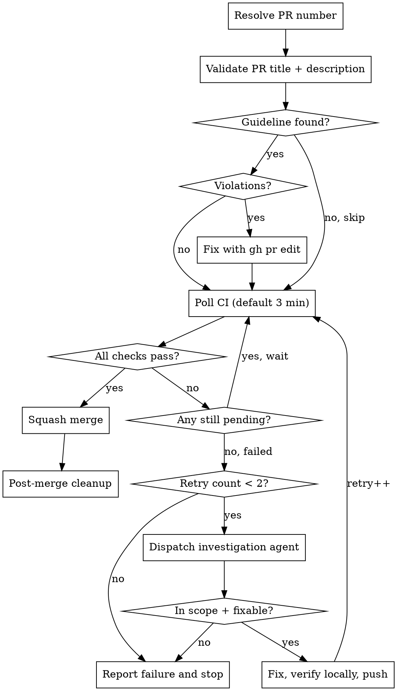

# PR Merge

Poll CI status on a pull request, merge when green, investigate and fix failures automatically.

## Process



## Step 1: Resolve PR Number

Auto-detect from current branch if no PR number provided:

```bash
gh pr view --json number --jq '.number'
```

If a PR number or URL is given as argument, use that directly. Confirm the PR is open before proceeding:

```bash
gh pr view <N> --json state --jq '.state'
```

## Step 1b: Validate PR Title and Description

Check whether the project has a PR guideline and validate the PR against it before proceeding.

### Find the guideline

```bash
# From the repo root, glob for PR guideline files
# Common patterns: pr-guideline.md, pr-guidelines.md, pr-template.md
```

Search for `**/pr-guideline*.md` in the repository root. If no file is found, skip validation and proceed to Step 2.

### Fetch PR data

Gather everything needed for both validation and any regeneration up-front, so the same data feeds both paths:

```bash
gh pr view <N> --json title,body
gh pr diff <N> --name-only
gh pr view <N> --json commits --jq '.commits[] | {headline: .messageHeadline, body: .messageBody}'
```

The file list and commit log are not used by the format check (title, required sections, anti-patterns), but the content-vs-diff check below depends on both — and the regeneration path was already pulling them from the same commands. Lifting them up here avoids re-fetching during fixes.

### Validate

Read the guideline file and check four dimensions:

1. **Title format** — does it match the format specified in the guideline? (e.g., Conventional Commits: `<type>(<scope>): <summary>`)
2. **Required sections** — does the description contain all sections the guideline's template requires? Compare against the template headings (e.g., Summary, Why, Changes, Impact, Testing, Breaking Changes, Related Issues)
3. **Anti-patterns** — does the description violate any explicit "do not" rules? (e.g., file-by-file changelogs, commit-SHA references, "originally / now" chronology)
4. **Content vs diff** — does the description's Changes / Summary still reflect what the commits actually changed? Best-effort, subsystem-level, not file-level. Flag if the description references subsystems or files the diff doesn't touch (stale claim), or omits subsystems the diff clearly modifies (under-disclosed change). Use the commit headlines + bodies from `gh pr view <N> --json commits` as the canonical statement of what each commit did, and the file list from `gh pr diff <N> --name-only` to identify subsystems.

The content-vs-diff check is bounded to the PR's own commits (`gh pr view <N> --json commits` returns only the PR's commits) and is intentionally subsystem-level: per `docs/guidelines/pr-guideline.md` §2, descriptions group by subsystem (`render`, `install`, `validate`, etc.), not by file. A description that names every affected subsystem with a behavior bullet passes even if it never names individual files. A description that promises behavior changes the diff does not contain — or omits a subsystem the diff plainly touches — fails.

### Fix violations

If any of the four checks flag a violation, rewrite the title and/or description to comply, then apply:

```bash
gh pr edit <N> --title "<fixed title>" --body "<fixed body>"
```

Pass only the flags whose content actually changed — `gh pr edit` leaves omitted fields untouched, so a body-only fix should drop `--title` and a title-only fix should drop `--body`.

Use the diff file list (`gh pr diff <N> --name-only`) and commit headlines + bodies (`gh pr view <N> --json commits`) — already fetched in the previous subsection — as the ground truth for what the PR actually contains. A regenerated description follows the guideline's template, including all required sections.

**When the content-vs-diff check is the trigger:** regenerate only the affected sections (typically Summary, Changes, sometimes Impact); preserve Why, Testing, and Related Issues verbatim unless the format check also flagged them. A single `gh pr edit --body` call applies the combined regeneration when both format and content violations are detected — no need for two trips.

**Anti-pattern guardrails still apply during regeneration**, even though commit data is now in scope:

- No commit SHAs in the regenerated body. The git history covers that.
- No "originally / now" or "we tried X then Y" chronology. The PR is the durable record of what merges, not the path that got there.
- No file-by-file changelog. Group changes by subsystem and behavior, not by which commit introduced them.
- Do not paste commit messages verbatim — synthesize behavior changes across the commit log.

Bullets 1–3 are direct entries in `docs/guidelines/pr-guideline.md` §3. Bullet 4 is this skill's application of §3's "Diff restatement" rule to the regeneration step — when commit headlines and bodies are the source material, the synthesis-vs-paste discipline is what keeps the description from re-narrating the diff.

**Do not skip validation because the description "looks close enough."** The guideline exists for a reason — enforce it exactly.

## Step 2: Poll CI

```bash
gh pr checks <N>
```

**Default interval: 3 minutes.** User can override via args (e.g., `5m`, `1m`).

Classify output:

- All checks show `pass` → proceed to merge (Step 3)
- Any check shows `pending`/`queued` → wait and re-poll
- Any check shows `fail` → proceed to investigation (Step 4)

**Max poll duration:** 30 minutes. If CI has not completed, report and stop.

## Step 3: Merge

```bash
gh pr merge <N> --squash --delete-branch
```

If `--delete-branch` fails locally (e.g., worktree holds the branch), the remote merge still succeeds. Check `gh pr view <N> --json state` — if `MERGED`, proceed to cleanup. The local error is handled in Step 3b.

If merge itself fails, check for:

- **Merge conflicts:** Report to user — conflicts require manual resolution
- **Missing review approvals:** Report which reviews are missing — do not bypass branch protection
- **Branch protection rules:** Report the specific rule blocking merge

## Step 3b: Post-Merge Cleanup

After successful merge, clean up local branches and worktrees.

### Detect context

```bash
BRANCH=$(gh pr view <N> --json headRefName --jq '.headRefName')
BASE=$(gh pr view <N> --json baseRefName --jq '.baseRefName')
MAIN_WORKTREE=$(git worktree list --porcelain | head -1 | sed 's/^worktree //')
WORKTREE_PATH=$(git worktree list --porcelain | awk -v branch="refs/heads/$BRANCH" '
  /^worktree / { sub(/^worktree /, ""); p=$0; next }
  $1 == "branch" && $2 == branch { print p; exit }
')
```

**Guard:** Never run cleanup on the base branch. If `$BRANCH` is empty (`gh pr view` failed) or equals `$BASE` (the PR's own base — e.g., `main`, `master`, `develop`), stop here — there is nothing to clean up.

`WORKTREE_PATH` is empty when no worktree holds the merged branch on a
named ref — for example, the PR was developed on a single checkout, or
the worktree is in a detached-HEAD state. The procedure below treats
that as "nothing to remove" and proceeds to `pull` + `branch -D`
directly. Detached-HEAD worktrees on the merged commit must be removed
manually with `git worktree remove`.

### Cleanup procedure

```bash
# If the feature branch still has a worktree, remove it first.
# git worktree remove handles the directory, the metadata, and the
# branch lock in one step — no prune, no rm -rf.
if [ -n "$WORKTREE_PATH" ] && [ "$WORKTREE_PATH" != "$MAIN_WORKTREE" ]; then
  # cd out of the worktree we're about to remove
  [ "$(pwd)" = "$WORKTREE_PATH" ] && cd "$MAIN_WORKTREE"
  git worktree remove --force "$WORKTREE_PATH"
fi

# Pull and branch deletion must run on the base branch in the main
# worktree, not in some other worktree (or some other branch the main
# worktree happens to have checked out). Switch explicitly.
cd "$MAIN_WORKTREE"
git checkout "$BASE"
git pull --ff-only

# Safety gate: only force-delete the local branch when BOTH
#   (a) GitHub reports the PR as MERGED, and
#   (b) the local branch tip matches the PR's head commit
#       (no unpushed local commits that would be lost).
# `branch -d`'s history-walk is a poor proxy on squash-merges (HEAD never
# contains the feature tip's original SHA after squash, so -d falls back to
# the remote-tracking ref and emits a misleading "merged to origin but not
# HEAD" warning). The two-part check below silences that warning while
# still refusing to discard unpublished work.
STATE=$(gh pr view <N> --json state --jq '.state')
PR_HEAD=$(gh pr view <N> --json headRefOid --jq '.headRefOid')
LOCAL_TIP=$(git rev-parse "$BRANCH")
if [ "$STATE" != "MERGED" ]; then
  echo "Skipping local branch deletion: PR <N> is in state '$STATE', not MERGED" >&2
elif [ "$LOCAL_TIP" != "$PR_HEAD" ]; then
  echo "Skipping local branch deletion: $BRANCH ($LOCAL_TIP) differs from PR head ($PR_HEAD); unpushed work would be lost" >&2
else
  git branch -D "$BRANCH"
fi
```

### Key invariants

| Rule                                                       | Why                                                                                     |
| ---------------------------------------------------------- | --------------------------------------------------------------------------------------- |
| Use `git worktree remove`, not `prune` + `rm -rf`          | `prune` only cleans missing worktrees; one `remove` does it all                         |
| `cd` out of the worktree if your CWD is inside it          | Cannot remove the worktree that holds your CWD                                          |
| `git pull --ff-only` on the base branch                    | Updates local `main` to include the squash commit (hygiene; not a safety gate)          |
| Verify `MERGED` AND local tip = PR head before `branch -D` | GitHub state confirms the merge; tip-equality refuses to discard unpushed local commits |
| `--ff-only` pull                                           | Fails loudly if main diverged — no silent merge commits                                 |

Report the merge to the user with the PR URL. Done.

## Step 4: Investigate and Fix Failures

Track retry count explicitly. **Max 2 failure cycles.** A "failure cycle" is: CI fails → investigation → fix → push. Pending/timeout does NOT count as a failure cycle.

### 4a. Get failure details

```bash
# Find the failing run
gh run list --branch <branch> --limit 5
# Get failed step logs
gh run view <run-id> --log-failed
```

### 4b. Dispatch investigation agent

Dispatch a **dedicated investigation agent**. The investigation agent:

1. Reads `.github/workflows/*.yml` to understand what CI runs and what commands to reproduce locally
2. Reads the failed log output
3. Reads the PR diff (`gh pr diff <N>`) to understand what changed
4. Uses `play-debug` to diagnose root cause
5. Determines if the failure is **in scope** (see below)
6. If fixable: fixes the issue, reproduces CI steps locally, uses `play-verification` before pushing
7. Reports back with status

**Pass to the investigation agent:**

- PR number and branch name
- Failed check name and log output
- Repository root path
- Retry count (so it knows this is attempt N)

### 4c. "In scope" definition

A failure is **in scope** if ALL of:

- The failing code, test, or lint rule directly involves files the PR modified
- The fix stays within the same files/modules the PR touches
- The fix is mechanical (formatting, lint, test assertion) not architectural

A failure is **out of scope** if ANY of:

- Flaky test in an unrelated module
- CI infrastructure issue (network timeout, cache corruption, runner problem)
- Failure in code the PR never touched
- Fix would require design decisions beyond the PR's scope

### 4d. After the fix

The investigation agent must:

1. Read `.github/workflows/*.yml` to extract the actual CI commands
2. Run the relevant CI steps locally (not hardcoded — derived from workflow files)
3. Use `play-verification` to confirm the fix
4. Commit with a descriptive message referencing the CI failure
5. Push to the PR branch

After push, return to Step 2 (poll CI) with retry count incremented.

### 4e. Second failure or out-of-scope

If retry count reaches 2, or investigation determines the failure is out of scope, report:

- The exact failing check name and log excerpt
- Whether it is in scope or out of scope
- What was attempted (if anything)
- Recommendation for manual resolution

## Quick Reference

| Situation                         | Action                                                                                                                                                                                                                           |
| --------------------------------- | -------------------------------------------------------------------------------------------------------------------------------------------------------------------------------------------------------------------------------- |
| No PR number given                | Auto-detect from current branch via `gh pr view`                                                                                                                                                                                 |
| PR guideline found                | Validate title + description, fix with `gh pr edit`                                                                                                                                                                              |
| Description content stale vs diff | Regenerate Summary/Changes/Impact from commit log + diff name-only, apply with `gh pr edit --body` (single call covers combined fixes)                                                                                           |
| No PR guideline found             | Skip validation, proceed to CI                                                                                                                                                                                                   |
| CI pending                        | Poll every 3 min (configurable)                                                                                                                                                                                                  |
| CI passes                         | `gh pr merge --squash --delete-branch` → cleanup                                                                                                                                                                                 |
| Post-merge cleanup                | If a worktree (not the main one) holds the branch: `git worktree remove --force <path>` → `cd` to main → `checkout <base>` → `pull --ff-only` → verify `MERGED` and local tip = PR head → `branch -D`; otherwise skip the remove |
| CI fails (1st time)               | Investigate → fix if in scope → push → re-poll                                                                                                                                                                                   |
| CI fails (2nd time)               | Report and stop                                                                                                                                                                                                                  |
| Out-of-scope failure              | Report and stop immediately                                                                                                                                                                                                      |
| CI not done after 30 min          | Report and stop                                                                                                                                                                                                                  |
| Merge conflicts                   | Report to user — requires manual resolution                                                                                                                                                                                      |
| Missing review approvals          | Report which reviews are missing                                                                                                                                                                                                 |

## Common Mistakes

### Skipping PR guideline validation

The validation step exists because agents routinely create PRs with generic descriptions that don't follow project conventions. Do not skip it because "the description looks fine" — read the guideline and check systematically. If no guideline file is found, that's the only valid reason to skip.

### Description content drifted from the diff

Step 1b validates that the description still reflects the diff, not just that the headings are present. When branch-review or PR review adds commits after the description was written, the Changes / Summary sections often go stale — the headings stay valid but the content stops describing what actually merged.

The skill regenerates the affected sections from the commit log + diff name-only before merging. The regeneration must still follow `docs/guidelines/pr-guideline.md` — no commit SHAs, no "originally / now" chronology, no file-by-file framing, no verbatim commit-message paste. Group by subsystem and behavior, not by which commit introduced the change.

The check is best-effort and subsystem-level. A description that names every affected subsystem with a behavior bullet passes even if it never names individual files; that is the guideline, not a gap.

### Hardcoding CI commands

Read `.github/workflows/*.yml` to discover what CI actually runs. Do NOT assume `cargo fmt + clippy + test` or any other fixed set of commands. Different repos have different CI pipelines.

### Investigating in the main session

Always dispatch a **dedicated agent** for investigation. Reading CI logs and debugging pollutes the main session's context. The investigation agent starts fresh and reports back a summary.

### Polling too frequently

60-second intervals waste API calls. Most CI runs take 5-10 minutes. 3-minute intervals balance responsiveness with efficiency.

### Forgetting retry count

Track retry count as an explicit variable, not "mentally." Context compression can lose track. State it in each poll message: "Poll attempt N, retry count: M/2."

### Pushing without local verification

Always reproduce the failing CI steps locally (derived from workflow files) before pushing a fix. Pushing without verification wastes a full CI cycle.

### Skipping post-merge cleanup

After merge, always clean up the local branch and worktree. Leftover worktrees accumulate and cause branch name conflicts on future work. Use `git worktree remove --force <path>`, not `rm -rf` — `remove` releases the worktree-to-branch lock so `git branch -D` can succeed afterward.

### Deleting main/master branch

Never delete the base branch during cleanup. Always check that `$BRANCH` is the feature branch, not `main` or `master`.
