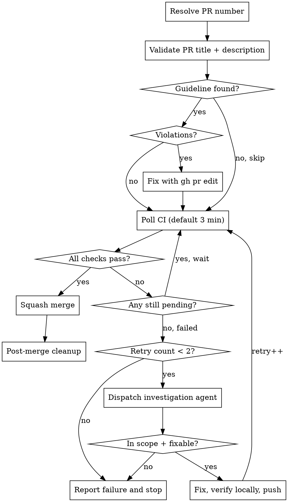

# PR Merge

Poll CI status on a pull request, merge when green, investigate and fix failures automatically.

## Process



## Step 1: Resolve PR Number

Auto-detect from current branch if no PR number provided:

```bash
gh pr view --json number --jq '.number'
```

If a PR number or URL is given as argument, use that directly. Confirm the PR is open before proceeding:

```bash
gh pr view <N> --json state --jq '.state'
```

## Step 1b: Validate PR Title and Description

Check whether the project has a PR guideline and validate the PR against it before proceeding.

### Find the guideline

```bash
# From the repo root, glob for PR guideline files
# Common patterns: pr-guideline.md, pr-guidelines.md, pr-template.md
```

Search for `**/pr-guideline*.md` in the repository root. If no file is found, skip validation and proceed to Step 2.

### Fetch current PR title and body

```bash
gh pr view <N> --json title,body
```

### Validate

Read the guideline file and check:

1. **Title format** — does it match the format specified in the guideline? (e.g., Conventional Commits: `<type>(<scope>): <summary>`)
2. **Required sections** — does the description contain all sections the guideline's template requires? Compare against the template headings (e.g., Summary, Why, Changes, Impact, Testing, Breaking Changes, Related Issues)
3. **Anti-patterns** — does the description violate any explicit "do not" rules? (e.g., file-by-file changelogs)

### Fix violations

If any violations are found, rewrite the title and/or description to comply, then apply:

```bash
gh pr edit <N> --title "<fixed title>"
gh pr edit <N> --body "<fixed body>"
```

Use the PR diff (`gh pr diff <N>`) and commit history (`gh pr view <N> --json commits`) to produce an accurate description that follows the guideline's template.

**Do not skip validation because the description "looks close enough."** The guideline exists for a reason — enforce it exactly.

## Step 2: Poll CI

```bash
gh pr checks <N>
```

**Default interval: 3 minutes.** User can override via args (e.g., `5m`, `1m`).

Classify output:

- All checks show `pass` → proceed to merge (Step 3)
- Any check shows `pending`/`queued` → wait and re-poll
- Any check shows `fail` → proceed to investigation (Step 4)

**Max poll duration:** 30 minutes. If CI has not completed, report and stop.

## Step 3: Merge

```bash
gh pr merge <N> --squash --delete-branch
```

If `--delete-branch` fails locally (e.g., worktree holds the branch), the remote merge still succeeds. Check `gh pr view <N> --json state` — if `MERGED`, proceed to cleanup. The local error is handled in Step 3b.

If merge itself fails, check for:

- **Merge conflicts:** Report to user — conflicts require manual resolution
- **Missing review approvals:** Report which reviews are missing — do not bypass branch protection
- **Branch protection rules:** Report the specific rule blocking merge

## Step 3b: Post-Merge Cleanup

After successful merge, clean up local branches and worktrees.

### Detect context

```bash
BRANCH=$(gh pr view <N> --json headRefName --jq '.headRefName')
MAIN_WORKTREE=$(git worktree list --porcelain | head -1 | sed 's/^worktree //')
WORKTREE_PATH=$(git worktree list --porcelain | awk -v branch="refs/heads/$BRANCH" '
  /^worktree / { sub(/^worktree /, ""); p=$0; next }
  $1 == "branch" && $2 == branch { print p; exit }
')
```

**Guard:** Never run cleanup on the base branch. If `$BRANCH` is `main` or `master` (or empty, meaning `gh pr view` failed), stop here — there is nothing to clean up.

`WORKTREE_PATH` is empty when no worktree holds the merged branch (e.g., the
PR was developed on a single checkout). The procedure below treats that as
"nothing to remove" and proceeds to `pull` + `branch -d` directly.

### Cleanup procedure

```bash
# If the feature branch still has a worktree, remove it first.
# git worktree remove handles the directory, the metadata, and the
# branch lock in one step — no prune, no rm -rf.
if [ -n "$WORKTREE_PATH" ] && [ "$WORKTREE_PATH" != "$MAIN_WORKTREE" ]; then
  # cd out of the worktree we're about to remove
  [ "$(pwd)" = "$WORKTREE_PATH" ] && cd "$MAIN_WORKTREE"
  git worktree remove --force "$WORKTREE_PATH"
fi

# Pull and branch deletion must run on main, not in some other worktree
# the operator happens to be sitting in. Switch explicitly.
cd "$MAIN_WORKTREE"

# Sync main so HEAD contains the squash commit before deleting the branch.
# Order matters: branch -d before pull would emit
#   "branch X has been merged to refs/remotes/origin/X, but not yet
#    merged to HEAD"
git pull --ff-only
git branch -d "$BRANCH" 2>/dev/null || true
```

### Key invariants

| Rule                                              | Why                                                             |
| ------------------------------------------------- | --------------------------------------------------------------- |
| Use `git worktree remove`, not `prune` + `rm -rf` | `prune` only cleans missing worktrees; one `remove` does it all |
| `cd` out of worktree before `git worktree remove` | Cannot remove the worktree that holds your CWD                  |
| `git pull --ff-only` before `git branch -d`       | HEAD must contain the squash commit, otherwise `-d` warns       |
| `branch -d` not `-D`                              | Refuses to delete unmerged branches as a safety net             |
| `--ff-only` pull                                  | Fails loudly if main diverged — no silent merge commits         |

Report the merge to the user with the PR URL. Done.

## Step 4: Investigate and Fix Failures

Track retry count explicitly. **Max 2 failure cycles.** A "failure cycle" is: CI fails → investigation → fix → push. Pending/timeout does NOT count as a failure cycle.

### 4a. Get failure details

```bash
# Find the failing run
gh run list --branch <branch> --limit 5
# Get failed step logs
gh run view <run-id> --log-failed
```

### 4b. Dispatch investigation agent

Dispatch a **dedicated investigation agent**. The investigation agent:

1. Reads `.github/workflows/*.yml` to understand what CI runs and what commands to reproduce locally
2. Reads the failed log output
3. Reads the PR diff (`gh pr diff <N>`) to understand what changed
4. Uses `play-debug` to diagnose root cause
5. Determines if the failure is **in scope** (see below)
6. If fixable: fixes the issue, reproduces CI steps locally, uses `play-verification` before pushing
7. Reports back with status

**Pass to the investigation agent:**

- PR number and branch name
- Failed check name and log output
- Repository root path
- Retry count (so it knows this is attempt N)

### 4c. "In scope" definition

A failure is **in scope** if ALL of:

- The failing code, test, or lint rule directly involves files the PR modified
- The fix stays within the same files/modules the PR touches
- The fix is mechanical (formatting, lint, test assertion) not architectural

A failure is **out of scope** if ANY of:

- Flaky test in an unrelated module
- CI infrastructure issue (network timeout, cache corruption, runner problem)
- Failure in code the PR never touched
- Fix would require design decisions beyond the PR's scope

### 4d. After the fix

The investigation agent must:

1. Read `.github/workflows/*.yml` to extract the actual CI commands
2. Run the relevant CI steps locally (not hardcoded — derived from workflow files)
3. Use `play-verification` to confirm the fix
4. Commit with a descriptive message referencing the CI failure
5. Push to the PR branch

After push, return to Step 2 (poll CI) with retry count incremented.

### 4e. Second failure or out-of-scope

If retry count reaches 2, or investigation determines the failure is out of scope, report:

- The exact failing check name and log excerpt
- Whether it is in scope or out of scope
- What was attempted (if anything)
- Recommendation for manual resolution

## Quick Reference

| Situation                | Action                                                                                                                |
| ------------------------ | --------------------------------------------------------------------------------------------------------------------- |
| No PR number given       | Auto-detect from current branch via `gh pr view`                                                                      |
| PR guideline found       | Validate title + description, fix with `gh pr edit`                                                                   |
| No PR guideline found    | Skip validation, proceed to CI                                                                                        |
| CI pending               | Poll every 3 min (configurable)                                                                                       |
| CI passes                | `gh pr merge --squash --delete-branch` → cleanup                                                                      |
| Post-merge cleanup       | If feature worktree exists: `git worktree remove --force` → `pull --ff-only` → `branch -d`; otherwise skip the remove |
| CI fails (1st time)      | Investigate → fix if in scope → push → re-poll                                                                        |
| CI fails (2nd time)      | Report and stop                                                                                                       |
| Out-of-scope failure     | Report and stop immediately                                                                                           |
| CI not done after 30 min | Report and stop                                                                                                       |
| Merge conflicts          | Report to user — requires manual resolution                                                                           |
| Missing review approvals | Report which reviews are missing                                                                                      |

## Common Mistakes

### Skipping PR guideline validation

The validation step exists because agents routinely create PRs with generic descriptions that don't follow project conventions. Do not skip it because "the description looks fine" — read the guideline and check systematically. If no guideline file is found, that's the only valid reason to skip.

### Hardcoding CI commands

Read `.github/workflows/*.yml` to discover what CI actually runs. Do NOT assume `cargo fmt + clippy + test` or any other fixed set of commands. Different repos have different CI pipelines.

### Investigating in the main session

Always dispatch a **dedicated agent** for investigation. Reading CI logs and debugging pollutes the main session's context. The investigation agent starts fresh and reports back a summary.

### Polling too frequently

60-second intervals waste API calls. Most CI runs take 5-10 minutes. 3-minute intervals balance responsiveness with efficiency.

### Forgetting retry count

Track retry count as an explicit variable, not "mentally." Context compression can lose track. State it in each poll message: "Poll attempt N, retry count: M/2."

### Pushing without local verification

Always reproduce the failing CI steps locally (derived from workflow files) before pushing a fix. Pushing without verification wastes a full CI cycle.

### Skipping post-merge cleanup

After merge, always clean up the local branch and worktree. Leftover worktrees accumulate and cause branch name conflicts on future work. Use `git worktree remove --force <path>`, not `rm -rf` — `remove` releases the worktree-to-branch lock so `git branch -d` can succeed afterward.

### Deleting main/master branch

Never delete the base branch during cleanup. Always check that `$BRANCH` is the feature branch, not `main` or `master`.
