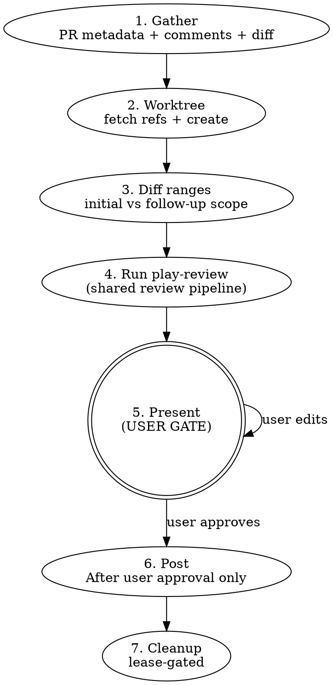

# PR Review

Multi-agent PR review with critic verification and user-gated posting.
Wrapper around `play-review` for the GitHub-PR case.

**Nothing touches GitHub without explicit user approval.** No posting
reviews, no resolving threads, no approving — until the user says go.

## Workflow



## Phase 1: Gather

Run in parallel:

- `gh pr view <N> --json title,body,baseRefName,headRefName,commits,files,reviews,comments,url`
- `gh api repos/{owner}/{repo}/pulls/<N>/comments` — inline review threads
- `gh api repos/{owner}/{repo}/pulls/<N>/reviews` — review states

<!-- Bare body intentional: responses feed Phase 4's prior_threads parsing. -->
<!-- See docs/guidelines/gh-api-hygiene.md § 3. -->

Detect mode:

- **Initial:** No prior review from the current user on this PR.
- **Follow-up:** Prior review exists. Find the last reviewed commit from the prior review's `commit_id`. Set `last_reviewed_sha` to that value.

## Phase 2: Worktree setup

```sh
git fetch origin <base-ref>
git fetch origin <head-ref>
git worktree add .worktrees/pr-<N>-review origin/<head-ref>
```

Both fetches are required: `<head-ref>` for the worktree, `<base-ref>` for `play-review`'s doc-impact summary diff. They run as separate commands so a fork-PR failure on `<head-ref>` doesn't lose the `<base-ref>` fetch.

**Fork PRs:** if `git fetch origin <head-ref>` fails or `origin/<head-ref>` doesn't exist, use `gh pr checkout <N> --detach` in a fresh worktree instead (this populates `HEAD` without needing `origin/<head-ref>`), or add the fork as a remote and re-fetch. The `<base-ref>` fetch is still required either way — `play-review`'s doc-impact diff uses the Phase 3 `origin/<base-ref>...HEAD` range, which works for both same-repo and fork PRs because `HEAD` resolves to the checked-out PR tip in either case.

Use the repo root as the base for `.worktrees/` to avoid cwd issues across bash
calls.

`working_directory` for the play-review handoff = the physical absolute path to
`.worktrees/pr-<N>-review`, for example
`WORKING_DIRECTORY="$(cd ".worktrees/pr-<N>-review" && pwd -P)"`. Manifest
validation rejects subdirectories, `.` aliases, and symlinked aliases.

Bind the lease helper after `PR_REVIEW_DIR` is known:

```bash
PR_REVIEW_LEASE_HELPER="$PR_REVIEW_DIR/scripts/review-leases.sh"
```

## Lease Lifecycle

The `pr-review/lease/v1` lease records the local lifecycle of one `pr-review`
review session. Its deterministic path is
`.ephemeral/pr-${PR_NUMBER}-${WORKTREE_DIGEST}-lease.json`, where
`WORKTREE_DIGEST` is derived by `scripts/review-leases.sh` from the physical
review worktree path. Store leases in the primary repository `.ephemeral/`
directory, outside the disposable review worktree.
Every helper command runs from the primary repository root with
`PRIMARY_REPOSITORY_ROOT` set to that same absolute physical path. `WORKTREE_PATH`
must resolve to the disposable review worktree, not the primary repository.

`review-leases.sh` owns lease path derivation, closed-schema validation,
transition enforcement, referenced-artifact validation, cleanup inspection, and
cleanup refusal mechanics. `SKILL.md` owns when to invoke the helper and when
operator confirmation is sufficient to pass cleanup override inputs.
`review-manifests.sh` owns handoff/result manifest validation.
`approved-review-artifacts.sh` and play-review own approved-review payload and
findings validation. The lease records lifecycle state only; it does not store
approval intent, review payload JSON, inline comments, findings content, or
thread-resolution decisions. The lease helper never posts to GitHub and never
constructs GitHub review payloads.

Helper command surface:

- `derive-path`
- `write`
- `validate`
- `inspect-worktree`
- `cleanup-worktree`

Fresh PR reviews with no existing worktree follow the same Phase 1 through
Phase 6 flow as before, except the lease is created and updated at the lifecycle
boundaries below.

The authoritative lifecycle contract lives in
[`references/review-lease-lifecycle-contract.md`](references/review-lease-lifecycle-contract.md).
That reference owns the valid states, transition rows, field inheritance and
clearing rules, artifact binding, terminal archive behavior, cleanup classifier
value domains, and cleanup artifact ownership rules. Keep `SKILL.md`
operator-facing; update the reference and focused tests when lease lifecycle
behavior changes. The reference names internal reducer events for auditability,
but operators invoke only the helper command surface and public environment
inputs shown here.

Operational summary: valid states are `created`, `reviewed`, `gated`, `posted`,
`aborted`, and `failed`. All other states and all transitions not listed in the
contract reference are forbidden. `UPDATED_AT` is required on every write.

Required writes:

- Write `created` after `WORKING_DIRECTORY` is resolved:

  ```bash
  LEASE_FILE=$(
    REPOSITORY="<owner/repo>" \
    PR_NUMBER="$PR_NUMBER" \
    PRIMARY_REPOSITORY_ROOT="$PRIMARY_REPOSITORY_ROOT" \
    WORKTREE_PATH="$WORKING_DIRECTORY" \
      bash "$PR_REVIEW_LEASE_HELPER" derive-path
  ) || exit 1
  REPOSITORY="<owner/repo>" \
  PR_NUMBER="$PR_NUMBER" \
  PRIMARY_REPOSITORY_ROOT="$PRIMARY_REPOSITORY_ROOT" \
  BASE_REF="$PR_BASE_REF" \
  HEAD_REF="<head-ref>" \
  WORKTREE_PATH="$WORKING_DIRECTORY" \
  LEASE_FILE="$LEASE_FILE" \
  STATE="created" \
  CREATED_AT="$(date -u "+%Y-%m-%dT%H:%M:%SZ")" \
  UPDATED_AT="$(date -u "+%Y-%m-%dT%H:%M:%SZ")" \
    bash "$PR_REVIEW_LEASE_HELPER" write || exit 1
  ```

- refresh `created` with `HANDOFF_FILE` after the Phase 3 handoff validates.
- Write `reviewed` after the initial Phase 4 result manifest validates.
- Write `gated` after each successful Phase 5 preview render, using
  `PRESENTED_AT` and `PRESENTATION_STATUS`.
- Write `aborted` immediately after the user chooses `abort`, with
  `FINISHED_AT` and `TERMINAL_REASON`, then proceed to lease-gated cleanup.
- Write `posted` only after the GitHub review post succeeds, with
  `APPROVED_REVIEW_FILE`, `FINISHED_AT`, `GITHUB_POST_ATTEMPTED=true`,
  `GITHUB_POST_RESULT=succeeded`, and `GITHUB_POSTED_AT`.
- Write `failed` before any cleanup decision when validation, preview,
  approval-freeze, stale-head, or GitHub posting fails. `failed` writes must
  include `FINISHED_AT`, `FAILURE_PHASE`, `FAILURE_REASON`, and
  `FAILURE_RECOVERABILITY`.
- Recreate a fresh active `created` lease for the same PR/worktree only through
  the helper's `STATE=created` write from a valid terminal `posted` or
  `aborted` lease. The helper archives the terminal lease before writing the
  new active lease; do not move or rewrite archived leases manually.

Resume `created`, `reviewed`, `gated`, and `failed` leases from validated lease
and manifest artifacts. Do not remove an existing review worktree during resume
discovery. If a review worktree exists, first derive the lease path from the
physical worktree path and run `review-leases.sh validate` or
`review-leases.sh inspect-worktree`; only treat it as stale after the helper
reports a cleanup outcome that permits removal. A prior Phase 5 preview is not
approval; resume must present or re-render the latest validated artifacts and
wait for fresh user action.

Use `review-leases.sh validate` whenever resuming from an existing lease before
trusting artifact paths. It validates the lease schema, immutable identity,
timestamps, and referenced artifacts. If validation fails, stop and either
record a `failed` lease when the current lease state allows it or preserve the
worktree for manual recovery; do not reconstruct state from conversation text.

## Phase 3: Determine diff ranges

`full_pr_diff_range` is **always** `"origin/<base>...HEAD"` (computed in the worktree). Used for `play-review`'s doc-impact summary regardless of mode. Keep the PR base ref name and the full-range left side distinct: `PR_BASE_REF="<base>"` is the GitHub base branch name, while `REVIEW_SCOPE_BASE_REF="origin/$PR_BASE_REF"` is the ref passed to scope-decision and approved-review validators because the canonical full range is `"$REVIEW_SCOPE_BASE_REF...HEAD"`.

Apply the shared follow-up scope policy in
`skills/play-review/references/follow-up-scope-policy.md` before invoking
`play-review`. Phase 3 owns GitHub-specific facts and final range selection.
The `pr-review` adapter
`skills/pr-review/scripts/prior-thread-artifacts.sh` preserves the wrapper
commands for prior-thread and scope-decision artifacts, then delegates
deterministic validation to the support validator
`skills/play-validate-review-artifacts/scripts/review-artifacts.sh` through
that support skill's sibling-script contract.

`active_diff_range` depends on mode:

- **Initial:** `active_diff_range = full_pr_diff_range`; `is_followup_narrow = false`.
- **Follow-up:** apply the shared follow-up scope policy and validated
  scope-decision artifact to choose narrow vs full.
  - **Narrow** (incremental): `active_diff_range = "<last_reviewed_sha>..HEAD"`; `is_followup_narrow = true`.
  - **Full** (escalate): `active_diff_range = full_pr_diff_range`; `is_followup_narrow = false`.

When classification is ambiguous, fail closed to full review. If the shared
policy or support validator escalates, keep `prior_threads` in the
`play-review` handoff so unresolved prior GitHub comments can still be verified
and carried forward.

**Unaddressed prior findings:** If a prior blocking finding was NOT addressed by the new commits (the flagged code is unchanged), `play-review`'s critic will carry it forward into the `## Carry-forward` section.

After final active range selection, compute `language_hints` from that selected
active diff only. The scope-decision artifact and adapter validation must agree
with those selected-range facts before invoking `play-review`.

Before invoking `play-review`, prepare, write, validate, and bind the canonical
Phase 3 scope-decision artifact from the target worktree. `PR_REVIEW_DIR` must
resolve to the installed `pr-review` skill bundle. The artifact's `full_range`
must be `"$REVIEW_SCOPE_BASE_REF...HEAD"`, where `REVIEW_SCOPE_BASE_REF` is the
same left side used in `full_pr_diff_range`; do not store `main...HEAD` when
Phase 3 selected `origin/main...HEAD`.

```bash
PR_REVIEW_DIR="<installed-pr-review-skill-bundle>"
PR_REVIEW_ARTIFACT_HELPER="$PR_REVIEW_DIR/scripts/prior-thread-artifacts.sh"
PR_BASE_REF="<base-ref>"
REVIEW_SCOPE_BASE_REF="origin/$PR_BASE_REF"
FULL_PR_DIFF_RANGE="$REVIEW_SCOPE_BASE_REF...HEAD"
REVIEW_CALLER_DIR="$(pwd -P)" || exit 1

bind_scope_decision_artifact() {
  cd "$WORKING_DIRECTORY" || return 1
  HEAD_SHA="$(git rev-parse HEAD)" || return 1
  SCOPE_DECISION_FILE=$(
    HEAD_SHA="$HEAD_SHA" \
      bash "$PR_REVIEW_ARTIFACT_HELPER" prepare-scope-decision-write || return 1
  ) || return 1
  # Write the pr-review/scope-decision/v1 envelope to "$SCOPE_DECISION_FILE".
  # It must record full_range="$FULL_PR_DIFF_RANGE", selected_range="$active_diff_range",
  # is_followup_narrow, language_hints, changed_files, prior_context, mechanical_facts,
  # and semantic_decision for the final Phase 3 scope choice. Phase 6 revalidates
  # the same artifact against "$REVIEW_SCOPE_BASE_REF" before posting.
  HEAD_SHA="$HEAD_SHA" \
  BASE_REF="$REVIEW_SCOPE_BASE_REF" \
  SCOPE_DECISION_FILE="$SCOPE_DECISION_FILE" \
  PRIOR_THREADS_FILE="${PRIOR_THREADS_FILE:-}" \
    bash "$PR_REVIEW_ARTIFACT_HELPER" validate-scope-decision || return 1
  REVIEW_SCOPE_DECISION_FILE="$SCOPE_DECISION_FILE"
}

SCOPE_DECISION_STATUS=0
bind_scope_decision_artifact || SCOPE_DECISION_STATUS=$?
cd "$REVIEW_CALLER_DIR" || exit 1
[ "$SCOPE_DECISION_STATUS" -eq 0 ] || exit "$SCOPE_DECISION_STATUS"
```

Pass `REVIEW_SCOPE_DECISION_FILE` and `REVIEW_SCOPE_BASE_REF` through the Phase
5 gate unchanged. Phase 6 must freeze and validate the approved review against
that exact scope-decision artifact and base-range ref.

After scope-decision validation succeeds and before Phase 4 can consume review
inputs, write and validate the Phase 3 handoff manifest with the installed
`pr-review` manifest helper. The helper owns deterministic mechanics:
direct-child `.ephemeral` path validation, temp-file writes, atomic replacement,
closed-schema validation, scope-decision authority checks, and worktree HEAD
binding. Skill prose owns when the helper runs and what later phases may infer
from the manifest.

Canonical manifest schemas:

- `pr-review/handoff/v1` records Phase 3 review execution inputs, range choice,
  immutable review head, follow-up classification, language hints, and paths to
  the validated scope-decision and optional prior-threads artifacts.
- `pr-review/result/v1` records the deterministic handoff path, validated
  review findings, optional review body and preview paths, content digests for
  mutable result inputs, the scope-decision summary, and presentation status.

Deterministic manifest paths:

- `.ephemeral/pr-${PR_NUMBER}-${REVIEW_HEAD_SHA}-handoff.json`
- `.ephemeral/pr-${PR_NUMBER}-${REVIEW_HEAD_SHA}-result.json`

Helper command surface:

- `prepare-handoff-write`
- `write-handoff`
- `validate-handoff`
- `prepare-result-write`
- `write-result`
- `validate-result`

Exact controller-facing notice lines:

```text
PR review handoff manifest written to <repo-relative-path>.
PR review result manifest written to <repo-relative-path>.
PR review result manifest updated at <repo-relative-path>.
```

Downstream consumers parse only those exact notice lines for manifest paths.
Do not reword them.

```bash
PR_REVIEW_MANIFEST_HELPER="$PR_REVIEW_DIR/scripts/review-manifests.sh"
write_pr_review_handoff_manifest() {
  cd "$WORKING_DIRECTORY" || return 1
  REVIEW_HEAD_SHA="$(git rev-parse HEAD)" || return 1
  REVIEW_HANDOFF_FILE=$(
    PR_NUMBER="$PR_NUMBER" \
    HEAD_SHA="$REVIEW_HEAD_SHA" \
    REPOSITORY="<owner/repo>" \
    EXECUTION_WORKING_DIRECTORY="$WORKING_DIRECTORY" \
    BASE_REF="$PR_BASE_REF" \
    HEAD_REF="<head-ref>" \
    REVIEW_SCOPE_BASE_REF="$REVIEW_SCOPE_BASE_REF" \
    ACTIVE_DIFF_RANGE="$active_diff_range" \
    FULL_PR_DIFF_RANGE="$FULL_PR_DIFF_RANGE" \
    MODE="github-post" \
    LANGUAGE_HINTS_JSON='<json-array>' \
    FOLLOW_UP_STATE="<initial|follow-up-full|follow-up-narrow>" \
    LAST_REVIEWED_SHA="${last_reviewed_sha:-}" \
    IS_FOLLOWUP_NARROW="$is_followup_narrow" \
    SCOPE_DECISION_FILE="$REVIEW_SCOPE_DECISION_FILE" \
    PRIOR_THREADS_FILE="${PRIOR_THREADS_FILE:-}" \
      bash "$PR_REVIEW_MANIFEST_HELPER" write-handoff || return 1
  ) || return 1
  PR_NUMBER="$PR_NUMBER" HEAD_SHA="$REVIEW_HEAD_SHA" HANDOFF_FILE="$REVIEW_HANDOFF_FILE" \
    bash "$PR_REVIEW_MANIFEST_HELPER" validate-handoff || return 1
  printf 'PR review handoff manifest written to %s.\n' "$REVIEW_HANDOFF_FILE"
}

HANDOFF_MANIFEST_STATUS=0
write_pr_review_handoff_manifest || HANDOFF_MANIFEST_STATUS=$?
cd "$REVIEW_CALLER_DIR" || exit 1
[ "$HANDOFF_MANIFEST_STATUS" -eq 0 ] || exit "$HANDOFF_MANIFEST_STATUS"
```

The helper output is the repo-relative path only. The controller-facing notice
line is emitted by this wrapper after validation succeeds. Run this as a
caller-shell function, not a subshell, so `REVIEW_HEAD_SHA` and
`REVIEW_HANDOFF_FILE` remain bound for Phase 4 and later guards.

After the handoff validates, refresh `created` with `HANDOFF_FILE` using the
same `LEASE_FILE`, `WORKTREE_PATH`, `BASE_REF`, and `HEAD_REF`. If the lease
write fails, stop before Phase 4; do not run `play-review` from an unleased
handoff.

## Phase 4: Run play-review

Start by validating and consuming the Phase 3 handoff manifest from the target
worktree root. Phase 4 must not rebuild range, scope, or prior-thread facts from
conversation text when the manifest is present. The `pr-review/handoff/v1`
closed schema is the controller-to-review handoff record, but it carries no
approval state, no lease state, and no GitHub review payload.

```bash
(
  cd "$WORKING_DIRECTORY" || exit 1
  : "${REVIEW_HANDOFF_FILE:?Phase 3 handoff manifest path missing}"
  PR_NUMBER="$PR_NUMBER" HEAD_SHA="$REVIEW_HEAD_SHA" HANDOFF_FILE="$REVIEW_HANDOFF_FILE" \
    bash "$PR_REVIEW_MANIFEST_HELPER" validate-handoff || exit 1
  CURRENT_WORKTREE_HEAD="$(git rev-parse HEAD)" || exit 1
  [ "$CURRENT_WORKTREE_HEAD" = "$REVIEW_HEAD_SHA" ] || {
    echo "review worktree HEAD changed since handoff; refusing stale review" >&2
    exit 1
  }
)
```

Hand off to `play-review` with these manifest-backed inputs:

- `working_directory` = absolute path to `.worktrees/pr-<N>-review`
- `base_ref` = the PR's base ref name (e.g., `main`)
- `active_diff_range` = computed in Phase 3
- `full_pr_diff_range` = `"origin/<base>...HEAD"` (always)
- `head_sha` = `git rev-parse HEAD` in the worktree
- `mode` = `"github-post"`
- `language_hints` = derived from the **active diff's** changed-files set (so `Code-quality` language checks and risk-triggered routing context match the selected scope; deriving from the full PR would re-run earlier-touched language context on docs-only follow-ups, defeating the narrow-mode scoping)
- `prior_threads` = parsed from the `gh api .../comments` and `.../reviews` responses (follow-up only)
- `last_reviewed_sha` = set in Phase 1 (follow-up only)
- `is_followup_narrow` = computed in Phase 3

Follow `skills/play-review/SKILL.md` end-to-end. The output is a markdown document with optional pre-findings presentation such as `## Root-Cause Synthesis`, followed by `## Findings` and (follow-up only) `## Carry-forward` sections. Immediately after `play-review` returns and before the Phase 5 user gate, capture the immutable review head and the exact findings notice path for Phase 6:

```bash
HEAD_SHA="$(git -C "$WORKING_DIRECTORY" rev-parse HEAD)"
REVIEW_HEAD_SHA="$HEAD_SHA"  # the trusted Phase 4 head_sha input passed to play-review
FINDINGS_FILE=$(printf '%s\n' "$PLAY_REVIEW_OUTPUT" | sed -n 's/^Findings written to \(.*\)\.$/\1/p' | tail -n 1)
[ -n "$FINDINGS_FILE" ] || { echo "play-review findings notice missing" >&2; exit 1; }
REVIEW_FINDINGS_FILE="$FINDINGS_FILE"
```

Then write and validate the initial result manifest before the Phase 5 preview.
This records that findings and scope-decision validation succeeded before any
user approval gate. It does not record approval intent, review event, lease
state, approved-review artifact paths, or payload JSON.

```bash
write_initial_pr_review_result_manifest() {
  cd "$WORKING_DIRECTORY" || return 1
  REVIEW_RESULT_FILE=$(
    PR_NUMBER="$PR_NUMBER" \
    HEAD_SHA="$REVIEW_HEAD_SHA" \
    REPOSITORY="<owner/repo>" \
    FINDINGS_FILE="$REVIEW_FINDINGS_FILE" \
    SCOPE_DECISION_FILE="$REVIEW_SCOPE_DECISION_FILE" \
    PRIOR_THREADS_FILE="${PRIOR_THREADS_FILE:-}" \
    PRESENTATION_STATUS="not-presented" \
      bash "$PR_REVIEW_MANIFEST_HELPER" write-result || return 1
  ) || return 1
  PR_NUMBER="$PR_NUMBER" HEAD_SHA="$REVIEW_HEAD_SHA" RESULT_FILE="$REVIEW_RESULT_FILE" \
    bash "$PR_REVIEW_MANIFEST_HELPER" validate-result || return 1
  printf 'PR review result manifest written to %s.\n' "$REVIEW_RESULT_FILE"
}

RESULT_MANIFEST_STATUS=0
write_initial_pr_review_result_manifest || RESULT_MANIFEST_STATUS=$?
cd "$REVIEW_CALLER_DIR" || exit 1
[ "$RESULT_MANIFEST_STATUS" -eq 0 ] || exit "$RESULT_MANIFEST_STATUS"
```

After the initial result manifest validates, write `reviewed` with
`RESULT_FILE="$REVIEW_RESULT_FILE"`. If this write fails, stop before Phase 5;
do not present a review result whose lease cannot be resumed.

## Phase 5: Present (USER GATE)

**STOP HERE. Present the report. Wait for user response.**

Before presenting or resuming this gate after a user-requested edit, consume the
current `pr-review/result/v1` manifest from the target worktree root. Phase 5
renders and resumes from the validated result manifest, not from ambient
conversation variables. Validate `REVIEW_RESULT_FILE` first, then extract and
rebind the manifest-backed paths and review head needed for rendering:
`REVIEW_HEAD_SHA`, `REVIEW_HANDOFF_FILE`, `REVIEW_FINDINGS_FILE`,
`REVIEW_BODY_FILE` when present, `REVIEW_SCOPE_DECISION_FILE`,
`PRIOR_THREADS_FILE` when present, and `RENDERED_PREVIEW_FILE` when present.
Then re-read the live PR head from GitHub and compare it to the rebound
`REVIEW_HEAD_SHA`. If it changed, stop and return to Phase 1; do not present,
edit, approve, or post a stale review result.

```bash
read_pr_review_result_manifest_for_preview() {
  cd "$WORKING_DIRECTORY" || return 1
  : "${REVIEW_RESULT_FILE:?Phase 5 result manifest path missing}"
  : "${REVIEW_HEAD_SHA:?Phase 5 trusted review head missing}"
  PR_NUMBER="$PR_NUMBER" \
  HEAD_SHA="$REVIEW_HEAD_SHA" \
  RESULT_FILE="$REVIEW_RESULT_FILE" \
    bash "$PR_REVIEW_MANIFEST_HELPER" validate-result >/dev/null || return 1
  RESULT_JSON=$(mktemp) || return 1
  trap 'rm -f "$RESULT_JSON"' RETURN
  cp "$REVIEW_RESULT_FILE" "$RESULT_JSON" || return 1
  REVIEW_HEAD_SHA="$(jq -r '.review_head_sha' "$RESULT_JSON")" || return 1
  REVIEW_HANDOFF_FILE="$(jq -r '.artifacts.handoff_file' "$RESULT_JSON")" || return 1
  REVIEW_FINDINGS_FILE="$(jq -r '.findings_file' "$RESULT_JSON")" || return 1
  REVIEW_BODY_FILE="$(jq -r '.review_body_file // empty' "$RESULT_JSON")" || return 1
  REVIEW_SCOPE_DECISION_FILE="$(jq -r '.artifacts.scope_decision_file' "$RESULT_JSON")" || return 1
  PRIOR_THREADS_FILE="$(jq -r '.artifacts.prior_threads_file // empty' "$RESULT_JSON")" || return 1
  RENDERED_PREVIEW_FILE="$(jq -r '.artifacts.rendered_preview_file // empty' "$RESULT_JSON")" || return 1
}

RESULT_READ_STATUS=0
read_pr_review_result_manifest_for_preview || RESULT_READ_STATUS=$?
cd "$REVIEW_CALLER_DIR" || exit 1
[ "$RESULT_READ_STATUS" -eq 0 ] || exit "$RESULT_READ_STATUS"
```

Result-manifest consumption is only for rendering or resume. It does not store
or imply approval intent, a review event, a lease, lifecycle ownership, an
approved-review artifact, or a GitHub payload. Phase 6 still requires fresh
explicit user approval for the latest preview and a separate approved-review
freeze before posting.

```sh
CURRENT_HEAD_SHA="$(gh pr view <N> --json headRefOid -q .headRefOid)"
[ "$CURRENT_HEAD_SHA" = "$REVIEW_HEAD_SHA" ] || {
  echo "PR head changed since review; refusing stale review result" >&2
  exit 1
}
```

Use the installed `play-review` helper to render the artifact-backed preview;
do not manually reshape findings. `PLAY_REVIEW_DIR` must resolve to the
installed `play-review` skill bundle, not the repository under review. Bind
`PLAY_REVIEW_HELPER="$PLAY_REVIEW_DIR/scripts/review-artifacts.sh"` and invoke
it from the target worktree root. The helper renders evidence snippets from
`REVIEW_HEAD_SHA`, not the mutable checkout.

Before the first preview, create a draft review body file as a direct child of
`.ephemeral/`. Guard the write target before every initial write or rewrite:
the path must be a direct child of `.ephemeral`, must not contain traversal,
`.ephemeral` must not be a symlink, the parent must be `.ephemeral`, and the
leaf must not be a symlink or directory. Then render the preview with
`REVIEW_SURFACE=pr-review`:

```bash
PLAY_REVIEW_DIR="<installed-play-review-skill-bundle>"
PLAY_REVIEW_HELPER="$PLAY_REVIEW_DIR/scripts/review-artifacts.sh"
REVIEW_BODY_FILE=".ephemeral/pr-${PR_NUMBER}-${REVIEW_HEAD_SHA}-review-body.md"

(
  cd "$WORKING_DIRECTORY" || exit 1
  case "$REVIEW_BODY_FILE" in .ephemeral/*/* | *..*) echo "review body path validation failed: $REVIEW_BODY_FILE" >&2; exit 1 ;; .ephemeral/*) ;; *) echo "review body path validation failed: $REVIEW_BODY_FILE" >&2; exit 1 ;; esac
  [ "$(dirname "$REVIEW_BODY_FILE")" = ".ephemeral" ] || { echo "review body parent must be .ephemeral" >&2; exit 1; }
  [ -L .ephemeral ] && { echo ".ephemeral must be a directory, not a symlink" >&2; exit 1; }
  mkdir -p .ephemeral
  [ ! -L "$REVIEW_BODY_FILE" ] || { echo "review body file must not be a symlink: $REVIEW_BODY_FILE" >&2; exit 1; }
  [ ! -d "$REVIEW_BODY_FILE" ] || { echo "review body path is a directory: $REVIEW_BODY_FILE" >&2; exit 1; }
  [ ! -e "$REVIEW_BODY_FILE" ] || [ -f "$REVIEW_BODY_FILE" ] || { echo "review body path exists but is not a regular file: $REVIEW_BODY_FILE" >&2; exit 1; }
  # Preserve markdown before the first `## Findings` heading in PLAY_REVIEW_OUTPUT.
  # The preserved block must start with the required narrative lead, then may include
  # optional presentation such as `## Root-Cause Synthesis`.
  PRE_FINDINGS_MARKDOWN=$(
    printf '%s\n' "$PLAY_REVIEW_OUTPUT" |
      awk '/^## Findings[[:space:]]*$/ { exit } { print }'
  ) || exit 1
  if [ -n "$PRE_FINDINGS_MARKDOWN" ]; then
    FIRST_PREFINDINGS_LINE=$(printf '%s\n' "$PRE_FINDINGS_MARKDOWN" | sed -n '/[^[:space:]]/{p;q;}') || exit 1
    case "$FIRST_PREFINDINGS_LINE" in "## "*) echo "pre-findings markdown must start with narrative lead before headings" >&2; exit 1 ;; esac
    printf '%s\n' "$PRE_FINDINGS_MARKDOWN" > "$REVIEW_BODY_FILE" || exit 1
  else
    REVIEW_BODY_FALLBACK="<one or two short narrative sentences naming what the implementation got right before findings>"
    case "$REVIEW_BODY_FALLBACK" in *"<"*">"*) echo "review body fallback must be replaced with concrete narrative summary" >&2; exit 1 ;; esac
    printf '%s\n' "$REVIEW_BODY_FALLBACK" > "$REVIEW_BODY_FILE" || exit 1
  fi
  HEAD_SHA="$REVIEW_HEAD_SHA" \
  FINDINGS_FILE="$REVIEW_FINDINGS_FILE" \
  REVIEW_SURFACE="pr-review" \
  REVIEW_BODY_FILE="$REVIEW_BODY_FILE" \
    bash "$PLAY_REVIEW_HELPER" render-review-preview
)
```

After each successful preview render, update and validate the result manifest
with the current review body and preview status, then emit the exact update
notice:

```bash
update_pr_review_result_manifest() {
  cd "$WORKING_DIRECTORY" || return 1
  REVIEW_RESULT_FILE=$(
    PR_NUMBER="$PR_NUMBER" \
    HEAD_SHA="$REVIEW_HEAD_SHA" \
    REPOSITORY="<owner/repo>" \
    FINDINGS_FILE="$REVIEW_FINDINGS_FILE" \
    REVIEW_BODY_FILE="$REVIEW_BODY_FILE" \
    SCOPE_DECISION_FILE="$REVIEW_SCOPE_DECISION_FILE" \
    PRIOR_THREADS_FILE="${PRIOR_THREADS_FILE:-}" \
    RENDERED_PREVIEW_FILE="${RENDERED_PREVIEW_FILE:-}" \
    PRESENTATION_STATUS="preview-current" \
      bash "$PR_REVIEW_MANIFEST_HELPER" write-result || return 1
  ) || return 1
  PR_NUMBER="$PR_NUMBER" HEAD_SHA="$REVIEW_HEAD_SHA" RESULT_FILE="$REVIEW_RESULT_FILE" \
    bash "$PR_REVIEW_MANIFEST_HELPER" validate-result || return 1
  printf 'PR review result manifest updated at %s.\n' "$REVIEW_RESULT_FILE"
}

RESULT_MANIFEST_STATUS=0
update_pr_review_result_manifest || RESULT_MANIFEST_STATUS=$?
cd "$REVIEW_CALLER_DIR" || exit 1
[ "$RESULT_MANIFEST_STATUS" -eq 0 ] || exit "$RESULT_MANIFEST_STATUS"
```

After the preview render and result-manifest update validate, write `gated` with
`RESULT_FILE="$REVIEW_RESULT_FILE"`, `PRESENTED_AT`, and
`PRESENTATION_STATUS`. If the user edits the body or findings and the preview is
re-rendered, update the same `gated` lease after the manifest update succeeds.
The lease gate is still not approval.

Present exactly that stdout to the user as the preview, plus the thread
resolution list for follow-up reviews when applicable:

```
### Previous Threads

| # | File:Line | Author | Action | Evidence |
|---|-----------|--------|--------|----------|
| 1 | entity.rs:153 | user | Resolve | Gate added at L439 |
```

The Phase 5 preview is not approval by itself. Any user-requested change returns
to this gate after the artifacts are rewritten and re-rendered. Approval intent
is captured only when the user approves a specific preview.

**Body edits:** rewrite `REVIEW_BODY_FILE`, rerun
`render-review-preview` with the same `REVIEW_HEAD_SHA`,
`REVIEW_FINDINGS_FILE`, `REVIEW_SURFACE=pr-review`, and `REVIEW_BODY_FILE`,
then update `pr-review/result/v1`, present the new stdout and result-manifest
update notice, and wait again. Run the same `REVIEW_BODY_FILE` pre-write guard
immediately before every rewrite. Do not proceed to Phase 6 until the user
approves that latest preview.

**Dropped or reclassified findings:** rewrite the
`play-review/findings/v1` envelope at `REVIEW_FINDINGS_FILE`, recomputing each
affected finding's pre-rendered `body` field after any severity or category
change. Validate the original path before reading, and immediately before
overwriting run `prepare-findings-write` for the same immutable review head and
path. Do not reuse the existing `REVIEW_BODY_FILE` after the finding set
changes: rerun the review-body write guard and rewrite the file with the
required narrative lead followed by any new pre-findings synthesis that is
supported by the edited finding set. If no synthesis remains, use the fallback
narrative body required by `docs/guidelines/code-review-guideline.md`. Never
write a review body whose first nonblank line is `## Root-Cause Synthesis`. If a
dropped or reclassified finding removes synthesis support, clear the old
synthesis before rerendering and replace it with one or two concrete narrative
sentences naming what the implementation got right before findings:

```bash
(
  cd "$WORKING_DIRECTORY" || exit 1
  HEAD_SHA="$REVIEW_HEAD_SHA" FINDINGS_FILE="$REVIEW_FINDINGS_FILE" \
    bash "$PLAY_REVIEW_HELPER" validate-findings || exit 1
  HEAD_SHA="$REVIEW_HEAD_SHA" FINDINGS_FILE="$REVIEW_FINDINGS_FILE" \
    bash "$PLAY_REVIEW_HELPER" prepare-findings-write || exit 1
  # Write the rewritten play-review/findings/v1 envelope to "$REVIEW_FINDINGS_FILE".
  case "$REVIEW_BODY_FILE" in .ephemeral/*/* | *..*) echo "review body path validation failed: $REVIEW_BODY_FILE" >&2; exit 1 ;; .ephemeral/*) ;; *) echo "review body path validation failed: $REVIEW_BODY_FILE" >&2; exit 1 ;; esac
  [ "$(dirname "$REVIEW_BODY_FILE")" = ".ephemeral" ] || { echo "review body parent must be .ephemeral" >&2; exit 1; }
  [ -L .ephemeral ] && { echo ".ephemeral must be a directory, not a symlink" >&2; exit 1; }
  mkdir -p .ephemeral
  [ ! -L "$REVIEW_BODY_FILE" ] || { echo "review body file must not be a symlink: $REVIEW_BODY_FILE" >&2; exit 1; }
  [ ! -d "$REVIEW_BODY_FILE" ] || { echo "review body path is a directory: $REVIEW_BODY_FILE" >&2; exit 1; }
  [ ! -e "$REVIEW_BODY_FILE" ] || [ -f "$REVIEW_BODY_FILE" ] || { echo "review body path exists but is not a regular file: $REVIEW_BODY_FILE" >&2; exit 1; }
  REVIEW_BODY_FALLBACK="<one or two short narrative sentences naming what the implementation got right before findings>"
  case "$REVIEW_BODY_FALLBACK" in *"<"*">"*) echo "review body fallback must be replaced with concrete narrative summary" >&2; exit 1 ;; esac
  printf '%s\n' "$REVIEW_BODY_FALLBACK" > "$REVIEW_BODY_FILE" || exit 1
  HEAD_SHA="$REVIEW_HEAD_SHA" \
  FINDINGS_FILE="$REVIEW_FINDINGS_FILE" \
  REVIEW_SURFACE="pr-review" \
  REVIEW_BODY_FILE="$REVIEW_BODY_FILE" \
    bash "$PLAY_REVIEW_HELPER" render-review-preview
)
```

Then present the re-rendered stdout and wait again. Do not rebuild a preview
from conversation text or current checkout state. After findings edits, rewrite
`pr-review/result/v1` with `PRESENTATION_STATUS="edited"` and emit
`PR review result manifest updated at <repo-relative-path>.`.

**User actions:**

| Action                               | Effect                                     |
| ------------------------------------ | ------------------------------------------ |
| `post`                               | Post review + resolve approved threads     |
| `post as comment`                    | Comment only, no verdict                   |
| `drop #N`                            | Remove finding                             |
| `change #N severity to Blocking/Nit` | Reclassify severity                        |
| `change #N category to Logic/...`    | Reclassify category                        |
| `edit`                               | Revise draft text                          |
| `skip threads`                       | Post but don't resolve                     |
| `abort`                              | Record `aborted`, then lease-gated cleanup |

## Phase 6: Post

Only after user approval:

1. **Resume from the current result separately from approval.** Re-run the
   Phase 5 result-manifest read before binding any approved review event. That
   read validates `REVIEW_RESULT_FILE`, rebinds `REVIEW_HEAD_SHA`,
   `REVIEW_HANDOFF_FILE`, `REVIEW_FINDINGS_FILE`, `REVIEW_BODY_FILE`,
   `REVIEW_SCOPE_DECISION_FILE`, and optional prior-thread or rendered-preview
   paths, then performs the live PR head guard before approval handling. The
   result manifest is evidence that the handoff, findings, body, preview, and
   scope-decision inputs were validated and digest-bound for rendering or resume;
   it is not approval, a lease, lifecycle state, an approved-review freeze, or a
   GitHub payload. If validation fails, stop before payload construction or any
   GitHub mutation. Fresh explicit user approval for the latest preview is still
   required after this read.

2. **Bind the approved review event from the user-approved intent.** Do not
   reuse an ambient or previously exported `REVIEW_EVENT`; unset it first, then
   derive it from the explicit Phase 5 approval that applies to the latest
   rendered preview. Approval intent maps to GitHub review events as follows:
   approve => `APPROVE`; request-changes or blocking review => `REQUEST_CHANGES`;
   post as comment, comment-only review, or no-verdict review => `COMMENT`.
   Any unrecognized approval intent is a contract failure; stop before payload
   construction.

   ```bash
   unset REVIEW_EVENT
   case "$APPROVED_REVIEW_INTENT" in
     approve) REVIEW_EVENT="APPROVE" ;;
     request-changes | blocking | blocking-review) REVIEW_EVENT="REQUEST_CHANGES" ;;
     post-as-comment | comment | comment-only | no-verdict) REVIEW_EVENT="COMMENT" ;;
     *) echo "unrecognized approved review intent: $APPROVED_REVIEW_INTENT" >&2; exit 1 ;;
   esac
   ```

3. **Build and freeze the approved payload artifact before posting.** Use the
   approved Phase 5 artifacts; do not rebuild findings or the review body from
   conversation text. `PR_REVIEW_DIR` must resolve to the installed
   `pr-review` skill bundle, not the repository under review. Bind
   `PR_REVIEW_HELPER="$PR_REVIEW_DIR/scripts/approved-review-artifacts.sh"`.
   First validate the findings envelope, then ask the `pr-review` helper for
   the deterministic payload path, then write exactly the JSON emitted by
   `build-github-review-payload` to that path, then freeze it. Run this as a
   caller-shell function, not a subshell, so `APPROVED_REVIEW_FILE` remains
   bound for the stale-head, validation, and posting steps below. Save and
   restore the starting directory before those later repo-root-relative steps:

   ```bash
   PR_REVIEW_DIR="<installed-pr-review-skill-bundle>"
   PR_REVIEW_HELPER="$PR_REVIEW_DIR/scripts/approved-review-artifacts.sh"
   PLAY_REVIEW_DIR="<installed-play-review-skill-bundle>"
   PLAY_REVIEW_HELPER="$PLAY_REVIEW_DIR/scripts/review-artifacts.sh"
   REVIEW_CALLER_DIR="$(pwd -P)" || exit 1
   : "${REVIEW_SCOPE_BASE_REF:?Phase 3 scope base ref missing}"
   : "${REVIEW_SCOPE_DECISION_FILE:?Phase 3 scope-decision artifact path missing}"

   build_and_freeze_approved_review() {
     cd "$WORKING_DIRECTORY" || return 1
     HEAD_SHA="$REVIEW_HEAD_SHA"  # immutable Phase 4 review head; current HEAD may differ before posting
     FINDINGS_FILE="$REVIEW_FINDINGS_FILE"
     HEAD_SHA="$HEAD_SHA" FINDINGS_FILE="$FINDINGS_FILE" \
       bash "$PLAY_REVIEW_HELPER" validate-findings || return 1
     REVIEW_PAYLOAD_FILE=$(
       HEAD_SHA="$REVIEW_HEAD_SHA" \
         bash "$PR_REVIEW_HELPER" prepare-review-payload-write || return 1
     ) || return 1
     HEAD_SHA="$REVIEW_HEAD_SHA" \
     FINDINGS_FILE="$REVIEW_FINDINGS_FILE" \
     REVIEW_SURFACE="pr-review" \
     REVIEW_BODY_FILE="$REVIEW_BODY_FILE" \
     REVIEW_EVENT="$REVIEW_EVENT" \
       bash "$PLAY_REVIEW_HELPER" build-github-review-payload > "$REVIEW_PAYLOAD_FILE" || return 1
     APPROVED_REVIEW_FILE=$(
       HEAD_SHA="$REVIEW_HEAD_SHA" \
       FINDINGS_FILE="$REVIEW_FINDINGS_FILE" \
       REVIEW_BODY_FILE="$REVIEW_BODY_FILE" \
       REVIEW_PAYLOAD_FILE="$REVIEW_PAYLOAD_FILE" \
       BASE_REF="$REVIEW_SCOPE_BASE_REF" \
       SCOPE_DECISION_FILE="$REVIEW_SCOPE_DECISION_FILE" \
         bash "$PR_REVIEW_HELPER" freeze-approved-review || return 1
     ) || return 1
     [ -n "$APPROVED_REVIEW_FILE" ] || { echo "approved review artifact path missing" >&2; return 1; }
   }

   BUILD_AND_FREEZE_STATUS=0
   build_and_freeze_approved_review || BUILD_AND_FREEZE_STATUS=$?
   cd "$REVIEW_CALLER_DIR" || exit 1
   [ "$BUILD_AND_FREEZE_STATUS" -eq 0 ] || exit "$BUILD_AND_FREEZE_STATUS"
   ```

   The frozen artifact schema is `pr-review/approved-review/v1`. It stores the
   approved `review_head_sha`, findings path, review body path, review payload
   path, Phase 3 scope-decision path, SHA-256 digests for all four source
   artifacts including the scope-decision artifact, and the exact payload
   object. The helper validates the stored scope-decision artifact and digest
   before posting. The helper ensures `commit_id`, `event`, `body`, and `comments` all land in the JSON body,
   and requires ranged inline comments to pair `start_line` with
   `start_side: "RIGHT"` while single-line comments omit both fields.
   Any nonzero helper exit is a contract failure; fail closed before posting.

4. **Refuse stale heads before posting.** Re-read the PR head SHA from GitHub
   immediately before posting. If it differs from `REVIEW_HEAD_SHA`, stop and
   return to Phase 1; do not post an approved artifact against a stale head.

   ```sh
   CURRENT_HEAD_SHA="$(gh pr view <N> --json headRefOid -q .headRefOid)"
   [ "$CURRENT_HEAD_SHA" = "$REVIEW_HEAD_SHA" ] || {
     echo "PR head changed since review; refusing to post stale approved review" >&2
     exit 1
   }
   ```

5. **Post exactly the validated approved payload.** After the stale-head guard
   passes, call `validate-approved-review` into a guarded direct-child
   `.ephemeral` payload file first. Only invoke `gh api` after validation exits
   zero. Do not call `build-github-review-payload` again after user approval.
   Do not edit, reformat, filter, or reconstruct the payload between validation
   and posting. If approved-review validation, stale-head verification, or
   GitHub posting fails after the approval freeze, write `failed` with
   `FINISHED_AT`, `FAILURE_PHASE`, `FAILURE_REASON`, and
   `FAILURE_RECOVERABILITY` before any cleanup decision. Preserve the result
   manifest, findings file, review body, rendered preview, approved-review
   artifact, and validated payload file when available. Do not retry or
   reconstruct a GitHub mutation from conversation text; retry only from a
   validating `APPROVED_REVIEW_FILE`, matching
   `REVIEW_HEAD_SHA`, and explicit user approval that still applies to the same
   preview.

   ```sh
   (
     cd "$WORKING_DIRECTORY" || exit 1
     VALIDATED_REVIEW_PAYLOAD_FILE=".ephemeral/pr-${PR_NUMBER}-${REVIEW_HEAD_SHA}-validated-review-payload.json"
     case "$VALIDATED_REVIEW_PAYLOAD_FILE" in .ephemeral/*/* | *..*) exit 1 ;; .ephemeral/*) ;; *) exit 1 ;; esac
     [ -L .ephemeral ] && { echo ".ephemeral must be a directory, not a symlink" >&2; exit 1; }
     mkdir -p .ephemeral
     [ ! -L "$VALIDATED_REVIEW_PAYLOAD_FILE" ] || { echo "validated review payload must not be a symlink" >&2; exit 1; }
     [ ! -d "$VALIDATED_REVIEW_PAYLOAD_FILE" ] || { echo "validated review payload path is a directory" >&2; exit 1; }
     [ ! -e "$VALIDATED_REVIEW_PAYLOAD_FILE" ] || [ -f "$VALIDATED_REVIEW_PAYLOAD_FILE" ] || { echo "validated review payload path exists but is not a regular file" >&2; exit 1; }
     if ! HEAD_SHA="$REVIEW_HEAD_SHA" \
       BASE_REF="$REVIEW_SCOPE_BASE_REF" \
       APPROVED_REVIEW_FILE="$APPROVED_REVIEW_FILE" \
       bash "$PR_REVIEW_HELPER" validate-approved-review > "$VALIDATED_REVIEW_PAYLOAD_FILE"; then
       rm -f "$VALIDATED_REVIEW_PAYLOAD_FILE"
       echo "approved review validation failed; refusing to invoke gh api" >&2
       exit 1
     fi
     gh api repos/{owner}/{repo}/pulls/<N>/reviews \
       --method POST \
       --silent \
       --input "$VALIDATED_REVIEW_PAYLOAD_FILE"
   )
   ```

   After the GitHub review post succeeds, write `posted` with
   `APPROVED_REVIEW_FILE`, `FINISHED_AT`, `GITHUB_POST_ATTEMPTED=true`,
   `GITHUB_POST_RESULT=succeeded`, and `GITHUB_POSTED_AT`.

6. Resolve threads via GraphQL only after the approved review post succeeds and
   only for threads the user approved for resolution:

   ```sh
   gh api graphql --silent -f query='mutation { resolveReviewThread(input: {threadId: "<id>"}) { thread { isResolved } } }'
   ```

7. Verify each API response succeeded. Report failures, stop on error.

## Phase 7: Cleanup

Never remove a review worktree directly. Use `review-leases.sh
inspect-worktree` before every cleanup decision and `review-leases.sh
cleanup-worktree` for every removal attempt. The helper owns safety mechanics
and removes worktrees only after all checks pass. It may use forced worktree
removal after accepting lease-managed `.ephemeral` residue; dirty worktrees,
unmanaged `.ephemeral` artifacts, identity mismatches, invalid lease mechanics,
non-worktree paths, and missing paths remain removal refusals or skipped
outcomes.

Inspection input:

```bash
REPOSITORY="<owner/repo>" \
PR_NUMBER="$PR_NUMBER" \
PRIMARY_REPOSITORY_ROOT="$PRIMARY_REPOSITORY_ROOT" \
WORKTREE_PATH="$WORKING_DIRECTORY" \
LEASE_FILE="$LEASE_FILE" \
  bash "$PR_REVIEW_LEASE_HELPER" inspect-worktree
```

Inspection prints fixed keys: `OUTCOME`, `CAN_REMOVE`, `REFUSAL_REASON`,
`DIRTY`, `LEASE_STATE`, `IDENTITY_MATCH`, `REQUIRES_CONFIRMATION`,
`METADATA_OUTCOME`, and `FORCE_REMOVE_ALLOWED`.

Dirty worktrees, unmanaged `.ephemeral` artifacts, identity mismatches, and
invalid lease mechanics are absolute refusals. Lease-referenced managed
artifacts may remain in terminal cleanup decisions so recovery and audit
pointers do not block their own cleanup path. Non-worktree paths and missing
physical paths are skipped outcomes, not removal permission. User confirmation
cannot override those outcomes. The helper's classifier is the single source of
cleanup truth for both inspection and removal; cleanup execution must not
reclassify or broaden the decision. Preserve any existing worktree and report
the helper's refusal message.

`created`, `reviewed`, `gated`, missing-lease cleanup, and recoverable `failed`
cleanup require explicit operator confirmation before passing
`ALLOW_POLICY_OVERRIDE=yes`. Extract `WORKTREE_DIGEST` from `LEASE_FILE`: it is
the 64-character hex segment between
`.ephemeral/pr-${PR_NUMBER}-` and `-lease.json`. Map the operator-visible
confirmation to:

```text
CONFIRM_REMOVE_TOKEN=remove-pr-review-worktree-${PR_NUMBER}-${WORKTREE_DIGEST}
```

Cleanup input:

```bash
REPOSITORY="<owner/repo>" \
PR_NUMBER="$PR_NUMBER" \
PRIMARY_REPOSITORY_ROOT="$PRIMARY_REPOSITORY_ROOT" \
WORKTREE_PATH="$WORKING_DIRECTORY" \
LEASE_FILE="$LEASE_FILE" \
ALLOW_POLICY_OVERRIDE="<yes|no>" \
CONFIRM_REMOVE_TOKEN="${CONFIRM_REMOVE_TOKEN:-}" \
  bash "$PR_REVIEW_LEASE_HELPER" cleanup-worktree
```

Cleanup prints fixed keys: `OUTCOME` and `MESSAGE`. Treat `removed`,
`retained`, and `skipped` as completed cleanup outcomes. It also prints the
same classifier keys as inspection: `CAN_REMOVE`, `REFUSAL_REASON`, `DIRTY`,
`LEASE_STATE`, `IDENTITY_MATCH`, `REQUIRES_CONFIRMATION`,
`METADATA_OUTCOME`, and `FORCE_REMOVE_ALLOWED`. Treat `failed` or a nonzero
exit as a cleanup failure and report the lease path, worktree path, classifier
fields, and message for manual recovery. Do not run a broad `.ephemeral` sweep.

## GitHub API Reference

For the `gh api` flag conventions used here, see [docs/guidelines/gh-api-hygiene.md](../../docs/guidelines/gh-api-hygiene.md).

**Posting boundary reference:** the only review-creation path in this skill is
Phase 6's explicitly user-approved artifact flow: after approval,
`prepare-review-payload-write`, `build-github-review-payload`,
`freeze-approved-review`, stale-head refusal, `validate-approved-review` into the
guarded `VALIDATED_REVIEW_PAYLOAD_FILE`, and then `gh api --input
"$VALIDATED_REVIEW_PAYLOAD_FILE"`. Do not manually construct a `jq` payload
here, do not fetch `commit_id` from live `gh pr view` for posting, and do not
call `gh api` until the approved artifact has validated successfully.

The sealed payload uses `line` (absolute file line in HEAD), not `position`
(diff offset). `side` is `"RIGHT"` for PR head lines.

**Reply to inline comment** (use the correct endpoint):

```sh
gh api repos/{owner}/{repo}/pulls/<N>/comments/<comment-id>/replies --jq '.id' -f body="<text>"
```

Verify the response includes the new comment ID. Do not assume success.

**Fetch thread IDs for resolution:**

```sh
# Bare body intentional: response is consumed for content-keyed thread-ID lookup
# (resolveReviewThread mutation at the snippet above). See docs/guidelines/gh-api-hygiene.md § 3.
gh api graphql -f query='{ repository(owner: "O", name: "R") {
  pullRequest(number: N) { reviewThreads(first: 50) { nodes {
    id isResolved comments(first: 5) { nodes { body author { login } path originalLine } }
} } } } }'
```

## Hard Rules

1. **NEVER post, approve, or resolve without user approval at the Phase 5 gate.**
2. **NEVER auto-approve.** Present the verdict recommendation; user decides.
3. **Never remove a review worktree directly; use the lease helper cleanup contract.**
4. **Verify every GitHub API response.** Report non-2xx failures.
5. **Never approve your own code.** If PR author = git user, warn and refuse approval.
6. **Always preserve `play-review`'s evidence code** (3-7 lines) when reformatting findings for the user gate.

## Red Flags — You Are Violating This Skill

- You called `gh pr review` or `resolveReviewThread` before presenting findings to the user
- You posted a review "since it looked clean" without the gate
- You skipped delegating to `play-review` and tried to spawn agents yourself
- You showed findings as a table with file:line but no code snippets
- You resolved threads "since they were obviously addressed"
- You posted all findings in the review body instead of as inline comments on specific lines
- You used `gh pr review --body` with findings instead of the reviews API with `comments` array
- You posted `Anchor: out-of-diff` findings as inline comments with fabricated line numbers — they belong in the review body

**All of these mean: STOP. You skipped the user gate or a required step. Go back.**

## Error Handling

| Scenario                              | Action                                                                          |
| ------------------------------------- | ------------------------------------------------------------------------------- |
| `gh` not authenticated                | Fail, suggest `gh auth login`                                                   |
| PR not found                          | Fail, verify number/URL                                                         |
| PR already merged/closed              | Warn user of state, ask whether to proceed                                      |
| Fork PR (head ref not on origin)      | Use `gh pr checkout <N> --detach` or add fork remote                            |
| Worktree exists                       | Inspect lease; resume valid leases or use lease-gated cleanup before recreating |
| `play-review` reports a missing input | Stop; this means the wrapper has a bug                                          |
| API returns non-2xx                   | Report failure, stop                                                            |
| Worktree cleanup fails                | Report lease path, worktree path, and helper message                            |

## Integration

**Calls:**

- `play-review` — shared review pipeline (this skill is a wrapper)

**Complements:**

- `branch-review` — for reviewing local diffs without a GitHub PR
- `play-review-response` — guidance for responding to review feedback
