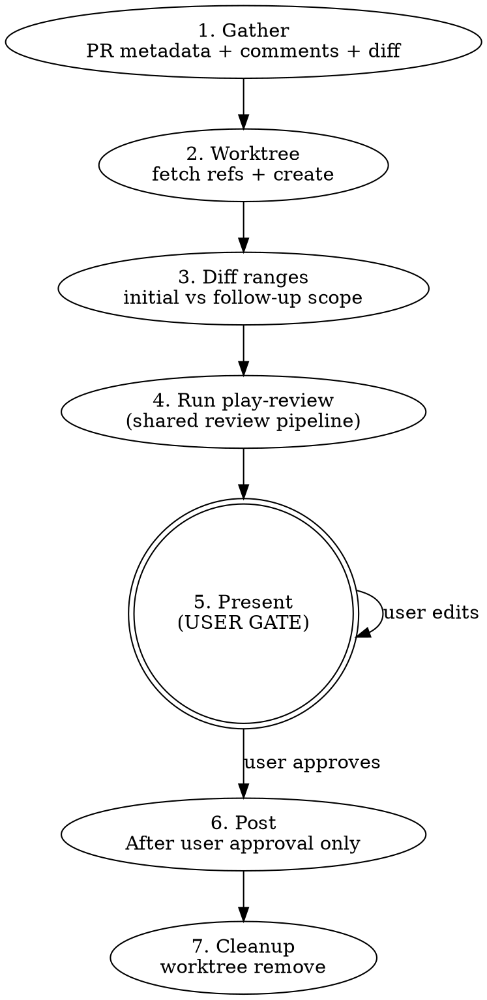

# PR Review

Multi-agent PR review with critic verification and user-gated posting.
Wrapper around `play-review` for the GitHub-PR case.

**Nothing touches GitHub without explicit user approval.** No posting
reviews, no resolving threads, no approving — until the user says go.

## Workflow



## Phase 1: Gather

Run in parallel:

- `gh pr view <N> --json title,body,baseRefName,headRefName,commits,files,reviews,comments,url`
- `gh api repos/{owner}/{repo}/pulls/<N>/comments` — inline review threads
- `gh api repos/{owner}/{repo}/pulls/<N>/reviews` — review states

<!-- Bare body intentional: responses feed Phase 4's prior_threads parsing. -->
<!-- See docs/guidelines/gh-api-hygiene.md § 3. -->

Detect mode:

- **Initial:** No prior review from the current user on this PR.
- **Follow-up:** Prior review exists. Find the last reviewed commit from the prior review's `commit_id`. Set `last_reviewed_sha` to that value.

## Phase 2: Worktree setup

```sh
git fetch origin <base-ref>
git fetch origin <head-ref>
git worktree add .worktrees/pr-<N>-review origin/<head-ref>
```

Both fetches are required: `<head-ref>` for the worktree, `<base-ref>` for `play-review`'s doc-impact summary diff. They run as separate commands so a fork-PR failure on `<head-ref>` doesn't lose the `<base-ref>` fetch.

**Fork PRs:** if `git fetch origin <head-ref>` fails or `origin/<head-ref>` doesn't exist, use `gh pr checkout <N> --detach` in a fresh worktree instead (this populates `HEAD` without needing `origin/<head-ref>`), or add the fork as a remote and re-fetch. The `<base-ref>` fetch is still required either way — `play-review`'s doc-impact diff uses `origin/$BASE_REF...HEAD`, which works for both same-repo and fork PRs because `HEAD` resolves to the checked-out PR tip in either case.

Use the repo root as the base for `.worktrees/` to avoid cwd issues across bash calls.

`working_directory` for the play-review handoff = the absolute path to `.worktrees/pr-<N>-review`.

## Phase 3: Determine diff ranges

`full_pr_diff_range` is **always** `"origin/<base>...HEAD"` (computed in the worktree). Used for `play-review`'s doc-impact summary regardless of mode.

Apply the shared follow-up scope policy in
`skills/play-review/references/follow-up-scope-policy.md` before invoking
`play-review`. Phase 3 owns GitHub-specific facts and final range selection;
the shared policy owns full-vs-narrow escalation criteria.

`active_diff_range` depends on mode:

- **Initial:** `active_diff_range = full_pr_diff_range`; `is_followup_narrow = false`.
- **Follow-up:** apply the shared follow-up scope policy to choose narrow vs full.
  - **Narrow** (incremental): `active_diff_range = "<last_reviewed_sha>..HEAD"`; `is_followup_narrow = true`.
  - **Full** (escalate): `active_diff_range = full_pr_diff_range`; `is_followup_narrow = false`.

When classification is ambiguous, fail closed to full review. If the policy
escalates, keep `prior_threads` in the `play-review` handoff so unresolved prior
GitHub comments can still be verified and carried forward.

**Unaddressed prior findings:** If a prior blocking finding was NOT addressed by the new commits (the flagged code is unchanged), `play-review`'s critic will carry it forward into the `## Carry-forward` section.

After final active range selection, compute `language_hints` from that selected
active diff only. Narrow follow-ups use the incremental changed-files set; full
escalations recompute from the full PR diff.

## Phase 4: Run play-review

Hand off to `play-review` with these inputs:

- `working_directory` = absolute path to `.worktrees/pr-<N>-review`
- `base_ref` = the PR's base ref name (e.g., `main`)
- `active_diff_range` = computed in Phase 3
- `full_pr_diff_range` = `"origin/<base>...HEAD"` (always)
- `head_sha` = `git rev-parse HEAD` in the worktree
- `mode` = `"github-post"`
- `language_hints` = derived from the **active diff's** changed-files set (so follow-up narrow mode only spawns language agents matching the incremental diff; deriving from the full PR would re-run earlier-touched language agents on docs-only follow-ups, defeating the narrow-mode scoping)
- `prior_threads` = parsed from the `gh api .../comments` and `.../reviews` responses (follow-up only)
- `last_reviewed_sha` = set in Phase 1 (follow-up only)
- `is_followup_narrow` = computed in Phase 3

Follow `skills/play-review/SKILL.md` end-to-end. The output is a markdown document with `## Findings` and (follow-up only) `## Carry-forward` sections. Immediately after `play-review` returns and before the Phase 5 user gate, capture the immutable review head and the exact findings notice path for Phase 6:

```bash
HEAD_SHA="$(git -C "$WORKING_DIRECTORY" rev-parse HEAD)"
REVIEW_HEAD_SHA="$HEAD_SHA"  # the trusted Phase 4 head_sha input passed to play-review
FINDINGS_FILE=$(printf '%s\n' "$PLAY_REVIEW_OUTPUT" | sed -n 's/^Findings written to \(.*\)\.$/\1/p' | tail -n 1)
[ -n "$FINDINGS_FILE" ] || { echo "play-review findings notice missing" >&2; exit 1; }
REVIEW_FINDINGS_FILE="$FINDINGS_FILE"
```

## Phase 5: Present (USER GATE)

**STOP HERE. Present the report. Wait for user response.**

Use the installed `play-review` helper to render the artifact-backed preview;
do not manually reshape findings. `PLAY_REVIEW_DIR` must resolve to the
installed `play-review` skill bundle, not the repository under review. Bind
`PLAY_REVIEW_HELPER="$PLAY_REVIEW_DIR/scripts/review-artifacts.sh"` and invoke
it from the target worktree root. The helper renders evidence snippets from
`REVIEW_HEAD_SHA`, not the mutable checkout.

Before the first preview, create a draft review body file as a direct child of
`.ephemeral/`. Guard the write target before every initial write or rewrite:
the path must be a direct child of `.ephemeral`, must not contain traversal,
`.ephemeral` must not be a symlink, the parent must be `.ephemeral`, and the
leaf must not be a symlink or directory. Then render the preview with
`REVIEW_SURFACE=pr-review`:

```bash
PLAY_REVIEW_DIR="<installed-play-review-skill-bundle>"
PLAY_REVIEW_HELPER="$PLAY_REVIEW_DIR/scripts/review-artifacts.sh"
REVIEW_BODY_FILE=".ephemeral/pr-${PR_NUMBER}-${REVIEW_HEAD_SHA}-review-body.md"

(
  cd "$WORKING_DIRECTORY" || exit 1
  case "$REVIEW_BODY_FILE" in .ephemeral/*/* | *..*) echo "review body path validation failed: $REVIEW_BODY_FILE" >&2; exit 1 ;; .ephemeral/*) ;; *) echo "review body path validation failed: $REVIEW_BODY_FILE" >&2; exit 1 ;; esac
  [ "$(dirname "$REVIEW_BODY_FILE")" = ".ephemeral" ] || { echo "review body parent must be .ephemeral" >&2; exit 1; }
  [ -L .ephemeral ] && { echo ".ephemeral must be a directory, not a symlink" >&2; exit 1; }
  mkdir -p .ephemeral
  [ ! -L "$REVIEW_BODY_FILE" ] || { echo "review body file must not be a symlink: $REVIEW_BODY_FILE" >&2; exit 1; }
  [ ! -d "$REVIEW_BODY_FILE" ] || { echo "review body path is a directory: $REVIEW_BODY_FILE" >&2; exit 1; }
  [ ! -e "$REVIEW_BODY_FILE" ] || [ -f "$REVIEW_BODY_FILE" ] || { echo "review body path exists but is not a regular file: $REVIEW_BODY_FILE" >&2; exit 1; }
  # Write the draft top-level review summary to "$REVIEW_BODY_FILE".
  HEAD_SHA="$REVIEW_HEAD_SHA" \
  FINDINGS_FILE="$REVIEW_FINDINGS_FILE" \
  REVIEW_SURFACE="pr-review" \
  REVIEW_BODY_FILE="$REVIEW_BODY_FILE" \
    bash "$PLAY_REVIEW_HELPER" render-review-preview
)
```

Present exactly that stdout to the user as the preview, plus the thread
resolution list for follow-up reviews when applicable:

```
### Previous Threads

| # | File:Line | Author | Action | Evidence |
|---|-----------|--------|--------|----------|
| 1 | entity.rs:153 | user | Resolve | Gate added at L439 |
```

The Phase 5 preview is not approval by itself. Any user-requested change returns
to this gate after the artifacts are rewritten and re-rendered. Approval intent
is captured only when the user approves a specific preview.

**Body edits:** rewrite `REVIEW_BODY_FILE`, rerun
`render-review-preview` with the same `REVIEW_HEAD_SHA`,
`REVIEW_FINDINGS_FILE`, `REVIEW_SURFACE=pr-review`, and `REVIEW_BODY_FILE`,
then present the new stdout and wait again. Run the same `REVIEW_BODY_FILE`
pre-write guard immediately before every rewrite. Do not proceed to Phase 6
until the user approves that latest preview.

**Dropped or reclassified findings:** rewrite the
`play-review/findings/v1` envelope at `REVIEW_FINDINGS_FILE`, recomputing each
affected finding's pre-rendered `body` field after any severity or category
change. Validate the original path before reading, and immediately before
overwriting run `prepare-findings-write` for the same immutable review head and
path:

```bash
(
  cd "$WORKING_DIRECTORY" || exit 1
  HEAD_SHA="$REVIEW_HEAD_SHA" FINDINGS_FILE="$REVIEW_FINDINGS_FILE" \
    bash "$PLAY_REVIEW_HELPER" validate-findings || exit 1
  HEAD_SHA="$REVIEW_HEAD_SHA" FINDINGS_FILE="$REVIEW_FINDINGS_FILE" \
    bash "$PLAY_REVIEW_HELPER" prepare-findings-write || exit 1
  # Write the rewritten play-review/findings/v1 envelope to "$REVIEW_FINDINGS_FILE".
  HEAD_SHA="$REVIEW_HEAD_SHA" \
  FINDINGS_FILE="$REVIEW_FINDINGS_FILE" \
  REVIEW_SURFACE="pr-review" \
  REVIEW_BODY_FILE="$REVIEW_BODY_FILE" \
    bash "$PLAY_REVIEW_HELPER" render-review-preview
)
```

Then present the re-rendered stdout and wait again. Do not rebuild a preview
from conversation text or current checkout state.

**User actions:**

| Action                               | Effect                                 |
| ------------------------------------ | -------------------------------------- |
| `post`                               | Post review + resolve approved threads |
| `post as comment`                    | Comment only, no verdict               |
| `drop #N`                            | Remove finding                         |
| `change #N severity to Blocking/Nit` | Reclassify severity                    |
| `change #N category to Logic/...`    | Reclassify category                    |
| `edit`                               | Revise draft text                      |
| `skip threads`                       | Post but don't resolve                 |
| `abort`                              | Discard all, clean up                  |

## Phase 6: Post

Only after user approval:

1. **Bind the approved review event from the user-approved intent.** Do not
   reuse an ambient or previously exported `REVIEW_EVENT`; unset it first, then
   derive it from the explicit Phase 5 approval that applies to the latest
   rendered preview. Approval intent maps to GitHub review events as follows:
   approve => `APPROVE`; request-changes or blocking review => `REQUEST_CHANGES`;
   post as comment, comment-only review, or no-verdict review => `COMMENT`.
   Any unrecognized approval intent is a contract failure; stop before payload
   construction.

   ```bash
   unset REVIEW_EVENT
   case "$APPROVED_REVIEW_INTENT" in
     approve) REVIEW_EVENT="APPROVE" ;;
     request-changes | blocking | blocking-review) REVIEW_EVENT="REQUEST_CHANGES" ;;
     post-as-comment | comment | comment-only | no-verdict) REVIEW_EVENT="COMMENT" ;;
     *) echo "unrecognized approved review intent: $APPROVED_REVIEW_INTENT" >&2; exit 1 ;;
   esac
   ```

2. **Build and freeze the approved payload artifact before posting.** Use the
   approved Phase 5 artifacts; do not rebuild findings or the review body from
   conversation text. `PR_REVIEW_DIR` must resolve to the installed
   `pr-review` skill bundle, not the repository under review. Bind
   `PR_REVIEW_HELPER="$PR_REVIEW_DIR/scripts/approved-review-artifacts.sh"`.
   First validate the findings envelope, then ask the `pr-review` helper for
   the deterministic payload path, then write exactly the JSON emitted by
   `build-github-review-payload` to that path, then freeze it. Run this as a
   caller-shell function, not a subshell, so `APPROVED_REVIEW_FILE` remains
   bound for the stale-head, validation, and posting steps below. Save and
   restore the starting directory before those later repo-root-relative steps:

   ```bash
   PR_REVIEW_DIR="<installed-pr-review-skill-bundle>"
   PR_REVIEW_HELPER="$PR_REVIEW_DIR/scripts/approved-review-artifacts.sh"
   PLAY_REVIEW_DIR="<installed-play-review-skill-bundle>"
   PLAY_REVIEW_HELPER="$PLAY_REVIEW_DIR/scripts/review-artifacts.sh"
   REVIEW_CALLER_DIR="$(pwd -P)" || exit 1

   build_and_freeze_approved_review() {
     cd "$WORKING_DIRECTORY" || return 1
     HEAD_SHA="$REVIEW_HEAD_SHA"  # immutable Phase 4 review head; current HEAD may differ before posting
     FINDINGS_FILE="$REVIEW_FINDINGS_FILE"
     HEAD_SHA="$HEAD_SHA" FINDINGS_FILE="$FINDINGS_FILE" \
       bash "$PLAY_REVIEW_HELPER" validate-findings || return 1
     REVIEW_PAYLOAD_FILE=$(
       HEAD_SHA="$REVIEW_HEAD_SHA" \
         bash "$PR_REVIEW_HELPER" prepare-review-payload-write || return 1
     ) || return 1
     HEAD_SHA="$REVIEW_HEAD_SHA" \
     FINDINGS_FILE="$REVIEW_FINDINGS_FILE" \
     REVIEW_SURFACE="pr-review" \
     REVIEW_BODY_FILE="$REVIEW_BODY_FILE" \
     REVIEW_EVENT="$REVIEW_EVENT" \
       bash "$PLAY_REVIEW_HELPER" build-github-review-payload > "$REVIEW_PAYLOAD_FILE" || return 1
     APPROVED_REVIEW_FILE=$(
       HEAD_SHA="$REVIEW_HEAD_SHA" \
       FINDINGS_FILE="$REVIEW_FINDINGS_FILE" \
       REVIEW_BODY_FILE="$REVIEW_BODY_FILE" \
       REVIEW_PAYLOAD_FILE="$REVIEW_PAYLOAD_FILE" \
         bash "$PR_REVIEW_HELPER" freeze-approved-review || return 1
     ) || return 1
     [ -n "$APPROVED_REVIEW_FILE" ] || { echo "approved review artifact path missing" >&2; return 1; }
   }

   BUILD_AND_FREEZE_STATUS=0
   build_and_freeze_approved_review || BUILD_AND_FREEZE_STATUS=$?
   cd "$REVIEW_CALLER_DIR" || exit 1
   [ "$BUILD_AND_FREEZE_STATUS" -eq 0 ] || exit "$BUILD_AND_FREEZE_STATUS"
   ```

   The frozen artifact schema is `pr-review/approved-review/v1`. It stores the
   approved `review_head_sha`, findings path, review body path, review payload
   path, SHA-256 digests for all three source artifacts, and the exact payload
   object. The helper ensures `commit_id`, `event`, `body`, and `comments` all land in the JSON body.
   Any nonzero helper exit is a contract failure; fail closed before posting.

3. **Refuse stale heads before posting.** Re-read the PR head SHA from GitHub
   immediately before posting. If it differs from `REVIEW_HEAD_SHA`, stop and
   return to Phase 1; do not post an approved artifact against a stale head.

   ```sh
   CURRENT_HEAD_SHA="$(gh pr view <N> --json headRefOid -q .headRefOid)"
   [ "$CURRENT_HEAD_SHA" = "$REVIEW_HEAD_SHA" ] || {
     echo "PR head changed since review; refusing to post stale approved review" >&2
     exit 1
   }
   ```

4. **Post exactly the validated approved payload.** After the stale-head guard
   passes, call `validate-approved-review` into a guarded direct-child
   `.ephemeral` payload file first. Only invoke `gh api` after validation exits
   zero. Do not call `build-github-review-payload` again after user approval.
   Do not edit, reformat, filter, or reconstruct the payload between validation
   and posting.

   ```sh
   (
     cd "$WORKING_DIRECTORY" || exit 1
     VALIDATED_REVIEW_PAYLOAD_FILE=".ephemeral/pr-${PR_NUMBER}-${REVIEW_HEAD_SHA}-validated-review-payload.json"
     case "$VALIDATED_REVIEW_PAYLOAD_FILE" in .ephemeral/*/* | *..*) exit 1 ;; .ephemeral/*) ;; *) exit 1 ;; esac
     [ -L .ephemeral ] && { echo ".ephemeral must be a directory, not a symlink" >&2; exit 1; }
     mkdir -p .ephemeral
     [ ! -L "$VALIDATED_REVIEW_PAYLOAD_FILE" ] || { echo "validated review payload must not be a symlink" >&2; exit 1; }
     [ ! -d "$VALIDATED_REVIEW_PAYLOAD_FILE" ] || { echo "validated review payload path is a directory" >&2; exit 1; }
     [ ! -e "$VALIDATED_REVIEW_PAYLOAD_FILE" ] || [ -f "$VALIDATED_REVIEW_PAYLOAD_FILE" ] || { echo "validated review payload path exists but is not a regular file" >&2; exit 1; }
     if ! HEAD_SHA="$REVIEW_HEAD_SHA" \
       APPROVED_REVIEW_FILE="$APPROVED_REVIEW_FILE" \
       bash "$PR_REVIEW_HELPER" validate-approved-review > "$VALIDATED_REVIEW_PAYLOAD_FILE"; then
       rm -f "$VALIDATED_REVIEW_PAYLOAD_FILE"
       echo "approved review validation failed; refusing to invoke gh api" >&2
       exit 1
     fi
     gh api repos/{owner}/{repo}/pulls/<N>/reviews \
       --method POST \
       --silent \
       --input "$VALIDATED_REVIEW_PAYLOAD_FILE"
   )
   ```

5. Resolve threads via GraphQL only after the approved review post succeeds and
   only for threads the user approved for resolution:

   ```sh
   gh api graphql --silent -f query='mutation { resolveReviewThread(input: {threadId: "<id>"}) { thread { isResolved } } }'
   ```

6. Verify each API response succeeded. Report failures, stop on error.

## Phase 7: Cleanup

**Always** (success or abort): `git worktree remove .worktrees/pr-<N>-review`

## GitHub API Reference

For the `gh api` flag conventions used here, see [docs/guidelines/gh-api-hygiene.md](../../docs/guidelines/gh-api-hygiene.md).

**Posting boundary reference:** the only review-creation path in this skill is
Phase 6's explicitly user-approved artifact flow: after approval,
`prepare-review-payload-write`, `build-github-review-payload`,
`freeze-approved-review`, stale-head refusal, `validate-approved-review` into the
guarded `VALIDATED_REVIEW_PAYLOAD_FILE`, and then `gh api --input
"$VALIDATED_REVIEW_PAYLOAD_FILE"`. Do not manually construct a `jq` payload
here, do not fetch `commit_id` from live `gh pr view` for posting, and do not
call `gh api` until the approved artifact has validated successfully.

The sealed payload uses `line` (absolute file line in HEAD), not `position`
(diff offset). `side` is `"RIGHT"` for PR head lines.

**Reply to inline comment** (use the correct endpoint):

```sh
gh api repos/{owner}/{repo}/pulls/<N>/comments/<comment-id>/replies --jq '.id' -f body="<text>"
```

Verify the response includes the new comment ID. Do not assume success.

**Fetch thread IDs for resolution:**

```sh
# Bare body intentional: response is consumed for content-keyed thread-ID lookup
# (resolveReviewThread mutation at the snippet above). See docs/guidelines/gh-api-hygiene.md § 3.
gh api graphql -f query='{ repository(owner: "O", name: "R") {
  pullRequest(number: N) { reviewThreads(first: 50) { nodes {
    id isResolved comments(first: 5) { nodes { body author { login } path originalLine } }
} } } } }'
```

## Hard Rules

1. **NEVER post, approve, or resolve without user approval at the Phase 5 gate.**
2. **NEVER auto-approve.** Present the verdict recommendation; user decides.
3. **Always clean up the worktree** (Phase 7) after post or abort.
4. **Verify every GitHub API response.** Report non-2xx failures.
5. **Never approve your own code.** If PR author = git user, warn and refuse approval.
6. **Always preserve `play-review`'s evidence code** (3-7 lines) when reformatting findings for the user gate.

## Red Flags — You Are Violating This Skill

- You called `gh pr review` or `resolveReviewThread` before presenting findings to the user
- You posted a review "since it looked clean" without the gate
- You skipped delegating to `play-review` and tried to spawn agents yourself
- You showed findings as a table with file:line but no code snippets
- You resolved threads "since they were obviously addressed"
- You posted all findings in the review body instead of as inline comments on specific lines
- You used `gh pr review --body` with findings instead of the reviews API with `comments` array
- You posted `Anchor: out-of-diff` findings as inline comments with fabricated line numbers — they belong in the review body

**All of these mean: STOP. You skipped the user gate or a required step. Go back.**

## Error Handling

| Scenario                              | Action                                               |
| ------------------------------------- | ---------------------------------------------------- |
| `gh` not authenticated                | Fail, suggest `gh auth login`                        |
| PR not found                          | Fail, verify number/URL                              |
| PR already merged/closed              | Warn user of state, ask whether to proceed           |
| Fork PR (head ref not on origin)      | Use `gh pr checkout <N> --detach` or add fork remote |
| Worktree exists                       | Remove stale, recreate                               |
| `play-review` reports a missing input | Stop; this means the wrapper has a bug               |
| API returns non-2xx                   | Report failure, stop                                 |
| Worktree cleanup fails                | Warn user, suggest manual `git worktree remove`      |

## Integration

**Calls:**

- `play-review` — shared review pipeline (this skill is a wrapper)

**Complements:**

- `branch-review` — for reviewing local diffs without a GitHub PR
- `play-review-response` — guidance for responding to review feedback
