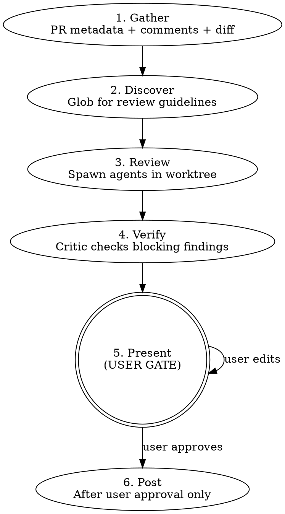

# PR Review

Multi-agent PR review with critic verification and user-gated posting.

**Nothing touches GitHub without explicit user approval.** No posting reviews, no resolving threads, no approving — until the user says go.

## Workflow



### Phase 1: Gather

Run in parallel:

- `gh pr view <N> --json title,body,baseRefName,headRefName,commits,files,reviews,comments,url`
- `gh api repos/{owner}/{repo}/pulls/<N>/comments` — inline review threads
- `gh api repos/{owner}/{repo}/pulls/<N>/reviews` — review states

Detect mode:

- **Initial:** No prior review from current user on this PR.
- **Follow-up:** Prior review exists. Find last reviewed commit from review's `commit_id`.

### Phase 2: Discover

Search the repository for review guidelines — read them, don't just list paths:

- `**/code-review*.md`, `**/review-*.md` — review checklists
- `**/error-handling*.md` — error discipline
- `AGENTS.md`, `CONTRIBUTING.md` — project conventions

No guidelines found? Proceed with agents' built-in knowledge, note it in the report.

### Phase 3: Review

**Worktree — always detached HEAD, from repo root:**

```sh
git fetch origin <head-ref>
git worktree add .worktrees/pr-<N>-review origin/<head-ref>
```

If the PR is from a fork and `origin/<head-ref>` doesn't exist, use `gh pr checkout <N> --detach` in a worktree instead, or add the fork remote first.

Use the repo root as the base for `.worktrees/` to avoid cwd issues across bash calls.

**Core agents (always spawned):**

| Agent       | Focus                                                                                                                          |
| ----------- | ------------------------------------------------------------------------------------------------------------------------------ |
| Correctness | Logic bugs, panic discipline, error propagation, API contracts, external-invocation audit (substitution + documented behavior) |
| Data-safety | Secrets/credentials, injection (path traversal, SQL, XSS, command), PII in logs/errors, untrusted input                        |

**Dynamic agents (by file types in diff):**

| Trigger                | Agent                                           |
| ---------------------- | ----------------------------------------------- |
| `*.rs`                 | Rust — clippy, unsafe, ECS, serde, WASM         |
| `*.ts` / `*.tsx`       | TypeScript — types, React patterns, bridge sync |
| `tests/` or `*_test.*` | Test — coverage, correctness, fixtures          |
| `docs/` or `*.md`      | Docs — accuracy, staleness, contract alignment  |

**Agent briefing — each prompt MUST include:**

1. Role — one sentence
2. PR context — title, summary, changed files with +/- counts
3. Diff — full or incremental (see follow-up rules)
4. Discovered guidelines — actual content, not file paths
5. Prior review context (follow-up only) — threads, author replies
6. Output format — file path (repo-relative), line number (in HEAD), severity (`Blocking` or `Nit`), category (`Logic`, `Safety`, `Architecture`, `Tests`, `Maintainability`, `Documentation`, or `Contracts`), code reference, recommendation

Compose PR-specific prompts referencing actual files and line counts. Generic prompts like "review this PR" are prohibited.

Run all agents in parallel.

**Model selection:** Use `{{model:deep}}` for all review agents and the critic. PR review is the final quality gate — the cost of missing a real bug far outweighs the cost of a more capable model.

**Correctness agent external-invocation audit:**

The Correctness agent must perform two structured sub-checks in addition to its existing logic-bug / panic-discipline / error-propagation / API-contract review. Both fire only when the diff contains an external CLI / REST / system primitive invocation.

**Sub-check 1 — Substitution audit.** Fires when the diff replaces one external invocation token with a sibling at the same call site (e.g., `git branch -d` → `git branch -D`, `fs.writeFileSync` → `fs.writeFile`, `gh pr review --body ...` → `gh api .../reviews --input ...`). "External invocation" means a CLI flag/subcommand swap, a method swap on an external SDK, a system primitive swap (`unlink` ↔ `rm -rf`), or a flag-set rearrangement on the same call.

Procedure:

1. Identify the replaced primitive (old → new), citing the diff hunk.
2. Enumerate every safety property, precondition check, or rejection mode the OLD primitive enforced. Pull from the tool's documented behavior (`--help` / official docs) when the property isn't obvious from the name alone.
3. For each property, classify what the NEW code does: PRESERVES (same property holds), GUARDS (replaces with an equivalent runtime check), or SILENTLY DROPS (no equivalent guard, no waiver).
4. A SILENTLY DROPS finding is `Blocking`, category `Safety`, unless the diff or surrounding spec explicitly waives the property with a rationale.

**Bounding rule:** apply only to _external_ invocations (CLIs, REST/HTTP APIs, OS primitives, third-party SDK calls). Do not apply to internal-code refactors (calling site changes from one repo function to another), to literal renames, or to mechanical formatting changes. The agent should self-check: "is the named primitive defined inside this repo, or by a tool whose semantics live elsewhere?"

**Disposition:** judgment-required. The fix for a lost safety property is a guard, which is design work — multiple reconstructions are usually possible. Findings surface as `Blocking`, category `Safety` — in `branch-review --fix`, they hit the Phase 5 stop rule for blocking design changes (do not auto-fix); in `pr-review`, they surface in the Phase 5 user-gate report.

Worked example (real, PR #117): a diff replaces `git branch -d` with `git branch -D` to silence a spurious squash-merge warning. The OLD primitive's safety properties include rejecting deletion when the branch has unmerged commits relative to its upstream and HEAD. The NEW primitive (`-D`) accepts unconditionally, and the diff adds no surrounding guard. Verdict: SILENTLY DROPS the unmerged-commit rejection — `Blocking | Safety`, with the recommendation to add a tip-equality check (local tip == PR head OID) before `-D` runs. (PR #117 landed exactly that fix after Copilot's inline review caught the regression.)

**Sub-check 2 — Documented-behavior verification.** Fires when the diff adds a new external invocation, or modifies an existing one's flags / body shape / query parameters. Substitutions (Sub-check 1's trigger) are a subset; Sub-check 2 is the broader case. Examples in scope: any new `gh api` / `gh pr` invocation, any `git` invocation with a non-trivial flag combination, any new `fetch(` / `axios.` / HTTP-client call, any new child_process / subprocess invocation, any new file-system primitive (`fs.*`, `unlink`, etc.). Excluded: pure language-stdlib calls with stable, well-understood semantics (`Array.map`, `JSON.stringify`).

Procedure:

1. Identify the tool and the specific invocation pattern (subcommand, flags, body shape, query params).
2. Verify the invocation against documented behavior — the tool's `--help` output, official docs, or actual runtime behavior. Do **not** approve based on prior knowledge of flag interactions or default semantics.
3. Flag any divergence: invocation that won't do what the surrounding code claims, silently-ignored arguments, defaults that change between adjacent flag combinations, etc.
4. Tag any divergence as DOCUMENTED-BEHAVIOR MISMATCH; this is `Blocking`, category `Contracts`, unless the diff or surrounding spec explicitly waives the documented behavior with a rationale.

**Bounding rule:** don't re-verify the tool's whole API surface — only the specific invocation pattern in the diff. Don't flag stable, widely-known stdlib behavior. The bar is "could a reasonable reviewer assume the wrong semantics here?" — if yes, verify.

**Disposition:** judgment-required. Even a flag-swap fix is rarely a 1–3 line mechanical change in practice. Findings surface as `Blocking`, category `Contracts` — in `branch-review --fix`, they hit the Phase 5 stop rule for blocking design changes (do not auto-fix); in `pr-review`, they surface in the Phase 5 user-gate report.

Worked example (real, PR #127): a diff adds a `gh api repos/{owner}/{repo}/pulls/<N>/reviews` invocation that mixes `-f commit_id=...`, `-f event=...`, `-f body=...` with `--input <file>`. The Correctness agent reads `gh api --help` and identifies that when `--input` is supplied, sibling `-f` flags become URL query parameters, not body fields — so `commit_id`, `event`, and `body` are silently dropped from the POST body. Verdict: DOCUMENTED-BEHAVIOR MISMATCH — `Blocking | Contracts`, with the recommendation to build the entire payload inside `jq -n` so all fields land in the JSON body. (PR #127's first "fix" rearranged flags but kept the broken pattern; the second review pass caught it. The audit should verify against `--help` rather than assume.)

**Follow-up review scoping:**

- **Narrow changes:** Incremental diff (`last_reviewed..HEAD`) + prior thread verification.
- **Broad changes — escalate to full `base...HEAD` diff when ANY of:** >5 files changed since last review, new public API functions/types introduced, or logic restructured beyond flagged lines. When in doubt, prefer full diff. Even on full diff, still verify prior comment threads.
- **Unaddressed prior findings:** If a prior blocking finding was NOT addressed by the new commits (the flagged code is unchanged), carry it forward into the new report as "still open" rather than silently dropping it.

### Phase 4: Verify

Spawn critic agent with all findings merged. The critic reads actual code in the worktree and tags each **blocking** finding:

- **VALID** — holds up
- **INVALID** — code doesn't match the claim
- **DOWNGRADE** — valid but not blocking

**Treat every concrete reference as a literal claim, not as illustrative rhetoric.** When a finding cites a specific `file:line`, identifier, function name, command, commit SHA, or PR number, verify it by opening the cited file (or running `git log` / `git show` / `gh pr view <N>`). Tag the finding INVALID if the cited artifact does not exist or does not contain the cited text. **Internal consistency is not evidence of literal intent.** Do not apply the inference "every occurrence of pattern X appears within this PR's diff, therefore X is illustrative." Fabricated citations are usually internally consistent precisely because they were generated together; co-occurrence within a diff is the failure signature, not a downgrade signal.

Nits skip critic verification.

### Phase 5: Present (USER GATE)

**STOP HERE. Present the report. Wait for user response.**

Format each finding with evidence code:

```
#### 1. <title>
**<file>:<line> | Blocking | Safety | Critic: VALID**

` ` `<lang>
// <file>:<start>-<end>
<3-7 lines of actual code>
` ` `

<Why this is a problem>

**Recommendation:** <concrete suggestion>
```

For follow-up reviews, include thread resolution list:

```
### Previous Threads

| # | File:Line | Author | Action | Evidence |
|---|-----------|--------|--------|----------|
| 1 | entity.rs:153 | user | Resolve | Gate added at L439 |
```

Include draft review body preview.

**User actions:**

| Action                               | Effect                                 |
| ------------------------------------ | -------------------------------------- |
| `post`                               | Post review + resolve approved threads |
| `post as comment`                    | Comment only, no verdict               |
| `drop #N`                            | Remove finding                         |
| `change #N severity to Blocking/Nit` | Reclassify severity                    |
| `change #N category to Logic/...`    | Reclassify category                    |
| `edit`                               | Revise draft text                      |
| `skip threads`                       | Post but don't resolve                 |
| `abort`                              | Discard all, clean up                  |

### Phase 6: Post

Only after user approval:

1. **Post review with inline comments** via the REST API. Each finding becomes a line-level comment on the diff:

   `gh api` reads the request body from `--input`; sibling `-f` flags become URL query parameters in that mode, not body fields. Build the entire review payload inside `jq` so `commit_id`, `event`, `body`, and `comments` all land in the JSON body:

   ```sh
   gh api repos/{owner}/{repo}/pulls/<N>/reviews \
     --method POST \
     --input <(jq -n \
       --arg commit_id "<HEAD SHA>" \
       --arg body "<overall summary>" \
       --arg event "<APPROVE|REQUEST_CHANGES|COMMENT>" \
       --argjson comments '<JSON array>' \
       '{commit_id: $commit_id, body: $body, event: $event, comments: $comments}')
   ```

   Each comment object in the array:

   ```json
   {
     "path": "relative/file.ts",
     "line": 42,
     "side": "RIGHT",
     "body": "**Blocking | Safety** ..."
   }
   ```

   - `path`: file path relative to repo root (from the diff)
   - `line`: the absolute line number in the HEAD version of the file
   - `side`: `"RIGHT"` for lines in the PR head (almost always what you want)
   - `body`: finding text — include severity, category, and recommendation

   For multi-line comments spanning a range, add `start_line`:

   ```json
   {
     "path": "src/auth.rs",
     "start_line": 10,
     "line": 15,
     "side": "RIGHT",
     "body": "..."
   }
   ```

   **Nits and blocking findings alike become inline comments.** The overall review `body` should contain only a brief summary (1-3 sentences) and the verdict rationale — not duplicate findings.

2. Resolve threads via GraphQL:
   ```sh
   gh api graphql -f query='mutation { resolveReviewThread(input: {threadId: "<id>"}) { thread { isResolved } } }'
   ```
3. Verify each API response succeeded. Report failures, stop on error.

**Always clean up:** `git worktree remove .worktrees/pr-<N>-review`

## GitHub API Reference

**Create review with inline comments** (primary posting method):

```sh
gh api repos/{owner}/{repo}/pulls/<N>/reviews \
  --method POST \
  --input <(jq -n \
    --arg commit_id "$(gh pr view <N> --json headRefOid -q .headRefOid)" \
    --argjson comments '[
      {"path":"src/handler.rs","line":42,"side":"RIGHT","body":"**Blocking | Safety** — unchecked error\n\n**Recommendation:** propagate with `?`"},
      {"path":"src/handler.rs","start_line":50,"line":55,"side":"RIGHT","body":"**Nit | Maintainability** — consider extracting helper"}
    ]' \
    '{commit_id: $commit_id, body: "Summary", event: "REQUEST_CHANGES", comments: $comments}')
```

Use `line` (absolute file line in HEAD), not `position` (diff offset). `side` is `"RIGHT"` for PR head lines.

**Reply to inline comment** (use correct endpoint):

```sh
gh api repos/{owner}/{repo}/pulls/<N>/comments/<comment-id>/replies -f body="<text>"
```

Verify the response includes the new comment ID. Do not assume success.

**Fetch thread IDs for resolution:**

```sh
gh api graphql -f query='{ repository(owner: "O", name: "R") {
  pullRequest(number: N) { reviewThreads(first: 50) { nodes {
    id isResolved comments(first: 5) { nodes { body author { login } path originalLine } }
} } } } }'
```

## Hard Rules

1. **NEVER post, approve, or resolve without user approval at the Phase 5 gate.**
2. **NEVER auto-approve.** Present verdict recommendation; user decides.
3. **Always spawn data-safety agent** regardless of file types.
4. **Always include evidence code** (3-7 lines) in findings.
5. **Always clean up worktree** after post or abort.
6. **Verify every GitHub API response.** Report non-2xx failures.
7. **Cite specific lines.** No generic warnings without code references.
8. **Never approve your own code.** If PR author = git user, warn and refuse approval.

## Red Flags — You Are Violating This Skill

- You called `gh pr review` or `resolveReviewThread` before presenting findings to the user
- You posted a review "since it looked clean" without the gate
- You skipped the data-safety agent because "there's no security-relevant code"
- You showed findings as a table with file:line but no code snippets
- You resolved threads "since they were obviously addressed"
- You used a generic agent prompt without PR-specific file references
- You skipped the critic pass because "findings were straightforward"
- You posted all findings in the review body instead of as inline comments on specific lines
- You used `gh pr review --body` with findings instead of the reviews API with `comments` array

**All of these mean: STOP. You skipped the user gate or a required step. Go back.**

## Error Handling

| Scenario                         | Action                                               |
| -------------------------------- | ---------------------------------------------------- |
| `gh` not authenticated           | Fail, suggest `gh auth login`                        |
| PR not found                     | Fail, verify number/URL                              |
| PR already merged/closed         | Warn user of state, ask whether to proceed           |
| Fork PR (head ref not on origin) | Use `gh pr checkout <N> --detach` or add fork remote |
| Worktree exists                  | Remove stale, recreate                               |
| Agent fails/times out            | Report partial results                               |
| API returns non-2xx              | Report failure, stop                                 |
| No guidelines found              | Note in report, proceed                              |
| Worktree cleanup fails           | Warn user, suggest manual `git worktree remove`      |
