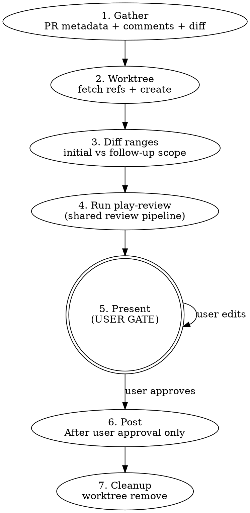

# PR Review

Multi-agent PR review with critic verification and user-gated posting.
Wrapper around `play-review` for the GitHub-PR case.

**Nothing touches GitHub without explicit user approval.** No posting
reviews, no resolving threads, no approving — until the user says go.

## Workflow



## Phase 1: Gather

Run in parallel:

- `gh pr view <N> --json title,body,baseRefName,headRefName,commits,files,reviews,comments,url`
- `gh api repos/{owner}/{repo}/pulls/<N>/comments` — inline review threads
- `gh api repos/{owner}/{repo}/pulls/<N>/reviews` — review states

Detect mode:

- **Initial:** No prior review from the current user on this PR.
- **Follow-up:** Prior review exists. Find the last reviewed commit from the prior review's `commit_id`. Set `last_reviewed_sha` to that value.

## Phase 2: Worktree setup

```sh
git fetch origin <base-ref>
git fetch origin <head-ref>
git worktree add .worktrees/pr-<N>-review origin/<head-ref>
```

Both fetches are required: `<head-ref>` for the worktree, `<base-ref>` for `play-review`'s doc-impact summary diff. They run as separate commands so a fork-PR failure on `<head-ref>` doesn't lose the `<base-ref>` fetch.

**Fork PRs:** if `git fetch origin <head-ref>` fails or `origin/<head-ref>` doesn't exist, use `gh pr checkout <N> --detach` in a fresh worktree instead (this populates `HEAD` without needing `origin/<head-ref>`), or add the fork as a remote and re-fetch. The `<base-ref>` fetch is still required either way — `play-review`'s doc-impact diff uses `origin/$BASE_REF...HEAD`, which works for both same-repo and fork PRs because `HEAD` resolves to the checked-out PR tip in either case.

Use the repo root as the base for `.worktrees/` to avoid cwd issues across bash calls.

`working_directory` for the play-review handoff = the absolute path to `.worktrees/pr-<N>-review`.

## Phase 3: Determine diff ranges

`full_pr_diff_range` is **always** `"origin/<base>...HEAD"` (computed in the worktree). Used for `play-review`'s doc-impact summary regardless of mode.

`active_diff_range` depends on mode:

- **Initial:** `active_diff_range = full_pr_diff_range`; `is_followup_narrow = false`.
- **Follow-up:** apply escalation rules to choose narrow vs full.
  - **Narrow** (incremental): `active_diff_range = "<last_reviewed_sha>..HEAD"`; `is_followup_narrow = true`.
  - **Full** (escalate): `active_diff_range = full_pr_diff_range`; `is_followup_narrow = false`.

**Escalate to full when ANY of:**

- More than 5 files changed since the last review.
- New public API functions / types introduced.
- Logic restructured beyond flagged lines.
- The increment touches `docs/adr/**`, `docs/arch/**`, `MAP.md`, `AGENTS.md`, or `agents/**`.
- When in doubt, prefer full diff. Even on full diff, still verify prior comment threads.

**Unaddressed prior findings:** If a prior blocking finding was NOT addressed by the new commits (the flagged code is unchanged), `play-review`'s critic will carry it forward into the `## Carry-forward` section.

## Phase 4: Run play-review

Hand off to `play-review` with these inputs:

- `working_directory` = absolute path to `.worktrees/pr-<N>-review`
- `base_ref` = the PR's base ref name (e.g., `main`)
- `active_diff_range` = computed in Phase 3
- `full_pr_diff_range` = `"origin/<base>...HEAD"` (always)
- `head_sha` = `git rev-parse HEAD` in the worktree
- `mode` = `"github-post"`
- `language_hints` = derived from the **active diff's** changed-files set (so follow-up narrow mode only spawns language agents matching the incremental diff; deriving from the full PR would re-run earlier-touched language agents on docs-only follow-ups, defeating the narrow-mode scoping)
- `prior_threads` = parsed from the `gh api .../comments` and `.../reviews` responses (follow-up only)
- `last_reviewed_sha` = set in Phase 1 (follow-up only)
- `is_followup_narrow` = computed in Phase 3

Follow `skills/play-review/SKILL.md` end-to-end. The output is a markdown document with `## Findings` and (follow-up only) `## Carry-forward` sections.

## Phase 5: Present (USER GATE)

**STOP HERE. Present the report. Wait for user response.**

Format `play-review`'s findings in this shape (preserve the evidence code):

````
#### 1. <title>
**<file>:<line> | Blocking | Safety | Critic: VALID**

```<lang>
// <file>:<start>-<end>
<3-7 lines of actual code>
```

<Why this is a problem>

**Recommendation:** <concrete suggestion>
````

For follow-up reviews, include the thread resolution list:

```
### Previous Threads

| # | File:Line | Author | Action | Evidence |
|---|-----------|--------|--------|----------|
| 1 | entity.rs:153 | user | Resolve | Gate added at L439 |
```

Include a draft review body preview.

**User actions:**

| Action                               | Effect                                 |
| ------------------------------------ | -------------------------------------- |
| `post`                               | Post review + resolve approved threads |
| `post as comment`                    | Comment only, no verdict               |
| `drop #N`                            | Remove finding                         |
| `change #N severity to Blocking/Nit` | Reclassify severity                    |
| `change #N category to Logic/...`    | Reclassify category                    |
| `edit`                               | Revise draft text                      |
| `skip threads`                       | Post but don't resolve                 |
| `abort`                              | Discard all, clean up                  |

## Phase 6: Post

Only after user approval:

1. **Post review with inline comments** via the REST API. Build the comments JSON from `play-review`'s **structured-finding JSON block** (the last fenced `json` code block in `play-review`'s output; `play-review/findings/v1` schema, see `skills/play-review/SKILL.md` § Output). Do **not** re-parse the human-readable markdown findings — read the JSON block directly. The JSON `anchor` enum values (`"natural"` / `"missing-file"` / `"out-of-diff"`) match the markdown `Anchor:` values verbatim per the schema — do not normalize one form to the other. For every inline finding, take `path`, `line`, and `start_line` from the finding's structured fields. **Omit the `start_line` key entirely when it is `null`** — the GitHub Reviews API rejects `start_line: null`; the schema permits `null` for shape uniformity, but the wire payload must drop the key. A `jq` filter such as `if .start_line == null then del(.start_line) else . end` applied per comment object enforces this. Partition `findings[]` by `anchor`:
   - `anchor: "natural"` → inline comment using the finding's `path` / `line` / `start_line`; `body` is the finding's pre-rendered `body` field.
   - `anchor: "missing-file"` → inline comment using the finding's `path` / `line` / `start_line` — `play-review` has already resolved them per its priority list; do NOT re-run the priority resolution. Prefix the `body` with _"Missing-file finding (no natural anchor — see body):"_ before passing it through.
   - `anchor: "out-of-diff"` → top-level review comment (single bucket; not inline). Concatenate each finding's pre-rendered `body` field into the review's overall `body`; do not put these in the `comments` array.

   `gh api` reads the request body from `--input`; sibling `-f` flags become URL query parameters in that mode, not body fields. Build the entire review payload inside `jq` so `commit_id`, `event`, `body`, and `comments` all land in the JSON body:

   ```sh
   gh api repos/{owner}/{repo}/pulls/<N>/reviews \
     --method POST \
     --input <(jq -n \
       --arg commit_id "<HEAD SHA>" \
       --arg body "<overall summary; include out-of-diff findings here>" \
       --arg event "<APPROVE|REQUEST_CHANGES|COMMENT>" \
       --argjson comments '<JSON array of inline comments>' \
       '{commit_id: $commit_id, body: $body, event: $event, comments: $comments}')
   ```

   Each inline comment object:

   ```json
   {
     "path": "relative/file.ts",
     "line": 42,
     "side": "RIGHT",
     "body": "**Blocking | Safety** ..."
   }
   ```

   For multi-line comments spanning a range, add `start_line`:

   ```json
   {
     "path": "src/auth.rs",
     "start_line": 10,
     "line": 15,
     "side": "RIGHT",
     "body": "..."
   }
   ```

2. Resolve threads via GraphQL:

   ```sh
   gh api graphql -f query='mutation { resolveReviewThread(input: {threadId: "<id>"}) { thread { isResolved } } }'
   ```

3. Verify each API response succeeded. Report failures, stop on error.

## Phase 7: Cleanup

**Always** (success or abort): `git worktree remove .worktrees/pr-<N>-review`

## GitHub API Reference

**Create review with inline comments** (primary posting method):

```sh
gh api repos/{owner}/{repo}/pulls/<N>/reviews \
  --method POST \
  --input <(jq -n \
    --arg commit_id "$(gh pr view <N> --json headRefOid -q .headRefOid)" \
    --argjson comments '[
      {"path":"src/handler.rs","line":42,"side":"RIGHT","body":"**Blocking | Safety** — unchecked error\n\n**Recommendation:** propagate with `?`"},
      {"path":"src/handler.rs","start_line":50,"line":55,"side":"RIGHT","body":"**Nit | Maintainability** — consider extracting helper"}
    ]' \
    '{commit_id: $commit_id, body: "Summary", event: "REQUEST_CHANGES", comments: $comments}')
```

Use `line` (absolute file line in HEAD), not `position` (diff offset). `side` is `"RIGHT"` for PR head lines.

**Reply to inline comment** (use the correct endpoint):

```sh
gh api repos/{owner}/{repo}/pulls/<N>/comments/<comment-id>/replies -f body="<text>"
```

Verify the response includes the new comment ID. Do not assume success.

**Fetch thread IDs for resolution:**

```sh
gh api graphql -f query='{ repository(owner: "O", name: "R") {
  pullRequest(number: N) { reviewThreads(first: 50) { nodes {
    id isResolved comments(first: 5) { nodes { body author { login } path originalLine } }
} } } } }'
```

## Hard Rules

1. **NEVER post, approve, or resolve without user approval at the Phase 5 gate.**
2. **NEVER auto-approve.** Present the verdict recommendation; user decides.
3. **Always clean up the worktree** (Phase 7) after post or abort.
4. **Verify every GitHub API response.** Report non-2xx failures.
5. **Never approve your own code.** If PR author = git user, warn and refuse approval.
6. **Always preserve `play-review`'s evidence code** (3-7 lines) when reformatting findings for the user gate.

## Red Flags — You Are Violating This Skill

- You called `gh pr review` or `resolveReviewThread` before presenting findings to the user
- You posted a review "since it looked clean" without the gate
- You skipped delegating to `play-review` and tried to spawn agents yourself
- You showed findings as a table with file:line but no code snippets
- You resolved threads "since they were obviously addressed"
- You posted all findings in the review body instead of as inline comments on specific lines
- You used `gh pr review --body` with findings instead of the reviews API with `comments` array
- You posted `Anchor: out-of-diff` findings as inline comments with fabricated line numbers — they belong in the review body

**All of these mean: STOP. You skipped the user gate or a required step. Go back.**

## Error Handling

| Scenario                              | Action                                               |
| ------------------------------------- | ---------------------------------------------------- |
| `gh` not authenticated                | Fail, suggest `gh auth login`                        |
| PR not found                          | Fail, verify number/URL                              |
| PR already merged/closed              | Warn user of state, ask whether to proceed           |
| Fork PR (head ref not on origin)      | Use `gh pr checkout <N> --detach` or add fork remote |
| Worktree exists                       | Remove stale, recreate                               |
| `play-review` reports a missing input | Stop; this means the wrapper has a bug               |
| API returns non-2xx                   | Report failure, stop                                 |
| Worktree cleanup fails                | Warn user, suggest manual `git worktree remove`      |

## Integration

**Calls:**

- `play-review` — shared review pipeline (this skill is a wrapper)

**Complements:**

- `branch-review` — for reviewing local diffs without a GitHub PR
- `play-review-response` — guidance for responding to review feedback
