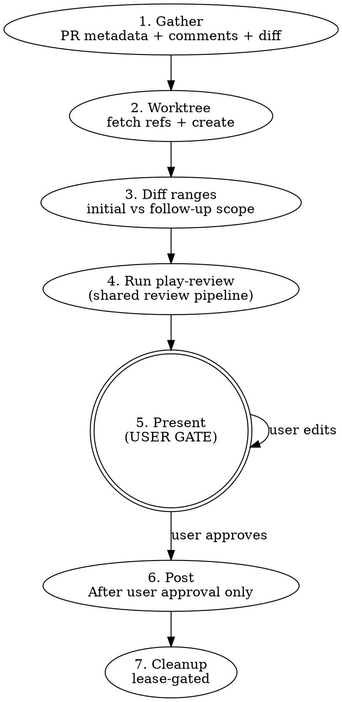

# PR Review

The [lifecycle target contract](references/review-lease-lifecycle-contract.md#target-retention-and-supersession-contract)
owns artifact purpose/retirement and completed unposted review supersession.
This wrapper checks current authority and scope, preserves needed continuity
through its existing artifact owners, and uses only supported lifecycle events.

## Public helper mechanics

Use the adjacent [review-leases usage](references/review-leases-usage.md), [prior-thread-artifacts usage](references/prior-thread-artifacts-usage.md), [review-manifests usage](references/review-manifests-usage.md), and [play-review review-artifacts usage](../play-review/references/review-artifacts-usage.md). Phase 6 first approved-review helper use on fresh or resumed posting requires [approved-review-artifacts usage](references/approved-review-artifacts-usage.md) at that loading site. This workflow retains lifecycle, provider, and review decisions.

Multi-agent PR review with critic verification and user-gated posting.
Wrapper around `play-review` for the GitHub-PR case.

**Nothing touches GitHub without explicit user approval.** No posting
reviews, no resolving threads, no approving — until the user says go.

## Reference Loading

### Eager

Every run reads these files; they count toward the eager footprint with `SKILL.md`.

- [`references/review-leases-usage.md`](references/review-leases-usage.md) — Phase 2 discovery and session creation, then every lease write.
- [`references/prior-thread-artifacts-usage.md`](references/prior-thread-artifacts-usage.md) — Phase 3 provider-scope, scope-decision, and prior-thread artifacts on every run.
- [`references/review-manifests-usage.md`](references/review-manifests-usage.md) — Phase 3 through Phase 6 handoff and result manifests on every run.
- [`../play-review/references/review-artifacts-usage.md`](../play-review/references/review-artifacts-usage.md) — Phase 5 preview render on every run.
- [`../play-review/references/follow-up-scope-policy.md`](../play-review/references/follow-up-scope-policy.md) — Phase 3 scope selection before every `play-review` invocation.
- [`../play-review/SKILL.md`](../play-review/SKILL.md) — Phase 4 delegates the review pipeline on every run.

This list covers the files this skill reads itself. Files that `play-review` reads during that delegation are transitively part of every run's footprint but are declared by `play-review`, not restated here.

### Conditional

Load these only at the loading site that names the trigger; that site states the fail-closed behavior and the owning document.

- [`references/review-lease-lifecycle-contract.md`](references/review-lease-lifecycle-contract.md) — Phase 2 terminal `posted` or `aborted` candidate or LC-18 `reentry`; resume, retry, failure-atomicity, or Phase 7 cleanup-authority questions.
- [`references/edited-preview-recovery.md`](references/edited-preview-recovery.md) — Phase 5 recognized body edit, `drop #N`, severity or category change, or an interruption between `write-review-body` and body-publication recovery.
- [`references/post-approval-procedure.md`](references/post-approval-procedure.md) — Phase 6 authorized fresh or resumed posting; Phase 7 lifecycle-permitted fresh or resumed cleanup, including abort/failure.
- [`references/approved-review-artifacts-usage.md`](references/approved-review-artifacts-usage.md) — first approved-review helper use inside the Phase 6 procedure on fresh or resumed posting.

Scripts under `scripts/` and `play-review`'s `review-artifacts.sh` are executed, not read; their usage documents above are the prompt-side surface.

## Workflow


```dot
digraph pr_review {
  rankdir=TB;
  gather [label="1. Gather\nPR metadata + comments + diff"];
  worktree [label="2. Worktree\nfetch refs + create"];
  ranges [label="3. Diff ranges\ninitial vs follow-up scope"];
  delegate [label="4. Run play-review\n(shared review pipeline)"];
  present [label="5. Present\n(USER GATE)", shape=doublecircle];
  post [label="6. Post\nAfter user approval only"];
  cleanup [label="7. Cleanup\nlease-gated"];

  gather -> worktree -> ranges -> delegate -> present;
  present -> post [label="user approves"];
  present -> present [label="user edits"];
  post -> cleanup;
}
```

## Phase 1: Gather

Run in parallel:

- `{{tool:github-cli}} pr view <N> --json title,body,baseRefName,baseRefOid,headRefName,headRefOid,commits,files,reviews,comments,url`
- `{{tool:github-cli}} api repos/{owner}/{repo}/pulls/<N>/comments` — inline review threads
- `{{tool:github-cli}} api repos/{owner}/{repo}/pulls/<N>/reviews` — review states

Phase 1 retains only raw provider authority: repository and PR identity,
provider `baseRefOid` and `headRefOid`, complete paginated provider file
metadata, and the exact full provider diff bytes plus dialect. `baseRefOid` is
metadata, not proof that a base branch ref is the PR diff base. Do not request
or compute a provider diff base, local file list, local patch digest, local
diff digest, or provenance claim in this phase. The terminal Phase 1 capture
step below runs inside the target worktree; once it binds the capture, the
producer does not refetch provider data.

<!-- Bare body intentional: responses feed Phase 4's prior_threads parsing. -->
<!-- See docs/guidelines/gh-api-hygiene.md § 3. -->

Detect mode:

- **Initial:** No established prior independent coverage of this repository/PR.
- **Follow-up:** A posted review from the current user or completed independent
  local review establishes prior coverage. For the current user's provider
  review use its `commit_id`; for local review use its immutable reviewed commit
  as `last_reviewed_sha`.

Establish local completion from the existing independent terminal outcomes,
applicable findings, and source coverage; empty findings or result files alone
are insufficient. Incomplete/failed semantic routes cannot qualify. A completed
semantic run may qualify when later result finalization failed, using directly
available terminal outcomes/findings through existing evidence/context owners.
Do not require another certificate, recreated package, or context assessment
solely to admit coverage.

For a safely located existing result, invoke `read-result-for-baseline` through
`review-manifests.sh` from its verified same-repository root with independently
established `REPOSITORY`, `PR_NUMBER`, and `RESULT_FILE`. Discover its contract
in [review manifests usage](references/review-manifests-usage.md). It returns
non-authorizing historical evidence; reconcile semantic completion separately.
Before consuming the result, honor any independently retained integrity binding
on its identity-bearing contents through the existing custody owner. A mismatch
requires authenticated recovery or owner correction; a newly computed digest
is not recovery. Unbound optional formatting is harmless.
Use bounded existing lookup/correction when bookkeeping is recoverable. Retain
consumed integrity conflicts for their owner; never launder them by rebinding.
If identity, relevant findings, coverage, ancestry, or comparison remains
unavailable/conflicting, select full coverage and retain prior context.

When provider and local coverage coexist, follow the shared baseline policy:
order comparable reviewed commits by ancestry, account for applicable findings
and wider coverage chains, and reconcile ambiguity or select full coverage.
Establish these facts before preparing/validating scope, recompute language
hints after final selection, and preserve the existing semantic escalation
checks. Historical coverage supplies no approval for the current candidate or
publication.

## Phase 2: Worktree setup

### Optional controller diagnostics custody

For this PR-review invocation, the wrapper may choose disk persistence for its
own raw terminal reports, ledger snapshots, and validation diagnostics. If it
does, before the first diagnostic write, resolve the physical primary
repository root and selected physical review worktree, verify that they belong
to the same Git repository, and create one fresh, unique, exclusive immediate
directory child of the primary root's ignored `.ephemeral` directory. Use a
PR-identifying, run-unique leaf (for example,
`.ephemeral/pr-42-controller-diagnostics-unique-run`); the head alone is not
unique. Require the `.ephemeral` parent and allocated directory to be real,
nonsymlink directories and the physical destination to be outside the selected
review checkout. Reject symlink or `..` alias traversal. An existing candidate,
including one from the same head or resumed run, is historical: choose another
leaf through exclusive creation, never reuse or overwrite it. Retain the
physical root and allocated directory in wrapper-local custody before Phase 4.
Failure to establish this custody stops optional persistence and its dependent
continuation; do not write into the checkout. If persistence is not chosen,
leave the shared review memory-only with no diagnostic disk target.

Clear the current diagnostic binding before the next invocation, repository or
PR switch, head advancement, or cleanup. Historical primary bytes stay in
place. This binding is separate from the lease and the live shared-context
family. It never repairs missing semantic evidence or grants acceptance,
posting, or cleanup authority.

The retained optional `SharedContextFamilyBinding` and its separately retained
original review association belong only to the selected live review worktree.
Before a lease operation can remove/recreate that worktree, advance its head,
or retire its artifacts, validate any still-supplied live family with the
installed shared-context helper's `validate-family-binding` operation and both
original helper-returned paths. Independently compare its input header with
the original repository/root/base/head/active/full association. A malformed or
mismatched supplied family refuses before the destructive lease operation.
From a validated input, extract only exact-kind
`verified-repository-doc-navigation` records within existing prior item and
UTF-8 byte budgets, requiring `untrusted: true` and valid source/reference,
bytes and summary fields. Retain path, original side/revision and untrusted
provenance in wrapper-local detached continuation state, bound separately to
the provider repository and PR. Do not carry other prior records, document
claims, semantic results, or approvals. Then clear the old family and
association before calling the lease owner. A failed/refused transition stops
and discards pending candidates; it never restores dead custody. Read-only
discovery and uninterrupted same-worktree resume keep live custody. Normal
absence keeps ordinary discovery available.

Before switching selected worktrees within the same PR, apply the same
validation/extraction and clear live custody. A repository or PR switch drops
both live custody and detached candidates.

After successful advancement/recreation, forward detached candidates only for
the same provider repository and PR, with independently selected current scope.
The new physical worktree may differ from the historical root. `play-review`
refreshes or drops stale optional paths before fresh D18 and D7 current-source
reads; it never receives the retired family. Switching repository/PR, explicit
continuation release, or controller loss discards detached candidates. An
unexpectedly invalid family still supplied remains a pre-D18 refusal.

Bind the lease helper before selecting a worktree path:

```bash
PR_REVIEW_DIR="<installed-pr-review-skill-bundle>"
PR_REVIEW_LEASE_HELPER="$PR_REVIEW_DIR/scripts/review-leases.sh"
bash "$PR_REVIEW_LEASE_HELPER" --help
```

Before session creation, run the read-only session planner from the primary
repository root with `REPOSITORY`, `PR_NUMBER`, and
`PRIMARY_REPOSITORY_ROOT` set:

```bash
bash "$PR_REVIEW_LEASE_HELPER" discover
```

The planner emits one closed selection result. Only `create` without an
authority-valid `reentry` candidate permits the default `session-create`
canonical-worktree progression. A missing canonical LC-18 `reentry` is admitted only
when its exact deterministic terminal archive is absent or byte-equal; a
divergent or unreadable archive remains a stop condition. When `create` reports
one authority-valid `reentry` candidate and `canonical_worktree_present=true`,
route it through the existing LC-18 operator flow: reuse that clean registered
canonical worktree and write the fresh LC-18 lease without rerunning `git
worktree add`. Do not invoke `session-create` for any `reentry` candidate.
`resume` identifies the already registered worktree and lease to
validate through the existing lifecycle flow;
`ambiguous` and `invalid` stop for the existing cleanup or lifecycle owner.
`cleanup-required` also stops, except for the single eligible terminal
candidate in the next paragraph. Discovery is read-only: it never creates,
removes, or updates worktrees, leases, or artifacts.

When discovery shows exactly one present, registered, clean, managed canonical
`posted` or `aborted` candidate, read its old head without mutation using
`git -C <canonical-worktree> rev-parse HEAD`, then compare it with the
provider-verified `HEAD_SHA`. When they differ, present both heads, offer
exactly two choices, and wait for the explicit operator choice: **keep and
stop** ends this run with no further helper, cleanup, or Git invocation;
**advance and create** runs `session-create` with `ALLOW_TERMINAL_ADVANCE=yes`
and the provider-bound creation inputs, continuing only from its `success`
identity. [`references/review-lease-lifecycle-contract.md`](references/review-lease-lifecycle-contract.md)
§ "Session creation boundary" owns the advance eligibility, mechanics,
guarantees, and outcomes; consult it before offering the choice, and stop
without invoking `session-create` if it is unavailable.

For an eligible fresh `create` with no `reentry` candidate, invoke the
runtime-owned transaction instead of separately adding a worktree and writing
LC-01. Set the provider-bound
`HEAD_SHA`, `BASE_REF`, and `HEAD_REF` alongside
the discovery inputs, then run `review-leases.sh session-create`. Routine
timestamps may be omitted; the [lease usage contract](references/review-leases-usage.md#timestamp-and-presentation-applicability)
owns defaults and explicit UTC input validation. A `success`
result is the only verified session identity. A `conflict` leaves no claimed
created session; follow the existing discovery or LC-18 operator route. A
`manual-cleanup` result preserves evidence for an operator and never grants
this skill authority to delete a reservation, worktree, registration, or lease.
`lifecycle-reentry-required` specifically means use the existing LC-18 route;
this transaction makes no mutation for that case.

The terminal-advance opt-in does not change ordinary `session-create`: omit
`ALLOW_TERMINAL_ADVANCE` for the default fresh LC-01 route, whose conflicts and
continuations remain unchanged.

```sh
git fetch origin <base-ref>
git fetch origin <head-ref>
if SESSION_CREATE_RESULT="$(bash "$PR_REVIEW_LEASE_HELPER" session-create)"; then
  SESSION_CREATE_STATUS=0
else
  SESSION_CREATE_STATUS=$?
fi
SESSION_CREATE_OUTCOME="$(printf '%s' "$SESSION_CREATE_RESULT" | jq -er '.outcome')"
case "$SESSION_CREATE_OUTCOME:$SESSION_CREATE_STATUS" in
  success:0)
    WORKING_DIRECTORY="$(printf '%s' "$SESSION_CREATE_RESULT" | jq -er 'select(.outcome == "success") | .canonical_worktree_path')"
    LEASE_FILE="$(printf '%s' "$SESSION_CREATE_RESULT" | jq -er 'select(.outcome == "success") | .lease_file')"
    ;;
  conflict:1 | manual-cleanup:1)
    printf '%s\n' "$SESSION_CREATE_RESULT" >&2
    exit 1
    ;;
  *) exit 1 ;;
esac
```

Fetch `<head-ref>` for the worktree and `<base-ref>` for GitHub PR context.
They run as separate commands so a fork-PR failure on `<head-ref>` doesn't lose
the `<base-ref>` fetch.

**Fork PRs:** if `git fetch origin <head-ref>` fails or `origin/<head-ref>` doesn't exist, add the fork as a remote and fetch its immutable head into the primary repository object database. Do not create or check out a separate worktree: `session-create` owns canonical worktree creation and initial LC-01 publication. The `<base-ref>` fetch is still useful for local context, but Phase 3 review scope must use the provider-proven PR diff base SHA from explicit provider scope evidence, not a moving `origin/<base-ref>` ref.

Use the repo root as the base for `.worktrees/` to avoid cwd issues across bash
calls.

For `create`, `WORKING_DIRECTORY` and `LEASE_FILE` are the validated values
from the successful `session-create` result. For
`resume`, use the planner's selected `resume.worktree_path` and
`resume.lease_file` instead. Manifest validation rejects subdirectories, `.`
aliases, and symlinked aliases.

## Lease Lifecycle

`pr-review/lease/v1` records the local lifecycle of one `pr-review` review
session. Its deterministic path is
`.ephemeral/pr-${PR_NUMBER}-${WORKTREE_DIGEST}-lease.json`, where
`WORKTREE_DIGEST` is derived by `scripts/review-leases.sh` from the physical
review worktree path. Store leases in the primary repository `.ephemeral/`
directory, outside the disposable review worktree.

`review-leases.sh` preserves the public helper commands but delegates lease
path derivation, typed reducer transitions, closed-schema validation,
path-guarded writes, and atomic writes to `devcanon-runtime`'s
`pr-review-leases` command. `review-manifests.sh` likewise preserves the public
handoff/result helper commands while delegating `pr-review/handoff/v1` and
`pr-review/result/v1` schema validation, path guards, delegated authority
checks, digest verification, and atomic writes to `devcanon-runtime`'s
`pr-review-manifests` command.
`approved-review-artifacts.sh` and `play-review` continue to own approved
review payload and findings validation. The lease records lifecycle state plus
the result-manifest validation outcome needed to resume a reviewed result; it
does not store approval intent, review payload JSON, inline comments, findings
content, or thread-resolution decisions. The lease helper never posts to GitHub
and never constructs GitHub review payloads.

Helper command surface:

- `derive-path`
- `discover`
- `session-create`
- `write`
- `validate`
- `inspect-worktree`
- `read-status`
- `record-audit-failure`
- `cleanup-worktree`

The authoritative lifecycle contract lives in
[`references/review-lease-lifecycle-contract.md`](references/review-lease-lifecycle-contract.md).
That reference owns valid states, transition rows, field inheritance and
clearing rules, artifact binding, terminal archive behavior, cleanup classifier
value domains, and cleanup artifact ownership rules. Keep `SKILL.md`
operator-facing; update the reference and focused tests when lease lifecycle
behavior changes.

After helper-recorded terminal worktree removal, LC-18 may archive and create a
fresh lease when the lifecycle reference's closed cleanup-authority rules pass.
This does not relax normal validation for other terminal re-entry attempts;
consult the lifecycle reference for retry and failure-atomicity behavior.

Fresh PR reviews with no existing worktree follow the same Phase 1 through
Phase 6 flow as before. This skill writes each lease state at the phase
boundary its step below names; each write realizes one Transition Matrix row
of
[`references/review-lease-lifecycle-contract.md`](references/review-lease-lifecycle-contract.md)
(LC-01 through LC-13 on the non-LC-18 path), and that reference owns the exact
required-inputs list per row.

Resume `created`, `reviewed`, `gated`, and `failed` leases from validated lease
and manifest artifacts. Do not remove an existing review worktree during resume
discovery. If a review worktree exists, first derive the lease path from the
physical worktree path and run `review-leases.sh validate` or
`review-leases.sh inspect-worktree`; only treat it as stale after the helper
reports a cleanup outcome that permits removal. A prior Phase 5 preview is not
approval; resume must present or re-render the latest validated artifacts and
wait for fresh user action.

## Phase 3: Determine diff ranges

`full_pr_diff_range` is **always** the provider-proven range
`"<provider_pr_diff_base_sha>..<headRefOid>"` from the explicit provider scope
evidence artifact. Used for `play-review`'s doc-impact summary regardless of
mode. Keep the PR base ref name, provider `baseRefOid`, and the provider
diff-base SHA distinct: `PR_BASE_REF="<base>"` is the GitHub base branch name,
`baseRefOid` is provider metadata, and `REVIEW_SCOPE_BASE_REF="$PROVIDER_PR_DIFF_BASE_SHA"`
is the immutable SHA passed to scope-decision and approved-review validators
because the canonical full range is
`"$PROVIDER_PR_DIFF_BASE_SHA..$REVIEW_HEAD_SHA"`.

After the producer has returned the validated evidence and this wrapper has
read its full range, apply the shared follow-up scope policy in
`skills/play-review/references/follow-up-scope-policy.md` before invoking
`play-review`. Phase 3 owns GitHub-specific facts and final range selection.
The `pr-review` adapter
`skills/pr-review/scripts/prior-thread-artifacts.sh` preserves the wrapper
commands for prior-thread and scope-decision artifacts, then delegates
deterministic validation to the support validator
`skills/play-validate-review-artifacts/scripts/review-artifacts.sh` through
that support skill's sibling-script contract.

The Phase 3 provider scope evidence artifact is the wrapper-owned authority for
full PR scope. It must record provider `baseRefOid`, provider `headRefOid`,
`provider_pr_diff_base_sha`; complete bound provider file/diff evidence;
normalized local file entries; local diff digest; and
`digest_provenance` using schema `pr-review/digest-provenance/v1`. Producers
must compute local file metadata, local diff digests, and local available patch
digests from the support validator's hardened provider-bound Git evidence
contract, and must declare whether provider full-diff evidence uses canonical
Git bytes or `github-provider-diff/v1` bytes. `provider_pr_diff_base_sha` is
not a shaped caller claim: it must equal the single merge base derived from
provider `baseRefOid` and `headRefOid` under that hardened provider-bound Git
executor. `baseRefOid` remains provider base metadata inside provider evidence
and must not be substituted into `REVIEW_SCOPE_BASE_REF`,
`review_scope_base_ref`, or helper `BASE_REF`; those fields remain the
immutable provider diff-base SHA surfaces equal to the proven
`provider_pr_diff_base_sha`.

Canonical local evidence uses raw Git bytes with inherited `GIT_CONFIG*`
injection stripped, global/system Git config and attributes disabled,
replacement refs and graft object-graph overrides disabled and rejected, local
diff-driver/textconv interpretation rejected, literal path identities preserved
instead of pathspec language, and valid UTF-8 JSON paths with no NUL. A
non-empty repository `info/attributes` file fails closed because Git gives it
highest precedence and does not provide a per-command disable. Provider-bound
command families include current/head resolution, commit/ref existence,
merge-base proof, range existence checks, changed-file listing,
`--name-status` metadata, `--numstat` metadata, per-file patch hashing,
full-diff digesting, inline anchor hunk lookup, approved payload hunk
verification, and pr-review follow-up scope checks that consume provider-bound
ranges. Branch-review `validate-risk-signals` remains outside provider evidence
and provider merge-base semantics. Provider/local file metadata and available
patch digests must match with compatible provenance, except for the
runtime-defined all-provider-files-unavailable full-diff digest case. In that
exception, every provider and local file entry in a non-empty complete
changed-file set has `patch_available=false` and `patch_sha256=null`, metadata
matches exactly, the complete provider file list is still bound, provider
full-diff provenance is `github-provider-diff/v1`, local full-diff provenance
is `canonical-git-diff/v1`, and the local digest matches canonical Git
evidence. Mixed available/unavailable file sets do not qualify for the
full-diff digest exception. For local ref checks,
local base refs are allowed only as diagnostics or optimization inputs after
exact-SHA
equivalence to `PROVIDER_PR_DIFF_BASE_SHA` is proven. Wrong-base diagnostics are
fail-closed: stale base refs, moving local base refs, hidden `HEAD` expansion,
incomplete provider evidence, missing digest provenance, provider/local file
metadata drift, available patch digest drift, full-diff digest drift,
incompatible provenance, stale shaped `provider_pr_diff_base_sha` without
merge-base proof, replacement/graft presence, local diff-driver influence,
invalid UTF-8 path evidence, NUL-bearing paths, or any mismatch between
provider proof and local checkout stop before Phase 4. In other words,
full-diff digest drift fails closed except for the runtime-defined
all-provider-files-unavailable case above.
The wrapper must bind the provider
scope evidence artifact into every scope-decision, handoff, result, and
approved-review validation path that consumes full-range authority. Unbound side
guards or ambient environment variables do not prove full range.
The key boundary is that play-review remains provider-agnostic and consumes
only the explicit final scope facts supplied by this wrapper.

Before invoking `play-review`, produce, validate, and bind the canonical
Phase 3 provider-scope evidence and scope-decision artifacts from the target
worktree. Phase 1 captures only raw GitHub authority: repository and PR
identity, base/head OIDs, the complete provider file records with raw patch
bytes or unavailable markers, and exact provider diff bytes with its dialect.
After entering the review worktree, materialize those raw facts as one guarded
`pr-review/provider-scope-capture/v1` direct child; Phase 3 is the only point
that derives local facts or converts it to evidence. `PR_REVIEW_DIR` must
resolve to the installed `pr-review` skill bundle. The adapter must pass an
explicit provider scope evidence artifact through
`PROVIDER_SCOPE_EVIDENCE_FILE`; read its validated range facts only after the
producer returns it.

```bash
PR_REVIEW_DIR="<installed-pr-review-skill-bundle>"
PR_REVIEW_ARTIFACT_HELPER="$PR_REVIEW_DIR/scripts/prior-thread-artifacts.sh"
PR_REPOSITORY="<owner/repo>"
PR_NUMBER="<N>"
PR_BASE_OID="<Phase-1-provider-base-oid>"
REVIEW_CALLER_DIR="$(pwd -P)" || exit 1

bind_scope_decision_artifact() {
  cd "$WORKING_DIRECTORY" || return 1
  HEAD_SHA="$(git rev-parse HEAD)" || return 1
  raw_branch="$(git rev-parse --abbrev-ref HEAD)" || return 1
  branch_slug="$(LC_ALL=C printf '%s' "$raw_branch" | LC_ALL=C tr '/' '-' | LC_ALL=C tr -cd '[:alnum:]._-')"
  [ "$raw_branch" != HEAD ] || branch_slug="detached"
  case "$branch_slug" in "" | . | .. | -* | .*) branch_slug="unnamed" ;; esac
  PROVIDER_SCOPE_CAPTURE_FILE=".ephemeral/$branch_slug-$HEAD_SHA-provider-scope-capture.json"
  [ ! -L .ephemeral ] || return 1
  mkdir -p .ephemeral || return 1
  # Reuse the exact preserved capture after a producer failure; never overwrite
  # or refetch it. Otherwise terminal Phase 1 fetches each raw evidence family.
  for capture_attempt in 1 2; do
  if [ ! -e "$PROVIDER_SCOPE_CAPTURE_FILE" ]; then
    capture_tmp="$(bash "$PR_REVIEW_ARTIFACT_HELPER" create-provider-scope-scratch)" || return 1
    trap 'bash "$PR_REVIEW_ARTIFACT_HELPER" remove-provider-scope-scratch "$capture_tmp"' RETURN
    gh api "repos/$PR_REPOSITORY/pulls/$PR_NUMBER" \
      --jq '{number,baseRefOid:.base.sha,headRefOid:.head.sha}' > "$capture_tmp/pr.json" || return 1
    PR_BASE_OID="$(jq -r '.baseRefOid' "$capture_tmp/pr.json")" || return 1
    # Bare body: the materializer consumes filename, status, previous_filename, additions, deletions, and changes from every record (docs/guidelines/gh-api-hygiene.md § 3).
    gh api --paginate --slurp "repos/$PR_REPOSITORY/pulls/$PR_NUMBER/files?per_page=100" > "$capture_tmp/files.json" || return 1
    # Bare body: the exact provider diff bytes are themselves the captured evidence (docs/guidelines/gh-api-hygiene.md § 3).
    gh api -H 'Accept: application/vnd.github.diff' "repos/$PR_REPOSITORY/pulls/$PR_NUMBER" > "$capture_tmp/full.diff" || return 1
    gh api "repos/$PR_REPOSITORY/pulls/$PR_NUMBER" \
      --jq '{baseRefOid:.base.sha,headRefOid:.head.sha}' > "$capture_tmp/recheck.json" || return 1
    # A changed provider binding invalidates this private attempt only; discard
    # its scratch and restart terminal Phase 1 rather than publishing it.
    if ! bash "$PR_REVIEW_ARTIFACT_HELPER" reconcile-provider-scope-fetch "$capture_tmp"; then
      bash "$PR_REVIEW_ARTIFACT_HELPER" remove-provider-scope-scratch "$capture_tmp" || return 1
      trap - RETURN
      [ "$capture_attempt" -lt 2 ] && continue
      return 1
    fi
    HEAD_SHA="$HEAD_SHA" PR_REPOSITORY="$PR_REPOSITORY" \
    PROVIDER_SCOPE_CAPTURE_FILE="$PROVIDER_SCOPE_CAPTURE_FILE" \
    PROVIDER_SCOPE_CAPTURE_TMP_FILE="$capture_tmp/capture.json" \
    PROVIDER_SCOPE_CAPTURE_PR_FILE="$capture_tmp/pr.json" \
    PROVIDER_SCOPE_CAPTURE_FILES_FILE="$capture_tmp/files.json" \
    PROVIDER_SCOPE_CAPTURE_DIFF_FILE="$capture_tmp/full.diff" \
      bash "$PR_REVIEW_ARTIFACT_HELPER" materialize-provider-scope-capture || return 1
    bash "$PR_REVIEW_ARTIFACT_HELPER" remove-provider-scope-scratch "$capture_tmp" || return 1
    trap - RETURN
    break
  else
    [ -f "$PROVIDER_SCOPE_CAPTURE_FILE" ] && [ ! -L "$PROVIDER_SCOPE_CAPTURE_FILE" ] || return 1
    # Classifier exit 0 binds, 2 is stale, 3 is unreadable or malformed. Remove
    # exactly this capture and restart Phase 1 only when it no longer binds this
    # HEAD/worktree; preserve it for producer, runtime, or transient failures.
    capture_state=0
    PR_BASE_OID="$PR_BASE_OID" PR_REPOSITORY="$PR_REPOSITORY" PR_NUMBER="$PR_NUMBER" HEAD_SHA="$HEAD_SHA" \
    PROVIDER_SCOPE_CAPTURE_FILE="$PROVIDER_SCOPE_CAPTURE_FILE" \
      bash "$PR_REVIEW_ARTIFACT_HELPER" classify-provider-scope-capture || capture_state=$?
    if [ "$capture_state" -eq 0 ]; then
      break
    elif [ "$capture_state" -eq 2 ]; then
      rm -f "$PROVIDER_SCOPE_CAPTURE_FILE" || return 1
      [ "$capture_attempt" -lt 2 ] && continue
      return 1
    else
      echo "preserved provider scope capture $PROVIDER_SCOPE_CAPTURE_FILE because it is unreadable, malformed, or unclassifiable; inspect it; to restart provider capture, remove only $PROVIDER_SCOPE_CAPTURE_FILE and rerun Phase 1/binding." >&2
      return 1
    fi
  fi
  done
  # files[].patch is only a hunk fragment. It is never recorded as an available
  # patch; patch_base64 remains null unless complete per-file sections are
  # extracted byte-for-byte from this full diff in the canonical dialect.
  PROVIDER_SCOPE_EVIDENCE_FILE=$(
    HEAD_SHA="$HEAD_SHA" \
    PROVIDER_SCOPE_CAPTURE_FILE="$PROVIDER_SCOPE_CAPTURE_FILE" \
      bash "$PR_REVIEW_ARTIFACT_HELPER" write-provider-scope-evidence || return 1
  ) || return 1
  REVIEW_SCOPE_BASE_REF="$(PROVIDER_SCOPE_EVIDENCE_FILE="$PROVIDER_SCOPE_EVIDENCE_FILE" bash "$PR_REVIEW_ARTIFACT_HELPER" read-provider-scope-evidence-field --field provider_pr_diff_base_sha)" || return 1
  FULL_PR_DIFF_RANGE="$(PROVIDER_SCOPE_EVIDENCE_FILE="$PROVIDER_SCOPE_EVIDENCE_FILE" bash "$PR_REVIEW_ARTIFACT_HELPER" read-provider-scope-evidence-field --field full_pr_diff_range)" || return 1
  # Now apply the existing initial/follow-up policy to FULL_PR_DIFF_RANGE.
  # Initial uses it in full; follow-up chooses last_reviewed_sha..HEAD only
  # when that policy permits narrow review, otherwise uses it in full.
  # Derive language_hints from the resulting active_diff_range only.
  SCOPE_DECISION_FILE=$(
    HEAD_SHA="$HEAD_SHA" \
      bash "$PR_REVIEW_ARTIFACT_HELPER" prepare-scope-decision-write || return 1
  ) || return 1
  # Follow references/prior-thread-artifacts-usage.md, "Scope-decision
  # construction": supply verified facts to its single JavaScript example and
  # write the result to this exact returned path. The runtime owns its closed
  # shape. Phase 6 revalidates this same artifact before posting.
  scope_original_record="$REVIEW_CALLER_DIR/.ephemeral/pr-$PR_NUMBER-scope-original-$HEAD_SHA-$(date +%s)-$$-$RANDOM.json"
  scope_failure_scratch="$(REPOSITORY="$PR_REPOSITORY" PR_NUMBER="$PR_NUMBER" bash "$PR_REVIEW_ARTIFACT_HELPER" allocate-original --record-file "$scope_original_record")" || return 1
  scope_validation_status=0
  HEAD_SHA="$HEAD_SHA" \
  BASE_REF="$REVIEW_SCOPE_BASE_REF" \
  SCOPE_DECISION_FILE="$SCOPE_DECISION_FILE" \
  PROVIDER_SCOPE_EVIDENCE_FILE="$PROVIDER_SCOPE_EVIDENCE_FILE" \
  PRIOR_THREADS_FILE="${PRIOR_THREADS_FILE:-}" \
    bash "$PR_REVIEW_ARTIFACT_HELPER" validate-scope-decision \
    2> "$scope_failure_scratch/validator.stderr" || scope_validation_status=$?
  if [ "$scope_validation_status" -ne 0 ]; then
    cp "$SCOPE_DECISION_FILE" "$scope_failure_scratch/failed-scope.json" || return 1
    REPOSITORY="$PR_REPOSITORY" PR_NUMBER="$PR_NUMBER" \
      bash "$PR_REVIEW_ARTIFACT_HELPER" seal-original --record-file "$scope_original_record" || return 1
    cat "$scope_failure_scratch/validator.stderr" >&2 || return 1
    printf 'Scope validation failed; exact candidate and stderr preserved in %s.\n' "$scope_failure_scratch" >&2
    return "$scope_validation_status"
  fi
  bash "$PR_REVIEW_ARTIFACT_HELPER" remove-provider-scope-scratch "$scope_failure_scratch" || return 1
  # No failed bytes were produced; the allocating owner can retire this unused
  # allocation record after successful scope validation.
  rm "$scope_original_record" || return 1
  REVIEW_SCOPE_DECISION_FILE="$SCOPE_DECISION_FILE"
}

SCOPE_DECISION_STATUS=0
bind_scope_decision_artifact || SCOPE_DECISION_STATUS=$?
cd "$REVIEW_CALLER_DIR" || exit 1
[ "$SCOPE_DECISION_STATUS" -eq 0 ] || exit "$SCOPE_DECISION_STATUS"
```

The scope decision remains an **unaccepted candidate** until this full
`validate-scope-decision` call succeeds. The existing owner may correct distinct,
positively identified mechanically determinable errors in its own never-accepted
candidate under the original review authorization. No coordinator approval or
replacement reviewer is needed for each routine correction.

Before every replacement, preserve exact failed bytes and validator stderr as
`failed-scope.json` and `validator.stderr`, regular nonsymlink files in one fresh
controller-owned directory returned by `allocate-original`, sealed before replacement. The
[lifecycle retention owner](references/review-lease-lifecycle-contract.md#failed-validation-scratch-outside-enrolled-custody)
defines finite preservation and supported original-proven retirement after purposes
and durable useful-context publication resolve; retain failed bytes until that boundary. Do not replace the candidate if preservation fails. Recheck
current verified head, provider evidence path/digest, full and active ranges,
prior inputs, and completed substantive semantic/mechanical decisions. Reconstruct
through the [canonical input owner](references/prior-thread-artifacts-usage.md),
correct only the identified mechanically derivable error, and run the full
validator after every correction and before handoff or semantic dispatch.

Track attempted candidate digests and corrected error/field identities in
controller-local context. Stop with a concrete blocker on an unchanged candidate,
a repeated unresolved error, a reused candidate/cycle, inability to prove
progress, substantive ambiguity, or an actual runtime limitation. Two distinct
correctable errors alone do not stop recovery. This progress boundary adds no
persistent retry counter or automatic loop and does not change semantic budgets
or completeness requirements.

For an existing recoverable pre-handoff failed lease, construct and fully validate
the current handoff first, then use LC-19 from the physical primary root:
`STATE=created`, `EXPECTED_STATE=failed`, exact current `HEAD_SHA`, `HANDOFF_FILE`,
unchanged `BASE_REF`/`HEAD_REF`, and fresh `UPDATED_AT`. Supply
`PREPARATION_FAILURE_DIRS` as the JSON array of exact preserved scratch paths.
Discovery may read these same explicit inputs before publication. The
[lifecycle owner](references/review-lease-lifecycle-contract.md#preparation-recovery-and-retained-custody)
defines the closed two-file or fixed four-file/two-pair custody family, full validation,
byte-exact archive, and permanent worktree retention. When an original scratch contains both fixed candidate/stderr pairs, retain and
bind both pairs in place. Explanatory semantic notes may evolve only alongside
checked/hint correction, with both notes strings and independently confirmed
unchanged substantive selection. Notes-only candidates or changes to meaningful
decisions refuse. Other malformed or
unprovable evidence remains unmanaged and blocks this route. Recovery attaches
preparation only; an incomplete result never supplies semantic completion,
fallback-review completion, or merge readiness.

This correction route does not apply to an accepted artifact, stale head or
base, provider or source mismatch, missing accepted evidence, broken custody,
or corruption. Follow the existing refusal or fresh-evidence route for those
conditions. Never reconstruct accepted review evidence or infer acceptance
from a format-only change.

Pass `REVIEW_SCOPE_DECISION_FILE` and `REVIEW_SCOPE_BASE_REF` through the Phase
5 gate unchanged. Phase 6 must freeze and validate the approved review against
that exact scope-decision artifact and base-range ref.

After scope-decision validation succeeds and before Phase 4 can consume review
inputs, write and validate the Phase 3 handoff manifest with the installed
`pr-review` manifest helper. The helper owns deterministic mechanics:
direct-child `.ephemeral` path validation, temp-file writes, atomic replacement,
closed-schema validation, scope-decision authority checks, and worktree HEAD
binding. Skill prose owns when the helper runs and what later phases may infer
from the manifest.

Canonical manifest schemas:

- `pr-review/handoff/v1` records Phase 3 review execution inputs, range choice,
  immutable review head, follow-up classification, language hints, and paths to
  the validated scope-decision, provider scope evidence file and digest, and
  optional prior-threads artifacts.
- `pr-review/result/v1` records the deterministic handoff path, validated
  review findings, optional review body and preview paths, content digests for
  mutable result inputs, the scope-decision summary, provider scope evidence
  file and digest, and presentation status.

Deterministic manifest paths:

- `.ephemeral/pr-${PR_NUMBER}-${REVIEW_HEAD_SHA}-handoff.json`
- `.ephemeral/pr-${PR_NUMBER}-${REVIEW_HEAD_SHA}-result.json`

Helper command surface:

- `prepare-handoff-write`
- `write-handoff`
- `validate-handoff`
- `prepare-result-write`
- `write-result`
- `validate-result`
- `read-result-for-preview`
- `write-review-body`
- `recover-review-body-publication`
- `replace-findings`
- `render-phase5-audit-summary`

Exact controller-facing notice lines:

```text
PR review handoff manifest written to <repo-relative-path>.
PR review result manifest written to <repo-relative-path>.
PR review result manifest updated at <repo-relative-path>.
```

Downstream consumers parse only those exact notice lines for manifest paths.
Do not reword them.

```bash
PR_REVIEW_MANIFEST_HELPER="$PR_REVIEW_DIR/scripts/review-manifests.sh"
write_pr_review_handoff_manifest() {
  cd "$WORKING_DIRECTORY" || return 1
  REVIEW_HEAD_SHA="$(git rev-parse HEAD)" || return 1
  REVIEW_HANDOFF_FILE=$(
    PR_NUMBER="$PR_NUMBER" \
    HEAD_SHA="$REVIEW_HEAD_SHA" \
    REPOSITORY="<owner/repo>" \
    EXECUTION_WORKING_DIRECTORY="$WORKING_DIRECTORY" \
    BASE_REF="$PR_BASE_REF" \
    HEAD_REF="<head-ref>" \
    REVIEW_SCOPE_BASE_REF="$REVIEW_SCOPE_BASE_REF" \
    ACTIVE_DIFF_RANGE="$active_diff_range" \
    FULL_PR_DIFF_RANGE="$FULL_PR_DIFF_RANGE" \
    LANGUAGE_HINTS_JSON='<json-array>' \
    FOLLOW_UP_STATE="<initial|follow-up-full|follow-up-narrow>" \
    LAST_REVIEWED_SHA="${last_reviewed_sha:-}" \
    IS_FOLLOWUP_NARROW="$is_followup_narrow" \
    SCOPE_DECISION_FILE="$REVIEW_SCOPE_DECISION_FILE" \
    PRIOR_THREADS_FILE="${PRIOR_THREADS_FILE:-}" \
      bash "$PR_REVIEW_MANIFEST_HELPER" write-handoff || return 1
  ) || return 1
  PR_NUMBER="$PR_NUMBER" HEAD_SHA="$REVIEW_HEAD_SHA" REPOSITORY="<owner/repo>" HANDOFF_FILE="$REVIEW_HANDOFF_FILE" \
    bash "$PR_REVIEW_MANIFEST_HELPER" validate-handoff || return 1
  printf 'PR review handoff manifest written to %s.\n' "$REVIEW_HANDOFF_FILE"
}

HANDOFF_MANIFEST_STATUS=0
write_pr_review_handoff_manifest || HANDOFF_MANIFEST_STATUS=$?
cd "$REVIEW_CALLER_DIR" || exit 1
[ "$HANDOFF_MANIFEST_STATUS" -eq 0 ] || exit "$HANDOFF_MANIFEST_STATUS"
```

The helper output is the repo-relative path only. The controller-facing notice
line is emitted by this wrapper after validation succeeds. Run this as a
caller-shell function, not a subshell, so `REVIEW_HEAD_SHA` and
`REVIEW_HANDOFF_FILE` remain bound for Phase 4 and later guards.

After the handoff validates, refresh `created` with `HANDOFF_FILE` using the
same `LEASE_FILE`, `WORKTREE_PATH`, `BASE_REF`, and `HEAD_REF`. If the lease
write fails, stop before Phase 4; do not run `play-review` from an unleased
handoff.

## Phase 4: Run play-review

Start by validating and consuming the Phase 3 handoff manifest from the target
worktree root. Retain the exact producer-returned `PRIOR_THREADS_FILE` through
construction, validation, and handoff under the [canonical path contract](references/prior-thread-artifacts-usage.md#prior-thread-construction);
reacquire producer output instead of reconstructing a basename. Phase 4 must
not rebuild range, scope, or prior-thread facts from
conversation text when the manifest is present. The `pr-review/handoff/v1`
closed schema is the controller-to-review handoff record, but it carries no
approval state, no lease state, and no GitHub review payload.

### Scope notice

After the handoff and worktree HEAD validations succeed, consume the exact
already-bound `REVIEW_SCOPE_DECISION_FILE`. Fail before dispatch if it is
unavailable or malformed; do not display changed-file text.

`render-scope-notice` validates the bound artifact's `mode`,
`is_followup_narrow`, and `changed_files` and prints exactly
`PR review scope: mode=..., selection=..., selected files=.... Review is continuing.`
It exits nonzero on a missing, unreadable, or schema-invalid artifact, and it
never echoes changed-file text.

```bash
(
  cd "$WORKING_DIRECTORY" || exit 1
  : "${REVIEW_HANDOFF_FILE:?Phase 3 handoff manifest path missing}"
  PR_NUMBER="$PR_NUMBER" HEAD_SHA="$REVIEW_HEAD_SHA" REPOSITORY="<owner/repo>" HANDOFF_FILE="$REVIEW_HANDOFF_FILE" \
    bash "$PR_REVIEW_MANIFEST_HELPER" validate-handoff || exit 1
  CURRENT_WORKTREE_HEAD="$(git rev-parse HEAD)" || exit 1
  [ "$CURRENT_WORKTREE_HEAD" = "$REVIEW_HEAD_SHA" ] || {
    echo "review worktree HEAD changed since handoff; refusing stale review" >&2
    exit 1
  }
  REVIEW_SCOPE_DECISION_FILE="$REVIEW_SCOPE_DECISION_FILE" \
    bash "$PR_REVIEW_ARTIFACT_HELPER" render-scope-notice || exit 1
)
```

Hand off to `play-review` with these manifest-backed inputs:

- `working_directory` = the Phase 2 selected physical worktree path: canonical
  `.worktrees/pr-<N>-review` for `create`, or `resume.worktree_path` for
  `resume`
- `base_ref` = the PR's base ref name (e.g., `main`)
- `active_diff_range` = computed in Phase 3
- `full_pr_diff_range` = `"<provider_pr_diff_base_sha>..<headRefOid>"` from explicit provider scope evidence (always)
- `head_sha` = `git rev-parse HEAD` in the worktree
- `mode` = `"github-post"`
- `language_hints` = derived from the **active diff's** changed-files set (so `Code-quality` language checks and risk-triggered routing context match the selected scope; deriving from the full PR would re-run earlier-touched language context on docs-only follow-ups, defeating the narrow-mode scoping)
- `prior_threads` = actual provider threads parsed from the `{{tool:github-cli}} api .../comments` and `.../reviews` responses (follow-up only)
- Local prior findings = existing untrusted prior-review context, preserving
  substantive IDs and origin commits for resolution/carry-forward checks; retain
  on full escalation. Never fabricate GitHub threads or use branch-findings
  on this surface.
- `last_reviewed_sha` = set in Phase 1 (follow-up only)
- `is_followup_narrow` = computed in Phase 3
- `prior_preparation_handle` = the retained exact
  `SharedContextFamilyBinding` from an earlier run in this caller, if live and
  present; keep its original review association separately
- `retained_navigation_candidates` = optional bounded exact-kind untrusted
  records extracted before successful lease retirement in the same provider
  repository and PR continuation, with separate original provenance; never a
  live family or an authority to select scope
- `controller_diagnostics_destination` = only when optional persistence was
  chosen and the current wrapper-local allocation remains live: exactly
  `{primary_repository_root,directory}`, both nonempty absolute physical
  strings. Forward the retained allocation, not a historical path or a newly
  inferred path. An absent value means memory-only diagnostics.

Follow `skills/play-review/SKILL.md` end-to-end. Before that semantic stage,
validate prepared paths and their current base/head/worktree bindings; changed
source, policy, authority, or dirty worktree state refreshes preparation. The
shared review context is internal `play-review` phase scaffolding, not a
`pr-review` consumer hook. Do not render, post, or snapshot the Phase 2.5 shared
review-context file in this wrapper. The sole read before retirement is the
validated input for bounded navigation extraction and independent association
checking. `pr-review` remains compatible when
`play-review` changes only its bounded shared-context prose or helper internals
and preserves the findings notice, findings envelope, and Phase 4 output
contract.

Retain the returned exact `SharedContextFamilyBinding` with the review head and
findings continuation state, including a completed no-findings review. Retain
the original frozen repository/root/base/head/active/full range association
separately. Forward the family unchanged on a fresh follow-up only while the
same selected worktree and family custody remain live under the Phase 2
invalidation rule. On successful retirement, forward only detached same-PR
navigation candidates with current scope. No retained family is normal. The
family is not a provider artifact,
public notice, payload, approval evidence or new follow-up parameter;
`play-review` alone validates and consumes it. Do not derive an artifact path
or use its contents for scope selection.

The output is a markdown document with optional pre-findings
presentation such as `## Root-Cause Synthesis`, followed by `## Findings` and
(follow-up only) `## Carry-forward` sections. Immediately after `play-review`
returns and before the Phase 5 user gate, capture the immutable review head and
the exact findings notice path for Phase 6:

```bash
HEAD_SHA="$(git -C "$WORKING_DIRECTORY" rev-parse HEAD)"
REVIEW_HEAD_SHA="$HEAD_SHA"  # the trusted Phase 4 head_sha input passed to play-review
FINDINGS_FILE=$(printf '%s\n' "$PLAY_REVIEW_OUTPUT" | sed -n 's/^Findings written to \(.*\)\.$/\1/p' | tail -n 1)
[ -n "$FINDINGS_FILE" ] || { echo "play-review findings notice missing" >&2; exit 1; }
REVIEW_FINDINGS_FILE="$FINDINGS_FILE"
```

Then write and validate the initial result manifest before the Phase 5 preview.
This records that findings and scope-decision validation succeeded before any
user approval gate. It does not record approval intent, review event, lease
state, approved-review artifact paths, or payload JSON.

```bash
write_initial_pr_review_result_manifest() {
  cd "$WORKING_DIRECTORY" || return 1
  REVIEW_RESULT_FILE=$(
    PR_NUMBER="$PR_NUMBER" \
    HEAD_SHA="$REVIEW_HEAD_SHA" \
    REPOSITORY="<owner/repo>" \
    FINDINGS_FILE="$REVIEW_FINDINGS_FILE" \
    SCOPE_DECISION_FILE="$REVIEW_SCOPE_DECISION_FILE" \
    PRIOR_THREADS_FILE="${PRIOR_THREADS_FILE:-}" \
    PRESENTATION_STATUS="not-presented" \
      bash "$PR_REVIEW_MANIFEST_HELPER" write-result || return 1
  ) || return 1
  PR_NUMBER="$PR_NUMBER" HEAD_SHA="$REVIEW_HEAD_SHA" REPOSITORY="<owner/repo>" RESULT_FILE="$REVIEW_RESULT_FILE" \
    bash "$PR_REVIEW_MANIFEST_HELPER" validate-result || return 1
  printf 'PR review result manifest written to %s.\n' "$REVIEW_RESULT_FILE"
}

RESULT_MANIFEST_STATUS=0
write_initial_pr_review_result_manifest || RESULT_MANIFEST_STATUS=$?
cd "$REVIEW_CALLER_DIR" || exit 1
[ "$RESULT_MANIFEST_STATUS" -eq 0 ] || exit "$RESULT_MANIFEST_STATUS"
```

After the initial result manifest validates, write `reviewed` with
`RESULT_FILE="$REVIEW_RESULT_FILE"`. If this write fails, stop before Phase 5
and retain completed evidence.
Result construction/validation and lease finalization are separate operations
from the semantic review. After correcting only operation inputs, revalidate
the same repository and immutable head, unchanged source, complete intact
semantic findings, and any already-produced result evidence applicable to the
failed operation. A failed construction need not have produced a result file:
retry its writer, then validate the resulting manifest before the
`created`-to-`reviewed` write. For validation or lease-write failures, revalidate
the complete existing evidence family before retrying that operation. Do not
rerun a semantic reviewer solely for an operation failure. Changed source, identity, digest, or completeness returns
through the existing review route; no `failed`-to-`reviewed` shortcut exists,
and approval cannot transfer. Never preview an unfinalized lease.
The reviewed lease records validated result evidence, not presentation. The
detailed evidence-family and freshness contract lives in
`references/review-lease-lifecycle-contract.md`.

## Phase 5: Present (USER GATE)

**STOP HERE. Present the report. Wait for user response.**

Before presenting or resuming this gate after a user-requested edit, consume the
current `pr-review/result/v1` manifest from the target worktree root. Phase 5
invokes `read-result-for-preview` with `REVIEW_RESULT_FILE` and the trusted
review head captured before the gate. Consume its closed JSON snapshot, then
render and resume from that validated result manifest rather than ambient
conversation variables. Extract and rebind the
manifest-backed paths and review head needed for rendering:
`REVIEW_HEAD_SHA`, `REVIEW_HANDOFF_FILE`, `REVIEW_HEAD_REF`,
`REVIEW_FINDINGS_FILE`, `REVIEW_BODY_FILE` when present, `REVIEW_SCOPE_DECISION_FILE`,
`PRIOR_THREADS_FILE` when present, and `RENDERED_PREVIEW_FILE` when present.
Then re-read the live PR head from GitHub and compare it to the rebound
`REVIEW_HEAD_SHA`. If it changed, stop and return to Phase 1; do not present,
edit, approve, or post a stale review result.

```bash
read_pr_review_result_manifest_for_preview() {
  cd "$WORKING_DIRECTORY" || return 1
  : "${REVIEW_RESULT_FILE:?Phase 5 result manifest path missing}"
  : "${REVIEW_HEAD_SHA:?Phase 5 trusted review head missing}"
  RESULT_PREVIEW_JSON=$( \
    PR_NUMBER="$PR_NUMBER" \
    HEAD_SHA="$REVIEW_HEAD_SHA" \
    REPOSITORY="<owner/repo>" \
    RESULT_FILE="$REVIEW_RESULT_FILE" \
      bash "$PR_REVIEW_MANIFEST_HELPER" read-result-for-preview
  ) || return 1
  RESULT_PREVIEW_BINDINGS=$(jq -er '
    [
      "REVIEW_HEAD_SHA=" + (.review_head_sha | @sh),
      "REVIEW_HANDOFF_FILE=" + (.handoff_file | @sh),
      "REVIEW_HEAD_REF=" + (.head_ref | @sh),
      "REVIEW_FINDINGS_FILE=" + (.findings_file | @sh),
      "REVIEW_BODY_FILE=" + ((.review_body_file // "") | @sh),
      "REVIEW_SCOPE_DECISION_FILE=" + (.scope_decision_file | @sh),
      "PRIOR_THREADS_FILE=" + ((.prior_threads_file // "") | @sh),
      "RENDERED_PREVIEW_FILE=" + ((.rendered_preview_file // "") | @sh)
    ] | .[]
  ' <<<"$RESULT_PREVIEW_JSON") || return 1
  eval "$RESULT_PREVIEW_BINDINGS" || return 1
  [ -n "$REVIEW_HEAD_REF" ] || return 1
}

RESULT_READ_STATUS=0
read_pr_review_result_manifest_for_preview || RESULT_READ_STATUS=$?
cd "$REVIEW_CALLER_DIR" || exit 1
[ "$RESULT_READ_STATUS" -eq 0 ] || exit "$RESULT_READ_STATUS"
```

Result-manifest consumption is only for rendering or resume. It does not store
or imply approval intent, a review event, a lease, lifecycle ownership, an
approved-review artifact, or a GitHub payload. Phase 6 still requires fresh
explicit user approval for the latest preview and a separate approved-review
freeze before posting.

```sh
CURRENT_HEAD_SHA="$(gh pr view <N> --json headRefOid -q .headRefOid)"
[ "$CURRENT_HEAD_SHA" = "$REVIEW_HEAD_SHA" ] || {
  echo "PR head changed since review; refusing stale review result" >&2
  exit 1
}
```

Use the installed `play-review` helper to render the artifact-backed preview;
do not manually reshape findings. `PLAY_REVIEW_DIR` must resolve to the
installed `play-review` skill bundle, not the repository under review. Bind
`PLAY_REVIEW_HELPER="$PLAY_REVIEW_DIR/scripts/review-artifacts.sh"` and invoke
it from the target worktree root. The helper renders evidence snippets from
`REVIEW_HEAD_SHA`, not the mutable checkout.

Before the first preview, author the draft review-body Markdown in the caller.
Pass it to `write-review-body` on stdin; the manifest helper owns the canonical
direct-child path and safe atomic write. The runtime does not invent, reshape,
or supplement the narrative. Then render the preview with
`REVIEW_SURFACE=pr-review`:

```bash
PLAY_REVIEW_DIR="<installed-play-review-skill-bundle>"
PLAY_REVIEW_HELPER="$PLAY_REVIEW_DIR/scripts/review-artifacts.sh"

write_review_body_from_markdown() {
  : "${REVIEW_BODY_MARKDOWN:?caller-authored review body Markdown missing}"
  REVIEW_BODY_FILE=$( \
    cd "$WORKING_DIRECTORY" || exit 1
    printf '%s\n' "$REVIEW_BODY_MARKDOWN" | \
      PR_NUMBER="$PR_NUMBER" \
      HEAD_SHA="$REVIEW_HEAD_SHA" \
      REPOSITORY="<owner/repo>" \
      RESULT_FILE="$REVIEW_RESULT_FILE" \
        bash "$PR_REVIEW_MANIFEST_HELPER" write-review-body
  ) || return 1
  REVIEW_RESULT_FILE=$( \
    cd "$WORKING_DIRECTORY" || exit 1
    PR_NUMBER="$PR_NUMBER" \
    HEAD_SHA="$REVIEW_HEAD_SHA" \
    REPOSITORY="<owner/repo>" \
    RESULT_FILE="$REVIEW_RESULT_FILE" \
      bash "$PR_REVIEW_MANIFEST_HELPER" recover-review-body-publication
  ) || return 1
}

# Preserve markdown before the first `## Findings` heading in PLAY_REVIEW_OUTPUT.
# The helper refuses a preserved block whose first non-blank line is a heading, so
# it must start with the required narrative lead, then may include optional
# presentation such as `## Root-Cause Synthesis`.
PRE_FINDINGS_MARKDOWN=$(
  printf '%s\n' "$PLAY_REVIEW_OUTPUT" |
    bash "$PR_REVIEW_MANIFEST_HELPER" extract-pre-findings-markdown
) || exit 1
if [ -n "$PRE_FINDINGS_MARKDOWN" ]; then
  REVIEW_BODY_MARKDOWN="$PRE_FINDINGS_MARKDOWN"
else
  REVIEW_BODY_FALLBACK="<one or two short narrative sentences naming what the implementation got right before findings>"
  case "$REVIEW_BODY_FALLBACK" in *"<"*">"*) echo "review body fallback must be replaced with concrete narrative summary" >&2; exit 1 ;; esac
  REVIEW_BODY_MARKDOWN="$REVIEW_BODY_FALLBACK"
fi
write_review_body_from_markdown || exit 1
(
  cd "$WORKING_DIRECTORY" || exit 1
  HEAD_SHA="$REVIEW_HEAD_SHA" \
  FINDINGS_FILE="$REVIEW_FINDINGS_FILE" \
  REVIEW_SURFACE="pr-review" \
  REVIEW_BODY_FILE="$REVIEW_BODY_FILE" \
    bash "$PLAY_REVIEW_HELPER" render-review-preview
)
```

After each successful preview render, update and validate the result manifest
with the current review body and preview status, then emit the exact update
notice:

```bash
update_pr_review_result_manifest() {
  local presentation_status="${1:-preview-current}"
  local updated_result_file
  updated_result_file=$( \
    cd "$WORKING_DIRECTORY" || exit 1
    PR_NUMBER="$PR_NUMBER" \
    HEAD_SHA="$REVIEW_HEAD_SHA" \
    REPOSITORY="<owner/repo>" \
    FINDINGS_FILE="$REVIEW_FINDINGS_FILE" \
    REVIEW_BODY_FILE="$REVIEW_BODY_FILE" \
    SCOPE_DECISION_FILE="$REVIEW_SCOPE_DECISION_FILE" \
    PRIOR_THREADS_FILE="${PRIOR_THREADS_FILE:-}" \
    RENDERED_PREVIEW_FILE="${RENDERED_PREVIEW_FILE:-}" \
    PRESENTATION_STATUS="$presentation_status" \
      bash "$PR_REVIEW_MANIFEST_HELPER" write-result
  ) || return 1
  (
    cd "$WORKING_DIRECTORY" || exit 1
    PR_NUMBER="$PR_NUMBER" HEAD_SHA="$REVIEW_HEAD_SHA" REPOSITORY="<owner/repo>" RESULT_FILE="$updated_result_file" \
      bash "$PR_REVIEW_MANIFEST_HELPER" validate-result
  ) || return 1
  REVIEW_RESULT_FILE="$updated_result_file"
  printf 'PR review result manifest updated at %s.\n' "$REVIEW_RESULT_FILE"
}

RESULT_MANIFEST_STATUS=0
update_pr_review_result_manifest || RESULT_MANIFEST_STATUS=$?
cd "$REVIEW_CALLER_DIR" || exit 1
[ "$RESULT_MANIFEST_STATUS" -eq 0 ] || exit "$RESULT_MANIFEST_STATUS"
```

After the preview render and result-manifest update validate, write `gated`
with `RESULT_FILE="$REVIEW_RESULT_FILE"` and `PRESENTATION_STATUS`; omitted
`PRESENTED_AT` uses the same operation instant as `UPDATED_AT`. Refresh lease
validation for every gate cycle; never
treat the `RESULT_FILE` path alone as freshness evidence. If the user edits the
body or findings and the preview is re-rendered, update the same `gated` lease
after the manifest update succeeds. The lease gate is still not approval.

After every successful `gated` write, including edited previews, render the
full Phase 5 artifact audit before asking for user action. Retain its exact
stdout beside the current review artifacts using the
[audit retention procedure](references/review-manifests-usage.md#phase-5-audit-retention)
after successful rendering on every gate cycle. The audit renderer validates the result manifest and then derives the summary only
from that validated manifest plus the current read-only lease/worktree status:

```bash
PHASE5_AUDIT_STATUS=0
PHASE5_AUDIT_SUMMARY=$(
  REPOSITORY="<owner/repo>" \
  PR_NUMBER="$PR_NUMBER" \
  HEAD_SHA="$REVIEW_HEAD_SHA" \
  RESULT_FILE="$REVIEW_RESULT_FILE" \
  PRIMARY_REPOSITORY_ROOT="$REVIEW_CALLER_DIR" \
  WORKTREE_PATH="$WORKING_DIRECTORY" \
  LEASE_FILE="$LEASE_FILE" \
    bash "$PR_REVIEW_MANIFEST_HELPER" render-phase5-audit-summary
) || PHASE5_AUDIT_STATUS=$?
if [ "$PHASE5_AUDIT_STATUS" -ne 0 ]; then
  (
    cd "$REVIEW_CALLER_DIR" || exit 1
    REPOSITORY="<owner/repo>" \
    PR_NUMBER="$PR_NUMBER" \
    PRIMARY_REPOSITORY_ROOT="$REVIEW_CALLER_DIR" \
    LEASE_FILE="$LEASE_FILE" \
    PR_REVIEW_DIR="$PR_REVIEW_DIR" \
    PR_REVIEW_MANIFEST_HELPER_SCRIPT="$PR_REVIEW_MANIFEST_HELPER" \
    PLAY_REVIEW_HELPER="$PLAY_REVIEW_HELPER" \
    STATE="failed" \
    EXPECTED_STATE="gated" \
    BASE_REF="$PR_BASE_REF" \
    HEAD_REF="$REVIEW_HEAD_REF" \
    RESULT_FILE="$REVIEW_RESULT_FILE" \
    FAILURE_PHASE="preview-render" \
    FAILURE_REASON="Phase 5 artifact audit summary failed" \
    FAILURE_RECOVERABILITY="recoverable" \
      bash "$PR_REVIEW_LEASE_HELPER" record-audit-failure >/dev/null
  ) || exit 1
  exit "$PHASE5_AUDIT_STATUS"
fi
```

Fail closed if the summary detects a stale digest or validation timestamp,
missing digest, mismatched presentation status, missing `presented_at`,
identity mismatch, missing worktree, unregistered worktree, or unreadable
worktree. Treat a dirty-but-valid worktree as truthful status and continue.
`render-phase5-audit-summary` invokes `review-leases.sh read-status` from the
primary repository root and parses that single JSON object; `read-status` is
read-only, uses optional-lock-free git status inspection, and must not record
cleanup metadata. If summary rendering fails after the gate write, use the
recovery-specific `record-audit-failure` command from the primary repository
root to record `failed` with
`FAILURE_PHASE=preview-render`, `FAILURE_REASON`, and
`FAILURE_RECOVERABILITY`. That command derives the worktree identity from the
existing gated lease, so it can record the failure even when the worktree is
missing. Preserve prior validated artifacts only when they are current and
still pass lease/result identity, digest freshness, result command authority
including nested artifacts and helper-backed checks, current presentation
evidence, and worktree existence/registration where applicable. Invalid
evidence is cleared while the failed lease is still written when identity and
transition authority are trustworthy.

Present the existing artifact-backed review preview stdout first. It is the
sole presentation of the reviewed head, findings path, every finding body and
evidence snippet, critic state, and carry-forward entry. Do not shorten or
rewrite the proposed GitHub publication. Follow it with a concise audit summary:

- Scope: full review or the selected follow-up scope and any coverage limitation.
- Findings: active and carry-forward counts from the validated audit.
- Completeness: the validated findings envelope's review completeness, including
  any incomplete route and its reason. Artifact validation success and zero
  findings never establish semantic review completion.
- Lifecycle/cleanup: actionable problems or warnings from the current audit and
  review evidence, including dirty worktree status when present. Otherwise say
  cleanup is pending approval and has not been attempted; do not imply failure
  merely because cleanup is pending at this gate.
- A clickable **Full audit** link to the retained local artifact, available
  during approval. Keep the path/digest/timestamp inventory in that artifact.

Use a short paragraph or a few bullets, without repeating the preview-owned
reviewed-head or findings-path identity. If audit rendering or retention fails,
do not present a successful approval gate; preserve the existing failure
handling and report the failure. Then present the complete thread resolution
list for follow-up reviews when applicable, before the unchanged user actions:

```
### Previous Threads

| # | File:Line | Author | Action | Evidence |
|---|-----------|--------|--------|----------|
| 1 | entity.rs:153 | user | Resolve | Gate added at L439 |
```

The Phase 5 preview is not approval by itself. Any user-requested change returns
to this gate after the artifacts are rewritten and re-rendered. Approval intent
is captured only when the user approves a specific preview.

For a recognized body edit, `drop #N`, finding severity/category change, or an
interruption after `write-review-body` and before body-publication recovery,
load [edited-preview recovery](references/edited-preview-recovery.md) before
the first dependent authoring, rebuilding, validation, publication, recovery,
rendering, or result-consumption operation. Do not load it for an initial
preview or an unedited resumed preview. If the reference is missing or
unreadable, stop before that operation and preserve the current artifacts and
lease state under their existing owners.

The main Phase 5 gate remains authoritative: an edit invalidates the prior
preview; the current trusted head, validated result, manifest/preview ordering,
`gated` lease refresh, and audit summary remain required; a retained findings
publication guard requires explicit manual recovery; and the user must approve
the latest exact preview before Phase 6.

**User actions:**

| Action                               | Effect                                                                              |
| ------------------------------------ | ----------------------------------------------------------------------------------- |
| `post`                               | Post review + resolve approved threads                                              |
| `post as comment`                    | Comment only, no verdict                                                            |
| `drop #N`                            | Omit from publication; retain evidence                                              |
| `change #N severity to Blocking/Nit` | Change published severity; retain evidence                                          |
| `change #N category to Logic/...`    | Change published category; retain evidence                                          |
| `edit`                               | Revise draft text                                                                   |
| `skip threads`                       | Post but don't resolve                                                              |
| `abort`                              | Record `aborted` with `FINISHED_AT` and `TERMINAL_REASON`, then lease-gated cleanup |

## Targeted review evidence gate

For each new `play-review` invocation require `play-review/findings/v3`, exact
current head/scope bindings, and complete D7 plus any required D10. Do not
accept legacy artifacts as new-run approval. A legitimately `not-required`
verifier differs from `incomplete`; any required verifier failure blocks
APPROVE even without surviving blockers. Preserve assessment freshness and
per-finding selection through previews and payload approval. Nits are
report-only; any fix handoff uses branch-review’s per-finding qualification and
requires validation plus independent review of the changed candidate.

## Phase 6: Post

Only after explicit Phase 5 approval of the latest exact preview, load
[post-approval procedure](references/post-approval-procedure.md) in full from
the installed `pr-review` bundle before the first Phase 6 action. On every
fresh or resumed posting continuation, explicitly read it again; do not assume
it survived earlier context. If it is missing, blank, unreadable, or unavailable,
stop before revalidation, approval-event derivation, artifact materialization,
or any GitHub mutation. This main skill remains the normative owner of approval
and continuation policy; the reference is its subordinate operating procedure.
Existing helper usage and lease lifecycle contracts retain their ownership.

Follow the reference's Phase 6 sequence. Revalidate the exact approved preview
and user-gated lease result before binding the user-approved event. Freeze the
approved artifacts, refuse a changed provider head by returning to Phase 1,
and post exactly the validated payload. Resolve only user-approved threads
after successful posting. Verify API responses and stop/report failures;
record the existing `posted` or `failed` lease transition and preserve the
existing evidence before any cleanup decision. Never reconstruct a mutation
from conversation text. The Phase 5 gate and targeted review evidence gate
remain binding throughout resumed continuation.

## Phase 7: Cleanup

When the existing lifecycle permits a cleanup decision after posting, abort,
or failure, load [post-approval procedure](references/post-approval-procedure.md)
before the first dependent cleanup action. Explicitly read it on resumed
cleanup as well. If it is missing, blank, unreadable, or unavailable, stop
before inspection, custody changes, or removal and preserve the worktree and
artifacts. This main skill owns cleanup routing and invariants; the reference
supplies the subordinate Phase 7 procedure, while the existing lease lifecycle
and helper contracts retain cleanup authority and mechanics. A cleanup-only
continuation does not authorize Phase 6 or any GitHub mutation.

Apply Phase 2 live-family validation/extraction and custody clearing before
lease-gated removal. Never remove a review worktree directly: use the existing
lease inspection and cleanup helpers, preserve their refusals, and report
failures for manual recovery. Do not run a broad `.ephemeral` sweep.

## GitHub API Reference

Thread lookup remains available before approval for the Phase 5 resolution
preview. Posting and reply examples live in the conditionally loaded procedure;
they confer no authority beyond the Phase 5 approval gate.

**Fetch thread IDs for resolution:**

```sh
# Bare body intentional: response is consumed for content-keyed thread-ID lookup
# (resolveReviewThread mutation in the post-approval procedure). See docs/guidelines/gh-api-hygiene.md § 3.
gh api graphql -f query='{ repository(owner: "O", name: "R") {
  pullRequest(number: N) { reviewThreads(first: 50) { nodes {
    id isResolved comments(first: 5) { nodes { body author { login } path originalLine } }
} } } } }'
```

## Hard Rules

1. **NEVER post, approve, or resolve without user approval at the Phase 5 gate.**
2. **NEVER auto-approve.** Present the verdict recommendation; user decides.
3. **Never remove a review worktree directly; use the lease helper cleanup contract.**
4. **Verify every GitHub API response.** Report non-2xx failures.
5. **Never approve your own code.** If PR author = git user, warn and refuse approval.
6. **Always preserve `play-review`'s evidence code** (3-7 lines) when reformatting findings for the user gate.

## Red Flags — You Are Violating This Skill

- You called `{{tool:github-cli}} pr review` or `resolveReviewThread` before presenting findings to the user
- You posted a review "since it looked clean" without the gate
- You skipped delegating to `play-review` and tried to spawn agents yourself
- You showed findings as a table with file:line but no code snippets
- You resolved threads "since they were obviously addressed"
- You posted all findings in the review body instead of as inline comments on specific lines
- You used `{{tool:github-cli}} pr review --body` with findings instead of the reviews API with `comments` array
- You posted `Anchor: out-of-diff` findings as inline comments with fabricated line numbers — they belong in the review body

**All of these mean: STOP. You skipped the user gate or a required step. Go back.**

## Error Handling

| Scenario                                | Action                                                                           |
| --------------------------------------- | -------------------------------------------------------------------------------- |
| `{{tool:github-cli}}` not authenticated | Fail, suggest `{{tool:github-cli}} auth login`                                   |
| PR not found                            | Fail, verify number/URL                                                          |
| PR already merged/closed                | Warn user of state, ask whether to proceed                                       |
| Fork PR (head ref not on origin)        | Fetch immutable fork head into primary object database; do not create a worktree |
| Worktree exists                         | Inspect lease; resume valid leases or use lease-gated cleanup before recreating  |
| `play-review` reports a missing input   | Stop; this means the wrapper has a bug                                           |
| API returns non-2xx                     | Report failure, stop                                                             |
| Worktree cleanup fails                  | Report lease path, worktree path, and helper message                             |

## Integration

**Calls:**

- `play-review` — shared review pipeline (this skill is a wrapper)

**Complements:**

- `branch-review` — for reviewing local diffs without a GitHub PR
- `play-review-response` — guidance for responding to review feedback

## Retire and continue an exhausted attempt

Use the [lifecycle owner](references/review-lease-lifecycle-contract.md#target-retention-and-supersession-contract)
and [lease usage](references/review-leases-usage.md#original-proven-attempt-retirement)
to qualify exact original-produced scratch, resolve current consumers/effects,
and verify useful durable context in the GitHub issue/PR. Original artifact records
are current producer custody evidence; check applicable current human authority
separately. Existing directories without current receipts use the guarded scratch
cleanup boundary only after the original owner/controller proves real custody,
ends readers/recovery, verifies durable context publication and binds the current
action. Unknown custody, pending publication or active consumers hold before any
snapshot-based invocation; hashes grant neither ownership nor permission. Invoke supported retirement from the physical primary,
then use canonical posted/aborted advancement or bound completed/failed continuation.
Retain precise custody/publication gaps and actual held effects; do not remove
scratch manually to obtain classifier eligibility.

A completed result can remain a historical baseline after mechanical failure.
Select current follow-up or full relevant scope through the shared scope policy;
a new commit or fresh agent/session does not decide that semantic choice. Narrow
corrective review still covers current repairs, prior findings and relevant
regression dependencies independently. Expanded assumptions or unusable baseline
require full relevant scope, and every approval belongs to current bytes.
